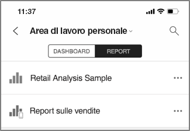
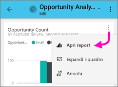
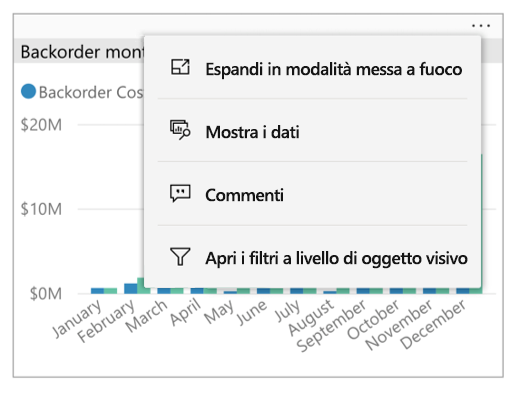
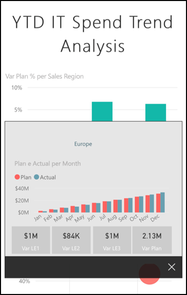
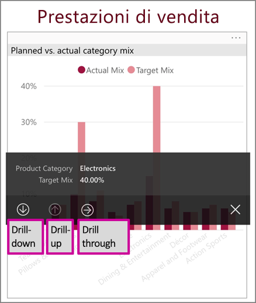
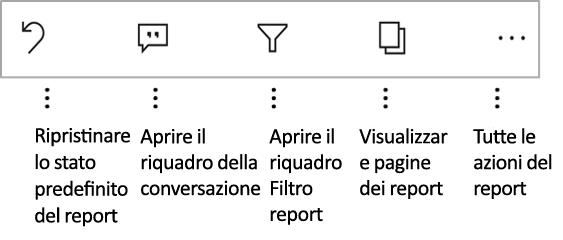
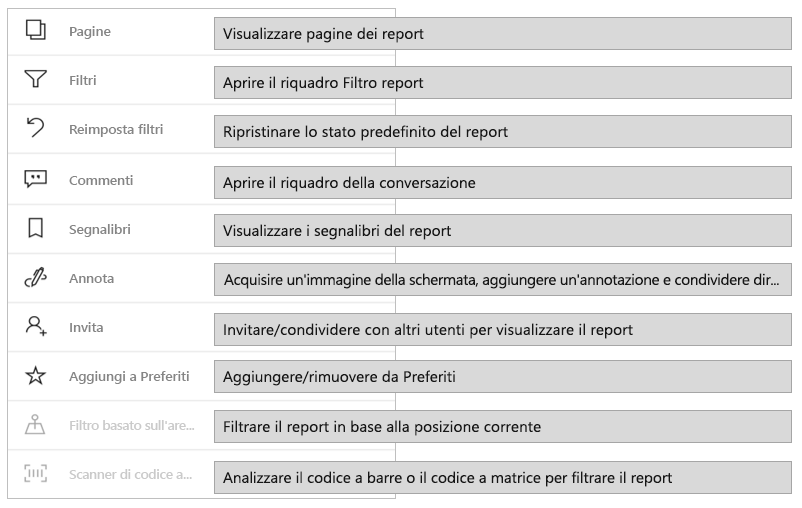
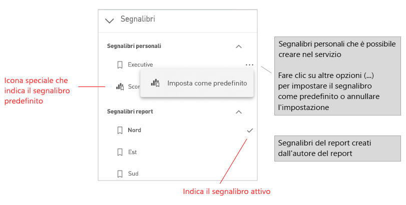
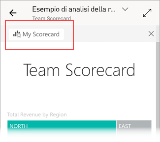

# Esplorare i report nelle app Power BI per dispositivi mobili
Si applica a:

|  |  |  |  |  |
|:---: |:---: |:---: |:---: |:---: |
| iPhone |iPad |Telefoni Android |Tablet Android |Dispositivi Windows 10 |

>[!NOTE]
>Il supporto delle app Power BI per dispositivi mobili per i **telefoni con Windows 10 Mobile** non sarà più disponibile dal 16 marzo 2021. [Altre informazioni](https://go.microsoft.com/fwlink/?linkid=2121400)

Un report di Power BI è una vista interattiva dei dati con elementi visivi che rappresentano conclusioni e approfondimenti diversi ottenuti da tali dati. La visualizzazione dei report nella app Power BI per dispositivi mobili è il terzo passaggio in un processo in tre fasi:

1. [Creare report in Power BI Desktop](../../desktop-report-view.md). In Power BI Desktop è persino possibile [ottimizzare un report per i telefoni](mobile-apps-view-phone-report.md).
2. Pubblicare i report nel servizio Power BI [(https://powerbi.com)](https://powerbi.com) o in [Server di report di Power BI](../../report-server/get-started.md).  
3. Interagire con i report nelle app Power BI per dispositivi mobili.

## Aprire un report di Power BI nell'app per dispositivi mobili
A seconda della provenienza, i report di Power BI sono archiviati in posizioni diverse nell'app per dispositivi mobili. Possono trovarsi in App, Condivisi con l'utente corrente, Aree di lavoro (inclusa l'Area di lavoro personale) oppure in un server di report. In alcuni casi, si accede attraverso un dashboard correlato per ottenere un report, e talvolta sono elencati.

Negli elenchi e nei menu viene visualizzata un'icona accanto al nome del report che indica che l'elemento è un report:

Sono disponibili due icone per i report nelle app per dispositivi mobili Power BI:

*  indica un report che verrà visualizzato con orientamento orizzontale nell'app. L'aspetto sarà identico a quello visualizzato in un browser.

*  indica un report che include almeno una pagina del report ottimizzata per il telefono che verrà visualizzata con orientamento verticale.

> [!NOTE]
> Quando si tiene il telefono con un orientamento orizzontale, si otterrà sempre il layout orizzontale, anche se la pagina del report è nel layout telefono.

Per passare a un report da un dashboard, toccare **Altre opzioni** (...) nell'angolo superiore destro di un riquadro e quindi toccare **Apri report**:
  
  
  
  Non tutti i riquadri possono essere aperti come report. Ad esempio, i riquadri creati quando si pone una domanda nella casella Domande e risposte non aprono i report quando vengono toccati.
  
## Interagire con i report
Dopo aver aperto un report nell'app, è possibile iniziare a usarlo. È possibile eseguire molte operazioni con i report e i relativi dati. Nel piè di pagina del report sono disponibili le azioni che è possibile eseguire sul report. Grazie al tocco e al tocco prolungato sui dati visualizzati nel report, è anche possibile visualizzare i dati in dettaglio.

### Interazione con tocco singolo o doppio tocco
Quando si scarica l'app per dispositivi mobili Power BI, è impostata per l'interazione con tocco singolo. Questo significa che quando si tocca un oggetto visivo per eseguire un'azione, ad esempio la selezione di un elemento del filtro dei dati, l'evidenziazione incrociata, il clic su un collegamento o un pulsante e così via, il tocco seleziona l'oggetto visivo ed esegue l'azione desiderata.

Se si preferisce, è possibile passare all'interazione con doppio tocco. Con l'interazione con doppio tocco è prima necessario toccare un oggetto visivo per selezionarlo e poi toccare di nuovo l'oggetto visivo per eseguire l'azione desiderata.

Per passare all'interazione con doppio tocco o per tornare all'interazione con tocco singolo, passare alle [impostazioni di interazione dell'app](./mobile-app-interaction-settings.md).

### Modalità selezione singola rispetto alla modalità selezione multipla per la selezione del punto dati

In un report toccare un punto dati per selezionarlo. È possibile scegliere se si desidera usare la modalità selezione singola o selezione multipla. In modalità selezione singola, quando si tocca un punto dati per selezionarlo, questa selezione sostituisce le selezioni precedenti effettuate. In modalità di selezione multipla, quando si tocca un punto dati per selezionarlo, la selezione viene *aggiunta* a qualsiasi selezione attualmente disponibile e il risultato combinato di tutte le selezioni viene evidenziato in tutti gli oggetti visivi del report.

Per deselezionare un punto dati selezionato, è sufficiente toccarlo di nuovo.

Per passare dalla modalità a selezione singola a quella a selezione multipla, passare alle [impostazioni di interazione delle app](./mobile-app-interaction-settings.md).

### Uso del tocco e del tocco lungo
Un tocco equivale a un clic del mouse. Di conseguenza, per l'evidenziazione incrociata del report in base a un punto dati, toccare il punto dati.
Quando si tocca un valore di filtro dei dati, il valore viene selezionato e il resto del report viene filtrato in base a tale valore.
Quando si tocca un collegamento, un pulsante o un segnalibro, viene eseguita l'azione definita dall'autore del report.

Probabilmente si è notato che quando si tocca un oggetto visivo, viene visualizzato un bordo. Nell'angolo superiore destro del bordo sarà disponibile il pulsante **Altre opzioni** (...). Se si toccano i puntini di sospensione, verrà visualizzato un menu di azioni che è possibile eseguire su tale oggetto visivo:

### Descrizione comando e azioni di drill
Con il tocco lungo (toccare e tenere premuto) su un punto dati, verrà visualizzata una descrizione comando con i valori rappresentati dal punto dati:

Se l'autore del report ha configurato la descrizione comando della pagina del report, la descrizione comando predefinita viene sostituita dalla descrizione comando della pagina del report:

> [!NOTE]
> Le descrizioni comando del report sono supportate per i dispositivi con riquadro di visualizzazione di almeno 640 pixel e 320 pixel. Se il dispositivo è più piccolo, l'app mostra le descrizioni comando predefinite.

Gli autori del report possono definire gerarchie nei dati e relazioni tra le pagine del report. Le gerarchie consentono di eseguire il drill-down, il drill-up e il drill-through di un'altra pagina del report da un oggetto visivo e un valore. Di conseguenza, quando si tocca un valore per alcuni secondi, oltre alla descrizione comando, verranno visualizzate anche le opzioni di drill nel piè di pagina:

Quando si tocca una parte specifica di un oggetto visivo e quindi si tocca l'opzione *Drill-through*, Power BI passa a un'altra pagina nel report, filtrata in base al valore toccato. L'autore del report può definire una o più opzioni di drill-through che portano a pagine diverse. In tal caso, è possibile scegliere l'opzione di cui eseguire il drill-through. Il pulsante Indietro consente di tornare alla pagina precedente.

Per altre informazioni, vedere [come aggiungere il drill-through in Power BI Desktop](../../desktop-drillthrough.md).
   
   > [!IMPORTANT]
   > Nelle app Power BI per dispositivi mobili, le azioni di drill negli oggetti visivi matrice e tabella vengono abilitate solo tramite i valori delle celle e non tramite le intestazioni di colonna o di riga.
   
   
   
### Uso delle azioni del piè di pagina del report
Dal piè di pagina del report è possibile eseguire diverse azioni sulla pagina del report corrente o sull'intero report. Il piè di pagina consente di accedere rapidamente alle azioni usate più di frequente. È possibile accedere ad altre azioni toccando il pulsante **Altre opzioni** (...):

È possibile eseguire queste azioni dal piè di pagina:
* Ripristinare lo stato originale del filtro del report e delle evidenziazioni incrociate.
* Aprire il riquadro conversazione per visualizzare commenti o aggiungere commenti al report.
* Aprire il riquadro di filtro per visualizzare o modificare il filtro applicato al report.
* Elencare tutte le pagine del report. Se si tocca il nome di una pagina, la pagina verrà caricata e visualizzata.
È possibile passare da una pagina del report a un'altra scorrendo dal bordo dello schermo verso il centro.
* Visualizzare tutte le azioni del report.

#### Tutte le azioni del report
Quando si tocca il pulsante **Altre opzioni** (...) nel piè di pagina del report, verranno visualizzate tutte le azioni che è possibile eseguire in un report:

È possibile che alcune azioni siano disabilitate perché dipendono dalle funzionalità specifiche del report.
ad esempio:

**Segnalibri** è presente solo se nel report sono stati impostati [segnalibri](mobile-reports-in-the-mobile-apps.md#bookmarks). Vengono visualizzati sia i segnalibri personali che è possibile definire nel servizio Power BI che i segnalibri definiti dall'autore del report. Se uno dei segnalibri è stato definito come segnalibro predefinito, il report viene aperto su tale vista quando viene caricato.

L'**annotazione e la condivisione** potrebbero essere disattivate in presenza di [criteri di protezione di Intune](https://docs.microsoft.com/intune/app-protection-policies) nell'organizzazione che impediscono la condivisione da un'app per dispositivi mobili Power BI.

L'**invito** è abilitato solo se è disponibile l'autorizzazione per condividere il report con altri utenti. Si avrà l'autorizzazione solo se si è il proprietario del report o se il proprietario ha concesso l'autorizzazione di ricondivisione.

Il **filtro in base alla posizione** è abilitato se l'autore ha creato categorie nel report con dati geografici. Per altre informazioni, vedere [come identificare i dati geografici in un report](https://docs.microsoft.com/power-bi/desktop-mobile-geofiltering).

L'**analisi per filtrare il report in base al codice a barre** è abilitata solo se il set di dati nel report è stato contrassegnato come **Codice a barre**. Per altre informazioni, vedere [come contrassegnare i codici a barre in Power BI Desktop](https://docs.microsoft.com/power-bi/desktop-mobile-barcodes).

### Segnalibri

L'app Power BI per dispositivi mobili supporta sia i segnalibri del report definiti dall'autore del report che i segnalibri personali che l'utente può definire nel servizio Power BI. il menu Segnalibri è disponibile in **Altre opzioni** (...) sulla [barra degli strumenti delle azioni del report](mobile-reports-in-the-mobile-apps.md#all-report-actions).

I segnalibri predefiniti sono indicati da un'icona speciale. Per i segnalibri personali è possibile impostare, annullare o modificare l'impostazione predefinita toccando **Altre opzioni (...)** accanto al segnalibro da modificare e scegliendo **Predefinito** o **Cancella predefinito**.

Quando è aperta una vista segnalibro di un report, il nome del segnalibro viene visualizzato nella parte superiore del report.

[Altre informazioni sui segnalibri nel servizio Power BI](https://docs.microsoft.com/power-bi/consumer/end-user-bookmarks).

## Configurare l'esperienza con i report
L'app per dispositivi mobili Power BI offre varie impostazioni che consentono di controllare l'esperienza con i report. Attualmente è possibile configurare
* **Interazione con gli oggetti visivi del report**: è possibile scegliere di usare l'interazione con tocco singolo o doppio tocco.
* **Metodo di aggiornamento dei dati**: è possibile scegliere di includere un pulsante di aggiornamento o un'azione di trascinamento verso il basso per aggiornare i dati del report.
* **Visibilità del piè di pagina del report**: è possibile scegliere di includere un piè di pagina ancorato sempre visibile o un piè di pagina dinamico che viene nascosto e rivisualizzato a seconda delle azioni (ad esempio, lo scorrimento).

Per informazioni su come modificare queste impostazioni, vedere le [impostazioni di interazione delle app](./mobile-app-interaction-settings.md).

## Passaggi successivi
* [Visualizzare e interagire con i report di Power BI ottimizzati per il proprio telefono](mobile-apps-view-phone-report.md)
* [Creare una versione di un report ottimizzata per i telefoni](../../desktop-create-phone-report.md)
* Domande? [Provare a rivolgersi alla community di Power BI](https://community.powerbi.com/)

