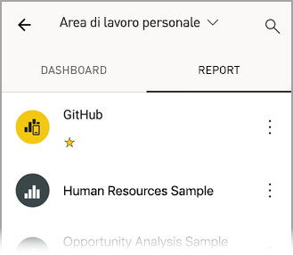

# Esplorare i report nelle app Power BI per dispositivi mobili
Si applica a:

|  |  |  |  |  |
|:--- |:--- |:--- |:--- |:--- |
| iPhone |iPad |Telefoni Android |Tablet Android |Dispositivi Windows 10 |

Un report di Power BI è una vista interattiva dei dati con elementi visivi che rappresentano conclusioni e approfondimenti diversi ottenuti da tali dati. La visualizzazione dei report nella app Power BI per dispositivi mobili è il terzo passaggio in un processo in tre fasi.

1. [Creare report in Power BI Desktop](../../desktop-report-view.md). In Power BI Desktop è persino possibile [ottimizzare un report per i telefoni](mobile-apps-view-phone-report.md). 
2. Pubblicare i report nel servizio Power BI [(https://powerbi.com)](https://powerbi.com) o in [Server di report di Power BI](../../report-server/get-started.md).  
3. È quindi possibile interagire con questi report nelle app Power BI per dispositivi mobili.

## Aprire un report di Power BI nell'app per dispositivi mobili
A seconda della provenienza, i report di Power BI sono archiviati in posizioni diverse nell'app per dispositivi mobili. Possono trovarsi in App, Condivisi con l'utente corrente, Aree di lavoro (inclusa l'Area di lavoro personale) oppure in un server di report. In alcuni casi si accede attraverso un dashboard correlato per ottenere un report, e talvolta sono elencati.

Negli elenchi e nei menu viene visualizzata un'icona accanto al nome del report che indica che l'elemento è un report. 

 

Sono disponibili due icone per i report nelle app Power BI per dispositivi mobili:

*  indica un report che verrà visualizzato con orientamento orizzontale nell'app e apparirà come viene visualizzato nel browser.

*  indica un report che include almeno una pagina del report ottimizzata per il telefono che verrà visualizzata con orientamento verticale. 

Nota: se il telefono viene tenuto in orizzontale, verrà sempre visualizzato il layout orizzontale, anche se la pagina del report ha un layout telefono. 

Per passare a un report da un dashboard, toccare i puntini di sospensione (...) nell'angolo superiore destro di un riquadro > **Apri report**.
  
  
  
  Non tutti i riquadri offrono l'opzione di apertura in un report. Ad esempio, i riquadri creati ponendo una domanda nella casella Domande e risposte non aprono i report quando vengono toccati. 
  
## Interazione con i report
Dopo aver aperto un report nell'app, è possibile iniziare a usarlo. È possibile eseguire molte operazioni con il report e i relativi dati. Nel piè di pagina del report sono indicate le azioni che è possibile eseguire sul report, mentre toccando per alcuni secondi i dati visualizzati nel report è anche possibile visualizzare i dati in dettaglio.

### Uso del tocco e del tocco lungo
Toccare equivale a fare clic con il mouse. Di conseguenza, per evidenziare il report in base a un punto dati, toccare il punto dati.
Se si tocca un valore di filtro dei dati, il valore viene selezionato e viene eseguito il sezionamento della parte rimanente del report in base al valore. Se si tocca un collegamento, un pulsante o un segnalibro, l'elemento viene attivato in base all'azione definita dall'autore.

Probabilmente si è notato che quando si tocca un oggetto visivo, viene visualizzato un bordo. Nell'angolo superiore destro del bordo sono visualizzati i puntini di sospensione (...). Se si toccano i punti di sospensione, viene visualizzato un menu con le azioni che è possibile eseguire sull'oggetto visivo.

### Azioni Descrizione comando e Drill

Durante il tocco lungo (toccare e tenere premuto) su un punto dati, viene visualizzata una descrizione comando con i valori rappresentati dal punto dati. 

Se l'autore del report ha configurato la descrizione comando della pagina del report, la descrizione comando predefinita viene sostituita dalla descrizione comando della pagina del report.

> [!NOTE]
> Le descrizioni comando del report sono supportate per i dispositivi con dimensioni maggiori di 640 pixel e un riquadro di visualizzazione di 320. Se il dispositivo è più piccolo, l'app usa le descrizioni comando predefinite.

Gli autori del report possono definire gerarchie nei dati e relazioni tra le pagine del report. La gerarchia consente di eseguire il drill-down, il drill-up e il drill-through di un'altra pagina del report da un oggetto visivo e un valore. Di conseguenza, quando si tocca un valore per alcuni secondi, oltre alla descrizione comando, vengono visualizzate anche le opzioni di drill nel piè di pagina. 

Con il *drill-through*, quando si tocca una parte specifica di un oggetto visivo, Power BI consente di passare a un'altra pagina nel report, filtrata in base al valore scelto.  L'autore del report può definire una o più opzioni di drill-through che portano a pagine diverse. In tal caso, è possibile scegliere la pagina di cui eseguire il drill-through. Il pulsante Indietro consente di tornare alla pagina del report precedente.

Leggere le informazioni su come [aggiungere il drill-through in Power BI Desktop](../../desktop-drillthrough.md).
   
   > [!IMPORTANT]
   > Nell'app Power BI per dispositivi mobili il drill negli oggetti visivi di matrici e tabelle viene abilitato solo tramite un valore di cella e non tramite le intestazioni di riga e colonna.
   
   
   
### Uso delle azioni del piè di pagina del report
Il piè di pagina del report include le azioni che è possibile eseguire nella pagina del report corrente o nell'intero report. Il piè di pagina offre l'accesso rapido alle azioni più utili. Per accedere a tutte le azioni, usare i puntini di sospensione (...).

Dal piè di pagina è possibile eseguire le azioni seguenti:
1) Ripristinare lo stato originale del filtro del report e delle evidenziazioni incrociate.
2) Aprire il riquadro conversazione per visualizzare o aggiungere commenti al report.
3) Aprire il riquadro filtro per visualizzare e modificare il filtro applicato al report.
4) Visualizzare un elenco di tutte le pagine del report. Se si tocca il nome di una pagina, la pagina viene caricata e visualizzata.
Il passaggio da una pagina del report a un'altra può essere eseguito scorrendo dal bordo dello schermo verso il centro.
5) Visualizzare tutte le azioni del report.

#### Tutte le azioni del report
Se si tocca sull'opzione puntini di sospensione (...) nel piè di pagina del report, vengono visualizzate tutte le azioni che è possibile eseguire nel report. 

È possibile che alcune azioni siano disabilitate poiché dipendono dalle funzionalità specifiche del report.
ad esempio:
1) Il **filtro in base alla posizione** è abilitato se l'autore ha creato categorie dei dati basate su dati geografici. [Altre informazioni su come identificare i dati geografici nel report](https://docs.microsoft.com/power-bi/desktop-mobile-geofiltering).
2) L'**analisi per filtrare il report in base al codice a barre** è abilitata solo se il set di dati nel report è stato contrassegnato come codice a barre. [Come contrassegnare codici a barre in Power BI Desktop](https://docs.microsoft.com/power-bi/desktop-mobile-barcodes). 
3) L'**invito** è abilitato solo se si dispone dell'autorizzazione per condividere il report con altri utenti. Si disporrà dell'autorizzazione solo se si è il proprietario del report o se è stata assegnata l'autorizzazione di ricondivisione da parte del proprietario.
4) L'**annotazione e la condivisione** potrebbero essere disabilitate in presenza di [criteri di protezione di Intune](https://docs.microsoft.com/intune/app-protection-policies) nell'organizzazione che impediscono la condivisione dall'app Power BI per dispositivi mobili. 

## Passaggi successivi
* [Visualizzare e interagire con i report di Power BI ottimizzati per il proprio telefono](mobile-apps-view-phone-report.md)
* [Creare una versione di un report ottimizzata per i telefoni](../../desktop-create-phone-report.md)
* Domande? [Provare a rivolgersi alla community di Power BI](http://community.powerbi.com/)

