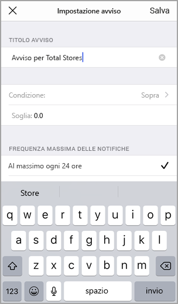
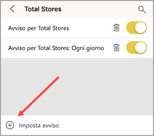
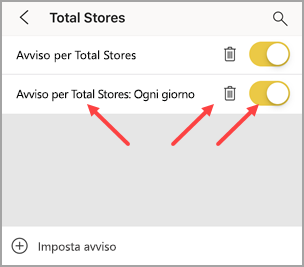
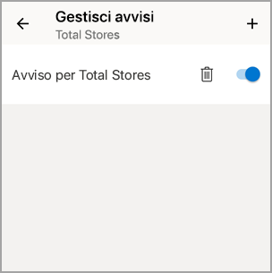
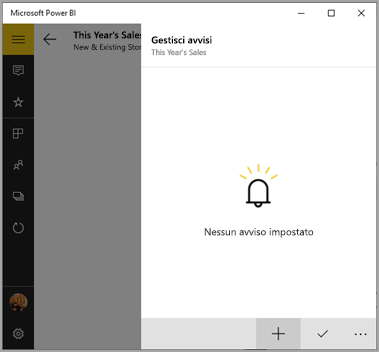
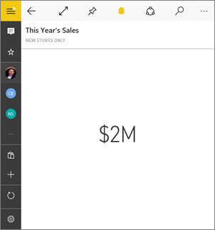

# Impostare gli avvisi per i dati nelle app Power BI per dispositivi mobili
Si applica a:

|  |  |  |  |  |
|:--- |:--- |:--- |:--- |:--- |
| iPhone |iPad |Telefoni Android |Tablet Android |Dispositivi Windows 10 |

È possibile impostare gli avvisi sui dashboard nell'app Power BI per dispositivi mobili e nel servizio Power BI. Gli avvisi segnalano eventuali modifiche apportate ai dati in un riquadro che superano i limiti impostati. Gli avvisi possono essere usati con i riquadri in cui è presente un singolo numero, ad esempio le schede e i misuratori, ma non con i dati di streaming. Gli avvisi per i dati possono essere impostati in un dispositivo mobile e visualizzati nel servizio Power BI e viceversa. Gli avvisi per i dati sono visibili solo all'utente che li ha impostati, anche se si condivide un dashboard o uno snapshot di un riquadro.

È possibile impostare avvisi sui riquadri se si ha una licenza di Power BI Pro oppure se il dashboard condiviso è disponibile in capacità Premium. 

> [!WARNING]
> Le notifiche di avviso basate sui dati forniscono informazioni sui dati. Se il dispositivo viene rubato, è consigliabile disattivare tutte le regole di avviso basate sui dati usando il servizio Power BI. 
> 
> Altre informazioni sulla [gestione degli avvisi per i dati nel servizio Power BI](../../service-set-data-alerts.md).
> 
> 

## Avvisi per i dati in un iPhone o iPad
### Impostare un avviso in un iPhone o iPad
1. Toccare il riquadro con un numero o un misuratore nel dashboard per aprirlo in modalità messa a fuoco.  
   
   
2. Toccare l'icona a forma di campanello  per aggiungere un avviso.  
3. Toccare **Aggiungi regola di avviso**.
   
   
4. Impostare il valore al di sopra o al di sotto del quale si vogliono ricevere gli avvisi.
   
   
5. Decidere se ricevere avvisi ogni ora o ogni giorno e se si vuole ricevere anche un messaggio di posta elettronica quando viene generato l'avviso.
   
   > [!NOTE]
   > Gli avvisi non vengono ricevuti con la cadenza oraria o giornaliera specificata se i dati non vengono effettivamente aggiornati in quel momento.
   > 
   > 
6. È anche possibile modificare il titolo dell'avviso.
7. Toccare **Salva**.
8. Un singolo riquadro può includere avvisi per i valori sia superiori che inferiori alla soglia specificata. In **Gestisci avvisi** toccare **Aggiungi regola di avviso**.
   
   

### Gestire gli avvisi nell'iPhone o iPad
È possibile gestire i singoli avvisi nel dispositivo mobile o [tutti gli avvisi nel servizio Power BI](../../service-set-data-alerts.md).

1. In un dashboard toccare il riquadro di tipo numero o misuratore che contiene un avviso.  
   
   
2. Toccare l'icona a forma di campanello .  
3. Toccare il nome dell'avviso per modificarlo, toccare il dispositivo di scorrimento per disattivare gli avvisi di posta elettronica o toccare l'icona a forma di bidone della spazzatura per eliminare l'avviso.
   
    

## Avvisi per i dati in un dispositivo Android
### Impostare un avviso in un dispositivo Android
1. In un dashboard di Power BI toccare un numero o un misuratore per aprirlo.  
2. Toccare l'icona a forma di campanello  per aggiungere un avviso.  
   
   
3. Toccare l'icona più (+).
   
   
4. Digitare il valore al di sopra o al di sotto del quale si vogliono ricevere gli avvisi.
   
   
5. Toccare **Fatto**.
6. Decidere se ricevere avvisi ogni ora o ogni giorno e se si vuole ricevere anche un messaggio di posta elettronica quando viene generato l'avviso.
   
   > [!NOTE]
   > Gli avvisi non vengono ricevuti con la cadenza oraria o giornaliera specificata se i dati non vengono effettivamente aggiornati in quel momento.
   > 
   > 
7. È anche possibile modificare il titolo dell'avviso.
8. Toccare **Salva**.

### Gestire gli avvisi in un dispositivo Android
È possibile gestire i singoli avvisi nell'app Power BI per dispositivi mobili o [tutti gli avvisi nel servizio Power BI](../../service-set-data-alerts.md).

1. In un dashboard toccare il riquadro di tipo scheda o misuratore che contiene un avviso.  
2. Toccare l'icona a forma di campanello .  
3. Toccare l'avviso per modificare un valore o per disattivarlo.
   
    
4. Toccare l'icona del segno più (+) per aggiungere un altro avviso allo stesso riquadro.
5. Per eliminare completamente l'avviso, toccare l'icona a forma di bidone della spazzatura .

## Avvisi per i dati in un dispositivo Windows
### Impostare avvisi per i dati in un dispositivo Windows
1. Toccare il riquadro con un numero o un misuratore nel dashboard per aprirlo.  
2. Toccare l'icona a forma di campanello  per aggiungere un avviso.  
   
   
3. Toccare l'icona più (+).
   
   
4. Digitare il valore al di sopra o al di sotto del quale si vogliono ricevere gli avvisi.
   
   
5. Decidere se ricevere avvisi ogni ora o ogni giorno e se si vuole ricevere anche un messaggio di posta elettronica quando viene generato l'avviso.
   
   > [!NOTE]
   > Gli avvisi non vengono ricevuti con la cadenza oraria o giornaliera specificata se i dati non vengono effettivamente aggiornati in quel momento.
   > 
   > 
6. È anche possibile modificare il titolo dell'avviso.
7. Toccare il segno di spunta.
8. Un singolo riquadro può includere avvisi per i valori sia superiori che inferiori alla soglia specificata. In **Gestisci avvisi** toccare il segno più (+).
   
   

### Gestire gli avvisi per i dati in un dispositivo Windows
È possibile gestire i singoli avvisi nell'app Power BI per dispositivi mobili o [tutti gli avvisi nel servizio Power BI](../../service-set-data-alerts.md).

1. In un dashboard toccare il riquadro di tipo scheda o misuratore che contiene un avviso.  
2. Toccare l'icona a forma di campanello .  
   
   
3. Toccare l'avviso per modificare un valore o per disattivarlo.
   
    
4. Per eliminare completamente l'avviso, fare clic con il pulsante destro del mouse oppure toccare e tenere premuto > **Elimina**.

## Ricezione di avvisi
Gli avvisi vengono ricevuti nel [centro notifiche](mobile-apps-notification-center.md) di Power BI nel dispositivo mobile o nel servizio Power BI, insieme alle notifiche sui nuovi dashboard condivisi da altri utenti.

Le origini dati vengono spesso impostate in modo da essere aggiornate quotidianamente, anche se alcuni utenti scelgono di aggiornarle più di frequente. Quando i dati nel dashboard vengono aggiornati, se i dati rilevati raggiungono una delle soglie impostate, verranno eseguite alcune operazioni.

1. A seconda dell'opzione selezionata, Power BI controlla se è trascorsa più di un'ora o più di 24 ore dall'invio dell'ultimo avviso.
   
   Se i dati superano la soglia, viene visualizzato un avviso ogni ora o ogni 24 ore.
2. Se è stato impostato anche l'invio di un messaggio di posta elettronica, nella posta in arrivo viene visualizzato un messaggio simile al seguente.
   
   
3. Power BI aggiunge un messaggio al **centro notifiche** e una nuova icona di avviso al riquadro  applicabile.
4. Toccare il pulsante di spostamento  per [aprire il **Centro notifiche**](mobile-apps-notification-center.md) e visualizzare i dettagli dell'avviso.
   
      

> [!NOTE]
> Gli avvisi possono essere usati solo con dati aggiornati. Quando i dati vengono aggiornati, Power BI controlla se è impostato un avviso per tali dati. Se i dati raggiungono una soglia di avviso, viene generato un avviso.
> 
> 

## Suggerimenti e risoluzione dei problemi
* Gli avvisi non sono attualmente supportati per i riquadri Bing o di tipo scheda con misure di data/ora.
* Gli avvisi possono essere usati solo con dati numerici.
* Gli avvisi possono essere usati solo con dati aggiornati. Non possono essere usati con dati statici.
* Gli avvisi non funzionano con i riquadri contenenti dati di streaming.

## Passaggi successivi
* [Gestire gli avvisi nel servizio Power BI](../../service-set-data-alerts.md)
* [Centro notifiche di Power BI per dispositivi mobili](mobile-apps-notification-center.md)
* Domande? [Provare a rivolgersi alla community di Power BI](http://community.powerbi.com/)

