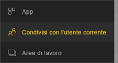
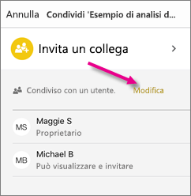
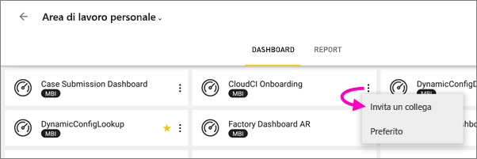
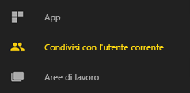
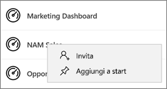
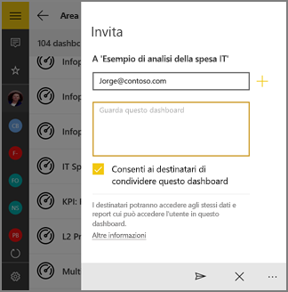

# Condividere un dashboard o un report da app Power BI per dispositivi mobili
Si applica a:

|  |  |  |  |  |
|:--- |:--- |:--- |:--- |:--- |
| iPhone |iPad |Telefoni Android |Tablet Android |Dispositivi Windows 10 |

Con una [licenza di Power BI Pro](../../service-features-license-type.md) è possibile invitare altri utenti a visualizzare i dashboard e i report condividendo i collegamenti dalle app Power BI per dispositivi mobili. La condivisione è possibile con chiunque, all'interno o all'esterno dell'organizzazione, con o senza un account di posta elettronica aziendale. Anche i destinatari devono avere una licenza di Power BI Pro. In caso contrario, il contenuto deve essere incluso in una [capacità Premium](../../service-premium-what-is.md).

Dalle app per dispositivi mobili Power BI per iOS e Android è possibile anche [aggiungere annotazioni e condividere lo snapshot di un riquadro, un report o un oggetto visivo](mobile-annotate-and-share-a-tile-from-the-mobile-apps.md) con chiunque. 

## Condividere dall'iPhone
1. Nella barra delle azioni nella parte inferiore del dashboard o del report toccare l'icona **Condividi** .
   
   
2. Digitare i nomi, separati da virgole, e un messaggio di accompagnamento per l'invito.
3. Per consentire la ricondivisione, lasciare selezionata l'opzione **Consenti ai destinatari di ricondividere**.
   
   La ricondivisione consente ai colleghi di inoltrare il messaggio di posta elettronica di invito ad altri utenti dell'organizzazione, usando il Web o le app per dispositivi mobili.
5. Toccare **Invia** nell'angolo in alto a destra.
   
   I destinatari riceveranno un messaggio di posta elettronica di invito contenente un collegamento diretto al dashboard o al report. L'invito scade dopo un mese. Quando i colleghi aprono il collegamento in un browser o nell'app Power BI per dispositivi mobili, questo viene aggiunto alla sezione **Condivisi** del loro account Power BI.
   
   
   
   Leggere altre [note sulla condivisione con i colleghi](../../service-share-dashboards.md).

### Annullare la condivisione dall'iPhone
È possibile annullare la condivisione solo se si è il proprietario.

1. Nella barra delle azioni nella parte inferiore del dashboard o del report toccare l'icona **Condividi** .
2. Toccare **Invita un collega**.
   
   Verrà visualizzato l'elenco dei colleghi con cui è stato condiviso questo dashboard o report, con le seguenti diciture:
   
   * **Può visualizzare**: i colleghi possono visualizzarlo, ma non condividerlo.
   * **Può visualizzare e invitare**: i colleghi possono visualizzarlo e condividerlo con altri colleghi.
1. Toccare **Modifica**.
   
    
4. Per annullare la condivisione, toccare il cerchio rosso accanto a un nome e toccare **Elimina**.

## Condividere dall'iPad
1. Toccare l'icona **Condividi**  nell'angolo in alto a destra del dashboard o del report.
2. Digitare gli indirizzi di posta elettronica e un messaggio di accompagnamento per l'invito.
3. Per consentire la ricondivisione, lasciare selezionata l'opzione **Consenti ai destinatari di ricondividere**.
   
   La ricondivisione consente ai colleghi di inoltrare il messaggio di posta elettronica di invito ad altri utenti dell'organizzazione, usando il Web o le app per dispositivi mobili. 

4. Toccare **Invia** nell'angolo in alto a destra.
   
   I destinatari riceveranno un messaggio di posta elettronica di invito contenente un collegamento diretto al dashboard o al report. L'invito scade dopo un mese. Quando i colleghi aprono il collegamento in un browser o nell'app Power BI per dispositivi mobili, questo viene aggiunto alla sezione **Condivisi** del loro account Power BI
   
   
   
   Leggere altre [note sulla condivisione con i colleghi](../../service-share-dashboards.md).

### Annullare la condivisione dall'iPad
È possibile annullare la condivisione solo se si è il proprietario.

1. Toccare l'icona **Condividi**  nell'angolo in alto a destra del dashboard o del report.
   
   Verrà visualizzato l'elenco dei colleghi con cui è stato condiviso questo dashboard o report, con le seguenti diciture:
   
   * **Può visualizzare**: i colleghi possono visualizzarlo, ma non condividerlo.
   * **Può visualizzare e invitare**: i colleghi possono visualizzarlo e condividerlo con altri colleghi.
2. Toccare **Modifica**.
3. Per annullare la condivisione, toccare il cerchio rosso accanto a un nome e toccare **Elimina**.

## Condividere da un dispositivo Android
1. Nella home page dei dashboard o dei report toccare i puntini di sospensione (...) e quindi **Invita un collega**.
   
   
2. In alternativa, in un dashboard o un report toccare l'icona Invita .

    Se si è proprietari del dashboard, verrà visualizzato l'elenco di colleghi con cui è stato condiviso il dashboard o il report unitamente alle note seguenti:

    -   **Può visualizzare**: i colleghi possono visualizzarlo, ma non condividerlo.
    -   **Può visualizzare e ricondividere**: i colleghi possono visualizzarlo e condividerlo con altri colleghi.

1. Digitare gli indirizzi di posta elettronica e un messaggio di accompagnamento per l'invito al dashboard. In caso contrario, Power BI invia un messaggio predefinito.
2. Per consentire la ricondivisione, lasciare selezionata l'opzione **Consenti ai destinatari di condividere questo dashboard** .
   
   La ricondivisione consente ai colleghi di inoltrare il messaggio di posta elettronica di invito ad altri utenti dell'organizzazione, usando il browser o le app per dispositivi mobili.
   
1. Toccare l'icona **Invia**  nell'angolo in alto a destra per inviare il messaggio.
   
   I destinatari riceveranno un messaggio di posta elettronica di invito contenente un collegamento diretto al dashboard. L'invito scade dopo un mese. Quando i colleghi aprono il collegamento in un browser o nell'app Power BI per dispositivi mobili, questo viene aggiunto alla sezione **Condivisi** del loro account Power BI
   
   
   
   Leggere altre [note sulla condivisione dei dashboard con i colleghi](../../service-share-dashboards.md).

### Annullare la condivisione da un dispositivo Android
È possibile annullare la condivisione solo se si è il proprietario.

1. Nell'angolo in alto a destra del dashboard o del report toccare l'icona Invita . 
   
   Verrà visualizzato l'elenco di colleghi con cui è stato condiviso questo dashboard o report.
2. Per interrompere la condivisione con un collega, toccare la **X** accanto a un nome \> **Rimuovi**.

## Condividere dal dispositivo Windows 10
1. In un dashboard o un report toccare l'icona Invita .
   
   In alternativa, nella home page dei dashboard o dei report fare clic con il pulsante destro del mouse o premere e tenere premuto e toccare **Invita**.
   
   
   
   Se si è proprietari del dashboard, verrà visualizzato l'elenco di colleghi con cui è stato condiviso il dashboard unitamente alle note seguenti:
   
   **Può visualizzare**: i colleghi possono visualizzarlo, ma non condividerlo.
   
   **Può visualizzare e ricondividere**: i colleghi possono visualizzarlo e condividerlo con altri colleghi.
2. Digitare gli indirizzi di posta elettronica e un messaggio di accompagnamento per l'invito. In caso contrario, Power BI invia un messaggio predefinito.
   
   
3. Per consentire la ricondivisione, lasciare selezionata l'opzione **Consenti ai destinatari di ricondividere**.
   
   La ricondivisione consente ai collaboratori di condividerlo con altri utenti dell'organizzazione, usando il browser o le app per dispositivi mobili.
   
1. Toccare l'icona **Invia** .
   
   I destinatari riceveranno un messaggio di posta elettronica di invito contenente un collegamento diretto al dashboard o al report. L'invito scade dopo un mese. Quando i colleghi aprono il collegamento in un browser o nell'app Power BI per dispositivi mobili, questo viene aggiunto alla sezione **Condivisi** del loro account Power BI
   
   
   
   Leggere altre [note sulla condivisione con i colleghi](../../service-share-dashboards.md).

## Passaggi successivi
* [Annotate & share a snapshot of a tile, report, or visual in the mobile apps](mobile-annotate-and-share-a-tile-from-the-mobile-apps.md) (Aggiungere annotazioni e condividere lo snapshot di un riquadro, un report o un oggetto visivo nelle app per dispositivi mobili)
* [Condividere un dashboard o un report in Power BI](../../service-share-dashboards.md)
* Domande? [Provare a rivolgersi alla community di Power BI](http://community.powerbi.com/)

