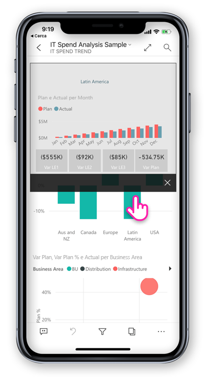
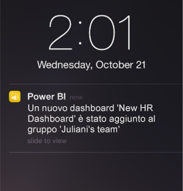

# Novità delle app per dispositivi mobili per Power BI
per le relative informazioni incluse nelle "Novità", vedere:

* [Blog del team di Power BI per le app per dispositivi mobili](https://powerbi.microsoft.com/blog/tag/mobile/)
* [Novità di Power BI Desktop](../../desktop-latest-update.md)  
* [Novità del servizio Power BI](../../service-whats-new.md)  

## Gennaio 2020

### Condividere le annotazioni create in modalità presentazione (Windows)

Le annotazioni create durante le presentazioni diventano una parte integrante della presentazione e un componente chiave della discussione. Quando si annotano i report in modalità presentazione, è ora possibile condividere uno snapshot della pagina del report con i colleghi. [Altre informazioni](./mobile-windows-10-app-presentation-mode.md#use-presentation-mode)

## Dicembre 2019

### Piè di pagina del report ancorato e un pulsante di aggiornamento - nuove esperienze per l'interazione con i report (Android)

Gli utenti Android hanno segnalato un'esperienza non ottimale per l'uso dei report, ovvero che è difficile usare il piè di pagina del report e che il trascinamento verso il basso per l'aggiornamento è troppo sensibile in alcuni dispositivi. Per questo motivo in questa versione sono stati modificati i comportamenti seguenti:
* **Piè di pagina del report ancorato** - ora, quando si apre un report nel telefono, il piè di pagina del report è ancorato nella parte inferiore della pagina del report, dove è sempre visibile e disponibile, indipendentemente dalle azioni eseguite nella pagina. Questo semplifica l'uso di tutte le opzioni incluse nel piè di pagina.
* **Pulsante di aggiornamento nell'intestazione del report** - è inoltre disponibile un pulsante di aggiornamento nell'intestazione del report, in modo che sia più semplicemente aggiornare il report all'occorrenza.

Gli utenti che preferiscono il comportamento precedente possono ripristinare questi comportamenti con le nuove [impostazioni di interazione](./mobile-app-interaction-settings.md) ampliate dell'app per dispositivi mobili.

Inoltre, gli amministratori IT possono [sostituire in remoto le nuove impostazioni predefinite](./mobile-app-configuration.md#interaction-settings-android) per conto dei propri utenti, usando lo strumento MDM preferito con un file di configurazione dell'app. In questo modo è possibile configurare lo stesso comportamento per tutti gli utenti di un'organizzazione.

> [!NOTE]
> Le impostazioni di interazione per il pulsante di aggiornamento e per l'ancoraggio del piè di pagina del report non vengono applicate attualmente ai report del server di report. Questo comportamento cambierà nella versione del server di report di gennaio.

### Impostare segnalibri predefiniti dall'app per dispositivi mobili
È ora possibile impostare segnalibri predefiniti per i report direttamente dall'app per dispositivi mobili Power BI. In questo modo, ogni volta che si apre un report, il relativo segnalibro predefinito verrà applicato automaticamente. [Altre informazioni](./mobile-reports-in-the-mobile-apps.md#bookmarks)

### Filtraggio in base alla posizione nei tablet Android
Il filtro geografico consente di filtrare i report in base alla posizione corrente. Questa funzionalità è ora disponibile anche nell'app Power BI per tablet Android. [Altre informazioni](./mobile-apps-geographic-filtering.md)

## Novembre 2019

### Il nuovo layout dell'app Power BI è ora attivato per impostazione predefinita
 
Ora quando si apre l'app, il nuovo layout e le barre di spostamento vengono attivate automaticamente, semplificando l'individuazione e l'apertura dei contenuti. Usare la [home page](mobile-apps-home-page.md) dell'app come punto di partenza per accedere rapidamente ai contenuti più importanti, oltre che come [feed attività](mobile-apps-home-page.md#activity-feed) che permette di rimanere aggiornati con gli avvisi e le notifiche più recenti e altro ancora.

### Visualizzare tutte le attività più recenti di Power BI
 
Il feed attività aiuta a tenere traccia di ciò che accade al contenuto di Power BI in tempo reale. Basta aprire la scheda Attività dalla home page dell'app per visualizzare gli ultimi avvisi, notifiche, commenti, @mentions e altro ancora. [Altre informazioni](mobile-apps-home-page.md#activity-feed)

### Usare i segnalibri nei report

L'app Power BI per dispositivi mobili supporta ora i segnalibri creati in Power BI. Dopo aver aperto l'app, è possibile sfruttare i segnalibri creati dall'autore del report e gli eventuali segnalibri creati personalmente. [Altre informazioni](mobile-reports-in-the-mobile-apps.md#bookmarks)

## Ottobre 2019

### Supporto Android per la configurazione remota delle impostazioni di accesso al server di report

È stato aggiunto il supporto Android per la configurazione remota delle impostazioni di accesso del server di report dell'app Power BI per dispositivi mobili. Gli amministratori IT possono ora usare lo strumento MDM dell'organizzazione per configurare in modalità remota queste impostazioni nei dispositivi iOS e Android. Per informazioni dettagliate, vedere [Configurare l'accesso al server di report delle app Power BI per dispositivi mobili in modalità remota](https://docs.microsoft.com/power-bi/report-server/configure-powerbi-mobile-apps-remote).

### Drill-through tra report

Questo mese è stato aggiunto il supporto per il drill-through tra report. È ora possibile toccare un punto dati per eseguire il drill-through e accedere ad altri report e pagine di report. Quando si esegue il drill-through in una pagina di destinazione, il contenuto della pagina viene filtrato in base alle impostazioni di drill-through.

> [!NOTE]
> Il drill-through tra report è disponibile solo se è stato abilitato al momento della creazione del report. [Altre informazioni sul drill-through tra report](https://docs.microsoft.com/power-bi/desktop-cross-report-drill-through).

### Etichette di riservatezza dei dati

È ora possibile visualizzare le etichette di riservatezza che i proprietari del contenuto hanno impostato su report, dashboard, set di dati e flussi di dati per classificare la riservatezza dei dati. Le etichette di riservatezza determinano il modo in cui è possibile condividere il contenuto con altri utenti. [Altre informazioni sulle etichette di riservatezza dei dati in Power BI](https://docs.microsoft.com/power-bi/admin/service-security-data-protection-overview).

### Supporto per l'esperienza di spostamento personalizzata dell'app (Windows)

È stato aggiunto il supporto per l'esperienza di spostamento personalizzata per i dispositivi Windows oltre ai dispositivi iOS e Android (vedere [la voce Novità di settembre](#september-2019)).

## Settembre 2019

### Supporto per l'esperienza di spostamento personalizzata dell'app (iOS e Android)

È stato aggiunto il supporto per l'esperienza di spostamento personalizzata dell'app. Ora, quando si apre un'app in Power BI per dispositivi mobili, sarà disponibile l'esperienza di spostamento personalizzata creata dall'autore dell'app. La struttura di spostamento delle app può essere organizzata in base al contenuto e può includere nuovi elementi, ad esempio collegamenti e sezioni comprimibili.
Vedere altre informazioni sull'[esperienza di spostamento personalizzata](https://powerbi.microsoft.com/blog/designing-custom-navigation-for-power-bi-apps-is-now-available/).

## Agosto 2019

### Presentazione del nuovo aspetto di Power BI per dispositivi mobili (anteprima) (iOS e Android)

L'app è stata aggiornata e sono state introdotte nuove esperienze, con l'aggiunta di una home page che consente di accedere rapidamente ai contenuti usati di frequente e di nuovi riquadri di spostamento che offrono un modo semplice per spostarsi nell'app. Con le esperienze nuove e aggiornate, ora è più veloce e più semplice trovare quello che ti serve, quando ti serve.
Poiché il nuovo aspetto è disponibile in anteprima, per poterlo apprezzare sarà necessario attivarlo.
Altre informazioni sul [ nuovo aspetto di Power BI](https://powerbi.microsoft.com/blog/introducing-power-bi-mobile-apps-new-look-preview/).

### Accesso protetto con Azure Active Directory (AD) Application Proxy (iOS e Android)

Il team di Power BI ha collaborato con il team di Azure Active Directory per integrare le applicazioni Power BI per dispositivi mobili con Azure Active Directory (AAD) Application Proxy. Con questa configurazione è possibile connettersi al server di report ospitato all'interno dei limiti aziendali dall'app Power BI per dispositivi mobili, senza dover definire una configurazione locale complessa. Vedere altre informazioni sull'[integrazione di Power BI per dispositivi mobili e Azure AD Application Proxy](https://powerbi.microsoft.com/blog/access-on-prem-report-server-from-your-power-bi-mobile-app-with-azure-active-directory-application-proxy/). Informazioni su [come configurare Azure AD Application Proxy e Power BI](https://docs.microsoft.com/azure/active-directory/manage-apps/application-proxy-integrate-with-power-bi).

## Luglio 2019

### Descrizioni comando per le pagine del report

Le descrizioni comando dei report sono ora supportate per i report visualizzati nell'app per dispositivi mobili. È sufficiente tenere premuto un oggetto visivo a cui è associata una descrizione comando del report per visualizzarla.  

 
> [!NOTE]
> Le descrizioni comando del report sono supportate per i dispositivi con dimensioni maggiori di 640 pixel e un riquadro di visualizzazione di 320. I dispositivi con dimensioni minori usano le descrizioni comando predefinite.

## Giugno 2019

### La scansione del codice a barre è ora disponibile in Android
È ora possibile usare l'app Power BI con Android (telefono e tablet) per effettuare la scansione di codici a barre stampati su prodotti o scaffali del punto vendita e visualizzare i report di Power BI correlati filtrati in base al valore ottenuto con la scansione. Altre informazioni su come [filtrare i dati con i codici a barre](mobile-apps-scan-barcode-iphone.md).

### Supporto di report PBIX ospitati in una configurazione PBI-RS su file system distribuito di Azure (iOS, Android)

I report di Power BI (PBIX) ospitati in una configurazione PBI-RS su file system distribuito di Azure sono ora accessibili anche dall'app Power BI per dispositivi mobili.

## Maggio 2019

### Supporto dei comandi rapidi di Siri (iOS)
Gli utenti possono creare comandi rapidi di Siri per i report e i dashboard di Power BI e quindi aprirli direttamente dall'interfaccia vocale Siri. [Informazioni su come usare i comandi rapidi di Siri nell'app Power BI per iOS](https://powerbi.microsoft.com/blog/introducing-siri-integration-with-power-bi-mobile-ios-app-preview/).

### Ricerca nel dispositivo (iOS)
Integrazione di Power BI con la ricerca nel dispositivo iOS (Spotlight). La ricerca del contenuto in un iPhone o iPad include ora anche gli elementi di Power BI. Quando gli utenti usano la ricerca nativa nel dispositivo, nei risultati vengono elencati anche i report, i dashboard, le app, le aree di lavoro e le persone di Power BI corrispondenti ai criteri di ricerca. [Per altre informazioni, visitare il post di blog](https://powerbi.microsoft.com/blog/introducing-siri-integration-with-power-bi-mobile-ios-app-preview/).

### Interazione con i report a tocco singolo - disponibile a livello generale

Il tocco singolo è ora disponibile a livello generale e diventerà l'interazione touch predefinita per i nuovi utenti. Gli utenti potranno comunque attivarlo e disattivarlo e impostare il doppio tocco nelle impostazioni dell'app.

### Protezione avanzata di accesso condizionale (iOS, Android)

È stata integrata una [nuova funzionalità di accesso condizionale basata sulla protezione delle app](https://docs.microsoft.com/azure/active-directory/conditional-access/app-protection-based-conditional-access) di AAD per aumentare la sicurezza limitando l'accesso a Power BI prima che vengano applicati i criteri delle app.

### Protezione del dispositivo (iOS)

Gli utenti possono usare la protezione incorporata del dispositivo per proteggere Power BI, richiedendo un Face ID, Touch ID o passcode per l'accesso a Power BI. Questa funzionalità può essere controllata dagli utenti tramite le impostazioni dell'app ma anche dagli amministratori tramite Intune e qualsiasi altro strumento MDM. [Altre informazioni](https://docs.microsoft.com/power-bi/consumer/mobile/mobile-ios-native-secure-access)

### Presentazione di report a una pagina (Windows)

L'aggiornamento automatico è supportato ora anche per i report a una pagina nelle presentazioni. Se l'origine dati sottostante del report viene aggiornata, verranno quindi raccolti e aggiornati i dati nella pagina.

## Aprile 2019

### Oggetto visivo Fattori di influenza chiave 

L'oggetto visivo Fattori di influenza chiave è ora disponibile nell'app per dispositivi mobili. Questo oggetto visivo consente di eseguire in pochi tocchi l'analisi dei fattori principali nei dati.

### Aggiungere commenti al contenuto del report (Android e iOS)

È ora possibile usare i commenti per collaborare e condividere feedback sulle pagine e gli oggetti visivi dei report. Per altre informazioni su come commentare i report nel servizio Power BI e per dispositivi mobili, leggere [questo blog](https://powerbi.microsoft.com/blog/announcing-report-commenting-for-power-bi-service-and-mobile/). 

### Ingrandire la vista con la modalità schermo intero (Android e iOS)

È stato aggiunto nuovo pulsante che consente un controllo quando l'utente si concentra sui dati rimuovendo intestazioni e piè di pagina e offrendo il massimo spazio per la visualizzazione dei report.

## Marzo 2019

### Supporto degli utenti guest esterni nelle app di Power BI (iOS, Android)

È possibile accedere direttamente dall'app ai contenuti di Power BI condivisi con l'utente da un'altra organizzazione (funzionalità nota anche come B2B). Altre informazioni sulla funzionalità B2B di Power BI per dispositivi mobili sono disponibili [qui](https://powerbi.microsoft.com/blog/power-bi-mobile-apps-now-support-azure-ad-b2b-guest-users/).

### Ottimizzazione delle presentazioni in Windows con la funzionalità di presentazione (Windows)

La funzionalità di [presentazione](https://powerbi.microsoft.com/blog/enhancing-presentation-mode-with-slideshow-in-windows-power-bi-app/) consente di usare gli schermi pubblici disponibili nell'ufficio aziendale per eseguire i report di Power BI in modalità schermo intero, con rotazione automatica tra le pagine del report.  

### Supporto dei report di PBI-RS nella configurazione del file system distribuito di Azure e WAP (solo iOS)

I report di Power BI (PBIX) ospitati in PBI-RS nella configurazione del file system distribuito di Azure sono ora accessibili dall'app Power BI per iOS.

### Abilitazione dell'interazione tramite tocco singolo con gli oggetti visivi del report

È stata modificata l'interazione nei report, che richiede ora un tocco singolo su oggetti visivi, pulsanti o filtri dei dati per un'interazione immediata con i dati. Gli utenti non devono più toccare un oggetto visivo per selezionarlo e toccarlo di nuovo per interagire con esso: è sufficiente un tocco singolo.

> [!NOTE]
> Gli utenti esistenti dovranno attivare questo comportamento nell'impostazione dell'app. Per altre informazioni, vedere l'articolo [Come configurare l'interazione nei report tramite tocco singolo](https://docs.microsoft.com/power-bi/consumer/mobile/mobile-app-single-tap).

## Gennaio - febbraio 2019
 
### Oggetti visivi di Visio

Abilitazione di Single Sign-On (SSO) negli oggetti visivi di Visio, in modo che non siano più necessari passaggi aggiuntivi per l'accesso quando si visualizzano report con oggetti visivi di Visio nell'app. 

### Funzionalità per l'aggiunta di commenti a dashboard in arrivo per l'app Windows Power BI per dispositivi mobili

È possibile aggiungere commenti sui dati direttamente nei dashboard e in riquadri specifici. I commenti sono visibili per chiunque visualizzi il dashboard. 

## Dicembre 2018

### Sono ora disponibili filtri per i report orizzontali 

Il riquadro del filtro del report è ora disponibile per i report orizzontali (oltre ai report per i telefoni).

## Novembre 2018

### Intestazione moderna dell'oggetto visivo 

I report che usano la nuova 'intestazione moderna dell'oggetto visivo' non allocheranno più spazio per le intestazioni, di conseguenza lo spazio vuoto risulterà ridotto e ci sarà più spazio per le visualizzazioni.

### Modalità di presentazione migliorata (Windows)

Modalità di presentazione migliorata per i dispositivi Surface Hub e Windows 10.  Un'esperienza più efficiente per la sala riunioni di Surface Hub con strumenti migliori per presentazione e collaborazione e una visualizzazione ottimizzata per schermi di grandi dimensioni chromeless, per potersi concentrare sui dati. La modalità di presentazione offre anche strumenti come l'input penna, per presentazioni e discussioni efficaci dei dati. Altre informazioni sulla modalità di presentazione sono disponibili [qui](https://powerbi.microsoft.com/blog/presentation-mode-in-power-bi-windows-app/).

### Layout dei report verticale per i tablet (iOS e Android)

È ora possibile usare il layout dei report per il telefono, se esistente, per visualizzare i report nei tablet con orientamento verticale. Vedere altre informazioni su [come creare un layout per telefono nel servizio Power BI o in Power BI Desktop](https://docs.microsoft.com/power-bi/desktop-create-phone-report/).

### Supporto della stringa di query del report 

Quando si apre un collegamento a un report che include una stringa di query, il report verrà ora aperto nell'app per dispositivi mobili pre-filtrato in base alle condizioni definite nella stringa di query. Vedere altre informazioni su [come creare l'URL del report con una stringa di query](https://docs.microsoft.com/power-bi/service-url-filters/).  

### Credenziali condivise (ora disponibili in Android)

Accedere a Power BI dall'app per dispositivi mobili non è mai stato così facile. Con le credenziali condivise, il processo di accesso viene semplificato usando altre credenziali dell'app Office 365 nel dispositivo per autenticarsi nel servizio Power BI.

### URL in-app (ora disponibili in Android) 

I collegamenti nei report che fanno riferimento ad altri elementi di Power BI verranno ora aperti direttamente nell'app. In questo modo è possibile compilare dei flussi di navigazione personalizzati, eseguendo ad esempio il collegamento da un report a un dashboard.

### Visualizzare i dati e copiare i valori

Il menu delle azioni per l'oggetto visivo del report (...) include ora l'opzione per visualizzare i dati sottostanti in formato tabella. Una volta nella tabella, è possibile usare un tocco prolungato per selezionare e copiare valori dalla tabella, a condizione che non esistano criteri di Intune che limitano la copia.

## Ottobre 2018

### Anteprima del report impaginato (tutti i dispositivi)

I report impaginati ora sono disponibili nel servizio Power BI. Gli utenti con accesso ai report impaginati nel servizio Power BI possono accedere anche a questi report dall'app per dispositivi mobili. 

Leggere il [post di blog sui report impaginati nell'app per dispositivi mobili](https://powerbi.microsoft.com/blog/power-bi-paginated-reports-also-available-in-power-bi-mobile-apps-preview/).

### Credenziali condivise (iOS)

Accedere a Power BI dall'app per dispositivi mobili non è mai stato così facile. Con le credenziali condivise, il processo di accesso viene semplificato usando altre credenziali dell'app Office 365 nel dispositivo per autenticarsi nel servizio Power BI.

### URL in-app (iOS) 

I collegamenti nei report che fanno riferimento ad altri elementi di Power BI verranno ora aperti direttamente nell'app. In questo modo è possibile compilare dei flussi di navigazione personalizzati, eseguendo ad esempio il collegamento da un report a un dashboard.

### Supporto per iOS12 e watchOS 5 

L'app Power BI è stata aggiornata per iOS in modo da integrarsi nel nuovo sistema operativo nei dispositivi mobili e nell'orologio.

## Settembre 2018

### Modifica di un report per smartphone nel browser (tutti i dispositivi)

È ora possibile creare un layout per smartphone per un report già pubblicato nel servizio Power BI e non solo in Power BI Desktop. È possibile eseguire questa attività in modalità di modifica nel browser.

### Aggiunta di commenti a dashboard (iOS e Android) 

È possibile aggiungere commenti sui dati direttamente nei dashboard e in riquadri specifici. I commenti sono visibili per chiunque visualizzi il dashboard. È anche possibile coinvolgere altri utenti dell'organizzazione nella conversazione tramite @mentioning. Gli utenti @mentioned ricevono una notifica push con il messaggio sul telefono cellulare.

La funzionalità è attualmente disponibile per dispositivi iOS e Android. Il supporto per Windows sarà presto disponibile.

Leggere il [post nel blog di Power BI sui commenti nel dashboard](https://powerbi.microsoft.com/blog/announcing-dashboard-comments-in-power-bi/).

### Single Sign-On (Windows)

Single Sign-On (SSO) è una delle funzionalità più richieste per Power BI per dispositivi mobili per Windows. È ora possibile usare l'account principale dell'organizzazione per accedere non solo ai dispositivi mobili Windows aggiunti a un dominio, ma anche al servizio Power BI, senza interruzioni. Altre informazioni su [SSO e sulle app per dispositivi mobili Windows](mobile-windows-10-app-single-sign-on-sso.md).

## Mesi precedenti

### Luglio 2018

#### Solo iOS e Android

**Filtri condivisi**

È ora possibile ricevere report con filtri e filtri dei dati condivisi.

**Supporto per immagini di sfondo**

Quando si visualizza un report in modalità orizzontale nel dispositivo mobile, è possibile visualizzare le stesse immagini di sfondo disponibili in Power BI sul Web.

### Giugno 2018

#### Report in area di disegno completa

Le barre delle azioni superiore e inferiore ora scompaiono subito dopo il caricamento del report, per consentire una visualizzazione più ampia del report.

#### Dimensioni dell'area di disegno del report aumentate

Sono state aumentate le dimensioni dell'area di disegno del report nel telefono per avere spazio per altri oggetti visivi.

### Maggio 2018

#### Drill-through per dispositivi mobili: tutte le app per dispositivi mobili

È possibile eseguire drill-through da un punto dati selezionato in un'altra pagina del report nelle app per dispositivi mobili, se tale azione è stata definita dall'autore del report. 

#### Pulsante Indietro: tutte le app per dispositivi mobili

Ora, quando si esplora un report scorrendo rapidamente, scegliendo una pagina del report sulla barra delle azioni o tramite il drill-through, il pulsante Indietro consente di tornare alla pagina precedente visualizzata. 

#### Temi del dashboard: tutte le app per dispositivi mobili

Quando gli autori di report personalizzano i temi del dashboard nel servizio Power BI, l'aspetto del dashboard verrà modificato anche nell'app per dispositivi mobili. Tuttavia, non si vedranno le immagini di sfondo.

#### iOS: Configurare l'accesso delle app per dispositivi mobili iOS di Power BI in modalità remota

L'amministratore IT può ora usare uno strumento MDM per configurare l'accesso delle app per dispositivi mobili iOS di Power BI a un server di report. Per informazioni dettagliate, vedere [Configurare l'accesso delle app per dispositivi mobili iOS di Power BI in modalità remota](../../report-server/configure-powerbi-mobile-apps-remote.md).

#### App Power BI per realtà mista (anteprima)

L'app Power BI per realtà mista è ora disponibile in Microsoft Store. È possibile visualizzare dashboard e report mentre si è immersi nel mondo virtuale o inserire tali elementi e visualizzarli in posizioni specifiche nel contesto del proprio ambiente. Vedere il nuovo video [Introducing Power BI on Hololens](https://www.youtube.com/watch?v=J_X_nOFUBss) (Introduzione a Power BI su Hololens) per informazioni sul contesto oppure leggere l'articolo sulla nuova [app Power BI per realtà mista](mobile-mixed-reality-app.md).

### Aprile 2018

#### Drill-up e drill-down per dispositivi mobili

È ora possibile eseguire il drill-up e il drill-down per esaminare in dettaglio gli oggetti visivi dei report sul proprio dispositivo mobile. Per accedere a questa nuova funzionalità, toccare e tenere premuto un oggetto visivo del report per aprire il menu di descrizione comandi e quindi toccare i pulsanti di espansione per esaminare i dati in modo approfondito. Altre informazioni su [drill-up e drill-down nelle app per dispositivi mobili](https://powerbi.microsoft.com/blog/drill-down-up-in-power-bi-mobile-apps/).

#### Filtri permanenti

I filtri e i filtri dei dati nei report sono stati aggiornati di recente in modo da essere salvati automaticamente da Power BI sul Web all'app Power BI per dispositivi mobili. Ora i filtri e i filtri dei dati impostati nell'app per dispositivi mobili vengono salvati automaticamente in Power BI sul Web.

### Marzo 2018

#### App Power BI per realtà mista (anteprima)

Nello sviluppo più recente per portare i dati ovunque, abbiamo creato l'app Power BI per realtà mista. È possibile visualizzare dashboard e report mentre si è immersi nel mondo virtuale o inserire tali elementi e visualizzarli in posizioni specifiche nel contesto del proprio ambiente. Altre informazioni sulla nuova [app Power BI per realtà mista](mobile-mixed-reality-app.md).

#### Condividi report e dashboard esternamente

Condividere i dashboard e i report con utenti esterni all'organizzazione, direttamente dall'app. La condivisione esterna è abilitata sia per gli account dell'organizzazione che per quelli di social networking. 

#### Filtri permanenti

Quando si impostano filtri e filtri dei dati in Power BI sul Web, le opzioni di filtro scelte vengono salvate anche nell'app per dispositivi mobili, in modo da poter riprendere da dove si è lasciato.

#### Aggiornare i report nell'iPad

Per i report di Power BI è ora disponibile un pulsante di aggiornamento nell'app per iPad.

### Febbraio 2018

#### Condividere i report

È ora possibile condividere un report direttamente dalle app per dispositivi mobili. Altre informazioni sulla [condivisione di dashboard e report dalle app per dispositivi mobili](mobile-share-dashboard-from-the-mobile-apps.md)

#### Descrizioni comandi migliorate

Quando si tocca e si tiene premuto l'oggetto visivo di un report per accedere alle descrizioni comandi, è ora possibile trascinare il dito attraverso l'oggetto visivo per esaminare informazioni dettagliate su ogni punto dati lungo il percorso.

### Gennaio 2018

#### Report Preferiti

Contrassegnare i report come Preferiti in modo da visualizzarli nella pagina **Preferiti**. Altre informazioni sui [dashboard preferiti nelle app Power BI per dispositivi mobili](mobile-apps-favorites.md).

#### Visualizzare report condivisi

Quando un utente condivide un report con l'utente, ora il report viene elencato nella pagina **Condivisi con l'utente corrente** insieme ai dashboard.

#### Supporto dei collegamenti ipertestuali migliorato

È ora possibile toccare i collegamenti negli oggetti visivi personalizzati per aprirli nel browser per dispositivi mobili.

#### Integrazione di Intune (Android)

Supporto dell'accesso condizionale tramite la gestione dei dispositivi mobili di Intune.

### Dicembre 2017

#### Gestione della sicurezza migliorata 

Per una miglior protezione dei dati dell'organizzazione è stato aggiunto il supporto dell'accesso condizionale e della gestione di dispositivi mobili Microsoft Intune (MDM) nei dispositivi Android. Questo supporto è già disponibile per i dispositivi iOS.

#### Gestione migliorata delle autorizzazioni

Sono state apportate alcune modifiche che consentono una gestione più precisa delle autorizzazioni utente per set di dati, dashboard e report.

#### App installate automaticamente

Non è necessario installare alcune delle app in Power BI. Gli autori di app di Power BI nell'organizzazione possono creare *app* che includono una raccolta di dashboard e report. Possono quindi pubblicare l'app e configurarla per l'installazione automatica nel servizio Power BI e nelle app Power BI per dispositivi mobili. Quando un'app è configurata per l'installazione automatica, viene visualizzata automaticamente nel menu **App**:

### Novembre 2017
#### Ottimizzazione per iPhone X

Il layout dell'app per iPhone X è stato ottimizzato per consentire di esplorare i dati con facilità in ogni dispositivo.

### Ottobre 2017
#### Filtri per i report per il telefono nei dispositivi Android

Se si crea un report con pagine ottimizzate per il telefono in Power BI Desktop e il report contiene filtri, è ora possibile applicare tali filtri nel report per il telefono su dispositivi Android. Altre informazioni sui filtri per i report di Power BI su Android.

#### Mostrare i dati nei report

È ora possibile passare dagli oggetti visivi nei report a una visualizzazione tabella per verificare i numeri su cui si basano i dati. Per accedere a questa funzionalità, toccare "Mostra i dati" dal menu dell'oggetto visivo nel report o la nuova icona nel menu Azione dell'oggetto visivo espanso.

### Settembre 2017
#### Filtri per i report per il telefono nei dispositivi iPhone
Se si crea un report con pagine ottimizzate per il telefono in Power BI Desktop e il report contiene filtri, è ora possibile applicare tali filtri nel report per il telefono sull'iPhone. Sono disponibili altre informazioni sui [filtri per i report di Power BI su dispositivi iPhone](https://powerbi.microsoft.com/blog/filters-coming-for-phone-reports-on-ios/).

### Agosto 2017
#### Supporto delle impostazioni proxy di iOS
È ora possibile configurare impostazioni proxy nell'app Power BI per dispositivi mobili iOS. Power BI quindi ora funziona con le connessioni VPN sul dispositivo mobile, consentendo a più utenti e organizzazioni di sfruttare in modo sicuro la potenza di Power BI anche in viaggio.

### Luglio 2017
Leggere il [riepilogo delle funzionalità delle app per dispositivi mobili di luglio 2017](https://powerbi.microsoft.com/blog/power-bi-service-and-mobile-july-feature-summary/#ios-preview)

#### Dispositivi iOS
**Nuova esperienza di Domande e risposte in iOS (anteprima)** Invece di ricevere semplicemente una risposta alle domande, è ora possibile usare il linguaggio naturale per ottenere informazioni dettagliate relative a un ambito specifico. Anche se non si è sicuri di ciò che si sta cercando, Domande e risposte propone in modo proattivo informazioni dettagliate rilevanti per i dati specifici. La nuova esperienza di Domande e risposte nei dispositivi mobili, sviluppata in collaborazione con il team di Microsoft Research, presenta tecnologie avanzate nel prodotto. Vedere l'esercitazione [Porre domande sui dati nelle app per dispositivi mobili iOS](mobile-apps-ios-qna.md).

### Oggetti visivi reattivi
**Oggetti visivi reattivi per i report e i dashboard del telefono** È possibile configurare gli oggetti visivi nel dashboard o nel report in modo che siano *reattivi*, ovvero in modo che vengano modificati dinamicamente per visualizzare la quantità massima di dati e informazioni dettagliate, indipendentemente dalle dimensioni dello schermo. Leggere il [blog sugli oggetti visivi reattivi](https://powerbi.microsoft.com/blog/power-bi-desktop-july-feature-summary-2/#responsiveVisuals).

### Giugno 2107
#### Tutti i dispositivi
**Aggiungere app ai Preferiti** È già possibile aggiungere un dashboard ai Preferiti. Recentemente [in Power BI sono state aggiunte le app](../../service-create-distribute-apps.md) ed è ora possibile aggiungere anche le app ai Preferiti. 

### Maggio 2017
#### Tutti i dispositivi
**Nuovo menu: Condivisi con l'utente corrente** Passare al menu Condivisi con l'utente corrente per visualizzare tutto il contenuto che è stato condiviso con l'utente.

**Nuovo menu: App** Un'app è costituita da una raccolta di dashboard e report creata dall'organizzazione allo scopo di fornire metriche chiave che consentano di prendere decisioni basate sui dati in modo semplice e rapido.

Altre informazioni sulla [modalità di organizzazione del contenuto di Power BI](mobile-apps-quickstart-view-dashboard-report.md).

#### Dispositivi iOS e Android
**Anteprima del server di report Power BI** Creare e pubblicare report di Power BI in locale, quindi [visualizzare e interagire con essi nel dispositivo mobile iOS o Android](mobile-app-ssrs-kpis-mobile-on-premises-reports.md). 

### Aprile 2017
Leggere il [riepilogo delle funzionalità delle app per dispositivi mobili di aprile 2017](https://powerbi.microsoft.com/blog/power-bi-mobile-apps-feature-summary-march-april-2017/)

#### Tutti i dispositivi
**Colore di sfondo dei report per il telefono** Quando si definisce un colore di sfondo per un report in Power BI Desktop, il report per il telefono avrà lo stesso colore di sfondo. Altre informazioni sull'[ottimizzazione delle pagine del report per telefoni](../../desktop-create-phone-report.md).

**Sviluppare oggetti visivi personalizzati ottimizzati per dispositivi mobili** Leggere questa [Guida per gli sviluppatori](https://github.com/Microsoft/PowerBI-visuals/blob/master/Tutorial/MobileGuideline.md) per suggerimenti sulla creazione di oggetti visivi personalizzati con un aspetto attraente e che funzionino correttamente sui dispositivi mobili.

#### Dispositivi iOS
**Comunicare con i dati: porre domande parlando** È ora possibile [ottenere risposte dai dati con le domande e risposte](mobile-apps-ios-qna.md) parlando anziché digitando. 

### Marzo 2017
Leggere il [riepilogo delle funzionalità delle app per dispositivi mobili di marzo 2017](https://powerbi.microsoft.com/blog/power-bi-mobile-apps-feature-summary-march-2017/).

#### Tutti i dispositivi
**Interazioni del filtro dei dati**

È stata migliorata l'interazione touch per i filtri dei dati ora.

#### Dispositivi iOS
**Ottenere risposte dai dati con le domande e risposte e fornire commenti e suggerimenti** Provare a ottenere risposte dai dati con le domande e risposte e quindi indicare il proprio grado di soddisfazione con la faccina sorridente o imbronciata.

**Usare le funzionalità touch 3D per le azioni comuni** Premere forte sull'icona dell'app Power BI nella schermata iniziale dell'iPhone 6s o versione successiva per accedere a notifiche, ricerca e dashboard usati di recente.

**Supporto per lingue scritte da destra a sinistra** Le app Power BI per dispositivi mobili ora supportano le lingue scritte da destra a sinistra. In questo contesto, per "lingue scritte da destra a sinistra" si intendono i sistemi di scrittura ebraico e arabo, che vengono scritti da destra a sinistra e richiedono forme contestuali. Vedere l'elenco delle [lingue supportate nelle app Power BI per dispositivi mobili](mobile-apps-supported-languages.md).

#### Dispositivi Android
**Connettersi a più server SSRS** 

Ora è possibile connettersi a un massimo di cinque server SQL Server Reporting Services (SSRS) contemporaneamente.

**Richiedere l'accesso ai dashboard** 

Se si scansiona un codice a matrice per un dashboard a cui non si ha accesso, è ora possibile inviare una richiesta di accesso direttamente dall'app per dispositivi mobili.

### Febbraio 2017
#### Tutti i dispositivi
**Scorrimento semplificato** 

Ora è possibile scorrere nei grafici a barre e negli istogrammi in un report toccando il grafico stesso anziché la barra di scorrimento laterale.

#### Dispositivi iOS
**Ottenere risposte dai dati con le un'anteprima di domande e risposte** 

Con Domande e risposte è possibile porre domande sui dati usando il linguaggio naturale e ottenere le risposte da Power BI. Domande e risposte è già presente nel servizio Power BI su https://powerbi.com. Ora è [disponibile anche nell'app per dispositivi mobili su iPhone o iPad](mobile-apps-ios-qna.md).

**Connettersi a più server SSRS** 

Ora è possibile connettersi a un massimo di cinque server SQL Server Reporting Services (SSRS) contemporaneamente.

#### Tablet Android
**L'app Power BI per dispositivi mobili** per tablet Android ora è disponibile a livello globale. Introduzione a [Power BI sul tablet Android](mobile-android-app-get-started.md).

#### Dispositivi iOS e Android
**Nuovo menu per i riquadri del dashboard** Da un menu nel riquadro di un dashboard è possibile passare direttamente al report sottostante, espandere il riquadro o gestire un avviso. 

Questo menu è una novità per iOS, per i telefoni Android in modalità orizzontale e per i tablet Android. Era già disponibile nei telefoni Windows e Android in modalità verticale.

### Gennaio 2017
Leggere il [riepilogo delle funzionalità delle app per dispositivi mobili di gennaio 2017](https://powerbi.microsoft.com/blog/power-bi-mobile-apps-feature-summary-january-2017).

#### Tutti i dispositivi
**Caricare più di 100 righe in tabelle e matrici** A questo punto, se si ha una tabella o una matrice di grandi dimensioni nel dashboard o nel report, viene mostrata una la maggiore quantità di dati possibile nel riquadro. Quindi, in modalità di messa a fuoco,, è possibile scorrere verso il basso per caricare righe aggiuntive.

**Report per il telefono - disponibilità generale** I report per il telefono di Power BI sono ora disponibili a livello generale. In Power BI Desktop, è possibile personalizzare una visualizzazione verticale di un report esistente per utenti di dispositivi mobili. Altre informazioni sulla [la creazione di report per il telefono in Power BI Desktop](../../desktop-create-phone-report.md) e l'[esperienza dei report sui telefoni](mobile-apps-view-phone-report.md).

#### iOS
**Autenticazione SSRS con l'anteprima di Active Directory Federation Services (ADFS)** È ora possibile accedere ai server di SQL Server Reporting Services in locale dal dispositivo mobile con l'account aziendale. Altre informazioni sull'[uso di OAuth per la connessione ai server SSRS](mobile-oauth-ssrs.md).

#### Telefoni
**Autenticazione SSRS con l'anteprima di Active Directory Federation Services (ADFS)** È ora possibile accedere ai server di SQL Server Reporting Services in locale dal dispositivo mobile con l'account aziendale. Altre informazioni sull'[uso di OAuth per la connessione ai server SSRS](mobile-oauth-ssrs.md).

**Novità e miglioramenti: Annotare e condividere le informazioni rapidamente** La condivisione e l'annotazione sono ora completamente funzionali nei dispositivi Android. Il menu migliorato rende più semplice e rapido aggiungere annotazioni e condividere informazioni ed è anche possibile condividere un report con annotazioni o direttamente dall'app Power BI.

### Dicembre 2016
Leggere il [riepilogo delle funzionalità delle app per dispositivi mobili di dicembre 2016](https://powerbi.microsoft.com/blog/power-bi-mobile-apps-feature-summary-december-2016).

#### Tutti i dispositivi
**Aggiornamento in background non in linea**

Per assicurarsi che sia possibile accedere ai dati più recenti mentre non in linea, viene eseguito un aggiornamento in background dell'app in modo che le informazioni aziendali siano aggiornate, anche se non vi si accede da tempo. Per assicurarsi che determinati dashboard siano sempre aggiornati, contrassegnarli come preferiti. Altre informazioni sulle [funzionalità offline nelle app Power BI per dispositivi mobili](mobile-apps-offline-data.md).

#### Dispositivi iOS
**Aggiungere annotazioni e condividere**

È ora possibile annotare e condividere un riquadro, un report o una visualizzazione dall'app Power BI per dispositivi mobili iOS. 

* [Nell'iPhone](mobile-annotate-and-share-a-tile-from-the-mobile-apps.md)
* [Nell'iPad](mobile-annotate-and-share-a-tile-from-the-mobile-apps.md)

**Richiedere l'accesso ai dashboard**

Se si scansiona un codice a matrice per un dashboard a cui non si ha accesso, è ora possibile inviare una richiesta di accesso direttamente dall'app per dispositivi mobili.

**URL personalizzato nel riquadro immagine**

Se un riquadro dell'immagine ha un URL personalizzato definito dal proprietario del dashboard, quando si tocca il riquadro si passa direttamente a tale URL senza aprire il riquadro nella modalità messa a fuoco. 

#### iPhone
**Miglioramenti di Apple Watch**

È ora possibile aggiornare i dati di Apple Watch direttamente dall'app Watch. Nella pagina di indice del dashboard premere forte per aggiornare i dati. Per il corretto funzionamento, l'app Power BI per dispositivi mobili deve essere in esecuzione in background nell'iPhone.

#### Telefoni
**URL personalizzato nel riquadro immagine**

Se un riquadro dell'immagine ha un URL personalizzato definito dal proprietario del dashboard, quando si tocca il riquadro si passa direttamente a tale URL senza aprire il riquadro nella modalità messa a fuoco. In più, i riquadri del dashboard che contengono gli URL personalizzati predefiniti possono ora reindirizzare i lettori a report all'interno dell'app.

### Novembre 2016
Leggere il [riepilogo delle funzionalità delle app Power BI per dispositivi mobili di novembre 2016](https://powerbi.microsoft.com/blog/power-bi-mobile-apps-feature-summary-november-2016/).

#### Tablet Android
**App Power BI per dispositivi mobili per tablet Android** È disponibile la versione di anteprima.

* Provare [Power BI sul tablet Android](mobile-android-app-get-started.md)
* Esplorare i [report per dispositivi mobili e gli indicatori KPI di Reporting Services nel tablet Android](mobile-app-ssrs-kpis-mobile-on-premises-reports.md)

#### Dispositivi Android
**Anteprima: Gestione di applicazioni mobili di Intune** Il supporto di Power BI per MAM (Mobile Application Manager) di Microsoft Intune è ora disponibile in anteprima per gli utenti di Power BI Pro su dispositivi Android. 

**Preferiti** È possibile contrassegnare i dashboard preferiti nel dispositivo Android e visualizzare tutti i [dashboard di Power BI e i report e gli indicatori KPI per dispositivi mobili di Reporting Services preferiti ](mobile-android-app-get-started.md#view-your-favorite-dashboards-and-reports) raccolti in un'unica comoda posizione. 

#### Dispositivi iOS
**Collegamenti** È ora possibile fare clic sugli URL nei riquadri e nelle visualizzazioni per aprirli in un browser.

#### Dispositivi Windows
**Centrare una mappa** per concentrarsi sui dati più vicini alla propria posizione

### Settembre/ottobre 2016
Leggere il [riepilogo delle funzionalità delle app Power BI per dispositivi mobili di ottobre 2016](https://powerbi.microsoft.com/blog/power-bi-mobile-apps-feature-summary-october-2016/).

#### Tutti i dispositivi
**Pagina Preferiti impostata come destinazione** Se eventuali dashboard sono stati impostati come preferiti, la pagina di destinazione sarà Preferiti. 

**Funzionalità di navigazione migliorate** È stato rinnovato l'aspetto dell'esplorazione principale e lo spostamento tra i gruppi è stato inserito nel catalogo dei gruppi. 

**Miglioramenti delle prestazioni del report e del dashboard** È stata migliorata l'esperienza di caricamento di report e dashboard nelle app Power BI per dispositivi mobili

**Notifiche di avviso avanzate** Le notifiche per gli avvisi basati sui dati ora contengono altre informazioni su ciò che ha attivato l'avviso e perché.

#### iOS su iPhone
**Miglioramenti dell'aggiornamento di Apple Watch** L'app Apple Watch per dispositivi mobili è stata migliorata per Watch OS3

#### Telefoni Android
**Aggiunto l'aggiornamento manuale del riquadro** Ora è possibile aggiornare manualmente i riquadri del dashboard. Per i riquadri basati su DirectQuery, recupera i dati più recenti dal set di dati.

#### Telefoni Windows 10
**Filtri geografici** Nel telefono Windows 10 è ora possibile filtrare il report in base alla posizione corrente e visualizzare solo i dati necessari.

**Visualizzazione SandDance** Questa visualizzazione personalizzata è ora disponibile in Surface Hub

### Agosto 2016
#### Tutti i telefoni
**Preferiti** È possibile visualizzare i dashboard preferiti da tutte le app Power BI per dispositivi mobili e gestire l'elenco dei dashboard preferiti dalle app Power BI per dispositivi mobili iOS e Windows 10. Altre informazioni sui [dashboard preferiti nelle app Power BI per dispositivi mobili](mobile-apps-favorites.md).

**Classificazione dei dati del dashboard** Vedere le classificazioni dei dati assegnate ai dashboard dai relativi proprietari. Altre informazioni sulla [classificazione dei dashboard](../../service-data-classification.md).

**Avvisi basati sui dati** Ricevere notifiche con un avviso quando i dati vengono modificati in modi predefiniti nei riquadri di tipo scheda, misuratore o indicatore KPI. Altre informazioni su:

* [Avvisi nell'app Power BI per telefoni Android](mobile-set-data-alerts-in-the-mobile-apps.md). 
* [Avvisi nelle app Power BI per iOS](mobile-set-data-alerts-in-the-mobile-apps.md). 
* [Avvisi nell'app Power BI per dispositivi Windows 10](mobile-set-data-alerts-in-the-mobile-apps.md).

#### iOS su iPhone e iPad
**Riquadri a schermo intero in modalità messa a fuoco nell'iPad** Se si seleziona un riquadro nell'iPad, quest'ultimo si aprirà ora a schermo intero in modalità messa a fuoco sfruttando le dimensioni dell'intero schermo dell'iPad.

**Aggiornamento manuale dei riquadri** Per aggiornare manualmente i riquadri, aprire il dashboard nell'app Power BI per dispositivi mobili iOS e scorrere verso il basso dalla parte superiore dello schermo. 

**Supporto per Intune MAM** Aggiunto il supporto per le funzionalità dell'applicazione di gestione delle applicazioni mobili Microsoft Intune per dispositivi mobili.

Altre informazioni su [Microsoft Intune nelle app Power BI per dispositivi mobili](../../service-admin-mobile-intune.md).

#### Dispositivi Windows 10
**Modalità schermo intero e presentazione** Visualizzare i report in modalità presentazione in Surface Hub, quindi dashboard, report e riquadri in modalità schermo intero nei dispositivi Windows 10.

### Luglio 2016
#### Tutti i telefoni
Nel servizio Power BI è ora possibile [creare una visualizzazione di un dashboard specifica per i telefoni](../../service-create-dashboard-mobile-phone-view.md) in modalità verticale. 

#### Telefoni Android
**Scheda Preferiti** Accedere a tutti i dashboard preferiti da un'unica posizione.

**Gestione della sicurezza migliorata** Selezionare una classificazione del rischio per i dati di business presentati in un dashboard specifico.

**Avvisi e banner migliorati** Gli avvisi e i banner per le app per dispositivi mobili sono stati migliorati.

**Codici a matrice per le pagine di report** Un codice a matrice generato nel servizio sarà collegato a una pagina specifica invece che all'intero report.

**Avvisi migliorati** Gli avvisi basati sui dati ora vengono formattati in base alle impostazioni locali del dispositivo.

#### iOS su iPhone e iPad
**Gestione della sicurezza migliorata** Selezionare una classificazione del rischio per i dati di business presentati in un dashboard specifico.

**Informazioni per dispositivi mobili** Visualizzare i dati di riepilogo, come max, min e tutto, nei riquadri degli istogrammi a colonne raggruppate.

**Aggiornamento manuale migliorato** Ora è possibile aggiornare manualmente i riquadri del dashboard. Per i riquadri basati su DirectQuery, consente di recuperare i dati più recenti dal modello di dati.

**Avvisi e banner migliorati** Gli avvisi e i banner per le app per dispositivi mobili sono stati migliorati.

**Codici a matrice per le pagine di report** Un codice a matrice generato nel servizio sarà collegato a una pagina specifica invece che all'intero report.

**Miglioramenti generali** Sono stati migliorati i messaggi di errore per i riquadri nell'app per dispositivi mobili.

#### Dispositivi Windows 10
**Gestione della sicurezza migliorata** Selezionare una classificazione del rischio per i dati di business presentati in un dashboard specifico.

**Avvisi e banner migliorati** Gli avvisi e i banner per le app per dispositivi mobili sono stati migliorati.

### Giugno 2016
Per altri dettagli, vedere il [post di blog del mese di giugno sulle app per dispositivi mobili di Power BI](https://powerbi.microsoft.com/blog/power-bi-mobile-apps-update-june-2016/).

#### I codici a matrice vengono ora visualizzati in realtà aumentata (iOS)
Quando si effettua la scansione di un codice a matrice generato dal servizio Power BI, viene effettuato il rendering del riquadro in realtà aumentata. 

Altre informazioni sulla [connessione a dati nel mondo reale](mobile-apps-data-in-real-world-context.md).

#### Filtrare i dati con i codici a barre (iPhone)
È ora possibile effettuare la scansione di codici a barre stampati su prodotti o su scaffali del punto vendita per visualizzare i report correlati di Power BI filtrati in base al valore sottoposto a scansione. 

Altre informazioni su come [filtrare i dati con i codici a barre](mobile-apps-scan-barcode-iphone.md).

#### Report per dispositivi mobili di SQL Server 2016 Reporting Services
Ora è possibile eseguire il drill-through da un indicatore KPI di Reporting Services o un report per dispositivi mobili a un altro report per dispositivi mobili o a un qualsiasi URL personalizzato.

#### Centro notifiche
Il Centro notifiche dell'app per dispositivi mobili di Power BI mostra nuovi dati o dashboard condivisi con l'utente oppure le modifiche apportate ai gruppi a cui si appartiene.

### Maggio 2016
#### Dispositivi iOS e telefoni Android
* I **codici a matrice** sono ora disponibili anche **per i report**. Effettuare la scansione del codice con l'app di Power BI per passare direttamente a un report correlato, senza dovere eseguire operazioni di spostamento o di ricerca.
* **Gestione di dati migliorata** per SQL Server 2016 Reporting Services: riduzione dei tempi di caricamento e del consumo dei dati nel dispositivo.
* **Report per dispositivi mobili di SQL Server 2016 con tema**: vedere i temi per i report per dispositivi mobili nel dispositivo.
* **Filtro geografico**: è possibile filtrare i report in base alla località corrente.

### Aprile 2016
Per altri dettagli, vedere [Blog di Microsoft Power BI: Power BI Mobile Apps Update](https://powerbi.microsoft.com/blog/power-bi-mobile-apps-update-april-2016/) (Aggiornamento per le app Power BI per dispositivi mobili).

#### Tutte le app
* È possibile selezionare più opzioni in un filtro dei dati dei report.

#### App per dispositivi mobili Android
* **SQL Server 2016 [Report per dispositivi mobili di Reporting Services](mobile-app-ssrs-kpis-mobile-on-premises-reports.md)** ora su telefoni Android.
* **Raccolta report** Aprire i report direttamente nella raccolta report.​
* Supporto dell'**autenticazione NTLM** per report per dispositivi mobili in SQL Server 2016 Reporting Services.

#### App Power BI per dispositivi Windows 10
* **Modalità presentazione** Power BI visualizza dashboard e report in modalità di presentazione dell'app Power BI.
* **SQL Server 2016[Report per dispositivi mobili di Reporting Services](mobile-app-windows-10-ssrs-kpis-mobile-reports.md)** ora disponibili per dispositivi Windows 10.
* È possibile visualizzare **descrizioni comando dei dati** quando si posiziona il mouse su un riquadro del dashboard.

### Marzo 2016
Leggere gli [aggiornamenti di marzo 2016 sul blog delle app Power BI per dispositivi mobili](https://powerbi.microsoft.com/blog/power-bi-mobile-apps-update-march-2016/).

#### App per dispositivi mobili iPhone
**Apple Watch**: è possibile visualizzare i riquadri e gli indicatori KPI di Power BI sull'[Apple Watch](mobile-apple-watch.md).

**iOS 9.0 e versioni successive** Per offrire la migliore esperienza possibile e le nuove funzionalità per Power BI, al momento vengono supportati solo i dispositivi che eseguono iOS 9.0 e versioni successive.​

**Ricerca globale**: per trovare velocemente i dati necessari, è possibile usare il nuovo elenco "visualizzati di recente" e la ricerca globale.

**Raccolta report** Aprire i report direttamente nella raccolta report.​

**Dati aggiornati offline**: il nuovo aggiornamento in background aggiorna automaticamente i dati memorizzati nella cache quando si è online, per poter usare i dati più recenti [anche quando si passa alla modalità offline](mobile-apps-offline-data.md). 

**Riquadri Bing e R** Aprire i riquadri Bing e R in modalità messa a fuoco.​

#### App per dispositivi mobili Android
**Report per dispositivi mobili e indicatori KPI di SQL Server 2016**: [visualizzare report per dispositivi mobili e indicatori KPI di SQL Server 2016](mobile-app-ssrs-kpis-mobile-on-premises-reports.md) e spostarsi tra le cartelle di SSRS.​

**Visualizzare i report** Aprire i report dai riquadri nei dashboard.​

**Dati aggiornati offline**: il nuovo aggiornamento in background aggiorna automaticamente i dati memorizzati nella cache quando si è online, per poter usare i dati più recenti [anche quando si passa alla modalità offline](mobile-apps-offline-data.md). 

#### App Power BI per dispositivi Windows 10
**Accesso rapido**: accedere rapidamente a dashboard, report e gruppi con un nuovo elenco "visualizzati di recente" e la ricerca rapida per trovare i dati di cui si ha bisogno.

**Riquadri Bing e R** Aprire i riquadri Bing e R in modalità messa a fuoco.​

**Più riquadri animati nella schermata Start**: [è possibile aggiungere indicatori KPI e schede con più righe ai riquadri animati della schermata Start](mobile-pin-dashboard-start-screen-windows-10-phone-app.md) per visualizzare le metriche più importanti a colpo d'occhio.

**Zoom con avvicinamento delle dita**: si può usare lo zoom con avvicinamento delle dita su un tablet per visualizzare più dettagli nei dashboard.

**Notifiche**: è possibile ricevere notifiche quando i set di dati, i report e i dashboard vengono aggiornati con nuovi dati.

**Raccolta report** Aprire i report direttamente nella raccolta report.​

### Febbraio 2016
#### Telefoni
Visualizzare i dashboard in [modalità orizzontale sui telefoni Android](mobile-apps-view-dashboard.md#view-dashboards-on-your-android-phone). 

#### App Power BI per dispositivi Windows 10
Visualizzare i [report su un telefono Windows 10](mobile-reports-in-the-mobile-apps.md).

Tempi più brevi per [ottenere le informazioni dettagliate nei dashboard per dispositivi mobili Windows 10](mobile-tiles-in-the-mobile-apps.md): condividere lo snapshot di un riquadro o aprire un report direttamente dal dashboard.

### Gennaio 2016
Tutti i miglioramenti di gennaio sono già presenti nella nuova [app Power BI per telefoni Windows 10](mobile-windows-10-phone-app-get-started.md) rilasciata a dicembre 2015. Ora vengono applicati alle nuove app Power BI per dispositivi mobili. Leggere il post di blog relativo a questi miglioramenti.

**Supporto dati in tempo reale** : i dashboard vengono aggiornati in tempo reale, quindi non è necessario aggiornarli manualmente.

**Indicatori offline** : in assenza di segnale, viene visualizzato un indicatore offline nella parte superiore del dashboard.

**Accesso ai dati memorizzati nella cache** : i dati memorizzata nella cache non scadono più, quindi è possibile accedervi offline in modo indefinito.

**Riquadri R e widget Web** : è possibile visualizzare questi nuovi tipi di riquadri nei dashboard nei dispositivi mobili.

**Dashboard Bing**: nel servizio Power BI ora è possibile [creare dashboard con i risultati delle ricerche Bing](../../service-connect-to-services.md) e visualizzarli nel dispositivo mobile.

**Pagine di report aggiunte come riquadri ai dashboard**: grazie alla possibilità di aggiungere un'intera pagina di report a un dashboard nel servizio Power BI, ora è possibile visualizzare le pagine dei report nell'app Power BI sull'iPhone o sul telefono Android.

### Dicembre 2015
Il team di Power BI ha chiuso il 2015 in modo eccellente, con numerose aggiunte e aggiornamenti significativi.

#### Report per dispositivi mobili di SQL Server 2016 Reporting Services in iOS
È ora possibile visualizzare i report SQL Server per dispositivi mobili nell'app Power BI sul dispositivo iOS, ad esempio iPad o iPhone. Altre informazioni:

* Post di blog relativo a [SQL 16 SSRS sull'app Power BI per iOS](https://blogs.msdn.com/b/powerbi/archive/2015/12/30/sql-16-ssrs-on-power-bi-app-for-ios.aspx)
* Vedere la documentazione sui [report per dispositivi mobili e indicatori KPI di SQL Server nelle app iPhone e iPad](mobile-app-ssrs-kpis-mobile-on-premises-reports.md)

#### App Power BI per telefoni Windows 10
La nuova app Power BI per telefoni Windows 10 è ottimizzata per il tocco e la produttività mobile. È possibile esplorare dashboard e report, invitare i colleghi a visualizzare i dati e condividere approfondimenti tramite posta elettronica per coinvolgere il team. È anche possibile [aggiungere dashboard di Power BI alla schermata Start di un telefono Windows](mobile-pin-dashboard-start-screen-windows-10-phone-app.md).

* Leggere il [post di blog sull'app Power BI per telefoni Windows 10](https://blogs.msdn.com/b/powerbi/archive/2015/12/30/announcing-the-power-bi-app-for-windows-10-mobile.aspx).
* [Introduzione all'app Power BI per telefoni Windows 10](mobile-windows-10-phone-app-get-started.md).

#### Altre aggiunte
Per informazioni dettagliate, leggere il [post di blog del mese di dicembre sulle app Power BI per dispositivi mobili](https://blogs.msdn.com/b/powerbi/archive/2015/12/30/power-bi-mobile-apps-update-_2d00_-december-2015.aspx).

* È possibile ricevere notifiche quando un collega condivide il proprio dashboard. (iOS)
* Visualizzare intere pagine di report aggiunte ai dashboard. (iOS e Android)
* [Eseguire la scansione di un codice a matrice](https://blogs.msdn.com/b/powerbi/archive/2015/12/08/bridge-the-gap-between-your-physical-world-and-your-bi-using-qr-codes.aspx) e passare direttamente al riquadro pertinente sul telefono Android.

### Novembre 2015
Leggere il [post di blog su Power BI per dispositivi mobili di novembre 2015](https://blogs.msdn.com/b/powerbi/archive/2015/11/24/power-bi-mobile-apps-update-_2d00_-november-2015.aspx).

#### Tutte le app per dispositivi mobili di Power BI
* Una nuova esperienza iniziale.
* Migliorate capacità dei dati del grafico.

#### App per dispositivi mobili iOS e Android
* Le aziende ora possono [configurare le app Power BI per dispositivi mobili iOS e Android con Microsoft Intune](../../service-admin-mobile-intune.md) per gestire i dispositivi e le applicazioni.

#### App per dispositivi mobili iPhone
* [Aggiungere un riquadro immagine a un dashboard](mobile-iphone-app-get-started.md) direttamente dall'iPhone.
* [Creare codici a matrice nel servizio Power BI](../../service-create-qr-code-for-tile.md), quindi eseguirne la scansione dall'iPhone per aprire l'app Power BI in un riquadro specifico.

#### App Power BI per dispositivi Windows
* [Collegamento diretto da un riquadro a un URL specifico](../../service-dashboard-edit-tile.md#hyperlink).

### Ottobre 2015
Leggere il [post di blog su Power BI per dispositivi mobili di metà ottobre](https://blogs.msdn.com/b/powerbi/archive/2015/10/21/power-bi-mobile-mid-october-updates-are-here.aspx).

#### Tutte le app per dispositivi mobili di Power BI
* I grafici a linee con l'asse Y basata sulla percentuale ora calcolano l'intervallo visivo in base ai dati effettivi. Il grafico ora viene avviato dal punto dati più basso nel grafico, anziché da un valore predefinito.
* I grafici a linee, a barre e gli istogrammi ora possono includere le etichette dati. 
  
    

#### iPhone
* Aggiornamenti continui grazie ai nuovi dashboard dei gruppi: ogni volta che un membro del team aggiunge un dashboard a uno dei gruppi si riceve una notifica sull'iPhone.
  
    
* Ora è possibile visualizzare i dashboard in senso orizzontale semplicemente ruotando il telefono. Altre informazioni sulla [modalità orizzontale nell'app iPhone](https://blogs.msdn.com/b/powerbi/archive/2015/11/02/enjoy-the-landscape-with-the-power-bi-iphone-app.aspx).
  
    

### Settembre 2015
Miglioramenti delle app Power BI per dispositivi mobili: Android, iOS (iPhone e iPad) e Windows. Leggere il [post di blog su Power BI per dispositivi mobili di metà settembre](https://blogs.msdn.com/b/powerbi/archive/2015/09/23/power-bi-mobile-mid-september-updates-are-here.aspx).

#### Telefoni
* Supporto per le aree di lavoro di gruppo: collaborare con i colleghi nelle aree di lavoro del gruppo. 
* Supporto per gli utenti non autenticati:  per i rari casi in cui gli utenti non riescono ad accedere all'app è stato aggiunto un modo pratico e veloce per contattare il supporto e inviare commenti e suggerimenti.
* Miglioramento dell'esperienza utente per l'accesso ai dashboard con la sicurezza basata sui ruoli.          
* Miglioramento della formattazione dei dati dei grafici e allineamento di tutti i riquadri dei dashboard. 

#### iOS (iPhone e iPad)
* Navigazione nuova e migliorata: il nuovo navigation drawer, o menu laterale a scomparsa, ingrandisce l'area dello schermo e migliora la navigazione in tutta l'app. 
* Aree di lavoro di gruppo: collaborare con i colleghi nelle aree di lavoro del gruppo. 
* Aggiornamento del processo di autenticazione: miglioramenti della qualità, delle prestazioni e della funzionalità ottimizzano il processo di autenticazione dell'app, compreso il supporto di SSO (Single Sign-On). 
* Miglioramento della rappresentazione dei dati dei riquadri dei grafici a linee per una migliore compressione dell'asse x.
* Miglioramento dell'esperienza utente per l'uso della sicurezza basata sui ruoli.
* Miglioramenti ottimizzati per il tocco per i riquadri dei grafici a matrice: è ora possibile scorrere i dati della matrice e visualizzare tutti i relativi dati in modo semplice e intuitivo.
* Miglioramento della formattazione dei dati dei grafici e allineamenti dei riquadri dei dashboard. 
* Rimozione del supporto di iOS 7: per garantire i massimi standard di sicurezza per Power BI, i dispositivi con iOS 7 non sono più supportati. È necessario iOS 8 o versioni successive. 
* Aggiunta nell'app della funzionalità per l'invio di commenti e suggerimenti nonché di valutazioni: è stata aggiunta una funzionalità in-app per inviare commenti e suggerimenti e fornire valutazioni in modo da poter aumentare l'influenza della community sulla roadmap e rilasciare nuove versioni facilmente e direttamente dall'app.

#### Windows
* Miglioramento del rendering delle tessere mappa nello stato attivo per ingrandire l'area dello schermo.
* Miglioramento dell'esperienza utente per l'accesso ai dashboard con la sicurezza basata sui ruoli. 
* Una nuova funzionalità consente di spostarsi avanti e indietro tra i riquadri del dashboard esplorandoli direttamente nello stato attivo senza dover tornare al dashboard per selezionare il riquadro successivo.
* Ulteriori miglioramenti alla stabilità e alle prestazioni. 

