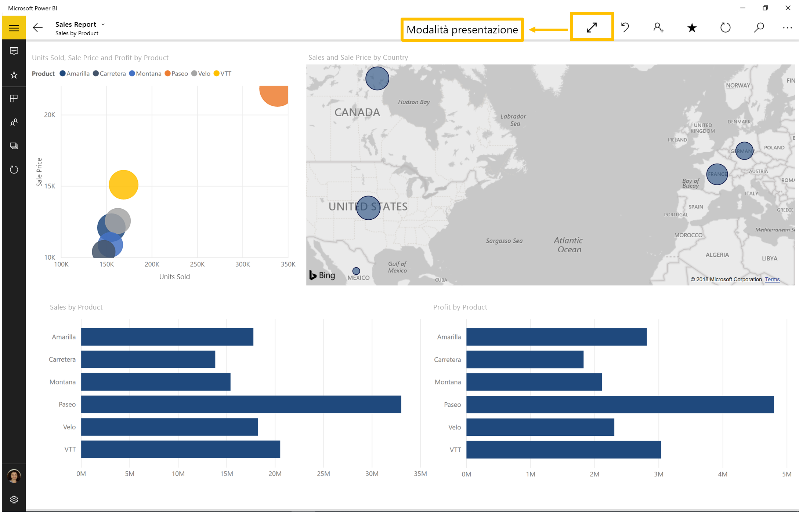

# Visualizzare i report in modalità presentazione in Surface Hub e Windows 10 - Power BI
È possibile visualizzare i report in modalità presentazione in Surface Hub, quindi dashboard, report e riquadri in modalità schermo intero nei dispositivi Windows 10. 

Le modalità presentazione e schermo intero sono utili per la visualizzazione di Power BI durante una riunione o conferenza, con un proiettore dedicato in un ufficio o anche solo per l'ottimizzazione dello spazio in uno schermo di piccole dimensioni. 

In modalità schermo intero, nell'app Power BI per dispositivi mobili, tutti i riquadri come le barre di spostamento e dei menu vengono rimossi ad eccezione delle schede della pagina e del riquadro filtri nei report.

Quando si visualizza un report in modalità presentazione in Surface Hub, è possibile disegnare sulle pagine con colori diversi e spostarsi tra le pagine del report.

È anche possibile [visualizzare dashboard e report in modalità a schermo intero dal Servizio Power BI](../../service-fullscreen-mode.md) sul Web.

> [!NOTE]
> La modalità presentazione è diversa dalla [modalità messa a fuoco per i riquadri](mobile-tiles-in-the-mobile-apps.md).
> 
> 

## Visualizzare dashboard, report e riquadri in modalità schermo intero
1. Nell'app Power BI per dispositivi mobili, in un dashboard, report o riquadro, toccare l'icona **Schermo intero**  per passare alla modalità schermo intero.
2. In modalità di presentazione, è possibile filtrare un report o cercare altri dashboard e report.
   
    Espandere il riquadro Filtri per impostare o rimuovere i filtri.
   
    
   
     Toccare l'icona di ricerca  per cercare altri dashboard.
   
    
3. Per uscire dalla modalità schermo intero, toccare l'icona con due frecce rivolte verso l'interno  sulla barra degli strumenti o scorrere dall'alto verso il basso e toccare le due frecce rivolte verso l'interno .

## Attivare la modalità presentazione per Surface Hub
La modalità presentazione è attivata per impostazione predefinita in Surface Hub, ma se è disattivata, è possibile riattivarla.

1. Toccare l'icona delle impostazioni  nella parte inferiore della barra di spostamento a sinistra.
2. Toccare **Opzioni**, quindi far scorrere **Abilita la modalità di presentazione di Microsoft Surface Hub** su **On**.
   
    

## Visualizzare e disegnare nei report in Surface Hub
1. In un report toccare l'icona **Schermo intero**  per passare alla modalità presentazione di Surface Hub.
   
    Verrà visualizzata una barra delle azioni comprimibile su entrambi i lati della schermata. 
   
   * Per aprirla, scorrere verso l'interno o toccare il quadratino.
   * Per chiuderla, scorrere verso l'esterno o toccare la X nella parte superiore.
2. Nei dispositivi che supportano la scrittura con una penna, è possibile iniziare a scrivere immediatamente. 
3. Per modificare il colore dell'input penna, toccare la penna nella barra delle azioni a sinistra o destra.
   
    
4. Toccare la gomma o la freccia di annullamento per rimuovere alcuni o tutti gli input penna.
5. Toccare la freccia circolare per aggiornare il contenuto del report.
6. Toccare le frecce che puntano verso i lati per passare ad altre pagine nel report.
   
    
7. Per uscire dalla modalità a schermo intero, scorrere verso il basso dalla parte superiore e toccare due frecce rivolte verso l'interno .

## Passaggi successivi
* [Visualizzare dashboard e report in modalità a schermo intero dal Servizio Power BI sul Web](../../service-fullscreen-mode.md)
* Domande? [Provare a rivolgersi alla community di Power BI](http://community.powerbi.com/)

