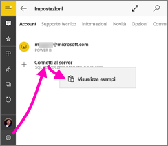

# Iniziare a usare l'app Power BI per dispositivi mobili con Windows 10
Grazie all'app Power BI per dispositivi mobili per Windows 10 è possibile accedere a informazioni aziendali aggiornate tramite tablet o telefoni abilitati per il tocco, nonché visualizzare e interagire con i dashboard aziendali ovunque ci si trovi, direttamente dalla [schermata Start di Windows](mobile-pin-dashboard-start-screen-windows-10-phone-app.md).

È possibile [creare dashboard e report nel servizio Power BI](../../service-get-started.md) con i propri dati. 

È quindi possibile interagire con i dashboard e i report, esplorare i dati e condividerli con l'app per dispositivi mobili Power BI per Windows 10.

## Operazioni preliminari
* [**Scaricare l'app Power BI per dispositivi mobili per Windows 10**](https://go.microsoft.com/fwlink/?LinkID=526478) da Windows Store.
  
  Il dispositivo deve eseguire Windows 10. L'app può essere eseguita in dispositivi con almeno 3 GB di RAM e 8 GB di spazio di archiviazione interno.

  >[!NOTE]
  >Il supporto delle app Power BI per dispositivi mobili per i **telefoni con Windows 10 Mobile** non sarà più disponibile dal 16 marzo 2021. [Altre informazioni](https://go.microsoft.com/fwlink/?linkid=2121400)
   
* Informazioni sulle [Novità delle app Power BI per dispositivi mobili](mobile-whats-new-in-the-mobile-apps.md).

## Iscriversi al servizio Power BI sul Web
Se non è ancora stata effettuata l'iscrizione, passare al [servizio Power BI](https://powerbi.com/). Registrare un account per creare e archiviare i dashboard e report e riunire i dati. Accedere quindi a Power BI dal dispositivo Windows 10 per visualizzare i propri dashboard ovunque ci si trovi.

1. Nel servizio Power BI toccare [Iscriviti](https://go.microsoft.com/fwlink/?LinkID=513879) per creare un account di Power BI.
2. Iniziare a [creare dashboard e report personalizzati](../../service-get-started.md).

## Introduzione all'app Power BI
1. Nella schermata Start del dispositivo Windows 10 aprire l'app Power BI.
   
   
2. Per visualizzare i dashboard e i report di Power BI, toccare **Power BI**. Accedere con le stesse credenziali dell'account di Power BI nel Web. 
   
   Per visualizzare i report per dispositivi mobili di Reporting Services e gli indicatori KPI, toccare **SQL Server 2016 Reporting Services**. Accedere con le credenziali di SQL Server Reporting Services.
   
   
3. Toccare **Inizia a esplorare**  per visualizzare i propri dashboard.

## Provare gli esempi di Power BI e Reporting Services
Anche senza iscriversi, è possibile provare a usare gli esempi di Power BI e Reporting Services. Dopo avere scaricato l'app, è possibile visualizzare gli esempi o iniziare a usarli. È possibile tornare agli esempi in qualsiasi momento dalla home page dei dashboard.

### Esempi di Power BI
È possibile visualizzare e interagire con gli esempi di dashboard di Power BI, con cui tuttavia non è possibile eseguire alcune operazioni, come ad esempio aprire i report dietro i dashboard, condividere gli esempi con altre persone o impostarli come preferiti.

1. Toccare il pulsante di spostamento globale  nell'angolo in alto a sinistra.
2. Toccare l'icona **Impostazioni**, toccare il nome, quindi toccare **Visualizza esempi**.
   
   
3. Selezionare un ruolo ed esplorare il dashboard degli esempi per tale ruolo.  
   
   

### Esempi di report per dispositivi mobili di Reporting Services
1. Toccare il pulsante di spostamento globale  nell'angolo in alto a sinistra.
2. Toccare l'icona **Impostazioni**, fare clic con il pulsante destro del mouse oppure toccare e tenere premuto **Connetti al server**, quindi toccare **Visualizza esempi**.
   
   
3. Aprire la cartella dei report sulle vendite al dettaglio o dei report sulle vendite per analizzare gli indicatori KPI e i report per dispositivi mobili.
   
   

## Ricerca di dashboard, report e app
Trovare velocemente dashboard, report e app usando la casella di ricerca che si trova sempre nella parte superiore dell'app.

1. Selezionare l'icona di ricerca nell'angolo in alto a destra.
   
   
   
   Power BI visualizza i dashboard, i report e le app più recenti.
   
   
2. Quando si inizia a digitare, Power BI visualizza tutti i risultati pertinenti.
   
   

## Cercare il contenuto nelle app Power BI per dispositivi mobili
A seconda della provenienza, i dashboard e i report sono memorizzati in posizioni diverse nelle app Power BI per dispositivi mobili. Leggere altre informazioni su come [cercare il contenuto nelle app per dispositivi mobili](mobile-apps-quickstart-view-dashboard-report.md). In più, è sempre possibile cercare qualsiasi contenuto presente nelle app Power BI per dispositivi mobili. 

## Visualizzare i dashboard, i report e gli indicatori KPI preferiti
Nella pagina Preferiti delle app per dispositivi mobili visualizzare tutti i dashboard preferiti di Power BI, insieme ai report per dispositivi mobili e agli indicatori KPI di Reporting Services. Quando si aggiunge un dashboard ai *Preferiti* nell'app Power BI per dispositivi mobili, è possibile accedervi da tutti i dispositivi, incluso il servizio Power BI nel proprio browser. 

* Toccare **Preferiti**.
  
   
  
   I Preferiti di Power BI i preferiti nel portale Reporting Services vengono visualizzati tutti in questa pagina.
  
   

Altre informazioni sui [dashboard preferiti nelle app Power BI per dispositivi mobili](mobile-apps-favorites.md).

## Passaggi successivi
Ecco alcune operazioni che è possibile eseguire nell'app Power BI per dispositivi Windows 10 con dashboard e report di Power BI e con report per dispositivi mobili di Reporting Services e indicatori KPI nel portale Web di Reporting Services.

### Dashboard e report di Power BI
* Visualizzare le [app](../../service-create-distribute-apps.md).
* Visualizzare i [dashboard](mobile-apps-view-dashboard.md).
* [Aggiungere riquadri e dashboard di Power BI](mobile-pin-dashboard-start-screen-windows-10-phone-app.md) alla schermata Start del dispositivo come riquadri animati.
* [Condividere riquadri](mobile-windows-10-phone-app-get-started.md).
* Condividere i [dashboard](mobile-share-dashboard-from-the-mobile-apps.md).

### Report per dispositivi mobili e indicatori KPI di Reporting Services
* [Visualizzare report per dispositivi mobili di Reporting Services e indicatori KPI](mobile-app-windows-10-ssrs-kpis-mobile-reports.md) nell'app Power BI per dispositivi Windows 10.
* Creare [indicatori KPI nel portale Web di Reporting Services](https://msdn.microsoft.com/library/mt683632.aspx).
* [Creare report per dispositivi mobili personalizzati con SQL Server Mobile Report Publisher](https://msdn.microsoft.com/library/mt652547.aspx) e pubblicarli nel portale Web di Reporting Services.

## Passaggi successivi
* [Scaricare l'app Power BI](https://go.microsoft.com/fwlink/?LinkID=526478) da Windows Store  
* [Che cos'è Power BI?](../../fundamentals/power-bi-overview.md)
* Domande? [Contattare la community di Power BI](https://community.powerbi.com/)

