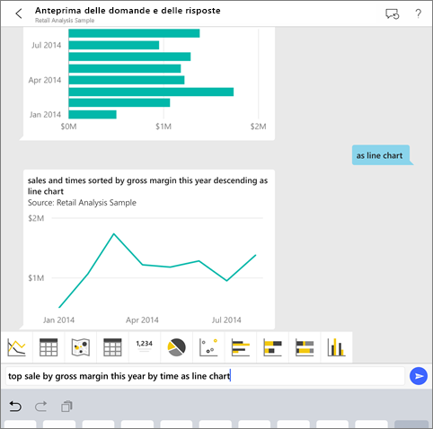
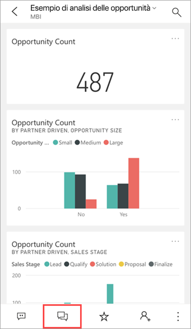
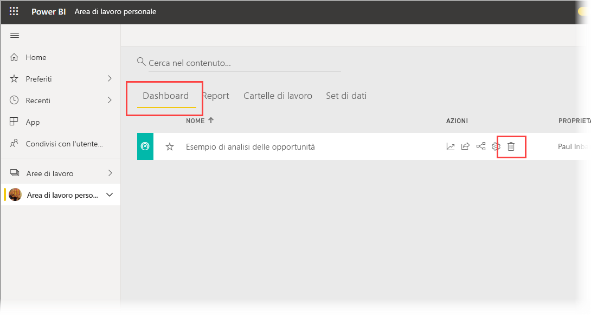
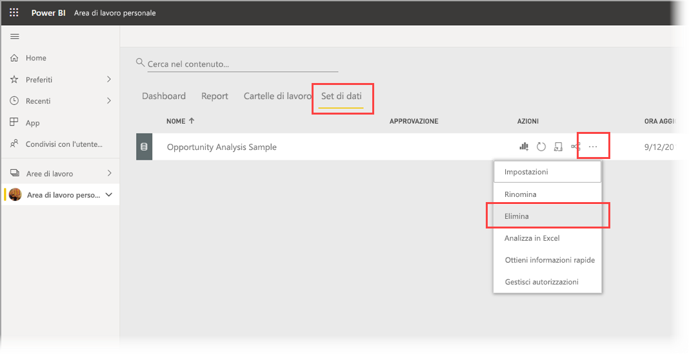

# Esercitazione: Porre domande sui dati con l'analista virtuale Domande e risposte nelle app Power BI per iOS

Il modo più semplice per conoscere i dati consiste nel porre domande a tal proposito con parole proprie. In questa esercitazione è possibile porre domande e visualizzare informazioni dettagliate in primo piano sui dati di esempio con l'analista virtuale Domande e risposte nell'app Power BI per dispositivi mobili su iPad o iPhone. 

Si applica a:

|  |  |
|:--- |:--- |
| iPhone |iPad |

L'analista virtuale Domande e risposte è un'esperienza di conversazione di Business Intelligence che accede ai dati di Domande e risposte sottostanti nel [servizio Power BI](https://powerbi.com). Suggerisce informazioni dettagliate sui dati e consente di digitare o pronunciare le proprie domande.

Questa esercitazione illustra come:

> [!div class="checklist"]
> * Installare l'app Power BI per dispositivi mobili per iOS
> * Scaricare un dashboard e un report di esempio di Power BI
> * Visualizzare le informazioni dettagliate in primo piano suggerite dall'app per dispositivi mobili

## Prerequisiti

* **Iscriversi a Power BI**: Se non si è ancora iscritti a Power BI, [iscriversi per ottenere una versione di prova gratuita](https://app.powerbi.com/signupredirect?pbi_source=web) prima di iniziare.
* **Installare l'app Power BI per iOS**: [scaricare l'app per iOS](https://apps.apple.com/app/microsoft-power-bi/id929738808) dall'App Store di Apple nel dispositivo iPad, iPhone o iPod Touch. Le versioni seguenti supportano l'app Power BI per iOS:
  * iPad con iOS 11 o versioni successive.
  * iPhone 5 e versioni successive con iOS 11 o versioni successive. 
  * iPod Touch con iOS 11 o versioni successive.
* **Scaricare i dati di esempio**: il primo passaggio consiste nel download dell'**esempio di analisi delle opportunità** nel servizio Power BI. Per istruzioni, vedere [Download degli esempi nell'area di lavoro personale nel servizio Power BI](./mobile-apps-download-samples.md).

Una volta completati i prerequisiti e scaricati i dati di esempio, è possibile visualizzare gli esempi sul dispositivo iOS.

## Provare le informazioni dettagliate in primo piano
1. Nell'iPhone o nell'iPad aprire l'app Power BI e accedere con le credenziali dell'account Power BI, le stesse usate nel servizio Power BI nel browser.

2. Sulla barra di spostamento della home page toccare l'icona **Aree di lavoro**.

    

3. Quando si apre la pagina Aree di lavoro, toccare **Area di lavoro personale** e quindi il dashboard **Esempio di analisi delle opportunità** per aprirlo.

3. Nel dashboard Esempio di analisi delle opportunità toccare l'icona dell'analista virtuale Domande e risposte nel menu di azione.

    

    Lo strumento di analisi virtuale Domande e risposte offre alcuni suggerimenti iniziali.

    

3. Toccare **featured insights** (informazioni dettagliate in primo piano).

4. Lo strumento di analisi virtuale Domande e risposte suggerisce alcune informazioni dettagliate. Scorrere verso destra e toccare **Insight 2** (Informazioni dettagliate 2).

    

   Lo strumento di analisi virtuale Domande e risposte mostra la seconda casella di informazioni dettagliate.

    

5. Toccare il grafico per aprirlo in stato attivo.

    

6. Toccare la freccia nell'angolo in alto a sinistra per tornare all'esperienza dell'analista virtuale Domande e risposte.

## Pulire le risorse

Al termine dell'esercitazione è possibile eliminare il dashboard, il report e il set di dati dell'esempio di analisi delle opportunità.

1. Aprire il servizio Power BI ([Servizio Power BI](https://app.powerbi.com)) ed eseguire l'accesso.

2. Nel riquadro di spostamento selezionare **Area di lavoro personale**.

3. Fare clic sulla scheda Dashboard e quindi nella riga dell'esempio di analisi delle opportunità fare clic sul Cestino.

    

    Selezionare la scheda Report ed eseguire la stessa operazione.

4. Selezionare ora la scheda Set di dati, fare clic su **Altre opzioni** (...) e quindi scegliere **Elimina**.

    

## Passaggi successivi

Si è provato a usare l'analista virtuale Domande e risposte nelle app Power BI per dispositivi mobili iOS. Altre informazioni su Domande e risposte nel servizio Power BI.
> [!div class="nextstepaction"]
> [Domande e risposte nel servizio Power BI](../end-user-q-and-a.md)