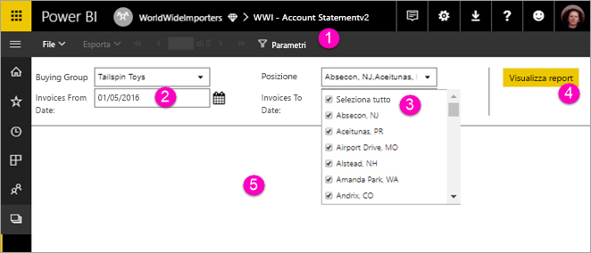

# Visualizzare i parametri per i report impaginati nel servizio Power BI

Questo articolo descrive come interagire con i parametri dei report impaginati nel servizio Power BI.  Un parametro del report consente di filtrare i dati del report. I parametri offrono un elenco di valori disponibili di cui è possibile sceglierne uno o molti. I parametri hanno talvolta un valore predefinito e, in alcuni casi, è necessario scegliere un valore prima di poter visualizzare il report.  

Quando si apre un report con parametri, nella barra degli strumenti del Visualizzatore di report viene visualizzato ogni parametro in modo da poter specificare i valori in modo interattivo. La figura seguente mostra l'area dei parametri di un report con parametri per gli elementi **Buying Group** (Gruppo acquirente), **Location** (Località), **From Date** (Dalla data) e **To Date** (Alla data).  

## Riquadro dei parametri nel servizio Power BI

  
1.  **Riquadro parametri**: nella barra degli strumenti del Visualizzatore di report viene visualizzato un prompt come "Obbligatorio" o un valore predefinito per ogni parametro.    
  
2.  **Parametri Invoices From Date / To Date (Fatture dalla data / alla data)** : a questi due parametri di dati sono associati valori predefiniti. Per modificare la data, digitare una data nella casella di testo oppure scegliere una data nel calendario.  
  
3.  **Parametro Location (Località)** : questo parametro è impostato in modo da consentire la selezione di uno, più o tutti i valori. 
  
4.  **Visualizza report**: dopo avere immesso o modificato i valori dei parametri, fare clic su **Visualizza report** per eseguire il report. 

5. **Valori predefiniti**: se a tutti i parametri sono associati valori predefiniti, il report viene eseguito automaticamente alla prima visualizzazione. Alcuni parametri di questo report non hanno valori predefiniti ed è quindi necessario selezionare i valori richiesti prima di poter visualizzare il report.  

## Passaggi successivi

[Report impaginati nel servizio Power BI](end-user-paginated-report.md)
