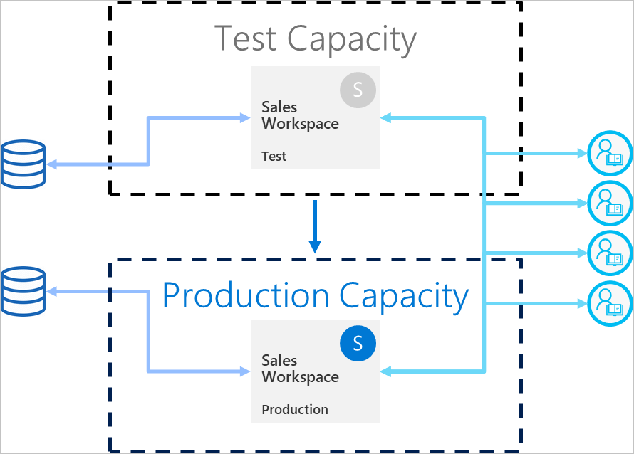

# Procedure consigliate per le pipeline di distribuzione (anteprima)

Questo articolo offre indicazioni per gli autori di BI che gestiscono il contenuto durante l'intero ciclo di vita. Approfondisce l'uso delle pipeline di distribuzione come strumento di gestione del ciclo di vita del contenuto BI.

L'articolo è suddiviso in quattro sezioni:

* **Preparazione del contenuto**: preparare il contenuto per la gestione del ciclo di vita.

* **Sviluppo**: informazioni sui modi migliori per creare il contenuto nella fase di sviluppo delle pipeline di distribuzione.

* **Test**: informazioni su come usare la fase di test delle pipeline di distribuzione per testare l'ambiente.

* **Produzione**: usare la fase di produzione delle pipeline di distribuzione quando il contenuto diventa disponibile per essere usato.

## Preparazione del contenuto

Preparare il contenuto per la gestione ordinaria durante l'intero ciclo di vita. Assicurarsi di esaminare le informazioni contenute in questa sezione prima di eseguire una delle operazioni seguenti:

* Rilasciare i contenuti nell'ambiente di produzione

* Iniziare a usare una pipeline di distribuzione per un'area di lavoro specifica

* Pubblicare il lavoro

### Considerare ogni area di lavoro come un pacchetto completo di analisi

Idealmente, un'area di lavoro deve contenere una vista completa di un aspetto, ad esempio reparto, business unit, progetto o verticale all'interno dell'organizzazione. In questo modo è più semplice gestire le autorizzazioni per utenti diversi e consentire il controllo dei rilasci del contenuto per l'intera area di lavoro sulla base di una pianificazione definita.  

Se si impiegano [set di dati centralizzati](../connect-data/service-datasets-across-workspaces.md) usati nell'organizzazione, è consigliabile creare due tipi di aree di lavoro:

* **Aree di lavoro di dati e modelli**: queste aree di lavoro conterranno tutti i set di dati centralizzati

* **Aree di lavoro di report**: queste aree di lavoro conterranno tutti i report e i dashboard dipendenti

### Pianificare il modello di autorizzazione

Una pipeline di distribuzione è un oggetto Power BI [con autorizzazioni proprie](deployment-pipelines-process.md#permissions). La pipeline contiene aree di lavoro che hanno a loro volta autorizzazioni proprie.

Per implementare un flusso di lavoro sicuro e semplice, pianificare gli utenti che possono accedere a ogni parte della pipeline. Alcune considerazioni importanti:

* Chi deve avere accesso alla pipeline?

* Quali operazioni devono poter eseguire gli utenti che accedono alla pipeline in ogni fase?

* Chi esamina il contenuto nella fase di test?

* I revisori della fase di test hanno accesso alla pipeline?

* Chi controllerà la distribuzione nella fase di produzione?

* Quale area di lavoro si sta assegnando?

* Quale fase viene assegnata all'area di lavoro?

* È necessario apportare modifiche alle autorizzazioni dell'area di lavoro che si sta assegnando?

### Connettere fasi diverse a database diversi

Un database di produzione deve essere sempre stabile e disponibile. È preferibile non sovraccaricarlo con query generate dagli autori di BI per i set di dati di sviluppo o test. Creare database distinti per lo sviluppo e il test. In questo modo si proteggono i dati di produzione e non si sovraccarica il database di sviluppo con l'intero volume dei dati di produzione che può causare un rallentamento.

>[!NOTE]
>Se l'organizzazione usa [set di dati centralizzati condivisi ](../connect-data/service-datasets-share.md), è possibile ignorare questa raccomandazione.

### Usare i parametri nel modello

Poiché non è possibile modificare le origini dati dei set di dati nel servizio Power BI, è consigliabile usare i [parametri](https://docs.microsoft.com/power-query/power-query-query-parameters) per archiviare i dettagli della connessione, ad esempio i nomi di istanza e i nomi di database, anziché usare una stringa di connessione statica. In questo modo è possibile gestire le connessioni tramite il portale Web del servizio Power BI o [usando le API](https://docs.microsoft.com/rest/api/power-bi/datasets/updateparametersingroup) in una fase successiva.

Nelle pipeline di distribuzione è possibile configurare le regole dei parametri per impostare valori specifici per le fasi di sviluppo, test e produzione.

Se non si usano i parametri per la stringa di connessione, è possibile definire le regole per le origini dati al fine di specificare una stringa di connessione per un determinato set di dati. Nelle pipeline di distribuzione questa opzione non è tuttavia supportata per tutte le origini dati. Per verificare se è possibile configurare le regole per l'origine dati, vedere le [limitazioni delle regole del set di dati](deployment-pipelines-get-started.md#dataset-rule-limitations).

I parametri hanno usi aggiuntivi, ad esempio possono modificare le query, i filtri e il testo visualizzato nel report.

## Sviluppo

Questa sezione offre indicazioni sull'uso della fase di sviluppo delle pipeline di distribuzione.

### Usare Power BI Desktop per modificare i report e i set di dati

Considerare Power BI Desktop come ambiente di sviluppo locale. Power BI Desktop consente di provare, esplorare ed esaminare gli aggiornamenti ai report e ai set di dati. Al termine del lavoro, è possibile caricare la nuova versione nella fase di sviluppo. Dati i motivi seguenti, è consigliabile modificare i file con estensione pbix in Power BI Desktop anziché nel servizio Power BI:

* È più facile collaborare con altri autori allo stesso file con estensione pbix se tutte le modifiche vengono eseguite usando il medesimo strumento.

 * Le operazioni di modifica online, download del file con estensione pbix e nuovo upload del file creano report e set di dati deduplicati.

* È possibile usare il controllo della versione per aggiornare i file con estensione pbix.

### Controllo della versione per i file con estensione pbix

Se si vuole gestire la cronologia delle versioni dei report e dei set di dati, usare [la sincronizzazione automatica di Power BI con OneDrive](../connect-data/service-connect-to-files-in-app-workspace-onedrive-for-business.md). Questa operazione consentirà di aggiornare i file con la versione più recente e di recuperare le versioni precedenti se necessario.

>[!NOTE]
>Usare la sincronizzazione automatica con OneDrive (o qualsiasi altro repository) solo con i file con estensione pbix nella fase di sviluppo delle pipeline di distribuzione. Non sincronizzare i file con estensione pbix nelle fasi di test e produzione delle pipeline di distribuzione per non causare problemi con la distribuzione del contenuto nella pipeline.

### Separare lo sviluppo di modelli dallo sviluppo di report e dashboard

Per le distribuzioni su scala aziendale, è consigliabile separare lo sviluppo di set di dati dallo sviluppo di report e dashboard. Per promuovere le modifiche solo a un report o a un set di dati, usare l'opzione di distribuzione selettiva delle pipeline di distribuzione.  

Questo approccio deve iniziare in Power BI Desktop, creando un file con estensione pbix separato per set di dati e report. È ad esempio possibile creare un file con estensione pbix per il set di dati e caricarlo nella fase di sviluppo. Successivamente, gli autori del report possono creare un nuovo file con estensione pbix solo per il report e [connetterlo al set di dati pubblicato](../connect-data/service-datasets-discover-across-workspaces.md) usando una connessione dinamica. Questa tecnica consente ad autori diversi di usare separatamente modelli e visualizzazioni e di distribuirli nell'ambiente di produzione in modo indipendente.

Con i [set di dati condivisi](../connect-data/service-datasets-share.md) è possibile usare questo metodo anche in aree di lavoro.

### Gestire i modelli tramite le funzionalità di lettura/scrittura XMLA

Separando lo sviluppo di modelli dallo sviluppo di report e dashboard è possibile usare funzionalità avanzate, ad esempio il controllo del codice sorgente, l'unione di modifiche diff e processi automatizzati. Queste modifiche devono essere eseguite nella fase di sviluppo, in modo che il contenuto finalizzato possa essere distribuito nelle fasi di test e produzione. In questo modo le modifiche attraversano un processo unificato con altri elementi dipendenti prima di essere distribuite nella fase di produzione.

È possibile separare lo sviluppo di modelli dalle visualizzazioni gestendo un [set di dati condiviso](../connect-data/service-datasets-share.md) in un'area di lavoro esterna, usando le funzionalità di lettura/scrittura XMLA. Il set di dati condiviso può connettersi a più report in varie aree di lavoro gestite in più pipeline.

## Test

Questa sezione offre indicazioni sull'uso della fase di test delle pipeline di distribuzione.

### Simulare l'ambiente di produzione

Oltre a verificare che i nuovi report o dashboard siano corretti, è anche importante osservarne il funzionamento dal punto di vista dell'utente finale. La fase di test delle pipeline di distribuzione consente di simulare un ambiente di produzione reale a scopo di test.

Considerare questi tre fattori nell'ambiente di testing:

* Volume dati

* Volume di utilizzo

* Capacità simile a quella dell'ambiente di produzione

Quando si esegue il test, è possibile usare la stessa capacità della fase di produzione. Tale scelta può però rendere instabile la produzione durante il test di carico. Per evitare che la produzione sia instabile, per il test usare un'altra capacità di risorse simile alla capacità in fase di produzione. Per evitare costi aggiuntivi, è possibile usare [le capacità A di Azure](../developer/embedded/azure-pbie-create-capacity.md) per pagare solo il tempo di test.

### Usare le regole del set di dati con un'origine dati reale

Se si usa la fase di test per simulare l'utilizzo dei dati reali, è consigliabile separare le origini dati di sviluppo e di test. Il database di sviluppo deve essere relativamente piccolo e il database di test deve essere il più simile possibile al database di produzione. Usare le [regole delle origine dati](deployment-pipelines-get-started.md#step-4---create-dataset-rules) per cambiare le origini dati nella fase di test.

Il controllo della quantità di dati importati dall'origine dati può essere utile se si usa un'origine dati di produzione nella fase di test. A tale scopo, aggiungere un parametro alla query dell'origine dati in Power BI Desktop. Usare le regole dei parametri per controllare la quantità di dati importati oppure modificare il valore del parametro.
È anche possibile usare questo approccio se non si vuole sovraccaricare la capacità.

### Misurare le prestazioni

Quando si simula una fase di produzione, [controllare il carico del report e le interazioni](../guidance/monitor-report-performance.md) e determinare se le modifiche apportate hanno effetto.

È anche necessario [monitorare il carico sulla capacità](../admin/service-admin-premium-monitor-capacity.md), in modo che sia possibile rilevare carichi eccessivi prima che raggiungano la produzione.  

>[!NOTE]
>È consigliabile monitorare nuovamente i carichi di capacità dopo aver distribuito gli aggiornamenti nella fase di produzione.

### Controllare gli elementi correlati

Gli elementi correlati possono essere influenzati dalle modifiche apportate ai set di dati o ai report. Durante il test, verificare che le modifiche non influiscano o interrompano le prestazioni degli elementi esistenti, che possono dipendere dagli elementi aggiornati.

È possibile trovare facilmente gli elementi correlati usando l'area di lavoro [Visualizzazione derivazione](../collaborate-share/service-data-lineage.md).

### Test dell'app

Se si distribuisce il contenuto agli utenti finali tramite un'app, esaminare la nuova versione dell'app prima che sia in produzione. Poiché ogni fase della pipeline di distribuzione ha una propria area di lavoro, è possibile pubblicare e aggiornare facilmente le app per le fasi di sviluppo e test. Questo consentirà di testare l'app dal punto di vista di un utente finale.

>[!IMPORTANT]
>Il processo di distribuzione non include l'aggiornamento del contenuto o delle impostazioni dell'app. Per applicare le modifiche al contenuto o alle impostazioni, è necessario aggiornare manualmente l'app nella fase della pipeline richiesta.

## Produzione

Questa sezione offre indicazioni sulla fase di produzione delle pipeline di distribuzione.

### Gestire gli utenti autorizzati alla distribuzione nell'ambiente di produzione

La distribuzione nell'ambiente di produzione deve essere gestita con attenzione. È quindi consigliabile consentire la gestione di questa operazione delicata solo a persone specifiche. Si vorrà probabilmente che tutti gli autori di BI per un'area di lavoro specifica abbiano accesso alla pipeline. Questa operazione può essere gestita usando le [autorizzazioni dell'area di lavoro](deployment-pipelines-process.md#permissions) di produzione.  

Per distribuire il contenuto tra le fasi, gli utenti devono disporre delle autorizzazioni di amministratore o membro per entrambe le fasi. Assicurarsi che solo gli utenti che potranno distribuire nell'ambiente di produzione dispongano delle autorizzazioni per l'area di lavoro di produzione. Gli altri utenti possono avere ruoli di visualizzatore o collaboratore dell'area di lavoro di produzione. Questi potranno visualizzare il contenuto all'interno della pipeline ma non potranno distribuirlo.

È anche consigliabile limitare l'accesso alla pipeline abilitando le autorizzazioni della pipeline solo per gli utenti che fanno parte del processo di creazione del contenuto.

### Impostare le regole per assicurare la disponibilità della fase di produzione

Le [regole del set di dati](deployment-pipelines-get-started.md#step-4---create-dataset-rules) sono un modo efficace per assicurare che i dati in produzione siano sempre connessi e disponibili agli utenti. Dopo aver applicato le regole del set di dati, è possibile eseguire le distribuzioni e al tempo stesso essere sicuri che gli utenti finali visualizzeranno le informazioni rilevanti senza interferenze.

Assicurarsi di impostare le regole del set di dati di produzione per le origini dati e i parametri definiti nel set di dati.

### Aggiornare l'app di produzione

La distribuzione in una pipeline aggiorna il contenuto dell'area di lavoro ma non aggiorna automaticamente l'app associata. Se si usa un'app per la distribuzione del contenuto, non dimenticare di aggiornare l'app dopo aver eseguito la distribuzione nell'ambiente di produzione. In questo modo gli utenti finali potranno usare immediatamente la versione più recente.  

### Correzioni rapide del contenuto

Se nell'ambiente di produzione sono presenti bug che richiedono una correzione, non è consigliabile né caricare una nuova versione del file con estensione pbix direttamente nella fase di produzione né apportare una modifica online nel servizio Power BI. La distribuzione di versioni precedenti nelle fasi di test e sviluppo non è possibile quando è già presente contenuto in tali fasi. Non è consigliabile neppure distribuire una correzione senza averla prima testata. Pertanto il modo corretto per gestire questo problema consiste nell'implementare la correzione nella fase di sviluppo ed eseguirne il push nelle restanti fasi della pipeline di distribuzione. In questo modo è possibile verificare il corretto funzionamento della correzione prima di distribuirla nell'ambiente di produzione. La distribuzione nella pipeline richiede solo pochi minuti.

## Passaggi successivi

>[!div class="nextstepaction"]
>[Introduzione alle pipeline di distribuzione](deployment-pipelines-overview.md)

>[!div class="nextstepaction"]
>[Iniziare a usare le pipeline di distribuzione](deployment-pipelines-get-started.md)

>[!div class="nextstepaction"]
>[Informazioni sul processo delle pipeline di distribuzione](deployment-pipelines-process.md)

>[!div class="nextstepaction"]
>[Risoluzione dei problemi delle pipeline di distribuzione](deployment-pipelines-troubleshooting.md)
