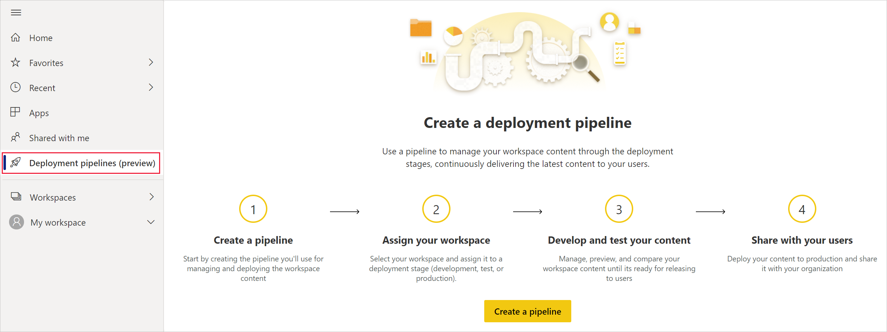

# Iniziare a usare le pipeline di distribuzione (anteprima)

Questo articolo illustra le impostazioni di base necessarie per l'uso delle pipeline di distribuzione.

## Accesso alle pipeline di distribuzione

È possibile accedere alla funzionalità delle pipeline di distribuzione se vengono soddisfatte le condizioni seguenti:

* Essere un utente di [Power BI Pro](../admin/service-admin-purchasing-power-bi-pro.md)

* Appartenere a un'organizzazione con capacità Premium

* Essere un amministratore di una [esperienza delle nuove aree di lavoro](../collaborate-share/service-create-the-new-workspaces.md)

>[!NOTE]
> Sarà anche possibile visualizzare il pulsante delle pipeline di distribuzione, se in precedenza è stata creata una pipeline o se una pipeline è stata condivisa con l'utente.

## Passaggio 1: creare una pipeline di distribuzione

Attenersi alla procedura seguente per creare una pipeline di distribuzione:

1. Nel servizio Power BI, nel riquadro di spostamento selezionare **Pipeline di distribuzione** e fare clic su **Crea la pipeline**.

2. Nella finestra di dialogo *Crea una pipeline di distribuzione* immettere un nome e una descrizione per la pipeline e fare clic su **Crea**.

Dopo la creazione della pipeline, è possibile condividerla con altri utenti o eliminarla. Quando si condivide una pipeline con altri, agli utenti con cui viene condivisa verrà concesso l'[accesso alla pipeline](deployment-pipelines-process.md#user-with-pipeline-access). L'accesso alla pipeline consente agli utenti di visualizzare, condividere, modificare ed eliminare la pipeline.

## Passaggio 2: assegnare un'area di lavoro a una pipeline di distribuzione

Dopo aver creato una pipeline, è necessario aggiungere il contenuto che si vuole gestire alla pipeline. L'aggiunta di contenuto alla pipeline viene eseguita assegnando un'area di lavoro alla fase della pipeline. È possibile assegnare un'area di lavoro a qualsiasi fase. 

È possibile assegnare una sola area di lavoro a una pipeline di distribuzione. Le pipeline di distribuzione creeranno cloni del contenuto dell'area di lavoro, da usare in diverse fasi della pipeline.

Per assegnare un'area di lavoro in una pipeline di distribuzione, seguire questa procedura:

1. Nella pipeline di distribuzione appena creata fare clic su **Assegna un'area di lavoro**.

2. Nel menu a discesa *Scegli l'area di lavoro* selezionare l'area di lavoro che si vuole assegnare alla pipeline.

3. Selezionare la fase a cui si vuole assegnare l'area di lavoro.

### Limitazioni all'assegnazione di aree di lavoro

* L'area di lavoro deve essere una [esperienza delle nuove aree di lavoro](../collaborate-share/service-create-the-new-workspaces.md).

* È necessario essere un amministratore di un'area di lavoro.

* L'area di lavoro non è assegnata ad altre pipeline.

* L'area di lavoro deve risiedere in una  [capacità Premium](../admin/service-premium-what-is.md).

* Non è possibile assegnare un'area di lavoro con [esempi di Power BI](../create-reports/sample-datasets.md) a una fase della pipeline.

>[!NOTE]
>Solo le aree di lavoro che possono essere usate con le pipeline di distribuzione verranno visualizzate nell'elenco delle aree di lavoro che è possibile selezionare.

## Passaggio 3: eseguire la distribuzione in una fase vuota

Qualsiasi utente di [Power BI Pro](../admin/service-admin-purchasing-power-bi-pro.md) che sia membro o amministratore dell'area di lavoro di origine, può distribuire il contenuto in una fase vuota, ovvero una fase che non include contenuto. Perché la distribuzione sia completata, l'area di lavoro deve risiedere in una capacità.

Quando si distribuisce contenuto in una fase vuota, le relazioni tra gli elementi vengono mantenute. Ad esempio, un report associato a un set di dati nella fase di origine viene clonato insieme con il set di dati e i cloni mantengono la stessa associazione nell'area di lavoro di destinazione.

Al termine della distribuzione, aggiornare il set di dati. Per altre informazioni, vedere la [distribuzione di contenuto in una fase vuota](deployment-pipelines-process.md#deploying-content-to-an-empty-stage).

### Distribuzione di tutto il contenuto

Selezionare la fase da cui eseguire la distribuzione e fare clic sul pulsante di distribuzione. Il processo di distribuzione crea un'area di lavoro duplicata nella fase di destinazione. Questa area di lavoro include tutto il contenuto esistente nella fase corrente.

### Distribuzione selettiva

Per distribuire solo elementi specifici, fare clic sul collegamento **Mostra più** e selezionare gli elementi che si vuole distribuire. Quando si fa clic sul pulsante per la distribuzione, nella fase successiva vengono distribuiti solo gli elementi selezionati.

Poiché i dashboard, i report e i set di dati sono correlati e presentano dipendenze, è possibile usare il pulsante per la selezione degli elementi correlati per controllare tutti gli elementi da cui dipendono. Se, ad esempio, si vuole distribuire un report nella fase successiva, facendo clic sul pulsante di selezione degli elementi correlati verrà contrassegnato il set di dati a cui è connesso il report, in modo che entrambi vengano distribuiti contemporaneamente e che il report non venga interrotto.

>[!NOTE]
> * Non è possibile distribuire un report o un dashboard nella fase successiva se gli elementi da cui dipende non esistono nella fase in cui si esegue la distribuzione.
> * Se si sceglie di distribuire un report o un dashboard senza il set di dati, è possibile che si ottengano risultati imprevisti. Ciò può verificarsi quando il set di dati nella fase di destinazione è stato modificato e non è più identico a quello della fase da cui si esegue la distribuzione.

### Distribuzione nella fase precedente

È possibile scegliere di eseguire la distribuzione in una fase precedente, ad esempio in uno scenario in cui si assegna un'area di lavoro esistente a una fase di produzione e quindi la si distribuisce prima alla fase di test e poi a quella di sviluppo.

La distribuzione in una fase precedente funziona solo se la fase precedente è vuota. Quando si esegue la distribuzione nella fase precedente, non è possibile selezionare elementi specifici, viene distribuito tutto il contenuto della fase.

## Passaggio 4: creare regole del set di dati

Quando si lavora in una pipeline di distribuzione, le varie fasi possono avere configurazioni diverse. Ogni fase, ad esempio, può avere database diversi o parametri di query diversi. La fase di sviluppo può eseguire query sui dati di esempio del database, mentre le fasi di test e produzione eseguono query sull'intero database.

Quando si distribuisce contenuto tra fasi della pipeline, la configurazione delle regole del set di dati consente di autorizzare modifiche al contenuto, mantenendo intatte alcune impostazioni.

Le regole del set di dati sono definite su origini dati e parametri, in ogni set di dati. Determinano i valori delle origini dati o dei parametri per un set di dati specifico. Se, ad esempio, si vuole che un set di dati in una fase di produzione punti a un database di produzione, è possibile definire una regola. La regola viene definita nella fase di produzione, sotto il set di dati appropriato. Una volta definita la regola, il contenuto distribuito dalla fase di test a quella di produzione erediterà il valore come definito nelle regole del set di dati e sarà sempre applicabile fino a quando la regola non viene modificata e resta valida.

>[!NOTE]
> Le regole del set di dati funzionano solo quando l'origine dati di origine e di destinazione sono dello stesso tipo.

### Creare una regola del set di dati

1. Nella fase della pipeline per la quale si vuole creare una regola del set di dati fare clic su **Impostazioni di distribuzione**.

    

2. Dal riquadro delle impostazioni di distribuzione selezionare il set di dati per cui si vuole creare una regola.

    

3. Selezionare il tipo di regola che si vuole creare, espandere l'elenco e fare clic su **Aggiungi regola**.

     

### Tipi di regole dei set di dati

È possibile creare due tipi di regole:

* **Regole origine dati** L'elenco di origini dati viene ricavato dal set di dati della fase della pipeline di origine. Nell'elenco delle origini dati selezionare un'origine dati da sostituire. Usare uno dei metodi seguenti per selezionare un valore per sostituire quello della fase di origine:

    1. Eseguire la selezione da un elenco.

    2. Fare clic su **Altro** e aggiungere manualmente la nuova origine dati. È possibile passare solo a un'origine dati dello stesso tipo.

* **Regole dei parametri** Selezionare un parametro dall'elenco di parametri. Viene visualizzato il valore corrente. Modificare il valore nel valore che si vuole rendere effettivo dopo ogni distribuzione.

### Limitazioni delle regole del set di dati

* Per creare una regola del set di dati, è necessario essere il proprietario del set di dati.

* Non è possibile creare regole del set di dati nella fase di sviluppo.

* Quando un elemento viene rimosso o eliminato, vengono eliminate anche le relative regole che non potranno essere ripristinate.

* Se l'origine dati o i parametri definiti in una regola vengono modificati o rimossi dal set di dati di origine, la regola non sarà valida e la distribuzione avrà esito negativo.

* È possibile definire le regole delle origini dati solo per le origini dati seguenti:
    * Analysis Services
    * Azure SQL Server
    * Azure Analysis Services
    * Feed OData
    * Oracle
    * SapHana
    * SharePoint
    * SQL Server
    * SQL Server Analysis Services (SSAS)
    * Teradata

    Per altre origini dati, è consigliabile [usare i parametri per configurare l'origine dati](deployment-pipelines-best-practices.md#use-parameters-in-your-model).

## Passaggio 5: distribuire il contenuto da una fase all'altra

Quando è presente contenuto in una fase della pipeline, è possibile distribuirlo alla fase successiva. La distribuzione del contenuto in un'altra fase avviene in genere dopo che sono state eseguite azioni nella pipeline. Ad esempio, la modifica allo sviluppo del contenuto in fase di sviluppo oppure l'esecuzione di test nella fase di test. Un flusso di lavoro tipico per lo spostamento di contenuto da fase a fase, è da sviluppo a test e quindi da test a produzione. Per altre informazioni su questo processo, vedere la sezione sulla [distribuzione di contenuto in un'area di lavoro esistente](deployment-pipelines-process.md#deploy-content-to-an-existing-workspace).

Per distribuire il contenuto nella fase successiva della pipeline di distribuzione, fare clic sul pulsante di distribuzione nella parte inferiore della fase.

Quando si esaminano le schede della fase di produzione e di test, è possibile visualizzare data e ora dell'ultima distribuzione. Questo valore indica l'ultima volta in cui il contenuto è stato distribuito nella fase.

La data e l'ora della distribuzione sono utili per stabilire quando è stato eseguito l'ultimo aggiornamento di una fase. Possono anche essere utili se si vuole tenere traccia del tempo tra le distribuzioni di test e di produzione.

## Confronto delle fasi

Quando due fasi sequenziali includono contenuto, questo viene confrontato in base ai metadati degli elementi di contenuto. Questa operazione non include il confronto tra i dati o il tempo di aggiornamento tra le fasi.

 

Per consentire una rapida visualizzazione di dati analitici sulle differenze tra due fasi sequenziali, viene visualizzato un indicatore di icona di confronto tra le due fasi. L'indicatore di confronto ha due stati:

* **Indicatore verde**: i metadati per ogni elemento di contenuto sono gli stessi in entrambe le fasi.

* **Indicatore arancione**: viene visualizzato se viene soddisfatta una delle condizioni seguenti.
    * Alcuni degli elementi di contenuto in ogni fase sono stati modificati o aggiornati, ovvero hanno metadati diversi.
    * Esiste una differenza nel numero di elementi tra le fasi.

Quando due fasi sequenziali non sono uguali, viene visualizzato un collegamento **Confronta** sotto l'icona di confronto arancione. Se si fa clic sul collegamento si apre l'elenco di elementi di contenuto in entrambe le fasi della visualizzazione di confronto. La visualizzazione di confronto consente di rilevare le modifiche o le differenze tra gli elementi in ogni fase della pipeline. Gli elementi modificati ottengono una delle etichette seguenti:

* **Nuovo**: nuovo elemento nella fase di origine. Si tratta di un elemento che non esiste nella fase di destinazione. Dopo la distribuzione questo elemento viene clonato nella fase di destinazione.

* **Diverso**: un elemento che esiste sia nella fase di origine che in quella di destinazione, laddove una delle versioni è stata modificata dopo l'ultima distribuzione. Dopo la distribuzione l'elemento nella fase di origine sovrascriverà l'elemento nella fase di destinazione, indipendentemente da dove è stata apportata la modifica.

* **Mancante da**: questa etichetta indica che un elemento viene visualizzato nella fase di destinazione ma non nella fase di origine.

    >[!NOTE]
    >La distribuzione non avrà alcun effetto sugli elementi *mancanti*.

 

## Esecuzione dell'override del contenuto

Quando si esegue la distribuzione dopo avere apportato modifiche al contenuto della fase di origine, il contenuto modificato nella fase di destinazione viene sovrascritto. Dopo aver fatto clic sul pulsante *di distribuzione* verrà visualizzato un avviso che indica il numero di elementi che verranno sovrascritti.

È possibile ottenere altre informazioni su [quali elementi vengono copiati nella fase successiva](deployment-pipelines-process.md#deployed-items) e [quali elementi non vengono copiati](deployment-pipelines-process.md#unsupported-items), in [Informazioni sul processo di distribuzione](deployment-pipelines-process.md).

## Passaggi successivi

>[!div class="nextstepaction"]
>[Introduzione alle pipeline di distribuzione](deployment-pipelines-overview.md)

>[!div class="nextstepaction"]
>[Informazioni sul processo delle pipeline di distribuzione](deployment-pipelines-process.md)

>[!div class="nextstepaction"]
>[Risoluzione dei problemi delle pipeline di distribuzione](deployment-pipelines-troubleshooting.md)

>[!div class="nextstepaction"]
>[Procedure consigliate per le pipeline di distribuzione](deployment-pipelines-best-practices.md)
