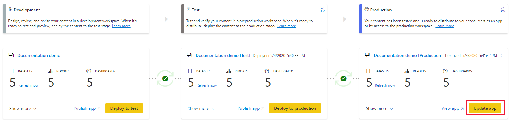

# Informazioni sul processo di distribuzione (anteprima)

Il processo di distribuzione consente di clonare contenuto da una fase della pipeline a un'altra, in genere dallo sviluppo al test e dal test alla produzione.

Durante la distribuzione, Power BI copia il contenuto dalla fase corrente a quella di destinazione. Durante il processo di copia le connessioni tra gli elementi copiati vengono mantenute. Power BI, poi, applica al contenuto aggiornato nella fase di destinazione le regole dei set di dati configurati. La distribuzione del contenuto può richiedere tempo, a seconda del numero di elementi da distribuire. Durante questo periodo, è possibile passare ad altre pagine del portale di Power BI, ma non è possibile usare il contenuto nella fase di destinazione.

## Distribuzione di contenuto in una fase vuota

Quando si distribuisce contenuto in una fase vuota, i metadati dei report, dei dashboard e dei set di dati nell'area di lavoro di origine della distribuzione vengono copiati nella fase di destinazione. In una capacità Premium viene creata una nuova area di lavoro per la fase di distribuzione di destinazione.

Esistono due modi per distribuire contenuto da una fase alla successiva. È possibile distribuire tutto il contenuto oppure [selezionare gli elementi di contenuto da distribuire](deployment-pipelines-get-started.md#selective-deployment).

È anche possibile distribuire contenuto in senso inverso, da una fase successiva nella pipeline di distribuzione a una precedente.

Al termine della distribuzione, aggiornare i set di dati in modo che sia possibile usare il contenuto appena copiato. L'aggiornamento dei set di dati è necessario perché i dati non vengono copiati da una fase all'altra. Per comprendere quali proprietà degli elementi vengono copiate durante il processo di distribuzione e quali non vengono copiate, vedere la sezione [Proprietà degli elementi copiate durante la distribuzione](#item-properties-copied-during-deployment).

### Creazione un'area di lavoro di una capacità Premium

Durante la prima distribuzione, le pipeline di distribuzione controllano se si hanno autorizzazioni di capacità Premium.  

Se si hanno autorizzazioni di capacità, il contenuto dell'area di lavoro viene copiato nella fase di destinazione e viene creata una nuova area di lavoro per tale fase nella capacità Premium.

Se non si hanno autorizzazioni di capacità, l'area di lavoro viene creata, ma il contenuto non viene copiato. È possibile chiedere a un amministratore della capacità di aggiungere l'area di lavoro a una capacità o richiedere autorizzazioni di assegnazione per la capacità. In seguito, quando l'area di lavoro viene assegnata a una capacità, è possibile distribuire contenuto in questa area di lavoro.

### Area di lavoro e proprietà del contenuto

L'utente che esegue la distribuzione diventa automaticamente il proprietario dei set di dati clonati e l'unico amministratore della nuova area di lavoro.

## Distribuire contenuto in un'area di lavoro esistente

La distribuzione di contenuto di una pipeline di produzione di lavoro in una fase con un'area di lavoro esistente prevede quanto segue:

* Distribuzione di nuovo contenuto come aggiunta, in una fase che contiene già contenuto.

* Distribuzione di nuovo contenuto per sostituire contenuto precedente, in una fase di lavoro corrente.

### Processo di distribuzione

Il contenuto della fase corrente viene copiato nella fase di destinazione. Power BI identifica il contenuto esistente nella fase di destinazione e lo sovrascrive. Per identificare gli elementi di contenuto da sovrascrivere, le pipeline di distribuzione usano la connessione tra l'elemento padre e i relativi cloni. Questa connessione viene mantenuta quando viene creato nuovo contenuto. L'operazione di sovrascrittura sovrascrive solo il contenuto dell'elemento. L'ID, l'URL e le autorizzazioni dell'elemento rimangono invariati.

Nella fase di destinazione, le [proprietà dell'elemento che non vengono copiate](deployment-pipelines-process.md#item-properties-that-are-not-copied) rimangono com'erano prima della distribuzione. Nuovo contenuto e nuovi elementi vengono copiati dalla fase corrente alla fase di destinazione.

### Aggiornamento del set di dati

Quando possibile, i dati nel set di dati di destinazione vengono mantenuti. Se un set di dati non è stato modificato, i dati vengono mantenuti com'erano prima della distribuzione.

Nel caso di piccole modifiche, ad esempio l'aggiunta di una tabella o di misure calcolate, Power BI mantiene i dati originali e l'aggiornamento viene ottimizzato in modo che vengano aggiornati solo gli elementi che lo richiedono. Per modifiche sostanziali dello schema o per le modifiche apportate alla connessione all'origine dati, è necessario un aggiornamento completo.

### Requisiti per la distribuzione in una fase con un'area di lavoro esistente

A condizione che il contenuto da distribuire risieda in una [capacità Premium](../admin/service-premium-what-is.md), un utente che soddisfi le condizioni seguenti può distribuire tale contenuto in una fase con un'area di lavoro esistente:

* Essere un [utente Pro](../admin/service-admin-purchasing-power-bi-pro.md) membro di entrambe le aree di lavoro nelle fasi di distribuzione di origine e di destinazione.

* Essere proprietario di tutti i set di dati dell'area di lavoro di destinazione che stanno per essere distribuiti.

Per altre informazioni, vedere la sezione delle [autorizzazioni](#permissions).

## Elementi distribuiti

Quando si distribuisce contenuto da una fase della pipeline a un'altra, il contenuto copiato contiene gli elementi Power BI seguenti:

* Set di dati

* Report

* Dashboard

### Elementi non supportati

Le pipeline di distribuzione non supportano gli elementi seguenti:

* Set di dati che non hanno origine da un file con estensione pbix

* Report basati su set di dati non supportati

* L'area di lavoro non può usare un'app modello

* Report impaginati

* Flussi di dati

* Set di dati di push

* Cartelle di lavoro

## Proprietà degli elementi copiate durante la distribuzione

Durante la distribuzione, le proprietà degli elementi seguenti vengono copiate e sovrascrivono le proprietà degli elementi nella fase di destinazione:

* Origini dati (le [regole dei set di dati](deployment-pipelines-get-started.md#step-4---create-dataset-rules) sono supportate)

* Parametri (le [regole dei set di dati](deployment-pipelines-get-started.md#step-4---create-dataset-rules) sono supportate)

* Oggetti visivi del report

* Pagine del report

* I riquadri del dashboard

* Metadati modello

* Relazioni tra elementi

### Proprietà degli elementi che non vengono copiate

Durante la distribuzione non vengono copiate le proprietà degli elementi seguenti:

* Dati: i dati non vengono copiati. Vengono copiati solo i metadati

* URL

* ID

* Autorizzazioni: per un'area di lavoro o un elemento specifico

* Impostazioni dell'area di lavoro: ogni fase ha una propria area di lavoro

* Contenuto e impostazioni delle app: per distribuire le app, vedere [Distribuzione di app Power BI](#deploying-power-bi-apps)

Durante la distribuzione non vengono copiate neanche le proprietà dei set di dati seguenti:

* Assegnazione di ruolo
    
* Pianificare gli aggiornamenti
    
* Credenziali origine dati
    
* Impostazioni di memorizzazione nella cache delle query (possono essere ereditate dalla capacità)
    
* Impostazioni di approvazione

## Distribuzione di app Power BI

Le [app Power BI](../consumer/end-user-apps.md) rappresentano la modalità consigliata per la distribuzione di contenuto agli utenti che usano Power BI gratuitamente. L'uso delle pipeline di distribuzione consente di gestire il ciclo di vita delle app Power BI all'interno di una pipeline con un controllo maggiore e una flessibilità più ampia.

Creare un'app per ogni fase della pipeline di distribuzione, in modo da poter testare ogni aggiornamento dell'app dal punto di vista dell'utente finale. Con una pipeline di distribuzione questo processo può essere gestito con facilità. Usare il pulsante di pubblicazione o visualizzazione nella scheda dell'area di lavoro per pubblicare o visualizzare l'app in una fase specifica della pipeline.

Nella fase di produzione, il pulsante dell'azione principale nell'angolo inferiore sinistro apre la pagina di aggiornamento dell'app in Power BI, in modo che tutti gli aggiornamenti del contenuto possano diventare disponibili per gli utenti dell'app.

>[!IMPORTANT]
>Il processo di distribuzione non include l'aggiornamento del contenuto o delle impostazioni dell'app. Per applicare le modifiche al contenuto o alle impostazioni, è necessario aggiornare manualmente l'app nella fase della pipeline richiesta.

## Autorizzazioni

Le autorizzazioni della pipeline e quelle dell'area di lavoro vengono concesse e gestite separatamente. Un utente con accesso alla pipeline che non ha autorizzazioni per l'area di lavoro, ad esempio, è in grado di visualizzare la pipeline e condividerla con altri utenti. Questo utente, tuttavia, non è in grado di visualizzare il contenuto dell'area di lavoro nella pipeline o nella pagina dell'area di lavoro e non è in grado di eseguire distribuzioni.

### Utente con accesso alla pipeline

Gli utenti con accesso alla pipeline hanno le autorizzazioni seguenti:

* Visualizzazione della pipeline
    
* Condivisione della pipeline con altri utenti
    
* Modifica ed eliminazione della pipeline

>[!NOTE]
>L'accesso alla pipeline non implica la concessione delle autorizzazioni per la visualizzazione o l'esecuzione di azioni sul contenuto dell'area di lavoro.

### Visualizzatore dell'area di lavoro

I visualizzatori dell'area di lavoro con *accesso alla pipeline* possono anche eseguire le operazioni seguenti:

* Utilizzare contenuto

>[!NOTE]
>I visualizzatori dell'area di lavoro non possono accedere al set di dati o modificare il contenuto dell'area di lavoro.

### Collaboratore dell'area di lavoro

I collaboratori dell'area di lavoro con *accesso alla pipeline* possono anche eseguire le operazioni seguenti:

* Utilizzare contenuto

* Confrontare fasi

* Visualizzare set di dati

### Membro dell'area di lavoro

I membri dell'area di lavoro con *accesso alla pipeline* possono anche eseguire le operazioni seguenti:

* Visualizzare il contenuto dell'area di lavoro
    
* Confrontare fasi
    
* Distribuire report e dashboard

* Rimuovere aree di lavoro

### Area di lavoro amministratore

Gli amministratori dell'area di lavoro con *accesso alla pipeline* possono eseguire le azioni dei *membri dell'area di lavoro*, oltre alle operazioni seguenti:

* Assegna aree di lavoro

* Rimuovere aree di lavoro

### Proprietario del set di dati

I proprietari di set di dati che sono membri o amministratori dell'area di lavoro possono anche eseguire le operazioni seguenti:

* Aggiornare i set di dati
    
* Configurare le regole

>[!NOTE]
>Questa sezione descrive le autorizzazioni utente nelle pipeline di distribuzione. Le autorizzazioni elencate in questa sezione possono avere applicazioni diverse in altre funzionalità di Power BI.

## Limitazioni

Questa sezione elenca la maggior parte delle limitazioni delle pipeline di distribuzione.

* L'area di lavoro deve risiedere in una  [capacità Premium](../admin/service-premium-what-is.md).

* Non è possibile distribuire elementi di Power BI quali report e dashboard con [etichette di riservatezza](../admin/service-security-data-protection-overview.md#sensitivity-labels-in-power-bi) di Power BI.

* Non è possibile distribuire set di dati configurati con [aggiornamento incrementale](../admin/service-premium-incremental-refresh.md).

* Per l'elenco delle limitazioni delle aree di lavoro, vedere [Limitazioni all'assegnazione di aree di lavoro](deployment-pipelines-get-started.md#workspace-assignment-limitations).

* Per l'elenco delle limitazioni delle regole del set di dati, vedere [Limitazioni delle regole del set di dati](deployment-pipelines-get-started.md#dataset-rule-limitations)

* Per un elenco di elementi non supportati, vedere [Elementi non supportati](#unsupported-items).

## Passaggi successivi

>[!div class="nextstepaction"]
>[Introduzione alle pipeline di distribuzione](deployment-pipelines-overview.md)

>[!div class="nextstepaction"]
>[Procedure consigliate per le pipeline di distribuzione](deployment-pipelines-best-practices.md)

>[!div class="nextstepaction"]
>[Iniziare a usare le pipeline di distribuzione](deployment-pipelines-get-started.md)

>[!div class="nextstepaction"]
>[Risoluzione dei problemi delle pipeline di distribuzione](deployment-pipelines-troubleshooting.md)