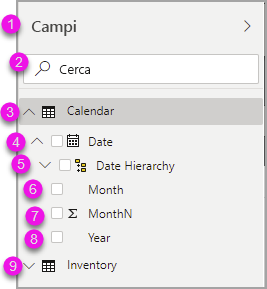
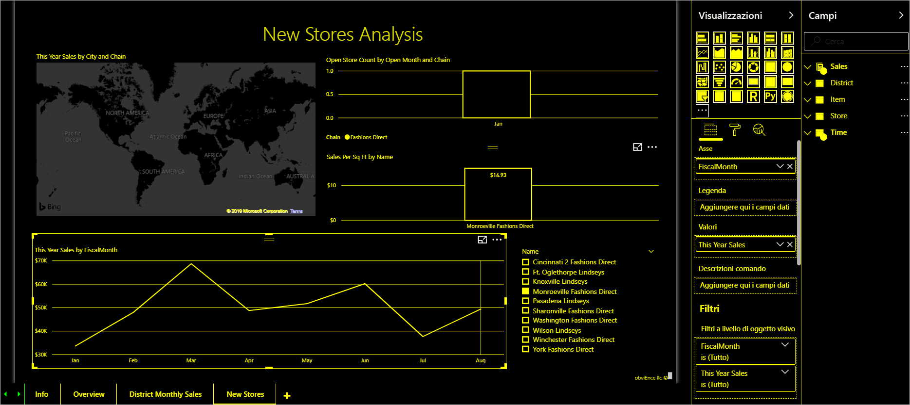

# Creazione di report in Power BI con gli strumenti di accessibilità

Power BI include molte funzionalità predefinite che possono essere utili agli autori di report che usano strumenti di accessibilità per creare i report.

Questo articolo descrive i diversi tipi di strumenti di accessibilità disponibili per gli autori di report in Power BI Desktop.

## Navigazione a livello di app
Quando si naviga in Power BI Desktop, è possibile spostare lo stato attivo sulle aree principali dell'app premendo **CTRL + F6**. Lo stato attivo viene spostato nell'area principale di Power BI Desktop nell'ordine seguente:

1. Oggetti nel canvas
2. Schede della pagina
3. Riquadri (ognuno separatamente, da sinistra a destra per quelli aperti)
4. Strumento di navigazione viste
5. Piè di pagina
6. Accesso
7. Avviso giallo/errore/barra degli aggiornamenti

Nella maggior parte dei casi, in Power BI è una procedura comune usare **INVIO** per selezionare o accedere a un'area e quindi usare **ESC** per uscirne.

## Navigazione nella barra multifunzione

Premere **ALT** per visualizzare i *suggerimenti per i tasti di scelta*, ovvero le caselline posizionate sopra ogni comando disponibile nella vista corrente della barra multifunzione. È quindi possibile premere la lettera indicata dal *suggerimento per il tasto di scelta* visualizzato sopra il comando che si vuole usare. 

Nell'immagine seguente, ad esempio, è stato premuto il tasto **ALT** per visualizzare i suggerimenti per i tasti di scelta, che contengono le lettere per i comandi accessibili disponibili. Premendo quindi **M** si aprirà la scheda **Creazione di modelli** sulla barra multifunzione.

A seconda della lettera premuta, potrebbero essere visualizzati altri suggerimenti per i tasti di scelta. Se ad esempio la scheda **Home** è attiva e si preme **W**, viene visualizzata la scheda **Visualizza** con i suggerimenti per i tasti di scelta per i gruppi di tale scheda **Visualizza** della barra multifunzione. È possibile continuare a premere le lettere visualizzate nei suggerimenti per i tasti di scelta fino a quando non si preme la lettera del comando specifico che si vuole usare. Per passare al set precedente di suggerimenti per i tasti di scelta, premere **ESC**. Per annullare l'azione che si sta eseguendo e nascondere i suggerimenti per i tasti di scelta, premere il tasto **ALT**.

## Navigazione nei riquadri degli oggetti visivi

Per spostarsi nel riquadro **Visualizzazioni**, è prima di tutto necessario assicurarsi che lo stato attivo sia sul riquadro, premendo **CTRL + F6** fino a raggiungere tale riquadro. Quando un utente si sposta nel riquadro Visualizzazioni, lo stato attivo passa prima sull'intestazione. Partendo dall'alto, l'ordine di tabulazione è il seguente, come illustrato nell'immagine che segue:

1. Titolo dell'intestazione
2. Carattere di espansione/compressione
3. Icona del primo oggetto visivo

Quando si arriva agli oggetti visivi, è possibile usare i tasti freccia per passare a un determinato oggetto visivo e premere **INVIO** per selezionarlo. Se si usa un'utilità per la lettura dello schermo, viene comunicato se è stato creato un nuovo grafico e ne viene indicato il tipo o viene indicato che un determinato tipo di grafico è stato modificato in un altro tipo di grafico. 

Dopo la sezione degli oggetti visivi del riquadro, l'ordine di attivazione passa quindi ai pivot dei riquadri, come illustrato nell'immagine seguente.

Quando lo stato attivo è sui pivot dei riquadri, la tabulazione viene applicata solo all'icona del riquadro selezionato. Per passare ad altri riquadri, usare i tasti freccia.

## Area campi

Quando lo stato attivo è sui pivot dei riquadri, come descritto nella sezione precedente, premendo di nuovo TAB lo stato attivo viene spostato sull'**area campi**. 

Nell'**area campi** l'ordine di attivazione passa a:

* ogni titolo dell'area (primo elemento)
* seguito da un determinato campo in ogni area (elemento successivo)
* il pulsante a discesa per aprire il menu del campo (nuovo elemento successivo)
* quindi il pulsante di rimozione (ultimo elemento)

L'immagine seguente mostra l'ordine di avanzamento dello stato attivo.

Un'utilità per la lettura dello schermo leggerà il nome e la descrizione comando dell'area. Un'utilità per la lettura dello schermo legge il nome e la descrizione comando di ogni campo di un'area. Se un'area è vuota, lo stato attivo passerà all'intera area vuota. L'utilità per la lettura dello schermo leggerà il nome e la descrizione comando dell'area e comunicherà che è vuota.

Quando il menu di un campo è aperto, è possibile spostarsi al suo interno usando **TAB** o **MAIUSC + TAB** oppure i tasti freccia **SU** / **GIÙ**. Un'utilità per la lettura dello schermo comunicherà i nomi delle opzioni.

Per spostare un campo da un bucket dell'area campi a un altro, è possibile usare la tastiera e usare l'opzione **Sposta in** nel menu dell'area campi, come illustrato nell'immagine seguente.

## Riquadro di formattazione

L'ordine di attivazione per il riquadro **Formattazione** passa dall'alto al basso, seguendo l'ordine delle schede. Lo stato attivo passa dal nome della scheda al pulsante di attivazione e disattivazione **Sì/No**, se esistente. Quando lo stato attivo è sul nome della scheda, un'utilità per la lettura dello schermo legge il nome della scheda e indica se la scheda è espansa o compressa. È possibile premere **INVIO** per espandere o comprimere la scheda. Il tasto **INVIO** consente anche di impostare su **Sì** o **No** il pulsante di attivazione e disattivazione.

Se una scheda è aperta, **TAB** consente di passare da un controllo all'altro della scheda prima di passare a quella successiva. Per i controlli in una scheda, un'utilità per la lettura schermo comunica il titolo, il valore corrente e il tipo di controllo.  

## Spostamento nell'elenco Campi

È possibile premere **TAB** per spostarsi nell'elenco **Campi**. Analogamente al riquadro Formattazione, se le tabelle sono compresse, l'ordine di attivazione è il seguente:

1. Intestazione dell'elenco **Campi**
2. Barra di ricerca
3. Nome di ogni tabella

Per espandere tutte le tabelle dell'area **Campi**, premere **ALT + MAIUSC + 9**. Per comprimere tutte le tabelle, premere **ALT + MAIUSC + 1**. Per espandere una singola tabella, premere il tasto **freccia DESTRA**. Per comprimere una singola tabella, premere il tasto **freccia SINISTRA**. Analogamente al riquadro Formattazione, se una tabella è espansa, la tabulazione e lo spostamento nell'elenco Campi includono i campi visualizzati. Un'utilità per la lettura schermo indica se una tabella è stata espansa o compressa.

È possibile contrassegnare un campo passando al campo desiderato e premendo **INVIO**.   Un'utilità per la lettura dello schermo indica qual è il campo con lo stato attivo e se il campo è selezionato o deselezionato.

Gli utenti che usano il mouse in genere trascinano i campi nel canvas o nei bucket di filtri pertinenti desiderati. Se si preferisce usare la tastiera, è possibile aggiungere un campo a un bucket di filtri immettendo il menu di scelta rapida di un campo premendo **MAIUSC + F10**, usando i tasti freccia per passare ad **Aggiungi ai filtri** e quindi premendo **INVIO** sul tipo di filtro a cui si vuole aggiungere il campo.

## Spostamento nel riquadro Selezione
L'avanzamento dell'ordine di attivazione nel riquadro **Selezione** è il seguente:

1. Titolo dell'intestazione
2. Pulsante Esci
3. Selettore Ordine livelli/di tabulazione
4. Pulsante per lo spostamento verso l'alto nel livello
5. Pulsante per lo spostamento verso il basso nel livello
6. Pulsante Mostra
7. Pulsante Nascondi
8. Oggetti

È possibile spostare lo stato attivo con il tasto TAB e premere **INVIO** per selezionare l'elemento a cui si è interessati.  

Quando si arriva al selettore Ordine livelli/di tabulazione, usare i tasti freccia SINISTRA e DESTRA per passare da Ordine livelli a Ordine di tabulazione.

Quando si arriva agli oggetti nel riquadro **Selezione**, premere **F6** per attivare il riquadro **Selezione**. Dopo aver attivato il riquadro **Selezione**, è possibile usare i tasti freccia SU/GIÙ per spostarsi tra i diversi oggetti del riquadro **Selezione**.
Una volta passati a un oggetto a cui si è interessati, è possibile eseguire alcune azioni diverse:

* Premere **CTRL + MAIUSC + S** per visualizzare/nascondere un oggetto
* Premere **CTRL + MAIUSC + F** per spostare un oggetto verso l'alto nell'ordine dei livelli
* Premere **CTRL + MAIUSC + B** per spostare un oggetto verso il basso nell'ordine dei livelli
* Premere **CTRL + BARRA SPAZIATRICE** per selezionare più oggetti

## Finestre di dialogo di Power BI Desktop

Tutte le finestre di dialogo in Power BI Desktop sono accessibili tramite la navigazione da tastiera e utilizzano le utilità per la lettura dello schermo.

Le finestre di dialogo in Power BI Desktop includono le seguenti:

* Finestra di dialogo Misura rapida
* Finestra di dialogo Formattazione condizionale e Barre dei dati
* Finestra di dialogo Esplora domande e risposte
* Finestra di dialogo Guida introduttiva
* Menu File e finestra di dialogo Informazioni
* Barra degli avvisi
* Finestra di dialogo Ripristino del file
* Finestra di dialogo Frowns (Commenti)

## Supporto del contrasto elevato

Quando si usano le modalità a contrasto elevato in Windows, queste impostazioni e la tavolozza selezionate vengono applicate anche ai report in Power BI Desktop.

Power BI Desktop rileva automaticamente il tema a contrasto elevato usato in Windows e applica queste impostazioni ai report. Questi colori a contrasto elevato vengono usati anche nel report pubblicato nel servizio Power BI o altrove.

## Passaggi successivi

Gli articoli relativi all'accessibilità in Power BI sono i seguenti:

* [Panoramica dell'accessibilità in Power BI](desktop-accessibility-overview.md) 
* [Creazione di report di Power BI accessibili](desktop-accessibility-creating-reports.md) 
* [Utilizzo di report in Power BI con gli strumenti di accessibilità](desktop-accessibility-consuming-tools.md)
* [Scelte rapide da tastiera per l'accessibilità per i report di Power BI](desktop-accessibility-keyboard-shortcuts.md)
* [Elenco di controllo dell'accessibilità dei report](desktop-accessibility-creating-reports.md#report-accessibility-checklist)

