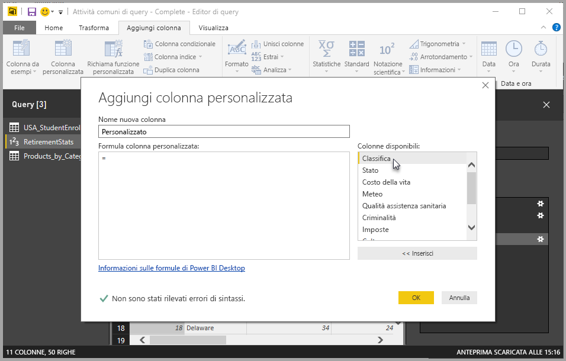

# Aggiungere una colonna personalizzata in Power BI Desktop

In Power BI Desktop è possibile aggiungere facilmente una nuova colonna di dati personalizzata al modello usando l'editor di query. Con l'editor di query è possibile creare e rinominare la colonna personalizzata per creare [query di formula Power Query M](https://docs.microsoft.com/powerquery-m/quick-tour-of-the-power-query-m-formula-language) e definire la colonna personalizzata. Le query di formula Power Query M hanno un [set di contenuti di riferimento completo per le funzioni](https://docs.microsoft.com/powerquery-m/power-query-m-function-reference). 

Quando si crea una colonna personalizzata nell'editor di query, Power BI Desktop la aggiunge come **passaggio applicato** in **Impostazioni query** per la query. La colonna può essere cambiata, spostata o modificata in qualsiasi momento.

## Usare l'editor di query per aggiungere una colonna personalizzata

Per iniziare a creare una colonna personalizzata, seguire questa procedura:

1. Avviare Power BI Desktop e caricare alcuni dati.

2. Nella scheda **Home** sulla barra multifunzione selezionare **Modifica query**e quindi selezionare **Modifica query** dal menu.

   

   Verrà visualizzata la finestra **Editor di query**. 

2. Nella scheda **Aggiungi colonna** sulla barra multifunzione selezionare **Colonna personalizzata**.

   

   Verrà visualizzata la finestra **Aggiungi colonna personalizzata**.

## Finestra Aggiungi colonna personalizzata

La finestra **Aggiungi colonna personalizzata** ha le funzionalità seguenti: 
- Un elenco di colonne disponibili nell'elenco **Colonne disponibili** a destra.

- Il nome iniziale della colonna personalizzata nella casella **Nuovo nome colonna**. È possibile rinominare la colonna.

- [Query di formula PowerQuery M](https://docs.microsoft.com/powerquery-m/power-query-m-function-reference) nella casella **Formula colonna personalizzata**. Per creare queste query, creare la formula in base alla quale deve essere definita la nuova colonna personalizzata. 

   

## Creare formule per la colonna personalizzata

1. Selezionare una colonna dall'elenco **Colonne disponibili** a destra e quindi selezionare **Inserisci** sotto l'elenco per aggiungerla alla formula colonna personalizzata. Per aggiungere una colonna è anche possibile fare doppio clic sulla colonna nell'elenco.

2. Man mano che si immette la formula e si crea la colonna, si noti l'indicatore nella parte inferiore della finestra **Aggiungi colonna personalizzata**. 

   Se non sono presenti errori, viene visualizzato un segno di spunta verde e il messaggio *Non sono stati rilevati errori di sintassi*.

   

   Se è presente un errore di sintassi, vengono visualizzati un'icona di avviso gialla e un collegamento alla posizione dell'errore nella formula.

   

3. Scegliere **OK**. 

   Power BI Desktop aggiunge la colonna personalizzata al modello e il passaggio **Aggiunta colonna personalizzata** all'elenco **Passaggi applicati** in **Impostazioni query**.

   

4. Per modificare la colonna personalizzata, fare doppio clic sul passaggio **Aggiunta colonna personalizzata** nell'elenco **Passaggi applicati**. 

   Verrà visualizzata la finestra **Aggiungi colonna personalizzata** con la formula della colonna personalizzata creata.

## Usare l'editor avanzato per le colonne personalizzate

Dopo aver creato la query, è anche possibile modificare qualsiasi passaggio di questa tramite l'**editor avanzato**. A tale scopo, seguire questa procedura:

1. Nella finestra **Editor di query** selezionare la scheda **Visualizza** sulla barra multifunzione. 

2. Selezionare **Editor avanzato**.

   Verrà visualizzata la pagina **Editor avanzato**, che consente il controllo completo della query. 

   

   
## Passaggi successivi

- È possibile creare una colonna personalizzata in altri modi, ad esempio creando una colonna in base ad esempi forniti dall'utente all'editor di query. Per altre informazioni, vedere [Aggiungere una colonna da un esempio in Power BI Desktop](desktop-add-column-from-example.md).

- Per informazioni di riferimento su Power Query M, vedere [Informazioni di riferimento sulle funzioni di Power Query M](/powerquery-m/power-query-m-function-reference).

