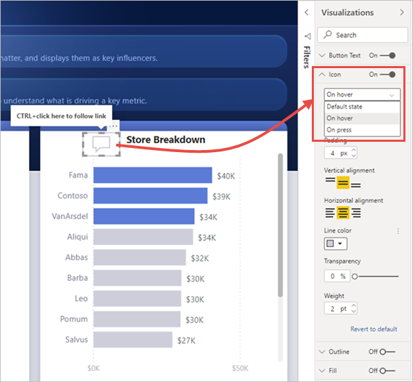

# Usare i pulsanti in Power BI
L'uso dei **pulsanti** in Power BI consente di creare report con un comportamento simile alle app e in tal modo di creare un ambiente coinvolgente in modo che gli utenti possano passare il mouse, fare clic e interagire in altri modi con il contenuto di Power BI. È possibile aggiungere pulsanti ai report in **Power BI Desktop** e nel **servizio Power BI**. Quando si condividono i report nel servizio Power BI, questi forniscono un'esperienza simile a un'app per gli utenti.

## Creare pulsanti nei report

### Creare un pulsante in Power BI Desktop

Per creare un pulsante in **Power BI Desktop**, selezionare **Pulsanti** nella barra multifunzione **Inserisci**. Viene visualizzato un menu a discesa in cui è possibile selezionare il pulsante desiderato da una raccolta di opzioni, come illustrato nella figura seguente. 

### Creare un pulsante nel servizio Power BI

Per creare un pulsante nel **servizio Power BI**, aprire il report nella visualizzazione di modifica. Selezionare **Pulsanti** nella barra dei menu superiore. Viene visualizzato un menu a discesa in cui è possibile selezionare il pulsante desiderato da una raccolta di opzioni, come illustrato nella figura seguente. 

## Personalizzare un pulsante

Indipendentemente dal fatto che il pulsante venga creato in Power BI Desktop o nel servizio Power BI, il resto della procedura è uguale. Quando si seleziona un pulsante nell'area di disegno report, il riquadro **Visualizzazioni** mostra i diversi modi per personalizzare il pulsante in base alle specifiche esigenze. Ad esempio, è possibile attivare o disattivare **Testo pulsante**, spostando il dispositivo di scorrimento in tale sezione del riquadro **Visualizzazioni**. È anche possibile modificare l'icona del pulsante, il riempimento del pulsante, il titolo e l'azione eseguita quando gli utenti selezionano il pulsante in un report, tra le altre proprietà.

## Impostare le proprietà dei pulsanti per lo stato inattivo, al passaggio del mouse o selezionato

I pulsanti in Power BI presentano tre stati: predefinito (aspetto dei pulsanti quando non sono selezionati o non vi si passa il mouse sopra), al passaggio del mouse o selezionato (azione spesso indicata come *fare clic*). Molte delle sezioni nel riquadro **Visualizzazioni** possono essere modificate singolarmente in base a questi tre stati, con una grande flessibilità per la personalizzazione dei pulsanti.

Le sezioni seguenti nel riquadro **Visualizzazioni** consentono di modificare la formattazione o il comportamento di un pulsante in base ai relativi tre stati:

* Testo del pulsante
* Icona
* Struttura
* Riempimento

Per specificare l'aspetto del pulsante per ogni stato, espandere una di queste sezioni e selezionare l'elenco a discesa visualizzato nella parte superiore della sezione. Nella figura seguente è visualizzata la sezione **Icona** espansa con l'elenco a discesa selezionato per mostrare i tre stati.

## Selezionare l'azione per un pulsante

È possibile selezionare l'azione da eseguire quando un utente seleziona un pulsante in Power BI. È possibile accedere alle opzioni per le azioni del pulsante dalla sezione **Azione** nel riquadro **Visualizzazioni**.

Le opzioni per le azioni dei pulsanti sono le seguenti:

- **Indietro** consente all'utente di tornare alla pagina precedente del report. Questa operazione è utile per le pagine di drill-through.
- **Segnalibro** visualizza la pagina del report associata a un segnalibro definito per il report corrente. Vedere altre informazioni sui [segnalibri in Power BI](desktop-bookmarks.md). 
- **Drill-through (anteprima)** sposta l'utente in una pagina di drill-through filtrata in base alla selezione, senza usare i segnalibri. Vedere altre informazioni sui [pulsanti di drill-through nei report](desktop-drill-through-buttons.md).
- **Navigazione sulle pagine** sposta l'utente in un'altra pagina all'interno del report, anche in questo caso senza usare i segnalibri. Per informazioni dettagliate, vedere [Creare l'esperienza di navigazione tra le pagine](#create-page-navigation) in questo articolo.
- **Domande e risposte** apre una finestra **Esplora domande e risposte**. 

Per alcuni pulsanti è disponibile un'azione predefinita selezionata automaticamente. Ad esempio, per il tipo di pulsante **Domande e risposte** è selezionata automaticamente l'azione **Domande e risposte**. Per altre informazioni su **Esplora domande e risposte**, vedere [questo post di blog](https://powerbi.microsoft.com/blog/power-bi-desktop-april-2018-feature-summary/#Q&AExplorer).

È possibile provare o testare i pulsanti creati per il report usando *CTRL+clic* sul pulsante da provare. 

### Creare l'esperienza di navigazione tra le pagine

Con il tipo di **Azione** **Navigazione sulle pagine** è possibile creare rapidamente un'intera esperienza di navigazione senza dover salvare o gestire alcun segnalibro.

Per impostare un pulsante di navigazione tra le pagine, creare un pulsante con il tipo di azione **Navigazione sulle pagine** e selezionare la pagina **Destinazione**.

È possibile creare rapidamente un riquadro di spostamento personalizzato. Si possono così evitare la modifica e la gestione dei segnalibri se si vogliono cambiare le pagine da visualizzare nel riquadro di spostamento.

È anche possibile formattare in modo condizionale la descrizione comando come per gli altri tipi di pulsanti.

## Passaggi successivi
Per altre informazioni sulle funzionalità simili o su come interagire con i pulsanti, vedere gli articoli seguenti:

* [Usare il drill-through nei report di Power BI](desktop-drillthrough.md)
* [Usare i segnalibri per condividere informazioni dettagliate e creare storie in Power BI](desktop-bookmarks.md)

