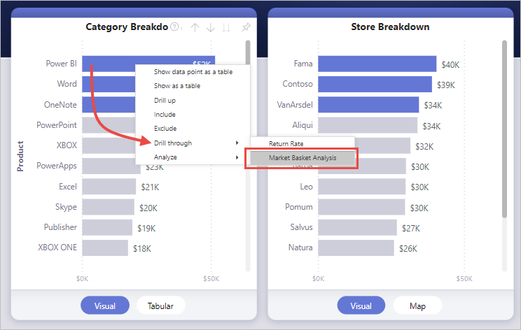
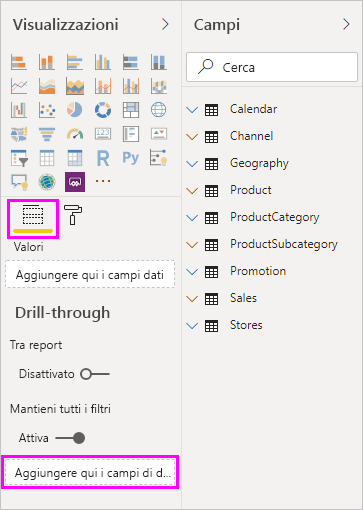
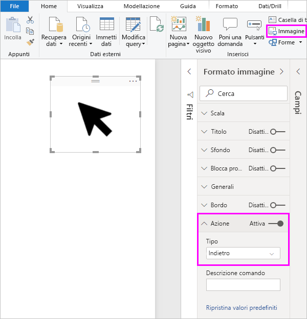
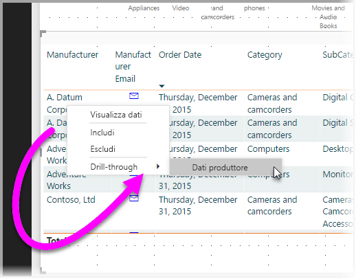
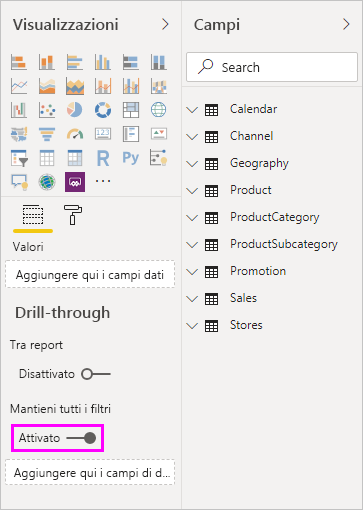
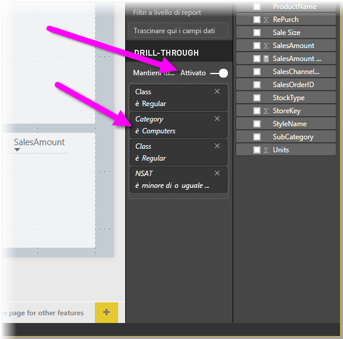
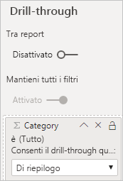

# Configurare il drill-through nei report di Power BI
Con il *drill-through* nei report di Power BI è possibile creare una pagina nel report incentrata su una specifica entità, ad esempio un fornitore, un cliente o un produttore. Quando i lettori del report usano la funzione di drill-through, possono fare clic con il pulsante destro del mouse su un punto dati in altre pagine del report ed eseguire il drill-through nella pagina specifica per ottenere dettagli che vengono filtrati in base al contesto selezionato. È anche possibile [creare un pulsante che consente di eseguire il drill-through](desktop-drill-through-buttons.md) per visualizzare i dettagli quando si fa clic su di esso.

Il drill-through può essere configurato nei report in Power BI Desktop o nel servizio Power BI.

## Configurare la pagina di destinazione del drill-through
1. Per usare il drill-through, creare una pagina di report con gli oggetti visivi voluti per il tipo di entità per la quale si fornirà il drill-through. 

    Si supponga, ad esempio, di voler fornire il drill-through per i produttori. In questo caso è possibile creare una pagina di drill-through con oggetti visivi che visualizzano le vendite totali, le unità spedite totali, le vendite per categoria, le vendite per area e così via. In questo modo, quando si esegue il drill-through a tale pagina, gli oggetti visivi saranno specifici per il produttore selezionato.

2. Nella pagina di drill-through, nella sezione **Campi** del riquadro **Visualizzazioni**, trascinare quindi il campo per cui si vuole abilitare il drill-through nell'area **Filtri di drill-through**.

    

    Quando si aggiunge un campo all'area **Filtri di drill-through**, Power BI crea automaticamente un oggetto visivo pulsante *Indietro*. Tale oggetto visivo diventa un pulsante nei report pubblicati. Gli utenti che utilizzano il report nel servizio Power BI usano questo pulsante per tornare alla pagina del report da cui sono arrivati.

    

> [!IMPORTANT]
> È possibile configurare ed eseguire il drill-through a una pagina nello stesso report, ma non si può eseguire il drill-through a una pagina in un report diverso.  

## Usare un'immagine personalizzata per un pulsante Indietro    
 Poiché il pulsante Indietro è un'immagine, è possibile sostituire l'immagine di tale oggetto visivo con qualsiasi altra immagine desiderata. Tale immagine continua a funzionare come pulsante Indietro per permettere agli utenti del report di tornare alla pagina originale. 

Per usare un'immagine personalizzata per un pulsante Indietro, seguire questa procedura:

1. Nella scheda **Home** selezionare **Immagine**. Individuare quindi l'immagine e inserirla nella pagina di drill-through.

2. Selezionare la nuova immagine nella pagina di drill-through. Nel riquadro **Formato immagine** impostare il dispositivo di scorrimento **Azione** su **Attivato** e quindi impostare **Tipo** su **Indietro**. A questo punto, l'immagine funziona come pulsante Indietro.

    

    
     Ora gli utenti possono fare clic con il pulsante destro del mouse su un punto dati nel report e ottenere un menu di scelta rapida che supporta il drill-through a tale pagina. 

    

    Quando gli utenti del report scelgono di eseguire il drill-through, la pagina viene filtrata per visualizzare le informazioni sul punto dati su cui hanno fatto clic con il pulsante destro del mouse. Si supponga, ad esempio, che l'utente abbia fatto clic con il pulsante destro del mouse su un punto dati relativo a Contoso, un produttore, e abbia scelto di eseguire il drill-through. La pagina di drill-through visualizzata verrà filtrata in base a Contoso.

## Passare tutti i filtri nel drill-through

È possibile passare tutti i filtri applicati alla finestra di drill-through. Ad esempio, è possibile selezionare solo una determinata categoria di prodotti e gli oggetti visivi filtrati per tale categoria e quindi selezionare il drill-through. È interessante vedere che aspetto ha il drill-through con tutti questi filtri applicati.

Per mantenere tutti i filtri applicati, nella sezione **Drill-through** del riquadro **Visualizzazioni** impostare **Mantieni tutti i filtri** su **Attiva**. 

Quando si esegue il drill-through su un oggetto visivo, è possibile vedere quali filtri sono stati applicati come risultato dell'applicazione di filtri temporanei all'oggetto visivo di origine. Nella sezione **Drill-through** del riquadro **Visualizzazione** tali filtri temporanei vengono visualizzati in corsivo. 

Anche se è possibile eseguire questa operazione con le pagine di descrizioni comandi, l'operazione risulterebbe insolita in quanto la descrizione comando non funzionerebbe correttamente. Per questo motivo, non è consigliabile eseguire l'operazione con le descrizioni comando.

## Aggiungere una misura al drill-through

Oltre a passare tutti i filtri alla finestra di drill-through, è anche possibile aggiungere una misura o una colonna numerica di riepilogo all'area di drill-through. Trascinare il campo di drill-through nella scheda **Drill-through** per applicarlo. 

Quando si aggiunge una misura o una colonna numerica di riepilogo, è possibile eseguire il drill-through alla pagina quando il campo viene usato nell'area *Valore* di un oggetto visivo.

Non sono necessarie altre operazioni per l'uso del drill-through nei report. Questo strumento è ideale per ottenere una visualizzazione espansa delle informazioni sulle entità selezionate per il filtro di drill-through.

## Passaggi successivi

Potrebbero essere interessanti anche gli articoli seguenti:

* [Usare il drill-through tra report nei report di Power BI](desktop-cross-report-drill-through.md)
* [Uso dei filtri dei dati in Power BI Desktop](../visuals/power-bi-visualization-slicers.md)
