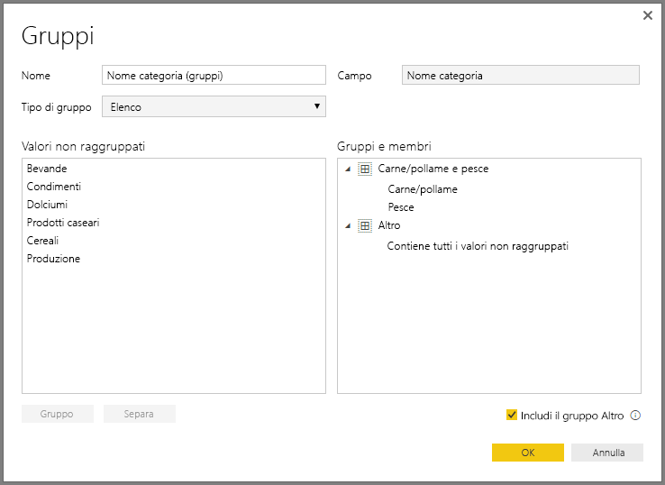

# Usare il raggruppamento e la creazione di contenitori in Power BI Desktop
Quando Power BI Desktop crea oggetti visivi, aggrega i dati in blocchi (o gruppi) in base ai valori trovati nei dati sottostanti. Tuttavia, a volte si potrebbe voler perfezionare la modalità di presentazione di tali blocchi. Ad esempio, si potrebbero voler inserire tre categorie di prodotti in una categoria maggiore (un *gruppo*). In alternativa, si potrebbero voler visualizzare le cifre delle vendite in dimensioni del contenitore di 1.000.000 di euro, anziché in blocchi di 923.983 euro.

In Power BI Desktop, è possibile *raggruppare* punti dati che consentono di visualizzare, analizzare ed esplorare più chiaramente dati e tendenze negli oggetti visivi. È anche possibile definire le *dimensioni del contenitore* in modo da inserire i valori in gruppi di uguali dimensioni che consentono una migliore e più significativa visualizzazione dei dati. Questa azione è detta anche *binning*.

## Uso del raggruppamento
Per usare il raggruppamento, selezionare due o più elementi in un oggetto visivo tenendo premuto CTRL mentre si fa clic per selezionare più elementi. Fare quindi clic con il pulsante destro del mouse su uno degli elementi della selezione multipla e scegliere **Raggruppa** dal menu di scelta rapida.

Una volta creato, il gruppo viene aggiunto al contenitore **Legenda** per l'oggetto visivo e viene visualizzato anche nell'elenco **Campi**.

Una volta creato un gruppo, è possibile modificarne facilmente i membri. Fare clic con il pulsante destro del mouse sul campo nel contenitore **Legenda** o nell'elenco **Campi**, quindi scegliere **Modifica gruppi**.

Nella finestra di dialogo **Gruppi** è possibile creare nuovi gruppi o modificare i gruppi esistenti. È anche possibile *rinominare* qualsiasi gruppo. Basta fare doppio clic sul titolo del gruppo nella casella **Gruppi e membri** e quindi immettere un nuovo nome.

Con i gruppi è possibile eseguire ogni sorta di operazioni. È possibile aggiungere elementi dall'elenco **Valori non raggruppati** in un nuovo gruppo o in uno dei gruppi esistenti. Per creare un nuovo gruppo, selezionare due o più elementi (premendo CTRL mentre si fa clic) nella casella **Valori non raggruppati** e quindi selezionare il pulsante **Raggruppa** sotto tale casella.

È possibile aggiungere un valore non raggruppato in un gruppo esistente: è sufficiente selezionare la voce corrispondente in **Valori non raggruppati**, quindi selezionare il gruppo esistente a cui si vuole aggiungerlo e selezionare il pulsante **Raggruppa**. Per rimuovere un elemento da un gruppo, selezionarlo nella casella **Gruppi e membri** e quindi selezionare **Separa**. È anche possibile spostare categorie non raggruppate nel gruppo **Altro** o lasciarle non raggruppate.

> [!NOTE]
> È possibile creare gruppi per qualsiasi campo nell'elenco **Campi** senza dover selezionare più elementi da un oggetto visivo esistente. Fare clic con il pulsante destro del mouse sul campo e selezionare **Nuovo gruppo** dal menu visualizzato.

## Uso della creazione di contenitori
È possibile impostare le dimensioni del contenitore per i campi numerici e ora in **Power BI Desktop**. È possibile usare il binning, o creazione di contenitori, per assegnare le dimensioni appropriate ai dati visualizzati da Power BI Desktop.

Per applicare una dimensione al contenitore, fare clic con il pulsante destro del mouse su un **campo** e scegliere **Nuovo gruppo**.

Nella finestra di dialogo **Gruppi** impostare **Dimensioni contenitore** sulle dimensioni desiderate.

Quando si seleziona **OK**, verrà visualizzato un nuovo campo nel riquadro **Campi** con **(contenitori)** accodato. È quindi possibile trascinare il campo nell'area di disegno per usare la dimensione del contenitore in un oggetto visivo.

Per vedere in azione la *creazione di contenitori*, dare uno sguardo a questo [video](https://www.youtube.com/watch?v=BRvdZSfO0DY).

E questo è tutto per quanto riguarda l'uso del *raggruppamento* e della *creazione di contenitori* per assicurarsi che gli oggetti visivi nei report mostrino i dati nel modo desiderato.
