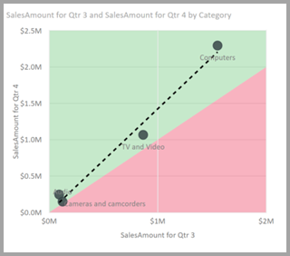

# Applicare le informazioni dettagliate in Power BI Desktop per spiegare le fluttuazioni negli oggetti visivi (anteprima)

Negli oggetti visivi si rilevano spesso notevoli aumenti e quindi brusche diminuzioni dei valori. Grazie alle **informazioni dettagliate** in **Power BI Desktop** è possibile trovare la causa di tali fluttuazioni con pochi clic.

Considerare ad esempio l'oggetto visivo seguente, che specifica il valore di *Importo vendite* per *Anno* e *Trimestre*. Nel 2014 si verifica una notevole diminuzione delle vendite, con un brusco calo tra il *1° trim.* e il *2° trim*. In questi casi è possibile esplorare i dati per investigare le cause delle variazioni. 

È possibile indicare a **Power BI Desktop** di spiegare gli aumenti o le diminuzioni nei grafici, visualizzare i fattori di distribuzione nei grafici e ottenere un'analisi approfondita, rapida e automatizzata dei dati. È sufficiente fare clic con il pulsante destro del mouse su un punto dati e scegliere **Analizza > Spiega la diminuzione** (o l'aumento, se la barra precedente era più bassa) oppure **Analizza > Scopri le differenze in questa distribuzione** per visualizzare informazioni dettagliate in una finestra facile da usare.

La funzionalità delle informazioni dettagliate è contestuale e si basa sul punto dati immediatamente precedente, ad esempio la barra o la colonna precedente.

> [!NOTE]
> Questa funzionalità è in anteprima e soggetta a modifiche. Per impostazione predefinita, la funzionalità delle informazioni dettagliate è abilitata e attiva (non è necessario selezionare una casella Anteprima per abilitarla) a partire dalla versione di settembre 2017 di **Power BI Desktop**.

## Uso delle informazioni dettagliate
Per usare le informazioni dettagliate per spiegare gli aumenti e le diminuzioni rilevati nei grafici, fare clic con il pulsante destro del mouse su un punto dati in un grafico a linee o a barre e scegliere **Analizza > Spiega l'aumento** (o *Spiega la diminuzione*, perché tutte le informazioni dettagliate si basano sulla variazione rispetto al punto dati precedente).

**Power BI Desktop** esegue quindi gli algoritmi di apprendimento automatico sui dati e popola una finestra con un oggetto visivo e una descrizione che illustra le categorie che più hanno influito sull'aumento o sulla diminuzione. Per impostazione predefinita, le informazioni dettagliate vengono fornite come oggetto visivo *a cascata*, come illustrato nell'immagine seguente.

Selezionando le piccole icone nella parte inferiore dell'oggetto visivo a cascata, è possibile scegliere di visualizzate le informazioni dettagliate come grafico a dispersione, istogramma in pila o grafico a nastri.

Le icone del *pollice in su* e del *pollice in giù* nella parte superiore della pagina consentono di fornire commenti e suggerimenti sull'oggetto visivo e sulla funzionalità. Questa operazione restituisce feedback, ma attualmente non esegue il training dell'algoritmo per influenzare i risultati restituiti alla successiva esecuzione della funzionalità.

È importante tenere presente che il pulsante **+** nella parte superiore dell'oggetto visivo consente di aggiungere l'oggetto visivo selezionato al report, proprio come se l'oggetto visivo fosse stato creato manualmente. È quindi possibile formattare o modificare in altro modo l'oggetto visivo aggiunto proprio come qualsiasi altro oggetto visivo del report. È possibile aggiungere un oggetto visivo informazioni dettagliate selezionato solo quando si modifica un report in **Power BI Desktop**.

È possibile usare le informazioni dettagliate quando il report è in modalità di lettura o di modifica. Questa funzionalità è quindi adatta sia all'analisi dei dati che alla creazione di oggetti visivi che è facilmente possibile aggiungere ai report.

## Dettagli dei risultati restituiti

I dettagli restituiti nelle informazioni dettagliate evidenziano le differenze tra i due periodi, per consentire di comprendere cosa è cambiato.  

Se ad esempio *Vendite* è aumentato di un 55% complessivo tra il *3° trim.* e il *4° trim.* , e questo è vero per ogni *Categoria* di prodotto (le vendite di Computer sono aumentate del 55%, le vendite di Audio sono aumentate del 55% e così via), ed è vero anche per ogni paese e per ogni tipo di cliente, i dati non contengono elementi identificabili che possono spiegare la variazione. Tuttavia questo scenario è molto raro e in genere si rilevano differenze nei dati, ad esempio *Computer* ed *Elettrodomestici* hanno registrato una crescita molto più elevata (63%) mentre *TV e video* è cresciuto solo del 23%, pertanto *Computer* ed *Elettrodomestici* hanno contribuito con una percentuale più elevata del totale nel *4° trimestre* rispetto al *3° trimestre*.  In base a questo esempio, una spiegazione ragionevole dell'incremento sarebbe: *vendite in netta crescita per Computer e TV e Audio*. 

Pertanto l'algoritmo non si limita a restituire i valori da cui dipende la quantità più grande della modifica. Se ad esempio la quasi totalità delle vendite (98%) proviene dagli Stati Uniti, in genere accade che anche la maggior parte dell'aumento sia stata registrata negli Stati Uniti. Tuttavia, salvo se gli Stati Uniti o altri paesi hanno registrato una variazione significativa del loro contributo relativo al totale, *Paese* non è considerato interessante in questo contesto.  

I termini semplici, l'algoritmo registra tutte le altre colonne del modello, calcola la scomposizione in base a tale colonna per i periodi di tempo *prima* e *dopo*, determina la quantità di variazione registrata nella scomposizione e quindi restituisce le colonne con la maggior quantità di variazione. Ad esempio nel caso precedente è stata selezionata *Categoria* perché il contributo di *TV e video* è sceso del 7% dal 33% al 26%, mentre il contributo di *Elettrodomestici* è cresciuto da zero a oltre il 6%. 

Per ogni colonna restituita è possibile visualizzare quattro oggetti visivi. Tre di questi oggetti visivi sono utili per evidenziare la variazione del contributo tra i due periodi. Ad esempio, per spiegare l'aumento tra *2° trimestre* e *3° trimestre*.

### Grafico a dispersione

L'oggetto visivo Grafico a dispersione indica il valore della misurazione nel primo periodo (asse x) rispetto al valore della misurazione nel secondo periodo (asse y) per ogni valore della colonna (in questo caso *Categoria*). Come illustrato nell'immagine seguente, i punti dati si trovano nell'area di colore verde se il valore è aumentato e nell'area di colore rosso se è diminuito. 

La linea tratteggiata indica la tendenza media ottimale. I punti dati sopra la linea registrano una crescita superiore al trend complessivo e quelli sotto la linea registrano una crescita inferiore.  

Si noti che gli elementi di dati il cui valore è vuoto in uno dei due periodi non vengono visualizzati nel grafico a dispersione (ad esempio, *Elettrodomestici* in questo caso)

### Istogramma a colonne in pila 100%

L'oggetto visivo istogramma in pila 100% indica il valore della misura prima e dopo, in base alla colonna selezionata, sotto forme di colonne in pila 100%. Questa visualizzazione affiancata consente il confronto dei contributi prima e dopo. Le descrizioni comandi visualizzano il contributo effettivo per il valore selezionato.

### Grafico a nastri

L'oggetto visivo Grafico a nastri visualizza anche il valore della misura prima e dopo. È particolarmente utile per visualizzare le variazioni dei contributi se queste hanno determinato un cambio dell'*ordine* delle entità che hanno contribuito (ad esempio se *Computer* era prima l'entità con il contributo maggiore, ma poi è passata in terza posizione). 

### Grafico a cascata

Il quarto oggetto visivo è un grafico a cascata, che indica gli aumenti o le diminuzioni principali reali tra i diversi periodi. Questo oggetto visivo specifica chiaramente le variazioni reali, ma da solo non indica le modifiche al livello di contributo sufficienti a spiegare perché la colonna è stata scelta come interessante. 

Quando si classificano le colonne in base alle differenze più grandi nei contributi relativi, viene considerato quanto segue: 

* Si tiene conto della cardinalità, perché una differenza è meno significativa a livello statistico e meno interessante quando una colonna ha una cardinalità elevata. 

* Le differenze per le categorie in cui i valori originali erano molto elevati o molto vicini allo zero vengono ponderate con un valore superiore a quelle di altre categorie. Se ad esempio una categoria contribuiva solo l'1% delle vendite e poi il valore passa al 6%, questo fatto è più significativo a livello statistico (e pertanto è considerato più interessante) dell'evoluzione di una categoria il cui contributo è passato dal 50% al 55%. 

* Vengono usate varie funzioni euristiche per selezionare i risultati più significativi, ad esempio considerando altre relazioni tra i dati.
 
Dopo l'esame di altre colonne, vengono scelte e incluse nell'output quelle che indicano il cambiamento più significativo al contributo relativo. Per ogni colonna sono indicati nella descrizione i valori che apportano il cambiamento più significativo al contributo. Vengono indicati anche i valori con il maggior aumento reale e la maggior diminuzione reale.

## Considerazioni e limitazioni
Poiché queste informazioni dettagliate sono basate sulle modifiche rispetto al punto dati precedente, non sono disponibili quando si seleziona il primo punto dati in un oggetto visivo. 

L'elenco seguente è una raccolta degli scenari attualmente non supportati per la **spiegazione dell'aumento/diminuzione**:

* Filtri PrimiN
* Filtri di inclusione/esclusione
* Filtri per le misure
* Misure non numeriche
* Uso di "Mostra valore come"
* Misure filtrate: calcoli a livello visivo ai quali viene applicato un filtro specifico (ad esempio *Vendite totali per la Francia*) e che vengono usati in alcuni oggetti visivi creati dalla funzionalità informazioni dettagliate
* Colonne categoriche sull'asse X a meno che non definisca un ordine scalare per colonna. Se si usa una gerarchia, ogni colonna nella gerarchia attiva deve corrispondere a questa condizione

Neppure i tipi di modelli e le origini dati seguenti sono attualmente supportati per le informazioni dettagliate:

* DirectQuery
* Live Connect
* Reporting Services locale
* Incorporamento

## Passaggi successivi
Per altre informazioni su **Power BI Desktop** e su come iniziare, vedere gli articoli seguenti.

* [Che cos'è Power BI Desktop?](../fundamentals/desktop-what-is-desktop.md)
* [Panoramica delle query con Power BI Desktop](../transform-model/desktop-query-overview.md)
* [Origini dati in Power BI Desktop](../connect-data/desktop-data-sources.md)
* [Connettersi ai dati in Power BI Desktop](../connect-data/desktop-connect-to-data.md)
* [Effettuare il data shaping e combinare i dati con Power BI Desktop](../connect-data/desktop-shape-and-combine-data.md)
* [Attività di query comuni in Power BI Desktop](../transform-model/desktop-common-query-tasks.md)   
