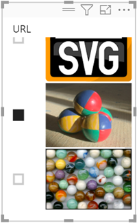

# Visualizzare immagini in una tabella, matrice o filtro dei dati in un report

Un modo efficace per migliorare i report consiste nell'aggiungere immagini. Le immagini statiche nella pagina sono utili per alcuni scopi. In alcuni casi sono tuttavia più indicate immagini correlate ai dati del report. In questo argomento viene illustrato come visualizzare le immagini in una tabella, matrice, filtro dei dati o scheda con più righe. 

## Aggiungere immagini al report

1. Creare una colonna con gli URL delle immagini. Per i requisiti, vedere le [considerazioni](#considerations) più avanti in questo articolo.

1. Selezionare la colonna. Nella barra multifunzione **Modellazione** selezionare **URL immagine** per **Categoria di dati**.

    

1. Aggiungere la colonna a una tabella, matrice, filtro dei dati o scheda con più righe.

    

## Considerazioni

- L'immagine deve essere in un formato di file con estensione bmp, jpg, jpeg, gif, png o svg
- L'URL deve essere accessibile in modo anonimo, non in un sito che richiede un accesso come ad esempio SharePoint. Se tuttavia le immagini sono ospitate in SharePoint o OneDrive, si potrebbe ottenere un codice di incorporamento che punta direttamente a esse. 

## Passaggi successivi

[Formattazione e layout di pagina](/learn/modules/visuals-in-power-bi/12-formatting)

[Concetti di base sulle finestre di progettazione del servizio Power BI](../fundamentals/service-basic-concepts.md)

Altre domande? [Provare la community di Power BI](https://community.powerbi.com/)
