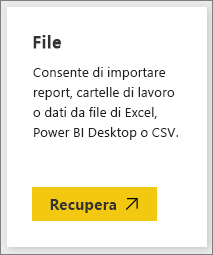

# Ottenere esempi per Power BI
Non si ha dimestichezza con Power BI e si vorrebbe provarlo, ma non si hanno dati da usare?  O forse si preferisce visualizzare report che illustrano alcune funzionalità di Power BI. È tutto sotto controllo.

Power BI offre vari tipi di esempi, per scopi diversi: 
- Un **[report di Power BI](#sales--returns-sample-pbix-file) (file con estensione pbix)** che è possibile visualizzare nella raccolta di storie di dati, aprire ed esplorare in Power BI Desktop o caricare nella servizio Power BI.
- Un' **[app di esempio](#sample-app-from-appsource)** scaricabile da AppSource anche direttamente nel servizio Power BI. Le app includono dashboard, report e set di dati. È possibile modificarle e quindi distribuirle ai colleghi.
- **[Otto esempi originali predefiniti](#eight-original-samples)** nel servizio Power BI come *pacchetti di contenuto* con dashboard, report e set di dati. Questi esempi si installano direttamente nel servizio Power BI. Gli esempi incorporati sono disponibili anche come report di Power BI (file con estensione pbix) e cartelle di lavoro di Excel (file con estensione xlsx).
- Versioni **[cartella di lavoro di Excel](#download-sample-excel-files)** degli esempi predefiniti, contenenti il modello di dati e i fogli di Power View. È possibile esplorare o modificare il modello di dati in Excel e usare la cartella di lavoro di Excel come origine dati per un report Power BI. È anche possibile caricare la cartella di lavoro come file di Excel e visualizzare gli oggetti visivi e le tabelle pivot di Excel in report di Power BI. 
- Una **[cartella di lavoro con dati finanziari di esempio](sample-financial-download.md)** , una semplice tabella flat in un file di Excel disponibile per il download. Contiene dati resi anonimi con prodotti fittizi e vendite suddivise per segmenti e paesi. Può costituire un'origine dati di base utile per un report di Power BI.

La documentazione online usa questi stessi dati nelle esercitazioni e negli esempi, pertanto è possibile seguirne lo svolgimento.

## File di esempio con estensione pbix Sales & Returns

:::image type="content" source="media/sample-datasets/sales-returns-sample-pbix.png" alt-text="File di esempio con estensione pbix Sales & Returns":::

*Report di esempio Sales & Returns*

I designer di report di Power BI Miguel Myers e Chris Hamill hanno creato il file con estensione pbix Sales & Returns per dimostrare molte nuove funzionalità di Power BI, tra cui i pulsanti, il drill-through, la formattazione condizionale, le condizioni what-if e le descrizioni comando personalizzate. 

Lo scenario per questo report è una società che vende skateboard decorati con temi Microsoft. L'azienda vuole ottenere una panoramica dello stato delle vendite e degli utili e un'analisi delle modifiche da apportare alle operazioni aziendali. 

È possibile esplorare queste funzionalità nei modi seguenti:

- Visualizzare e interagire con il report [Data Stories Gallery](https://community.powerbi.com/t5/Data-Stories-Gallery/Sales-amp-Returns-Sample-Report/m-p/876607) nella community di Power BI.
- Scaricare il file con estensione pbix ed esplorarlo in modo approfondito. In questo modo è possibile visualizzare nel dettaglio come Miguel ha ottenuto i risultati desiderati. Se si seleziona il collegamento seguente il file viene scaricato automaticamente: [Report di esempio Sales & Returns](https://go.microsoft.com/fwlink/?linkid=2113239).
- Per informazioni sul report, vedere il post di blog di Power BI [Take a tour of the new Sales & Returns sample report](https://powerbi.microsoft.com/blog/take_a_tour_of_the_new_sales_returns_sample_report/) (Tour del nuovo report di esempio Sales & Returns).

## App di esempio da AppSource

L'*app* Marketing and Sales è disponibile in Microsoft AppSource. Un'app è un tipo di contenuto di Power BI che combina dashboard e report correlati. Un'app può avere uno o più dashboard e uno o più report, tutti aggregati insieme. È possibile eseguire il download dell'app Marketing and Sales da **Apps** nel servizio Power BI o visitando AppSource nel browser in uso.

- L'articolo [Installare e usare app](../consumer/end-user-app-view.md) illustra come scaricare un'app dal servizio Power BI.
- Questo collegamento consente di accedere direttamente all'[app Sales & Marketing](https://appsource.microsoft.com/product/power-bi/microsoft-retail-analysis-sample.salesandmarketingsample?tab=Overview) in AppSource.

Dopo l'installazione, l'app viene visualizzata nella raccolta di app.

:::image type="content" source="media/sample-datasets/power-bi-sales-marketing-app.png" alt-text="Riquadro dell'app Sales & Marketing":::

Quando si apre l'app, selezionare **Esplora con dati di esempio**. 

:::image type="content" source="media/sample-datasets/power-bi-explore-app.png" alt-text="Esplorare l'app":::

La visualizzazione app presenta il dashboard e le singole pagine del report nel riquadro di spostamento. 

:::image type="content" source="media/sample-datasets/power-bi-sales-marketing-app-navigation.png" alt-text="Riquadro di spostamento dell'app":::

Poiché l'utente ha installato l'app, può anche aprire l'*area di lavoro* e modificare gli elementi dell'app. Selezionare l'icona a forma di matita **Modifica** per aprire l'area di lavoro.

:::image type="content" source="media/sample-datasets/power-bi-app-edit-pencil.png" alt-text="Modificare l'app":::

Ora è possibile visualizzare il dashboard, il report e il set di dati dall'app nella visualizzazione elenco dell'area di lavoro. Nell'area di lavoro è possibile modificare ognuno di questi elementi.

:::image type="content" source="media/sample-datasets/power-bi-sales-marketing-workspace.png" alt-text="Area di lavoro Sales & Marketing":::

Se si vuole, è possibile distribuire questa app a qualsiasi utente dell'organizzazione. Selezionare **Aggiorna app**.

:::image type="content" source="media/sample-datasets/power-bi-update-app.png" alt-text="Pulsante Aggiorna app":::

Completare la scheda **Installazione** scegliendo anche un **Colore tema dell'app**. 

:::image type="content" source="media/sample-datasets/power-bi-app-setup.png" alt-text="Selezionare Installazione dell'app":::

Completare le schede **Navigazione** e **Autorizzazioni**, quindi selezionare **Aggiorna app**.

:::image type="content" source="media/sample-datasets/power-bi-select-update-app.png" alt-text="Selezionare Aggiorna app per pubblicare l'app":::

Per altre informazioni, vedere [Pubblicare un'app in Power BI](../collaborate-share/service-create-distribute-apps.md).

## Otto esempi originali
Sono disponibili per l'uso otto esempi originali. Ogni esempio rappresenta un settore diverso. È possibile interagire con ogni esempio in formati diversi:

- Installare i [pacchetti di contenuto predefiniti](#install-built-in-content-packs) nel servizio Power BI.
- Scaricare i [file di report di Power BI](#download-original-sample-power-bi-files) (con estensione pbix).
- Scaricare i [file cartella di lavoro di Excel](#download-sample-excel-files) (con estensione xlsx), quindi caricarli nella servizio Power BI.
- Esplorare i [file di Excel](#explore-excel-samples-inside-excel) direttamente in Excel.

La società obviEnce ([www.obvience.com](http://www.obvience.com/)) e Microsoft hanno collaborato alla creazione degli esempi da usare con Power BI.  I dati sono stati resi anonimi e sono rappresentativi di diversi settori, come finanze, risorse umane, vendite e altri. 

Ognuno di questi esempi è disponibile in diversi formati: come pacchetto di contenuto, come cartella di lavoro di Excel e come file di Power BI con estensione pbix. Se non si conoscono questi elementi o non si sa come ottenerli, nessun problema. Questo articolo illustra i dettagli. Per ognuno di questi esempi è stata creata una *presentazione*. Le presentazioni sono articoli che raccontano la storia degli esempi e illustrano diversi scenari. Gli scenari possibili includono, ad esempio, la risposta alle domande per il responsabile, la ricerca di approfondimenti sulla concorrenza o la creazione di report e dashboard da condividere oppure la spiegazione di una variazione di business.

Prima di iniziare, leggere queste linee guida legali sull'uso degli esempi, quindi passare alla presentazione degli esempi e alla dimostrazione di come usarli.

### Linee guida per l'uso delle cartelle di lavoro di Excel di esempio

&copy;2015 Microsoft Corporation. Tutti i diritti sono riservati. Documenti e cartelle di lavoro vengono forniti così come sono. Le informazioni e le opinioni espresse nel presente documento, inclusi gli URL e altri riferimenti a siti Web, possono essere soggette a modifiche senza preavviso. L'utente accetta di usarle a proprio rischio. Alcuni esempi vengono forniti a solo scopo illustrativo e sono fittizi. Nessuna associazione reale è intenzionale o può essere desunta. Microsoft non offre alcuna garanzia, esplicita o implicita, relativamente alle informazioni fornite.

Le cartelle di lavoro non implicano la concessione di alcun diritto legale di proprietà intellettuale relativo a prodotti Microsoft. È possibile copiare e usare questa cartella di lavoro per finalità di riferimento interni.

Le cartelle di lavoro e i dati correlati sono forniti da obviEnce. [www.obvience.com](http://www.obvience.com)

ObviEnce è un ISV e un incubatore di proprietà intellettuale (IP) che si occupa principalmente di Microsoft Business Intelligence. ObviEnce collabora a stretto contatto con Microsoft per sviluppare procedure consigliate e leadership di pensiero per ottimizzare e distribuire soluzioni Microsoft Business Intelligence.

Le cartelle di lavoro e i dati sono di proprietà di obviEnce, LLC e sono stati condivisi al solo scopo di illustrare le funzionalità di Power BI con dati di esempio del settore.

Eventuali usi delle cartelle di lavoro e/o dei dati devono includere l'attribuzione precedente (presente anche nel foglio di lavoro Info di ogni cartella di lavoro). La cartella di lavoro e le eventuali visualizzazioni devono essere accompagnate dal seguente avviso di copyright: obviEnce &copy;.

Facendo clic su uno dei collegamenti seguenti per scaricare i file delle cartelle di lavoro di Excel o i file con estensione pbix, si accettano i termini sopra illustrati.

### Esempio di analisi della redditività dei clienti  
[Presentazione dell'esempio di analisi della redditività dei clienti](sample-customer-profitability.md)

Questo esempio di settore analizza le metriche principali di una responsabile amministrativa relative ai dirigenti, prodotti e clienti dell'azienda. È possibile esaminare quali fattori influiscono sulla redditività della società.

### Esempio di analisi delle risorse umane 
[Presentazione dell'esempio sulle risorse umane](sample-human-resources.md)

Questo esempio di settore esamina la strategia di assunzione di una società analizzando i dati relativi a nuovi assunti, dipendenti attivi ed ex dipendenti.  Esplorando i dati è possibile trovare le tendenze relative alle separazioni volontarie e i pregiudizi nella strategia di assunzione.

### Esempio di analisi della spesa IT 
[Presentazione dell'esempio di analisi della spesa IT](sample-it-spend.md)

In questo esempio di settore vengono messi a confronto i costi pianificati e i costi effettivi del reparto IT di una società. Il confronto consente di valutare l'accuratezza delle pianificazioni per l'anno in corso e verificare le aree che evidenziano importanti deviazioni dalla pianificazione. La società di questo esempio prevede un ciclo di pianificazione annuale e genera una nuova ultima stima ogni trimestre per valutare le variazioni nella spesa IT nel corso dell'esercizio fiscale.

### Opportunity Analysis Sample 
[Presentazione dell'esempio di analisi delle opportunità](sample-opportunity-analysis.md)

Questo esempio di settore esamina il canale di vendita di una società di software. I responsabili delle vendite monitorano i canali di vendita diretti e partner tenendo traccia delle opportunità e dei ricavi per area, volume dell'offerta e canale.

### Esempio di analisi dell'approvvigionamento  
[Presentazione dell'esempio di analisi dell'approvvigionamento](sample-procurement.md)

Questo esempio di settore analizza le metriche principali di una responsabile amministrativa relative ai dirigenti, prodotti e clienti dell'azienda. È possibile esaminare quali fattori influiscono sulla redditività della società.

### Retail Analysis sample  
[Presentazione dell'esempio di analisi delle vendite al dettaglio](sample-retail-analysis.md)

Questo esempio di settore analizza i dati delle vendite al dettaglio relativi ad articoli venduti in più negozi e in più zone. Grazie alle metriche è possibile confrontare le prestazioni dell'anno corrente con quelle dell'anno precedente in diverse aree, tra cui vendite, unità, profitto lordo e scostamento, oltre ad analizzare i nuovi negozi.

### Sales and Marketing sample  
[Presentazione dell'esempio di analisi di vendita e marketing](sample-sales-and-marketing.md)

Questo esempio di settore analizza una società di produzione, VanArsdel Ltd. Consente al responsabile marketing di tenere sotto controllo il settore e la quota di mercato della società VanArsdel.  Esaminando l'esempio, è possibile trovare la quota di mercato, i volumi di produzione, le vendite e il sentiment della società.

### Esempio di analisi della qualità dei fornitori  
[Presentazione dell'esempio di analisi della qualità dei fornitori](sample-supplier-quality.md)

Questo esempio di settore è incentrato su una delle problematiche tipiche della supply chain, ovvero l'analisi della qualità dei fornitori. Questa analisi si basa su due metriche principali: numero totale di difetti e tempo totale di inattività causato da tali difetti. Questo esempio ha due obiettivi principali: trovare i migliori e i peggiori fornitori in termini di qualità e identificare gli stabilimenti che presentano le prestazioni migliori nell'individuazione e nello scarto di prodotti difettosi.

### Installare pacchetti di contenuto predefiniti

Si inizierà con i *pacchetti di contenuto*. Gli esempi predefiniti sono disponibili nel servizio Power BI; per trovarli non è necessario uscire da Power BI. Un pacchetto di contenuto è un'aggregazione di uno o più dashboard, set di dati e report creata da un utente e utilizzabile con il servizio Power BI. Ogni pacchetto di contenuto di esempio per Power BI contiene un set di dati, un report e un dashboard.  I pacchetti di contenuto sono ancora disponibili, ma sono deprecati. Non sono disponibili per Power BI Desktop.

1. Aprire il servizio Power BI (app.powerbi.com) ed eseguire l'accesso.
2. Passare all'Area di lavoro personale o a un'altra area di lavoro in cui si vuole installare l'esempio. 
2. Nell'angolo in basso a sinistra selezionare **Recupera dati**.

    
3. Nella pagina Recupera dati che viene visualizzata selezionare **Esempi**.

   
4. Selezionare uno degli esempi per visualizzarne una descrizione, quindi scegliere **Connetti**.  

   
5. Power BI importa il pacchetto di contenuto e aggiunge un nuovo dashboard, report e set di dati all'area di lavoro corrente. Gli esempi sono risorse utili per provare il funzionamento di Power BI.  

   

Ora che si hanno i dati, si può procedere.  Seguire alcune esercitazioni usando i pacchetti di contenuto di esempio oppure aprire il servizio Power BI ed esplorare.

### Scaricare i file di esempio originali di Power BI
Ognuno dei pacchetti di contenuto di esempio è disponibile anche come file con estensione pbix. I file con estensione pbix sono progettati espressamente per Power BI Desktop.  

1. Per scaricare i singoli file, usare i collegamenti riportati di seguito. Se si selezionano questi collegamenti il file viene salvato automaticamente nella cartella Download. 

   - [Esempio di analisi della redditività dei clienti come file con estensione pbix](https://download.microsoft.com/download/6/A/9/6A93FD6E-CBA5-40BD-B42E-4DCAE8CDD059/Customer%20Profitability%20Sample%20PBIX.pbix)
   - [Esempio di analisi delle risorse umane come file con estensione pbix](https://download.microsoft.com/download/6/9/5/69503155-05A5-483E-829A-F7B5F3DD5D27/Human%20Resources%20Sample%20PBIX.pbix)
   - [Esempio di analisi di approvvigionamento come file con estensione pbix](https://download.microsoft.com/download/D/5/3/D5390069-F723-413B-8D27-5888500516EB/Procurement%20Analysis%20Sample%20PBIX.pbix)
   - [Esempio di analisi delle vendite come file con estensione pbix](https://download.microsoft.com/download/9/6/D/96DDC2FF-2568-491D-AAFA-AFDD6F763AE3/Retail%20Analysis%20Sample%20PBIX.pbix)
   - [Esempio di analisi di vendite e marketing come file con estensione pbix](https://download.microsoft.com/download/9/7/6/9767913A-29DB-40CF-8944-9AC2BC940C53/Sales%20and%20Marketing%20Sample%20PBIX.pbix)
   - [Esempio di analisi della qualità dei fornitori come file con estensione pbix](https://download.microsoft.com/download/8/C/6/8C661638-C102-4C04-992E-9EA56A5D319B/Supplier-Quality-Analysis-Sample-PBIX.pbix)

1. In Power BI Desktop selezionare **File > Apri** e passare alla posizione in cui è stato salvato il file di esempio con estensione pbix.

4. Selezionare il file con estensione pbix per aprirlo in Power BI Desktop.

### Scaricare i file di Excel di esempio
Ognuno dei pacchetti di contenuto di esempio è disponibile anche come cartella di lavoro di Excel. Le cartelle di lavoro di Excel sono progettate per l'uso con il servizio Power BI.  

1. Scaricare i singoli file usando i collegamenti seguenti oppure [scaricare un file ZIP con tutti i file di esempio](https://go.microsoft.com/fwlink/?LinkId=535020). Per gli utenti avanzati può essere utile scaricare le cartelle di lavoro di Excel per esaminare o modificare i modelli di dati.

   - [Esempio di analisi della redditività dei clienti](https://go.microsoft.com/fwlink/?LinkId=529781)
   - [Esempio di analisi delle risorse umane](https://go.microsoft.com/fwlink/?LinkId=529780)
   - [Esempio di analisi delle opportunità](https://go.microsoft.com/fwlink/?LinkId=529782)
   - [Esempio di analisi dell'approvvigionamento](https://go.microsoft.com/fwlink/?LinkId=529784)
   - [Esempio di analisi delle vendite al dettaglio](https://go.microsoft.com/fwlink/?LinkId=529778)
   - [Esempio di analisi di vendite e marketing](https://go.microsoft.com/fwlink/?LinkId=529785)
   - [Esempio di analisi della qualità dei fornitori](https://go.microsoft.com/fwlink/?LinkId=529779)

2. Salvare il file scaricato. La posizione di salvataggio è importante.

      **Locale** - Se si salva il file in un'unità locale del computer o in un'altra posizione all'interno dell'organizzazione, da Power BI è possibile importare il file in Power BI. Il file rimane nel disco locale, per cui non viene importato in Power BI. Viene invece creato un nuovo set di dati nel sito di Power BI e i dati, e in alcuni casi, il modello di dati, vengono caricati nel set di dati. Se il file contiene report, verranno visualizzati nel sito Power BI in Report.
    
     **OneDrive - Business** - Se si ha OneDrive for Business e si esegue l'accesso con lo stesso account con cui si accede a Power BI, OneDrive for Business è decisamente il modo migliore per mantenere il lavoro in un file di Excel, Power BI o CSV sincronizzato con il set di dati, i report e i dashboard in Power BI. Dato che sia Power BI che OneDrive sono nel cloud, Power BI si connette al file in OneDrive all'incirca ogni ora. Se vengono rilevate modifiche, il set di dati, i report e i dashboard vengono aggiornati automaticamente in Power BI.
    
     **SharePoint - Siti del team** - Il salvataggio dei file di Power BI in SharePoint - Siti del team corrisponde al salvataggio in OneDrive for Business. La differenza principale è rappresentata dalla modalità di connessione al file da Power BI. Si può specificare un URL o connettersi alla cartella radice.
1. Aprire il servizio Power BI (app.powerbi.com) ed eseguire l'accesso.

1. Passare all'Area di lavoro personale o a un'altra area di lavoro oppure creare un'area di lavoro per l'esempio.

4. Nell'angolo inferiore sinistro del riquadro di spostamento selezionare **Recupera dati**.

    
5. Nella pagina **Recupera dati** visualizzata selezionare **File > Recupera**.

    
6. Selezionare il percorso in cui è stato scaricato e salvato l'esempio.

    
7. Selezionare il file. A seconda della posizione in cui è stato salvato il file, selezionare **Connetti** o **Apri**.

8. Scegliere se importare i dati o caricare la cartella di lavoro in Power BI e visualizzarla esattamente com'è in Excel Online.

    
9. Se si seleziona **Importa** Power BI importa la cartella di lavoro e la aggiunge come nuovo dashboard, report e set di dati. Nell'esempio corrente ogni elemento ha il nome **Procurement Analysis Sample**.

    - Poiché la cartella di lavoro include fogli di Power View, Power BI crea un report con una pagina per ogni foglio di Power BI. 
    - Power BI crea un nuovo dashboard con un nuovo riquadro vuoto.  Se si seleziona il riquadro si passa al report appena aggiunto.

10. quindi aprirlo. Selezionare elementi diversi del report per esplorarne le interazioni. 

    

### Esplorare gli esempi di Excel all'interno di Excel

(Facoltativo) Se si vuole comprendere come i dati di una cartella di lavoro di Excel vengono convertiti in report e set di dati di Power BI, aprendo gli esempi di Excel *in Excel* ed esplorando i fogli di lavoro è possibile ottenere alcuni chiarimenti utili.

- Quando si apre una cartella di lavoro di esempio in Excel per la prima volta, possono essere visualizzati due avvisi. Nel primo avviso si viene informati che la cartella di lavoro è in visualizzazione protetta. Selezionare **Abilita modifica**. Il secondo avviso potrebbe indicare che la cartella di lavoro contiene connessioni a dati esterni. Selezionare **Abilita contenuto**.
- Ogni cartella di lavoro contiene più fogli di Power View. Se si desidera visualizzare i fogli di Power View in Excel, è necessario [abilitare il componente aggiuntivo Power View](https://support.office.com/article/flash-silverlight-and-shockwave-controls-blocked-in-microsoft-office-55738f12-a01d-420e-a533-7cef1ff6aeb1) scaricando un pacchetto di chiavi del Registro di sistema.
- I dati effettivi si trovano nel modello di dati di Power Pivot. Non sono necessari i fogli di Power View per visualizzare i dati. Nella scheda **PowerPivot** selezionare **Gestisci**.

    Se la scheda **PowerPivot** non è visibile, [abilitare il componente aggiuntivo Power Pivot](https://support.office.com/article/Start-Power-Pivot-in-Microsoft-Excel-2013-add-in-A891A66D-36E3-43FC-81E8-FC4798F39EA8).

    In Power Pivot è possibile visualizzare i dati di tutte le tabelle sottostanti oltre a tutte le formule DAX. 

- La scheda Info fornisce informazioni su obviEnce, la società che ha creato l'esempio.

## Passaggi successivi
[Concetti di base sulle finestre di progettazione del servizio Power BI](../fundamentals/service-basic-concepts.md)

[Esercitazione: Connettersi agli esempi di Power BI](sample-tutorial-connect-to-the-samples.md)

[Origini dati per Power BI](../connect-data/service-get-data.md)

Altre domande? [Provare la community di Power BI](https://community.powerbi.com/)
