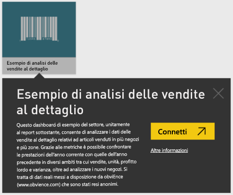
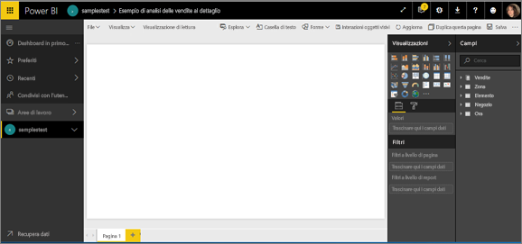
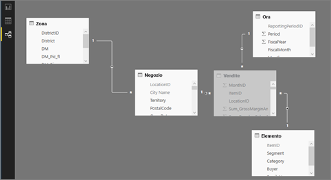

# Esaminare l'esempio di analisi delle vendite al dettaglio

Questa esercitazione illustra come: 
- Importare il pacchetto di contenuto di esempio per l'analisi delle vendite al dettaglio, aggiungerlo al servizio Power BI e aprire il contenuto. Un *pacchetto di contenuto* è un tipo di esempio in cui il set di dati è abbinato a un dashboard e a un report. 
- Aprire il file con estensione pbix dell'esempio di analisi delle vendite al dettaglio in Power BI Desktop.

Se servono maggiori informazioni di base, vedere [Set di dati di esempio per Power BI](sample-datasets.md). L'articolo illustra in dettaglio tutti gli esempi, come ottenerli, dove salvarli, come usarli e alcuni degli scenari trattati. 

## Prerequisiti
Gli esempi sono disponibili per il servizio Power BI e per Power BI Desktop. Se si vuole seguire la procedura, usare l'esempio di analisi delle vendite al dettaglio.

Il pacchetto di contenuto di esempio di *analisi delle vendite al dettaglio* usato in questa esercitazione comprende un dashboard, un report e un set di dati.
Per acquisire familiarità con questo pacchetto di contenuto e il relativo scenario, vedere [Esempio di analisi delle vendite al dettaglio per Power BI: Presentazione](sample-retail-analysis.md) prima di iniziare.

## Importare l'esempio nel servizio Power BI

1. Aprire il servizio Power BI (app.powerbi.com), eseguire l'accesso e aprire l'area di lavoro in cui salvare l'esempio. 

    Se non si ha una licenza Power BI Pro, è possibile salvare l'esempio nell'area di lavoro personale.

2. Selezionare **Recupera dati** nella parte inferiore del riquadro di spostamento. 

   

   Se l'opzione **Recupera dati** non è visualizzata, espandere il riquadro di spostamento selezionando l'icona seguente nella parte superiore: .

5. Nella pagina **Recupera dati** che viene visualizzata selezionare **Esempi**.
   
6. Selezionare **Retail Analysis Sample** e quindi scegliere **Connetti**.   
   
   

## Cosa è stato importato?
Con i pacchetti di contenuto di esempio, quando si seleziona **Connetti** Power BI ottiene una copia del pacchetto di contenuto e la archivia nel cloud. Quando si seleziona **Connetti** si ottiene ciò che l'autore del pacchetto di contenuto ha incluso, ovvero un set di dati, un report e un dashboard. 

1. Quando si seleziona **Connetti**, Power BI crea il nuovo dashboard e lo aggiunge nella scheda **Dashboard**. 
   
   
2. Aprire la scheda **Report**. Sarà presente un nuovo report denominato *Esempio di analisi delle vendite al dettaglio*.
   
   
   
   Esaminare la scheda **Set di dati** e osservare la presenza anche di un nuovo set di dati.
   
   

## Esplorare il nuovo contenuto
Ora è possibile esaminare il dashboard, il set di dati e il report autonomamente. Ci sono molti modi diversi per passare ai dashboard, ai report e ai set di dati. Uno di questi modi è descritto nella procedura seguente.  

1. Tornare alla scheda **Dashboard** e selezionare il dashboard **Esempio di analisi delle vendite al dettaglio** per aprirlo.       

   Il dashboard viene aperto e include una serie di riquadri di visualizzazione.   
 
1. Selezionare uno dei riquadri nel dashboard per aprire il report sottostante. In questo esempio verrà selezionato il grafico ad area **This Year's Sales, Last Year's Sales by Fiscal Month**.  

   

   Il report si apre alla pagina che contiene il grafico ad area selezionato, in questo caso, la pagina **District Monthly Sales** del report.
   
   
   
   > [!NOTE]
   > Se il riquadro fosse stato creato con [Domande e risposte di Power BI](power-bi-tutorial-q-and-a.md) verrebbe visualizzata invece la pagina Domande e risposte. Se il riquadro fosse stato [aggiunto da Excel](service-dashboard-pin-tile-from-excel.md), verrebbe aperto Excel Online all'interno di Power BI.
   > 
   > 
1. Quando un utente condivide un pacchetto di contenuto con i colleghi, in genere vuole condividere solo informazioni dettagliate specifiche e non consentire ai colleghi di accedere direttamente ai dati. Nella scheda **Set di dati** sono disponibili varie opzioni per esplorare il set di dati. Non è tuttavia possibile vedere le righe e le colonne di dati, come invece si può fare in Power BI Desktop o in Excel. 
   
   
   
1. Un modo per esplorare il set di dati consiste nel creare visualizzazioni e report personalizzati da zero. Selezionare l'icona del grafico  per aprire il set di dati in modalità di modifica report.
     
   

1. Un altro modo per esplorare il set di dati consiste nell'eseguire [Informazioni rapide](../consumer/end-user-insights.md). Selezionare **Altre opzioni** (...) e quindi scegliere **Ottieni informazioni rapide**. Quando le informazioni sono pronte, selezionare **Visualizza informazioni dettagliate**.
     
    

## Scaricare l'esempio in Power BI Desktop 
Quando si apre il file con estensione pbix di esempio per la prima volta in Power BI Desktop, viene applicata la visualizzazione report, che consente di esplorare, creare e modificare qualsiasi numero di pagine del report con visualizzazioni. La visualizzazione report offre un'esperienza di progettazione analoga a quella della visualizzazione di modifica di un report nel servizio Power BI, consentendo di spostare le visualizzazioni, nonché di copiare e incollare, unire e così via. 

A differenza di quanto avviene quando si modifica un report nel servizio Power BI, in Power BI Desktop è anche possibile lavorare con le query e modellare i dati per ottenere informazioni dettagliate di migliore qualità nei report. Il file di Power BI Desktop può quindi essere salvato in qualsiasi posizione, nell'unità locale o nel cloud.

1. Scaricare il [file con estensione pbix dell'esempio di analisi delle vendite al dettaglio](https://download.microsoft.com/download/9/6/D/96DDC2FF-2568-491D-AAFA-AFDD6F763AE3/Retail%20Analysis%20Sample%20PBIX.pbix) e aprirlo in Power BI Desktop. 

    

1. Il file verrà aperto nella visualizzazione Report. Osservare le quattro schede nella parte inferiore dell'editor di report, che rappresentano le quattro pagine del report. Per questo esempio è selezionata la pagina **New Stores**. 

    .

1. Per un approfondimento sull'editor di report, vedere [Presentazione dell'editor di report](service-the-report-editor-take-a-tour.md).

## Quali elementi sono presenti nel report?
Quando si scarica un file con estensione pbix di esempio, oltre al report viene scaricato anche il *set di dati sottostante*. Quando si apre il file, Power BI Desktop carica i dati con le query e le relazioni associate. È possibile visualizzare i dati e le relazioni sottostanti, ma non è possibile visualizzare le query sottostanti nell'editor di query.

1. Passare alla [visualizzazione dati](../connect-data/desktop-data-view.md) selezionando l'icona di tabella .
 
    

    Nella visualizzazione dati è possibile esaminare, esplorare e comprendere i dati nel modello di Power BI Desktop. Questa visualizzazione è diversa da quella di tabelle, colonne e dati nell'editor di query. I dati nella visualizzazione dati sono già caricati nel modello.

    Durante la modellazione dei dati talvolta si vuole vedere il contenuto effettivo delle righe e delle colonne di una tabella senza creare un oggetto visivo nell'area di disegno report. Questo vale in particolare per la creazione di misure e colonne calcolate o quando è necessario identificare un tipo di dati o una categoria di dati.

1. Passare alla [visualizzazione relazioni](../transform-model/desktop-relationship-view.md) selezionando l'icona seguente: .
 
    

    La visualizzazione Relazioni mostra tutte le tabelle, le colonne e le relazioni presenti nel modello. Da qui è possibile visualizzare, modificare e creare relazioni.

## Passaggi successivi
Questo ambiente è sicuro perché è possibile scegliere di non salvare le modifiche, ma, se le si salva, è sempre possibile scegliere **Recupera dati** per ottenere una nuova copia di questo esempio.

La presentazione ha illustrato in che modo dashboard, set di dati, relazioni e report di Power BI possono fornire informazioni dettagliate sui dati di esempio. È ora possibile iniziare e connettersi ai propri dati. Con Power BI è possibile connettersi a una vasta gamma di origini dati. Per altre informazioni, vedere [Introduzione al servizio Power BI](../fundamentals/service-get-started.md) e [Introduzione a Power BI Desktop](../fundamentals/desktop-getting-started.md).  

Per altre informazioni, vedere:  
- [Concetti di base del servizio Power BI](../fundamentals/service-basic-concepts.md)
- [Esempi per il servizio Power BI](sample-datasets.md)
- [Origini dati per Power BI](../connect-data/service-get-data.md)

Altre domande? [Provare la community di Power BI](https://community.powerbi.com/)
