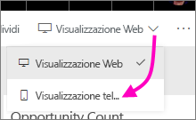
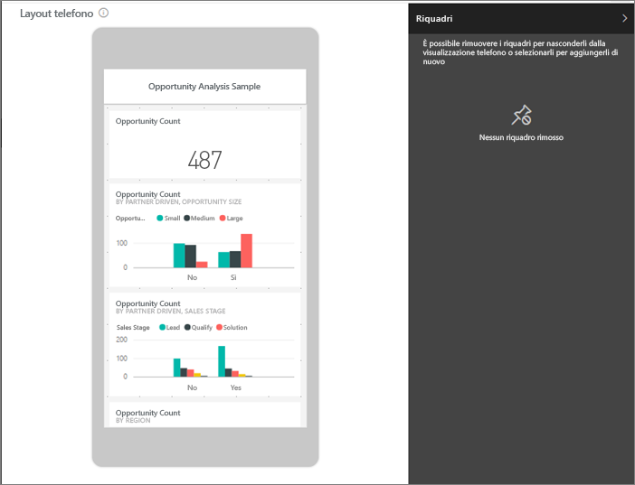
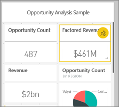
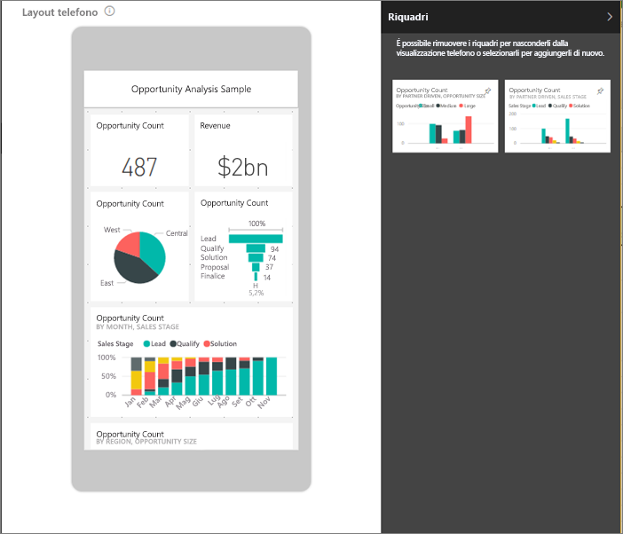
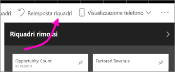

# Ottimizzare un dashboard per telefoni cellulari - Power BI 
Quando si visualizzano i dashboard in modalità verticale in un telefono, si noterà che i riquadri del dashboard sono disposti uno dopo l'altro, tutti con le stesse dimensioni. Nel servizio Power BI è possibile creare una visualizzazione personalizzata di un dashboard, in particolare per la visualizzazione verticale nei telefoni. Anche se si crea una visualizzazione telefono, quando si posiziona il telefono in orizzontale l'aspetto del dashboard è uguale a quello nel servizio.

Per informazioni sulla visualizzazione dei dashboard in un dispositivo mobile, vedere invece [Avvio rapido: Esplorare dashboard e report nelle app Power BI per dispositivi mobili](../consumer/mobile/mobile-apps-quickstart-view-dashboard-report.md).

> [!NOTE]
> Durante la modifica della visualizzazione telefono, chiunque visualizzi il dashboard in un telefono potrà visualizzare in tempo reale le modifiche apportate. Se, ad esempio, si rimuovono tutti i riquadri nella visualizzazione telefono del dashboard, improvvisamente il dashboard nel telefono non avrà alcun riquadro. 
> 
> 

## Creare una visualizzazione telefono di un dashboard
1. Aprire un dashboard nel servizio Power BI.
2. Selezionare la freccia accanto a **Visualizzazione Web** nell'angolo superiore destro > selezionare **Visualizzazione telefono**.

    

    Se non si è il proprietario del dashboard, questa opzione non sarà visualizzata.

    

    Viene visualizzata la visualizzazione di modifica del dashboard nel telefono, in cui è possibile rimuovere, ridimensionare e ridisporre i riquadri per adattarli alla visualizzazione telefono. La versione Web del dashboard non subisce modifiche.

1. Selezionare un riquadro per trascinarlo, ridimensionarlo o rimuoverlo. Come si può notare, gli altri riquadri si spostano quando si trascina un riquadro.
   
    
   
    I riquadri rimossi passano al riquadro Riquadri rimossi, dove rimangono a meno che non li si aggiunga di nuovo.
   
    
2. Se si cambia idea, selezionare **Reimposta riquadri** per ripristinare le dimensioni e l'ordine precedente.
   
    
   
    È sufficiente aprire la visualizzazione di modifica su telefono nel servizio Power BI per modificare leggermente la forma e le dimensioni dei riquadri in un telefono. Per ripristinare esattamente lo stato del dashboard precedente all'apertura nella visualizzazione di modifica nel telefono, selezionare **Reimposta riquadri**.
3. Dopo aver ottenuto il layout desiderato per il dashboard, selezionare la freccia accanto a **Visualizzazione telefono** nell'angolo superiore destro > selezionare **Visualizzazione Web**.
   
    Power BI salva automaticamente il layout del telefono.

## Passaggi successivi
* [Creare report ottimizzati per le app per telefoni di Power BI](desktop-create-phone-report.md)
* [Creare oggetti visivi reattivi ottimizzati per qualsiasi dimensione](../visuals/power-bi-report-visualizations.md)
* Altre domande? [Provare a rivolgersi alla community di Power BI](https://community.powerbi.com/)
