# Creare un riquadro a un dashboard di Power BI da un report
Dopo aver letto l'[introduzione ai dashboard in Power BI](service-dashboards.md) si può creare il proprio dashboard. Per creare un dashboard è possibile procedere in molti modi. Si può partire da un report, da zero, da un set di dati o dalla duplicazione di un dashboard esistente.  

È possibile iniziare creando un dashboard semplice e rapido che aggiunge le visualizzazioni di un report già creato. 

Al termine di questo articolo, si avrà una buona conoscenza dei seguenti aspetti:
- Relazione tra dashboard e report
- Come aprire la visualizzazione di modifica nell'editor di report
- Come aggiungere riquadri 
- Come spostarsi tra un dashboard e un report 
 
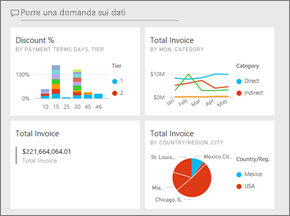

> [!NOTE] 
> I dashboard sono una funzionalità del servizio Power BI, non di Power BI Desktop. Sebbene non sia possibile creare dashboard nelle app per dispositivi mobili Power BI, è possibile [visualizzarli e condividerli](../consumer/mobile/mobile-apps-view-dashboard.md).
>
> 

## Video: Creare un dashboard aggiungendo oggetti visivi e immagini da un report
Osserviamo Amanda creare un nuovo dashboard aggiungendo le visualizzazioni da un report. Seguire quindi la procedura nella sezione successiva [Importare un set di dati con un report](#import-a-dataset-with-a-report) per provare a eseguire l'operazione usando l'esempio di analisi dell'approvvigionamento.
    

<iframe width="560" height="315" src="https://www.youtube.com/embed/lJKgWnvl6bQ" frameborder="0" allowfullscreen></iframe>

## Importare un set di dati con un report
In questa procedura viene importato uno dei set di dati di esempio di Power BI che viene quindi usato per creare un nuovo dashboard. L'esempio è una cartella di lavoro di Excel con due fogli PowerView. Quando Power BI importa la cartella di lavoro, aggiunge un set di dati e un report all'area di lavoro. Il report viene creato automaticamente dai fogli PowerView.

1. Scaricare il file di Excel [Esempio di analisi dell'approvvigionamento](https://go.microsoft.com/fwlink/?LinkId=529784). È consigliabile salvarlo in OneDrive for Business.
2. Aprire il servizio Power BI nel browser (app.powerbi.com).
3. Nel riquadro di spostamento selezionare **Area di lavoro personale** e quindi selezionare **Recupera dati**.

    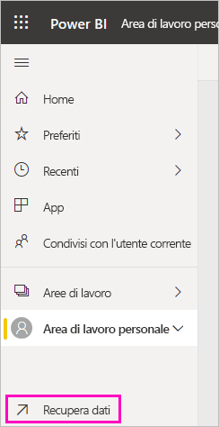
5. In **File** selezionare **Ottieni**.

   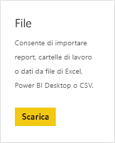
6. Andare al percorso in cui è stato salvato il file di Excel di esempio dell'analisi di approvvigionamento. Selezionarlo e scegliere **Connetti**.

   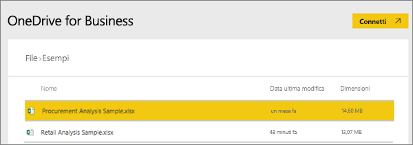
7. Per questo esercizio, selezionare **Importa**.

    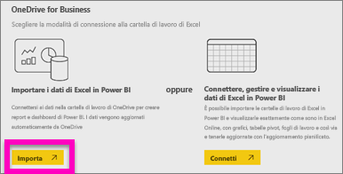
8. Quando viene visualizzato il messaggio di conferma, fare clic sulla **x** per eliminarlo.

   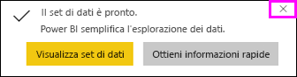

> [!TIP]
> Suggerimenti utili È possibile ridurre il riquadro di spostamento selezionando l'icona con tre righe nella parte superiore . In questo modo si ottiene più spazio per il report.

### Aprire il report e aggiungere alcuni riquadri a un dashboard
1. Nella stessa area di lavoro selezionare la scheda **Report** e quindi selezionare **Esempio di analisi dell'approvvigionamento** per aprire il report.

    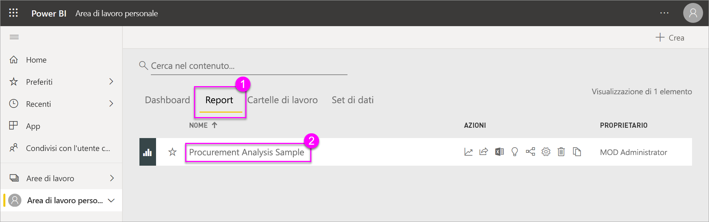 Il report viene aperto nella visualizzazione di lettura. Si noti la presenza di due schede a sinistra: **Discount Analysis** (Analisi degli sconti) e **Spend Overview** (Panoramica di spesa). Ogni scheda rappresenta una pagina del report.

2. Selezionare **Altre opzioni (...)**  > **Modifica report** per aprire il report nella visualizzazione di modifica.

    
3. Passare il mouse su una visualizzazione per vedere le opzioni disponibili. Per aggiungere una visualizzazione a un dashboard, selezionare l'icona di aggiunta. .

    
4. Poiché si sta creando un nuovo dashboard, selezionare l'opzione per **Nuovo dashboard** e assegnare un nome.

    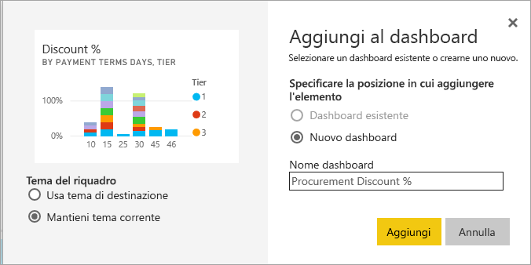
5. Quando si seleziona **Aggiungi**, Power BI crea il nuovo dashboard nell'area di lavoro corrente. Quando appare il messaggio **Aggiunti al dashboard**, selezionare **Vai al dashboard**. Se viene chiesto di salvare il report, scegliere **Salva**.

    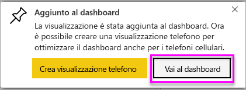

    Power BI apre il nuovo dashboard, che include un solo riquadro, vale a dire la visualizzazione appena bloccata.

   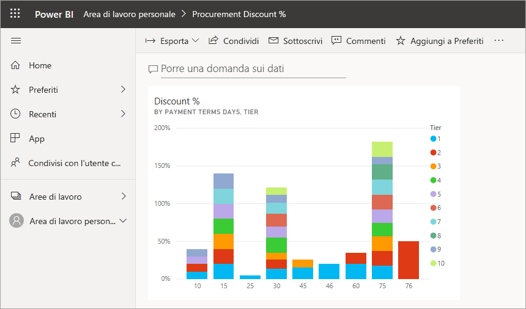
7. Per tornare al report, selezionare il riquadro. Aggiungere qualche altro riquadro al nuovo dashboard. Quando viene visualizzata la finestra **Aggiungi al dashboard**, selezionare **Dashboard esistente**.  

   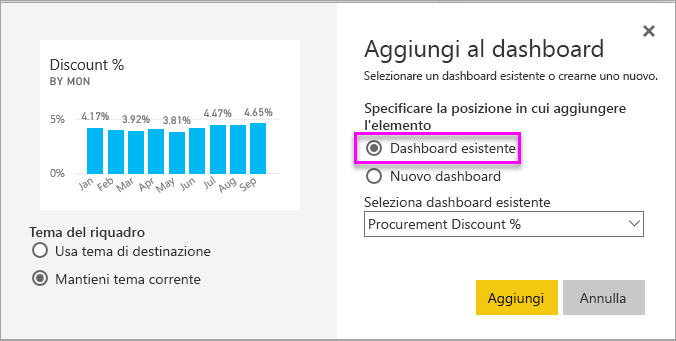

## Aggiungere un'intera pagina del report al dashboard
Invece di aggiungere un singolo oggetto visivo alla volta, è possibile [aggiungere un'intera pagina del report come *riquadro animato*](service-dashboard-pin-live-tile-from-report.md). Di seguito viene descritta la procedura.

1. Nell'editor di report selezionare la scheda **Spend Overview** (Panoramica di spesa) per aprire la seconda pagina del report.

   

2. È preferibile che tutti gli oggetti visivi nel report siano presenti nel dashboard. Nell'angolo superiore destro della barra dei menu selezionare **Aggiungi pagina dinamica**. In un dashboard, i riquadri delle pagine dinamiche vengono aggiornati ogni volta che viene aggiornata la pagina.

   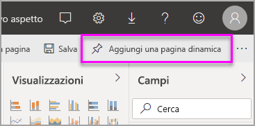

3. Quando viene visualizzata la finestra **Aggiungi al dashboard**, selezionare **Dashboard esistente**.

   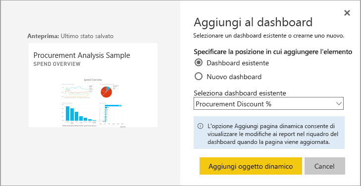

4. Quando viene visualizzato il messaggio di operazione riuscita, selezionare **Vai al dashboard**. Vengono visualizzati i riquadri aggiunti dal report. Nell'esempio riportato di seguito vengono aggiunti due riquadri dalla pagina 1 del report e un riquadro animato corrispondente alla pagina due del report.

   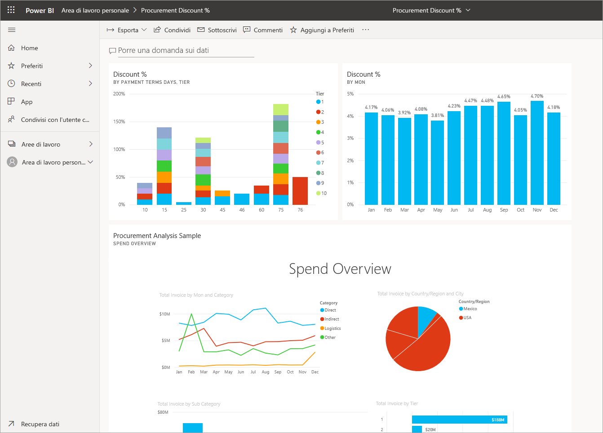

## Passaggi successivi
Congratulazioni per aver creato il primo dashboard. Ora che il dashboard è creato, lo si può usare per fare molte altre cose. Leggere uno degli articoli suggeriti di seguito o iniziare a esplorare autonomamente: 

* [Ridimensionare e spostare i riquadri](service-dashboard-edit-tile.md)
* [Informazioni sui riquadri del dashboard](service-dashboard-tiles.md)
* [Condividere il dashboard creando un'app](../collaborate-share/service-create-workspaces.md)
* [Power BI - Concetti di base](../fundamentals/service-basic-concepts.md)
* [Suggerimenti per la progettazione di un dashboard ottimale](service-dashboards-design-tips.md)

Altre domande? [Provare la community di Power BI](https://community.powerbi.com/).
