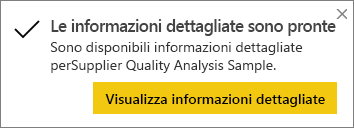
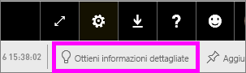

# Generare automaticamente informazioni dettagliate sui dati con Power BI
Si ha un nuovo set di dati e non si sa da dove iniziare?  È necessario creare velocemente un dashboard?  Si desidera cercare le informazioni dettagliate perse?

Eseguire Informazioni rapide per generare visualizzazioni interattive interessanti basate sui dati. La funzionalità Informazioni rapide può essere eseguita su un intero set di dati (Informazioni rapide) o in un riquadro del dashboard specifico (Informazioni rapide con ambito). È anche possibile generare informazioni dettagliate su un'informazione dettagliata.

> [!NOTE]
> La funzionalità Informazioni dettagliate non funziona con DirectQuery, ma solo con i dati caricati in Power BI.
> 

La funzionalità Informazioni dettagliate si basa su un [set di algoritmi analitici avanzati](../consumer/end-user-insight-types.md) sviluppati in collaborazione con Microsoft Research per consentire a più utenti di trovare informazioni dettagliate nei propri dati in modi nuovi e intuitivi.

## Eseguire Informazioni rapide su un set di dati
Il video seguente illustra come eseguire Informazioni rapide su un set di dati, aprire un'informazione dettagliata nella modalità messa a fuoco, aggiungere un'informazione dettagliata come riquadro al dashboard e quindi ottenere informazioni dettagliate per un riquadro del dashboard.

<iframe width="560" height="315" src="https://www.youtube.com/embed/et_MLSL2sA8" frameborder="0" allowfullscreen></iframe>

Passare ora all’azione. Esplorare le informazioni dettagliate usando l'[esempio di analisi della qualità dei fornitori](sample-supplier-quality.md).

1. Nella scheda **Set di dati** selezionare **Altre opzioni** (...) e quindi scegliere **Ottieni informazioni rapide**.
   
    
   
    
2. Power BI usa [vari algoritmi ](../consumer/end-user-insight-types.md) per cercare tendenze nel set di dati.
   
    
3. Entro pochi secondi, le informazioni sono pronte.  Selezionare **Visualizza informazioni dettagliate** per vedere le visualizzazioni.
   
    
   
    > [!NOTE]
    > Alcuni set di dati non possono a generare informazioni dettagliate perché i dati non sono significativi dal punto di vista statistico.  Per altre informazioni, vedere [Ottimizzare i dati per Informazioni rapide](service-insights-optimize.md).
    > 
    
4. Le visualizzazioni appaiono in un apposito canvas di **Informazioni rapide** con un massimo di 32 schede separate di informazioni. Ogni scheda contiene un grafico o un grafico con una breve descrizione.
   
    

## Interagire con le schede di informazioni dettagliate

1. Passare il puntatore del mouse su una scheda e selezionare l'icona a forma di puntina per aggiungere la visualizzazione a un dashboard.

2. Passare il puntatore del mouse su una scheda, selezionare **Altre opzioni** (...) e quindi scegliere **Visualizza informazioni dettagliate**. 

    La schermata delle informazioni dettagliate si apre in modalità messa a fuoco.
   
    
3. In questa modalità è possibile:
   
   * Filtrare le visualizzazioni. Se il riquadro **Filtri** non è già aperto, espanderlo selezionando la freccia sul lato destro della finestra.

       
   * Per aggiungere la scheda delle informazioni dettagliate a un dashboard, selezionare l'icona **Aggiungi oggetto visivo**.
   * Eseguire le informazioni dettagliate nella scheda stessa. Questa modalità d'uso è spesso indicata come *informazioni dettagliate con ambito*. Nell'angolo superiore destro selezionare l'icona a forma di lampadina  oppure **Ottieni informazioni dettagliate**.
     
       
     
     Le informazioni dettagliate vengono visualizzate a sinistra, mentre le nuove schede, basate esclusivamente sui dati presenti in tali informazioni dettagliate specifiche, vengono visualizzate a destra.
     
       
4. Per tornare all'area di disegno originale delle informazioni dettagliate, nell'angolo superiore sinistro selezionare **Esci dalla modalità messa a fuoco**.

## Eseguire informazioni dettagliate su un riquadro del dashboard
Invece di cercare informazioni dettagliate in un intero set di dati, è possibile limitare la ricerca per eseguire le informazioni dettagliate con ambito sui dati usati per creare un singolo riquadro del dashboard. 

1. Aprire un dashboard.
2. Passare il mouse su un riquadro. Selezionare **Altre opzioni** (...) e quindi scegliere **Visualizza informazioni dettagliate**. Il riquadro verrà aperto in [modalità messa a fuoco](../consumer/end-user-focus.md) con le schede delle informazioni dettagliate visualizzate sul lato destro.    
   
        
3. Se un approfondimento attira l’interesse, selezionare la scheda di informazioni dettagliate per un approfondimento. Le informazioni dettagliate selezionate vengono visualizzate a sinistra, mentre le nuove schede di informazioni, basate esclusivamente sui dati presenti in tali informazioni dettagliate specifiche, vengono visualizzate a destra.    
4. Continuare a esaminare i dati e quando si osserva un'informazione dettagliata interessante, aggiungerla al dashboard selezionando **Aggiungi oggetto visivo** nell'angolo superiore destro.

## Passaggi successivi
- Se è disponibile un set di dati, [ottimizzarlo per Informazioni rapide](service-insights-optimize.md).
- Altre informazioni sui [tipi di informazioni rapide disponibili](../consumer/end-user-insight-types.md).

Altre domande? [Provare la community di Power BI](https://community.powerbi.com/).
