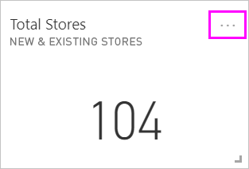
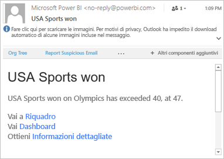
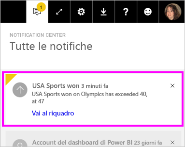
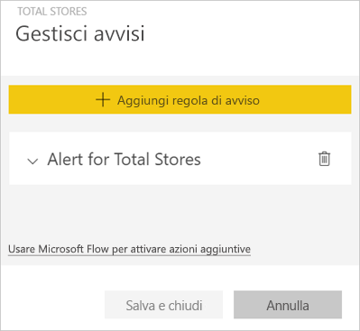
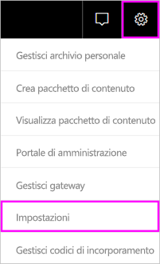

# Avvisi per i dati nel servizio Power BI

Impostare gli avvisi per ricevere una notifica quando i dati nei dashboard superano i limiti impostati.

È possibile impostare gli avvisi per i riquadri nell'area di lavoro personale. È anche possibile impostare avvisi che informano se qualcuno condivide un dashboard incluso in una [capacità Premium](../admin/service-premium-what-is.md). Se si ha una licenza di Power BI Pro, è anche possibile impostare gli avvisi per i riquadri in qualsiasi altra area di lavoro. Gli avvisi possono essere impostati solo in riquadri aggiunti da oggetti visivi del report e solo su misuratori, indicatori KPI e schede. Gli avvisi possono essere impostati negli oggetti visivi creati da set di dati in streaming aggiunti da un report a un dashboard. Gli avvisi non possono essere impostati nei riquadri in streaming creati direttamente nel dashboard usando **Aggiungi riquadro** > **Dati in streaming personalizzati**.

Gli avvisi possono essere visualizzati solo da chi li imposta, anche se si condivide il dashboard. Neanche il proprietario del dashboard può visualizzare gli avvisi impostati dall'utente nella visualizzazione del dashboard. Gli avvisi per i dati sono completamente sincronizzati sulle piattaforme. È possibile quindi impostare e visualizzare gli avvisi per i dati [nell'app Power BI per dispositivi mobili](../consumer/mobile/mobile-set-data-alerts-in-the-mobile-apps.md) e nel servizio Power BI. Non sono disponibili per Power BI Desktop. È anche possibile automatizzare e integrare gli avvisi con Power Automate. Per provare, vedere l'articolo [Power Automate e Power BI](../collaborate-share/service-flow-integration.md).

> [!WARNING]
> Le notifiche di avviso basate sui dati forniscono informazioni sui dati. Se il dispositivo mobile sul quale si visualizzano i dati di Power BI viene smarrito o rubato, è consigliabile disattivare tutte le regole di avviso basato sui dati usando il servizio Power BI.

## Impostare gli avvisi per i dati nel servizio Power BI

In questo video Amanda aggiunge alcuni avvisi ai riquadri del dashboard. Seguire quindi tutte le istruzioni riportate sotto il video per provare a farlo da soli.

<iframe width="560" height="315" src="https://www.youtube.com/embed/JbL2-HJ8clE" frameborder="0" allowfullscreen></iframe>

Questo esempio usa un riquadro di tipo scheda dal dashboard di esempio per l'analisi delle vendite al dettaglio. [Scaricare il report Retail Analysis Sample](sample-retail-analysis.md#get-the-content-pack-for-this-sample) se si vuole seguire la procedura.

1. Iniziare in un dashboard. Nel riquadro **Total Stores** (Totale negozi) selezionare i puntini di sospensione.

   

1. Selezionare l'icona a forma di campana  per aggiungere uno o più avvisi per **Total stores** (Totale negozi).

1. Per iniziare, selezionare **+ Aggiungi regola di avviso**, verificare che il dispositivo di scorrimento **Attivo** sia impostato su **Sì** e assegnare un titolo all'avviso. I titoli consentono di riconoscere facilmente gli avvisi.

   

1. Scorrere verso il basso e immettere i dettagli dell'avviso.  In questo esempio si crea un avviso che notifica una volta al giorno se il numero totale di negozi supera 100.

   

    Gli avvisi vengono visualizzati nel **centro notifiche**. Power BI invia anche un messaggio di posta elettronica relativo all'avviso, se si seleziona la casella di controllo.

1. Selezionare **Salva e chiudi**.

## Ricezione di avvisi

Quando i dati rilevati raggiungono una delle soglie impostate, vengono eseguite alcune operazioni. In base all'opzione selezionata, Power BI per prima cosa controlla se è trascorsa più di un'ora o più di 24 ore dall'ultimo avviso. Se i dati superano la soglia, viene visualizzato un avviso.

Successivamente, Power BI invia un avviso al **centro notifiche** e, facoltativamente, un messaggio di posta elettronica. Ogni avviso contiene un collegamento diretto ai dati. Selezionare il collegamento per visualizzare il riquadro in cui è possibile esplorare, condividere e leggere altre informazioni.  

* Se è stato impostato anche l'invio di un messaggio di posta elettronica, nella posta in arrivo viene visualizzato un messaggio simile al seguente.

   

* Power BI aggiunge un messaggio al **centro notifiche** e una nuova icona di avviso al riquadro applicabile.

   

* Il **centro notifiche** visualizza i dettagli dell'avviso.

    

   > [!NOTE]
   > Gli avvisi funzionano solo per i dati aggiornati. Quando i dati vengono aggiornati, Power BI controlla se è impostato un avviso per tali dati. Se i dati raggiungono una soglia di avviso, Power BI attiva un avviso.

## Gestione degli avvisi

Sono disponibili molti modi per gestire gli avvisi:

* Dal riquadro del dashboard.

* Dal menu Impostazioni di Power BI.

* In un riquadro nelle [app Power BI per dispositivi mobili](../consumer/mobile/mobile-set-data-alerts-in-the-mobile-apps.md).

### Dal riquadro del dashboard

1. Per modificare o rimuovere un avviso per un riquadro, aprire nuovamente la finestra **Gestisci avvisi** selezionando l'icona a forma di campana .

    Power BI visualizza gli avvisi impostati per questo riquadro.

    

1. Per modificare un avviso, selezionare la freccia a sinistra del nome dell'avviso.

    

1. Per eliminare un avviso, selezionare il cestino a destra del nome dell'avviso.

      

### Dal menu Impostazioni di Power BI

1. Selezionare l'icona dell'ingranaggio dalla barra dei menu di Power BI e selezionare **Impostazioni**.

    .

1. In **Impostazioni** selezionare **Avvisi**.

    

1. Da qui è possibile attivare e disattivare gli avvisi, aprire la finestra **Gestisci avvisi** per apportare modifiche o eliminare l'avviso.

## Considerazioni e risoluzione dei problemi

* Gli avvisi non sono supportati per i riquadri di tipo scheda con misure di data/ora.
* Gli avvisi possono essere usati solo con tipi di dati numerici.
* Gli avvisi funzionano solo per i dati aggiornati. Non possono essere usati con dati statici.
* Gli avvisi funzionano nei set di dati in streaming solo se si crea un oggetto visivo del report di tipo indicatore KPI, scheda o misuratore e quindi si aggiunge l'oggetto visivo al dashboard.

## Passaggi successivi

* [Creare un flusso di Power Automate che includa un avviso per i dati](../collaborate-share/service-flow-integration.md).

* [Impostare gli avvisi per i dati nel dispositivo mobile](../consumer/mobile/mobile-set-data-alerts-in-the-mobile-apps.md).

* [Che cos'è Power BI?](../fundamentals/power-bi-overview.md)

Altre domande? [Provare a rivolgersi alla community di Power BI](https://community.powerbi.com/)
