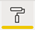
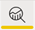

# Presentazione dell'editor di report in Power BI

In Power BI Desktop e nel servizio Power BI l'*editor di report* consente di progettare i report visualizzati dagli utenti, con grafici, tabelle, mappe e altri oggetti visivi. È simile nei due ambienti. In genere si inizia creando un report in Power BI Desktop. Il report viene poi pubblicato nel servizio Power BI, dove è possibile continuare a modificarlo. Il servizio Power BI è anche la posizione in cui si creano i dashboard basati sui report.

Dopo aver creato i dashboard e i report, è possibile distribuirli ai consumer dei report. A seconda del modo in cui vengono condivisi, gli utenti finali possono interagire con i report nella visualizzazione di lettura nel servizio Power BI, ma non modificarli. Altre informazioni su [cosa possono fare i consumer dei report nel servizio Power BI](../consumer/end-user-reading-view.md). 

Questo video illustra l'editor di report in Power BI Desktop. Questo articolo illustra anche l'editor di report in Power BI Desktop. 

<iframe width="560" height="315" src="https://www.youtube.com/embed/IkJda4O7oGs" frameborder="0" allowfullscreen></iframe>

Nel servizio Power BI l'editor di report è disponibile solo nella visualizzazione di modifica. Per aprire un report nella visualizzazione di modifica è necessario essere proprietario o autore del report oppure avere un ruolo di collaboratore nell'area di lavoro che ospita il report.

L'editor di report di Power BI è suddiviso in diverse sezioni principali:  

1. Riquadro di spostamento superiore
1. Canvas del report
1. Riquadro Filtri
1. Riquadro Visualizzazioni
1. Riquadro Campi

## 1. Riquadro di spostamento superiore
Le azioni disponibili nel riquadro di spostamento superiore sono numerose e in continuo aumento. Per informazioni su una determinata azione, usare il Sommario della documentazione o la casella di ricerca di Power BI.

## 2. Area di disegno report
Nell'area di disegno report viene visualizzato il lavoro. Quando si usano i riquadri Campi, Filtri e Visualizzazioni per creare oggetti visivi, questi vengono creati e visualizzati nell'area di disegno report. Ogni scheda nella parte inferiore dell'area di disegno rappresenta una pagina del report. Selezionare una scheda per aprire tale pagina. 

## Riquadri dell'editor di report

All'apertura di un report sono visibili tre riquadri: Filtri, Visualizzazioni e Campi. I primi due riquadri a sinistra, Filtri e Visualizzazioni, controllano l'aspetto delle visualizzazioni, vale a dire tipo, colori, filtri e formattazione. L'ultimo riquadro a destra, Campi, consente di gestire i dati sottostanti usati nelle visualizzazioni. Il contenuto visualizzato nell'editor di report varia in base alle selezioni effettuate nell'area di disegno report. 

Ad esempio, quando si seleziona un singolo oggetto visivo come questo istogramma:

**Il riquadro Filtri** visualizza eventuali filtri applicati all'oggetto visivo, alla pagina o a tutte le pagine. In questo caso, sono presenti filtri a livello di pagina, ma nessun filtro a livello di visualizzazione.

**La parte superiore del riquadro Visualizzazioni** identifica il tipo di oggetto visivo in uso. In questo esempio, un istogramma a colonne raggruppate. 

**La parte inferiore del riquadro Visualizzazioni** include tre schede:

 **Campi** visualizza i campi nell'oggetto visivo. Potrebbe essere necessario scorrere verso il basso per visualizzare tutti i dettagli. Questo grafico usa StoreNumberName e This Year Sales.

 **Formato** Per visualizzare il riquadro Formato per la visualizzazione selezionata, selezionare l'icona del rullo.

 **Analisi** Per visualizzare il riquadro Analisi, selezionare l'icona della lente di ingrandimento.

**Il riquadro Campi** elenca tutte le tabelle disponibili nel modello di dati. Quando si espande una tabella, vengono visualizzati i campi in tale tabella. Il segno di spunta giallo indica che almeno un campo della tabella è presente in una visualizzazione.

Per informazioni dettagliate su ogni riquadro, continuare a leggere.

## 3. Riquadro Filtri
Usare il riquadro Filtri per visualizzare, impostare e modificare i filtri permanenti per i report a livello di pagina, report, drill-through e oggetto visivo. È possibile applicare filtri ad hoc alle pagine e agli oggetti visivi del report selezionando gli elementi degli oggetti visivi o usando strumenti come i filtri dei dati. L'applicazione di filtri nel riquadro Filtri ha il vantaggio che lo stato dei filtri viene salvato con il report. 

Il riquadro Filtri offre anche un'altra potente funzionalità: è possibile filtrare i dati in base a un campo *non già presente in uno degli oggetti visivi nel report*. Quando si crea una pagina del report Power BI aggiunge automaticamente tutti i campi della visualizzazione all'area dei filtri a livello di oggetto visivo del riquadro Filtri. Per impostare un filtro per oggetto visivo, pagina, drill-through o report in base a un campo non attualmente usato nella visualizzazione, è sufficiente trascinarlo su uno dei bucket dei filtri.

La nuova esperienza di filtro offre maggiore flessibilità. È ad esempio possibile formattare i filtri in modo che abbiano un aspetto simile al report. È anche possibile bloccare i filtri o nasconderli dai consumer dei report. 

Per altre informazioni, vedere [Nuova esperienza di filtro](power-bi-report-filter.md).

## 4. Riquadro Visualizzazioni

Il riquadro Visualizzazioni contiene quattro sezioni. Verrà esaminata prima la parte superiore del riquadro.

In questo riquadro è possibile selezionare un tipo di visualizzazione. Le icone piccole mostrano i diversi tipi di visualizzazioni che è possibile creare. Nell'immagine precedente è selezionato il grafico a bolle. Se si inizia a creare una visualizzazione selezionando i campi senza prima selezionare un tipo di visualizzazione, Power BI sceglie automaticamente il tipo di visualizzazione. È possibile accettare il tipo proposto da Power BI o cambiarlo selezionando un'icona diversa.

È possibile scaricare visualizzazioni personalizzate in Power BI Desktop, le cui icone vengono visualizzate sempre in questo riquadro. 

### Gestire i campi in una visualizzazione

I bucket (noti anche come *aree*) di questo riquadro variano a seconda del tipo di visualizzazione selezionato.  Se ad esempio si è selezionato un grafico a barre, si vedranno Asse, Legenda e Valori. Quando si seleziona un campo o lo si trascina nel canvas, Power BI lo aggiunge a uno dei bucket.  È anche possibile trascinare campi dall'elenco Campi direttamente nei bucket.  Alcuni bucket sono limitati a determinati tipi di dati.  Ad esempio, **Valori** non accetta i campi non numerici. Se dunque si trascina un campo **Category** nel bucket **Valori**, Power BI lo cambia in **Conteggio di Category**.

Per altre informazioni, vedere [Aggiungere visualizzazioni a un report di Power BI](../visuals/power-bi-report-add-visualizations-i.md).

Questa parte del riquadro contiene anche opzioni per controllare il comportamento di [drill-through](desktop-drillthrough.md) e filtri.

### Formattare gli oggetti visivi
Selezionare l'icona del rullo per visualizzare il riquadro Formato. Le opzioni disponibili dipendono dal tipo di visualizzazione selezionato.

Le opzioni di formattazione sono innumerevoli.  Per informazioni, esplorarle autonomamente o vedere gli articoli seguenti:

* [Personalizzazione di visualizzazione, sfondo e legenda della visualizzazione](../visuals/power-bi-visualization-customize-title-background-and-legend.md)
* [Formattazione dei colori](../visuals/service-getting-started-with-color-formatting-and-axis-properties.md)
* [Personalizzazione delle proprietà degli assi X e Y](../visuals/power-bi-visualization-customize-x-axis-and-y-axis.md)

### Aggiungere il riquadro Analisi alle visualizzazioni
Per visualizzare il riquadro Analisi, selezionare l'icona della lente di ingrandimento. Le opzioni disponibili dipendono dal tipo di visualizzazione selezionato.

Il riquadro Analisi nel servizio Power BI consente di aggiungere linee di riferimento dinamiche alle visualizzazioni e di concentrare l'attenzione su tendenze o informazioni importanti. Per altre informazioni, vedere [Riquadro Analisi in Power BI Desktop](../transform-model/desktop-analytics-pane.md).

## 5. Riquadro Campi
Il riquadro Campi mostra le tabelle, le cartelle e i campi nei dati utilizzabili per creare visualizzazioni.

|  |  |
| --- | --- |
|  |<ul><li>Trascinare un campo sulla pagina per avviare una nuova visualizzazione.  È anche possibile trascinare un campo in una visualizzazione esistente per aggiungervi il campo.  </li> <li>Quando si aggiunge un segno di spunta accanto a un campo, Power BI aggiunge tale campo alla visualizzazione attiva o a quella nuova. Decide anche in quale bucket posizionare il campo.  Ad esempio, il campo deve essere usato come legenda, asse o valore? Power BI ipotizza l'uso del campo, che può comunque essere spostato in un altro bucket se necessario.   </li><li>In entrambi i casi, ogni campo selezionato viene aggiunto al riquadro Visualizzazioni nell'editor di report.</li></ul> |

In Power BI Desktop sono anche disponibili opzioni per mostrare/nascondere campi, aggiungere calcoli e così via.

## Icone dei campi

Power BI usa una serie di icone diverse per indicare i tipi di campi in un report. È opportuno saperle riconoscere per comprendere meglio come funzionano nei diversi oggetti visivi. Ecco alcune di quelle più comuni.

|Icona  |Significato  |
|---------|---------|
|  | Cartella nell'elenco Campi |
| | Campo numerico: i campi numerici sono aggregati che possono essere sommati o di cui è possibile calcolare la media, ad esempio. Gli aggregati vengono importati con i dati e definiti nel modello di dati su cui si basa il report. Per altre informazioni, vedere [Aggregati nei report di Power BI](service-aggregates.md). |
| | Colonna calcolata con un tipo di dati non numerico: nuova colonna non numerica creata con una formula DAX (Data Analysis Expressions) che definisce i valori della colonna. Altre informazioni sulle [colonne calcolate](../transform-model/desktop-calculated-columns.md). |
|     |   Colonna calcolata numerica: nuova colonna creata con una formula DAX (Data Analysis Expressions) che definisce i valori della colonna. Altre informazioni sulle [colonne calcolate](../transform-model/desktop-calculated-columns.md). |
| |  Misura: una misura calcolata ha una propria formula hardcoded. Non è possibile modificare il calcolo; ad esempio, se è una somma, può essere solo una somma. I valori non vengono archiviati in una colonna. Vengono calcolati in tempo reale, esclusivamente a seconda della loro posizione in un oggetto visivo. Per altre informazioni, vedere [Informazioni sulle misure](../transform-model/desktop-measures.md). |
|     | Gruppo di misure  |
| |      KPI: segnale visivo che comunica lo stato di avanzamento verso un obiettivo misurabile. Altre informazioni sugli oggetti visivi [indicatore di prestazioni chiave (KPI)](../visuals/power-bi-visualization-kpi.md) |
|     |  Gerarchia dei campi: selezionare la freccia per visualizzare i campi che costituiscono la gerarchia.  Per altre informazioni, guardare su YouTube questo video di Power BI su come [creare e usare le gerarchie](https://www.youtube.com/watch?v=q8WDUAiTGeU). |
|     | Dati geografici: questi campi di posizione possono essere usati per creare visualizzazioni mappa. |
|      | Campo di identità: i campi con questa icona sono *campi univoci*, impostati in modo da mostrare tutti i valori, anche se hanno duplicati. Ad esempio i dati potrebbero contenere record per due utenti diversi denominati "Robin Smith" e ognuno verrà considerato come univoco. Non verranno sommati.   |
|   | Parametro: impostare i parametri in modo che le parti dei report e dei modelli di dati (ad esempio un filtro di query, un riferimento a un'origine dati, una definizione di misura e così via) dipendano da uno o più valori dei parametri. Per altre informazioni, vedere questo post di blog di Power BI sui [parametri di query](https://powerbi.microsoft.com/blog/deep-dive-into-query-parameters-and-power-bi-templates/). |
|  | Campo di data del calendario con una tabella di date predefinita |

## Passaggi successivi
[Creare un report](service-report-create-new.md)

Altre informazioni sui report nel [servizio Power BI](service-report-create-new.md), in [Power BI Desktop](desktop-report-view.md) e nelle [app Power BI per dispositivi mobili](../consumer/mobile/mobile-apps-view-phone-report.md).

[Concetti di base per responsabili di progettazione di Power BI](../fundamentals/service-basic-concepts.md)

Altre domande? [Provare la community di Power BI](https://community.powerbi.com/)
