# Aggiornare le aree di lavoro classiche alle nuove aree di lavoro in Power BI

Questo articolo illustra come aggiornare un'area di lavoro classica alla nuova esperienza delle aree di lavoro. È possibile aggiornare tutte le aree di lavoro classiche. Le nuove aree di lavoro hanno ruoli dell'area di lavoro più granulari per poter gestire meglio l'accesso al contenuto. Consentono di gestire le aree di lavoro aggiornate con maggiore flessibilità perché sono connesse in modo più generico al gruppo di Office 365 originale. Altre informazioni sulla [nuova esperienza delle aree di lavoro](../service-new-workspaces.md). 

>[!NOTE]
>L'aggiornamento dell'area di lavoro è disponibile come anteprima pubblica. 

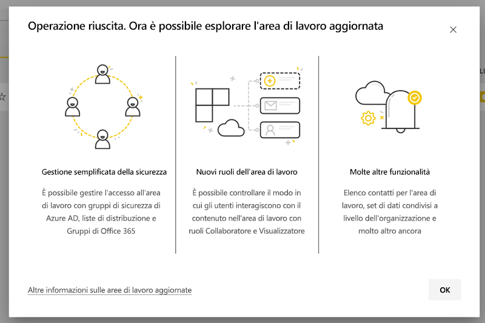

Potrebbero essere tuttavia necessarie modifiche all'area di lavoro che è necessario conoscere e pianificare. I pacchetti di contenuto non sono ad esempio supportati nella nuova esperienza delle aree di lavoro. Vedere la sezione [Considerazioni e limitazioni dell'aggiornamento](#upgrade-considerations-and-limitations) più avanti in questo articolo.

## Operazioni da eseguire dopo l'aggiornamento

*Dopo* l'aggiornamento è necessario eseguire diverse operazioni. È preferibile pianificarle *prima di* eseguire l'aggiornamento:
- Esaminare l'elenco degli accessi e ottenere informazioni sulle [autorizzazioni dopo l'aggiornamento](#permissions-after-upgrade).
- Esaminare l'[elenco contatti](#modify-the-contact-list) e assicurarsi che sia impostato nel modo corretto.
- Ottenere altre informazioni sulla [nuova esperienza delle aree di lavoro](../service-new-workspaces.md), se non si è già informati.

## Aggiornare un'area di lavoro classica

Tutti gli amministratori dell'area di lavoro possono aggiornare l'area di lavoro. Per le aree di lavoro classiche è necessario che l'amministratore di un'area di lavoro sia proprietario del gruppo di Office 365 sottostante. Per aggiornare un'area di lavoro, attenersi alla procedura seguente.

1. Nell'elenco del contenuto dell'area di lavoro selezionare **Altre opzioni** ( **...** ) > **Modifica questa area di lavoro**.

    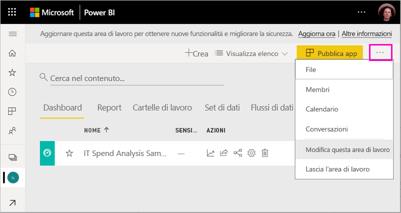

1. Espandere **Avanzate** e selezionare **Aggiorna ora**.

    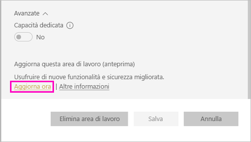

1. Esaminare le informazioni nella finestra di dialogo. Se sono stati pubblicati o installati pacchetti di contenuto nell'area di lavoro, verranno visualizzati avvisi. Quando si è pronti, selezionare **Si è pronti ad aggiornare questa area di lavoro**, quindi selezionare **Aggiorna**.

    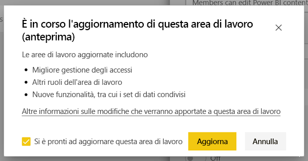

2. Durante l'aggiornamento, viene visualizzato il messaggio **Aggiornamento in corso**. L'aggiornamento dell'area di lavoro richiede in genere meno di un minuto.

1. Al termine dell'aggiornamento, verrà visualizzata la finestra di dialogo **Operaz. completata**. È consigliabile leggere la pagina [Organizzare il lavoro nelle nuove aree di lavoro in Power BI](../service-new-workspaces.md) per acquisire familiarità con le differenze tra le aree di lavoro nuove e quelle classiche.

### Effetti sugli altri utenti dell'area di lavoro

È consigliabile eseguire l'aggiornamento durante gli orari di minore attività, quando pochi utenti visualizzano o modificano attivamente gli elementi nell'area di lavoro.

Agli utenti che stanno usando attivamente l'area di lavoro verrà richiesto di aggiornare il browser. Agli utenti che stanno modificando un report viene offerta la possibilità di salvare i dati prima dell'aggiornamento.

## Considerazioni e limitazioni dell'aggiornamento

- Gli URL e gli ID dell'area di lavoro, il contenuto dell'area di lavoro e l'app pubblicata dall'area di lavoro non cambiano. Il contenuto dei pacchetti di contenuto installato nell'area di lavoro viene gestito separatamente. Per informazioni dettagliate, vedere [Pacchetti di contenuto durante l'aggiornamento](#content-packs-during-upgrade) in questo articolo.
- I pacchetti di contenuto non sono supportati nella nuova esperienza delle aree di lavoro. Per informazioni su come gestire i pacchetti di contenuto durante l'aggiornamento, vedere le relative sezioni [Pacchetti di contenuto pubblicati](#published-content-packs) o [Pacchetti di contenuto installati](#installed-content-packs). Prima di eseguire l'aggiornamento, è consigliabile eliminare i pacchetti di contenuto che sono stati installati o pubblicati nell'area di lavoro.
- Il gruppo di Office 365 per l'area di lavoro classica non viene influenzato dall'aggiornamento dell'area di lavoro in Power BI. I team, i siti di SharePoint, le cassette postali o altre risorse gestite da Office 365 non vengono modificati. Rimangono intatti dopo aver aggiornato l'area di lavoro in Power BI. Il gruppo di Office 365 continua a esistere come prima.
- Dopo l'aggiornamento, viene modificato il modo in cui l'area di lavoro viene protetta. Per informazioni dettagliate, vedere la sezione [Autorizzazioni dell'area di lavoro dopo l'aggiornamento](#permissions-after-upgrade).
- Se necessario, è possibile **ripristinare un'area di lavoro classica**. Non vengono tuttavia ripristinati completamente alcuni aspetti dell'area di lavoro esistenti prima dell'aggiornamento. Se si iniziano a usare funzionalità disponibili solo nella nuova esperienza delle aree di lavoro, non sarà possibile ripristinare l'area classica. L'opzione che consente di ripristinare l'area classica è disponibile per 30 giorni dopo l'aggiornamento.

## Autorizzazioni dopo l'aggiornamento

Selezionare **Accesso** nella barra dei menu nella parte superiore dell'elenco del contenuto dell'area di lavoro per esaminare le autorizzazioni dopo l'aggiornamento.

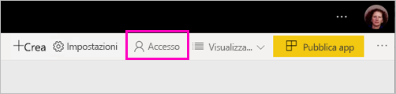

Ogni proprietario del gruppo di Office 365 viene aggiunto singolarmente al ruolo di amministratore per l'area di lavoro aggiornata. Il gruppo di Office 365 stesso viene aggiunto a un ruolo dell'area di lavoro. Il ruolo a cui viene aggiunto dipende dal fatto che l'area di lavoro classica sia *di sola lettura* o *di lettura/scrittura*:

- Quando l'area di lavoro è impostata su **I membri possono modificare il contenuto di Power BI**, dopo l'aggiornamento il gruppo di Office 365 viene aggiunto all'elenco di accesso dell'area di lavoro con il ruolo di **membro**.
- Quando l'area di lavoro è impostata su **Members can only read Power BI content** (I membri possono solo leggere il contenuto di Power BI), dopo l'aggiornamento il gruppo di Office 365 viene aggiunto all'elenco di accesso dell'area di lavoro con il ruolo di **visualizzatore**.

Poiché al gruppo di Office 365 viene assegnato un ruolo nell'area di lavoro, tutti gli utenti aggiunti al gruppo di Office 365 dopo l'aggiornamento avranno tale ruolo nell'area di lavoro. Se però si aggiungono nuovi proprietari al gruppo di Office 365 dopo l'aggiornamento, questi non avranno il ruolo di amministratore per l'area di lavoro.

### Differenze nei ruoli prima e dopo l'aggiornamento

I ruoli dell'area di lavoro sono diversi nelle aree di lavoro classiche e in quelle nuove. La nuova esperienza delle aree di lavoro consente di assegnare i ruoli dell'area di lavoro a gruppi di Office 365, gruppi di sicurezza o liste di distribuzione.

- I **membri** possono condividere singoli elementi e consentire l'accesso all'intera area di lavoro tramite i ruoli di membro, collaboratore o visualizzatore
- I **visualizzatori** possono solo visualizzare il contenuto e non possono esportare i dati sottostanti o analizzare in Excel i set di dati dell'area di lavoro, a meno che non abbiano l'autorizzazione di compilazione.

Tutti gli utenti che hanno accesso agli elementi nell'area di lavoro tramite condivisione o autorizzazione dell'app continuano ad avere accesso a tali elementi. Chi ha accesso all'area di lavoro può anche accedere all'app pubblicata dall'area di lavoro. Questi utenti non sono inclusi nell'elenco di accesso dell'app.

È consigliabile valutare se usare il nuovo ruolo di collaboratore. Dopo l'aggiornamento, è possibile modificare il gruppo di Office 365 in modo che il ruolo di collaboratore sia disponibile nel riquadro Accesso.

Dopo l'aggiornamento, è possibile creare un gruppo di sicurezza o un gruppo di Office 365 oppure una lista di distribuzione per gli amministratori dell'area di lavoro, invece di gestire l'accesso tramite le assegnazioni dei ruoli a singoli utenti.

Altre informazioni sui [ruoli nelle nuove aree di lavoro](../service-new-workspaces.md#roles-in-the-new-workspaces).

## Gestione delle licenze dopo l'aggiornamento

Gli utenti con il ruolo di amministratore, membro o collaboratore devono avere una licenza di Power BI Pro per accedere all'area di lavoro.

Se l'area di lavoro si trova nella capacità condivisa, anche gli utenti con il ruolo di visualizzatore nell'area di lavoro devono avere una licenza di Power BI Pro per accedere all'area di lavoro. Se invece l'area di lavoro si trova in una capacità Premium, gli utenti con il ruolo di visualizzatore non devono avere una licenza Pro per accedere all'area di lavoro.

## Altre nuove funzionalità delle aree di lavoro

La nuova esperienza delle aree di lavoro include funzionalità che non sono disponibili nelle aree di lavoro classiche. Una differenza consiste nella possibilità di impostare un elenco contatti diverso dagli amministratori o dai proprietari dell'area di lavoro. Una somiglianza è invece che esiste ancora una connessione alla raccolta documenti di SharePoint del gruppo di Office 365. 

### Modificare l'elenco contatti

1. Selezionare **Impostazioni** nella barra dei menu nella parte superiore dell'elenco del contenuto dell'area di lavoro per accedere alle impostazioni dell'area di lavoro.

    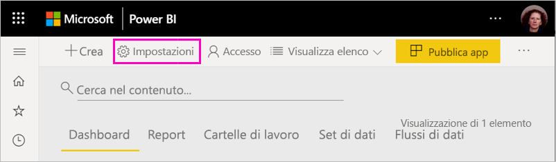

2. In **Avanzate** l'**elenco contatti** dell'area di lavoro viene configurato come gruppo di Office 365 da cui è stata aggiornata l'area di lavoro. È possibile aggiungere altri utenti o gruppi all'elenco contatti o scegliere gli amministratori dell'area di lavoro.

    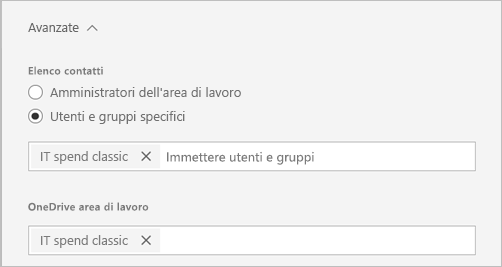

### OneDrive nell'area di lavoro 

Dopo l'aggiornamento, il servizio **OneDrive** nell'area di lavoro è connesso alla raccolta documenti di SharePoint del gruppo di Office 365. Questa raccolta documenti viene visualizzata come opzione **OneDrive** nell'esperienza **Scarica i dati > File**. Tenere presente che non tutti gli utenti dell'area di lavoro possono avere l'autorizzazione per la raccolta documenti, se non sono inclusi nel gruppo di Office 365.

## Pacchetti di contenuto durante l'aggiornamento

La nuova esperienza delle aree di lavoro non supporta i pacchetti di contenuto. Usare invece le app e i set di dati condivisi per distribuire il contenuto nell'area di lavoro. Prima di eseguire l'aggiornamento, è consigliabile rimuovere dall'area di lavoro i pacchetti di contenuto pubblicati o installati. Tuttavia, se quando si esegue l'aggiornamento sono presenti pacchetti di contenuto pubblicati o installati, il processo di aggiornamento tenterà di preservarne il contenuto, come descritto di seguito.  Dopo l'aggiornamento non è possibile ripristinare il pacchetto di contenuto o l'associazione del contenuto al pacchetto.

### Pacchetti di contenuto pubblicati

Durante l'aggiornamento, i pacchetti di contenuto pubblicati dall'area di lavoro vengono rimossi. Dopo l'aggiornamento non sarà possibile pubblicarli o aggiornarli, anche se si ripristina l'area di lavoro classica. Se il pacchetto di contenuto è stato installato in aree di lavoro da altri utenti, dopo l'aggiornamento questi utenti visualizzeranno una copia del pacchetto di contenuto nelle proprie aree di lavoro. Per informazioni dettagliate, vedere la sezione **Pacchetti di contenuto installati**.

### Pacchetti di contenuto installati

Quando si aggiorna l'area di lavoro o si aggiorna l'area di lavoro da cui viene pubblicato il pacchetto di contenuto, ai pacchetti di contenuto installati vengono apportate modifiche importanti. Dopo l'aggiornamento, l'area di lavoro contiene una copia del contenuto del pacchetto. È connessa al set di dati originale nell'area di lavoro originale.

Le modifiche importanti sono comunque le seguenti:

- Il contenuto non viene più aggiornato se viene aggiornato il pacchetto.
- Gli URL e gli identificatori di elemento cambiano e richiedono i segnalibri o i collegamenti condivisi con altri utenti per essere aggiornati.
- Tutte le personalizzazioni dell'utente nel pacchetto di contenuto originale dall'area di lavoro vengono perse. Le personalizzazioni includono sottoscrizioni, avvisi, segnalibri personali, filtri permanenti e preferiti.
- I nuovi utenti non possono accedere ai set di dati che erano presenti nel pacchetto di contenuto. È necessario collaborare con il proprietario del set di dati per assicurarsi che gli utenti dell'area di lavoro abbiano accesso ai dati.

## Ripristinare un'area di lavoro classica

L'esperienza di aggiornamento consente anche di ripristinare un'area di lavoro classica per 30 giorni dopo aver eseguito l'aggiornamento. Questa funzionalità consente di ripristinare l'associazione del contenuto dell'area di lavoro con il gruppo di Office 365 originale e può essere usata nel caso in cui l'organizzazione riscontri problemi importanti con la nuova esperienza delle aree di lavoro. Esistono tuttavia limitazioni. Per prima cosa, leggere [Considerazioni per il ripristino della versione classica](#considerations-for-switching-back-to-classic) in questo articolo.

Per ripristinare la versione classica, è necessario essere proprietario del gruppo di Office 365 a cui era associata l'area di lavoro prima dell'aggiornamento. Attenersi a questa procedura.

1. Nell'elenco del contenuto dell'area di lavoro selezionare **Altre opzioni** ( **…** )  > **Impostazioni area di lavoro**.

    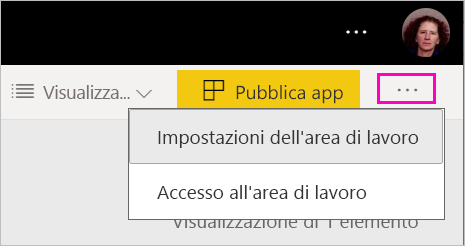

1. Espandere **Avanzate** e selezionare **Torna alla modalità classica**. Se questa opzione non è disponibile, vedere [Considerazioni per il ripristino della versione classica](#considerations-for-switching-back-to-classic) in questo articolo.

    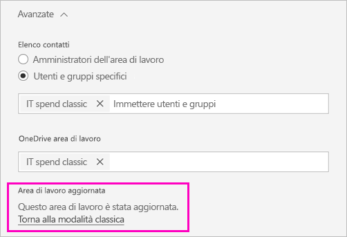

1. Quando si è pronti, selezionare la casella **Sono pronto per ripristinare la versione classica** e selezionare **Passa alla modalità classica**. È possibile che in questa finestra di dialogo vengano visualizzati avvisi o blocchi. Se si verificano questi problemi, leggere [Considerazioni per il ripristino](#considerations-for-switching-back-to-classic) in questo articolo.

    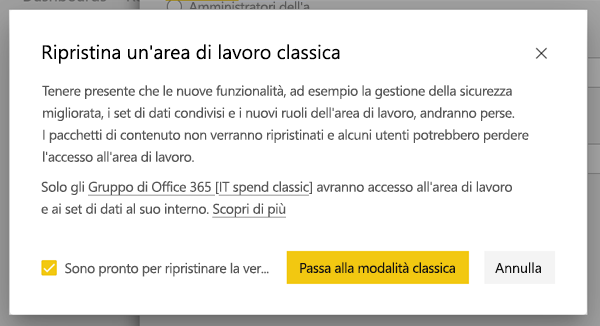

1. Dopo aver completato il ripristino, viene visualizzata una finestra di dialogo di conferma.

    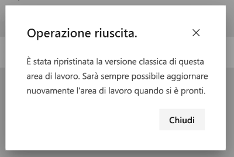

### Considerazioni per il ripristino della versione classica

Non è possibile ripristinare la versione classica, se viene soddisfatta una delle affermazioni seguenti sull'area di lavoro:

- Il gruppo di Office 365 è stato eliminato.
- Sono trascorsi più di 30 giorni dall'aggiornamento.
- I set di dati dell'area di lavoro vengono usati da report o dashboard in altre aree di lavoro. Come è potuto succedere? Può essere che sia stato pubblicato un pacchetto di contenuto dall'area di lavoro prima dell'aggiornamento e che un utente lo abbia installato in un'altra area di lavoro. Subito dopo l'aggiornamento, i set di dati vengono usati dai report e dai dashboard in tale pacchetto di contenuto.
- L'area di lavoro fa parte di una pipeline di gestione del ciclo di vita dell'applicazione.
- L'area di lavoro viene usata per app modello.
- L'area di lavoro usa la funzionalità per modelli di grandi dimensioni.
- L'area di lavoro usa la nuova funzionalità per metriche di utilizzo.

Quando si torna a un'area di lavoro classica, non si ripristina una copia esatta dell'area di lavoro originale. Le modifiche sono le seguenti:

- Le autorizzazioni per l'area di lavoro vengono impostate dal gruppo di Office 365 a cui era originariamente connessa l'area di lavoro aggiornata.
  - Tutti gli amministratori del gruppo di Office 365 diventano amministratori dell'area di lavoro classica.
  - Tutti i membri del gruppo di Office 365 diventano membri dell'area di lavoro classica. Se l'area di lavoro classica è stata impostata su **Members can only read Power BI content** (I membri possono solo leggere il contenuto di Power BI), questa impostata viene ripristinata.
  - Tutti gli utenti o i gruppi di utenti aggiunti all'area di lavoro dopo il completamento dell'aggiornamento (all'esterno del gruppo di Office 365) perdono l'accesso all'area di lavoro. Aggiungerli al gruppo di Office 365 per concedere loro l'accesso. Si noti che i gruppi di Office 365 non consentono l'annidamento dei gruppi di sicurezza o di distribuzione nell'appartenenza.
  - Gli utenti che hanno ricevuto l'accesso all'app per l'area di lavoro continuano ad accedere all'app.
  - Gli utenti che hanno ricevuto l'accesso agli elementi nell'area di lavoro tramite condivisione continuano ad accedere agli elementi.
- I pacchetti di contenuto pubblicati dall'area di lavoro classica prima dell'aggiornamento non vengono ripristinati.
- I pacchetti di contenuto installati nell'area di lavoro classica prima dell'aggiornamento non vengono ripristinati.
- Le sottoscrizioni create dagli utenti nell'area di lavoro dopo l'aggiornamento vengono rimosse. Le sottoscrizioni esistenti prima dell'aggiornamento continuano a funzionare come previsto.
- Gli avvisi sui dati non vengono conservati e vengono rimossi.
- Se l'area di lavoro è stata rinominata dopo l'aggiornamento, il nome dell'area di lavoro viene ripristinato in modo che corrisponda al nome del gruppo di Office 365.
- Le operazioni in corso, ad esempio gli aggiornamenti, non sono interessate dall'aggiornamento dell'area di lavoro.

## Gestire la migrazione alle nuove aree di lavoro per il tenant 

Alcune organizzazioni vogliono spostare molte o tutte le aree di lavoro nella nuova esperienza delle aree di lavoro. Lo strumento di aggiornamento dell'area di lavoro consente principalmente agli amministratori di eseguire l'aggiornamento dell'area di lavoro. Le organizzazioni che vogliono gestire questo tipo di processo possono seguire questa procedura.

1. L'elenco delle aree di lavoro nel portale di amministrazione di Power BI e l'API corrispondente offrono un elenco di tutte le aree di lavoro in Power BI. Le aree di lavoro classiche vengono visualizzate come Gruppo nell'elenco.
2. Collaborare con i singoli proprietari del gruppo di Office 365 o con l'amministratore di Office 365 per aggiornare le aree di lavoro. Se si vuole aggiornare l'area di lavoro, è necessario diventare proprietario del gruppo.

La funzionalità di aggiornamento dell'area di lavoro non offre gli strumenti per l'aggiornamento in blocco o l'aggiornamento a livello di codice. I nuovi gruppi di Office 365 creati nell'organizzazione continueranno a essere visualizzati in Power BI. 
   
   
## Problemi noti

Possono verificarsi diversi problemi noti:
- Dopo l'aggiornamento, può essere visualizzata la finestra di dialogo di avviso "Non è possibile caricare il modello". Questo messaggio viene visualizzato erroneamente e può essere ignorato. 
- Dopo l'aggiornamento, i nomi di alcune aree di lavoro sono diversi. Quando si verifica questa situazione, viene ripristinato un nome precedente dell'area di lavoro o il nome dell'area di lavoro diventa vuoto. Per risolvere questo problema, rinominare l'area di lavoro con il nome desiderato.
- Dopo l'aggiornamento di un'area di lavoro in cui è installato un pacchetto di contenuto, è possibile che nell'area di lavoro vengano visualizzati altri dashboard che non erano visibili prima dell'aggiornamento. Questo problema si verifica in alcuni casi se il pacchetto di contenuto non è stato aggiornato di recente. È possibile rimuovere senza problemi questi dashboard.

## Passaggi successivi
* [Creare le nuove aree di lavoro in Power BI](../service-create-the-new-workspaces.md)
* [Creare le aree di lavoro classiche](../service-create-workspaces.md)
* Domande? [Provare a rivolgersi alla community di Power BI](https://community.powerbi.com/)
