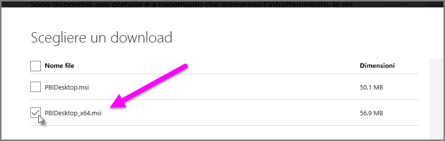

# Risolvere problemi di importazione dei file di Access e XLS in Power BI Desktop
In **Power BI Desktop**, sia i **database di Access** sia le prime versioni delle **cartelle di lavoro di Excel** (file XLS di tipo Excel 2007-2003) usano il *motore di database di Access*. Esistono tre situazioni comuni che possono impedire il corretto funzionamento del motore di database di Access:

### Situazione 1: nessun motore di database di Access installato
Quando il messaggio di errore di Power BI Desktop indica che il motore di database di Access non è installato, è necessario installare la versione del motore di database di Access, a 32 bit o a 64 bit, che corrisponde alla propria versione di Power BI Desktop. È possibile installare il motore di database di Access da [questo percorso](http://www.microsoft.com/en-us/download/details.aspx?id=13255).

>[!NOTE]
>Se la versione di bit del motore di database di Access installata è diversa dalla versione di bit dell'installazione di Microsoft Office, le applicazioni di Office non riusciranno a usare il motore di database di Access.

### Situazione 2: la versione di bit del motore di database di Access (32 bit o 64 bit) è diversa dalla versione di bit di Power BI Desktop
Spesso questa situazione si verifica quando la versione installata di Microsoft Office è a 32 bit e la versione di Power BI Desktop installata è a 64 bit. Può verificarsi anche il contrario e la mancata corrispondenza di versione di bit si verifica in entrambi i casi (se si usa una sottoscrizione di Office 365, vedere **Situazione 3** per un problema e una risoluzione diversi). Una delle seguenti soluzioni può risolvere l'errore di mancata corrispondenza di versione di bit:

1. Modificare la versione di Power BI Desktop in modo che corrisponda alla versione di bit dell'installazione di Microsoft Office. Per modificare la versione di bit di Power BI Desktop, disinstallare Power BI Desktop e quindi installare la versione di Power BI Desktop corrispondente all'installazione di Office. Per selezionare una versione di Power BI Desktop, nella pagina di download per desktop selezionare **Opzioni di download avanzate**.
   
   
   
   Nella pagina di download che viene visualizzata, scegliere la lingua e quindi selezionare il pulsante **Scarica** . Nella schermata che viene visualizzata selezionare la casella di controllo accanto a PBIDesktop.msi per la versione a 32 bit o accanto a PBIDesktop_x64.msi per la versione a 64 bit. Nella schermata seguente, viene selezionata la versione a 64 bit.
   
   
   
   >[!NOTE]
   >Quando si usa la versione a 32 bit di Power BI Desktop, durante la creazione di modelli di dati molto grandi si potrebbero riscontrare problemi di memoria esaurita.
2. Modificare la versione di Microsoft Office in modo che corrisponda alla versione di bit dell'installazione di Power BI Desktop. Per modificare la versione di bit di Microsoft Office, disinstallare Office e quindi installare la versione di Office che corrisponde all'installazione di Power BI Desktop.
3. Se l'errore si è verificato quando si prova ad aprire un file XLS (cartella di lavoro di Excel 2007-2003), è possibile evitare di usare il motore di database di Access aprendo il file XLS in Excel e salvandolo come file con estensione XLSX.
4. Se le tre soluzioni precedenti non sono applicabili, è possibile installare entrambe le versioni del motore di database di Access, ma si tratta di una soluzione *non* consigliata. L'installazione di entrambe le versioni risolverà il problema per Power Query per Excel e Power BI Desktop, ma verranno introdotti errori e problemi per qualsiasi applicazione che usi automaticamente (per impostazione predefinita) la versione di bit del motore di database di Access che è stata installata per prima. Per installare entrambe le versioni di bit del motore di database di Access, [scaricare](http://www.microsoft.com/en-us/download/details.aspx?id=13255) entrambe le versioni, quindi eseguire ognuna di esse usando l'opzione */passive*. ad esempio:
   
       c:\users\joe\downloads\AccessDatabaseEngine.exe /passive
   
       c:\users\joe\downloads\AccessDatabaseEngine_x64.exe /passive

### Situazione 3: Problemi nell'uso di file Access o XLS con una sottoscrizione di Office 365
Se si usa una sottoscrizione di Office 365, che sia **Office 2013** o **Office 2016**, il provider del motore di database di Access è registrato in un percorso del Registro di sistema virtuale accessibile *solo* ai processi di Office. Di conseguenza, il motore Mashup (che è responsabile dell'esecuzione di Excel e Power BI Desktop non Office 365), che non è un processo di Office, non potrà usare il provider del motore di database di Access.

Per risolvere questo problema, è possibile scaricare e installare il motore di database di Access ridistribuibile che corrisponde alla versione di bit dell'installazione di Power BI Desktop (vedere le sezioni precedenti per altre informazioni sulle versioni di bit).

Collegamento per il download: [Motore di database di Access](http://www.microsoft.com/en-us/download/details.aspx?id=13255).

### Altre situazioni che causano problemi di importazione
Microsoft si impegna a coprire tutti i problemi possibili che si verificano con i file XLS o di Access. Se si verifica un problema che non viene trattato in questo articolo, inviare una domanda riguardante il problema al [supporto di Power BI](https://powerbi.microsoft.com/support/). Vengono esaminati regolarmente i problemi che potrebbero influire su molti clienti, che saranno poi inclusi negli articoli.

