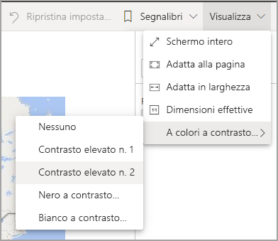
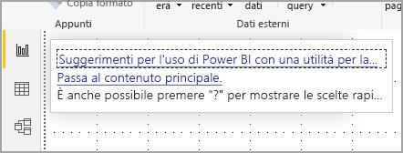
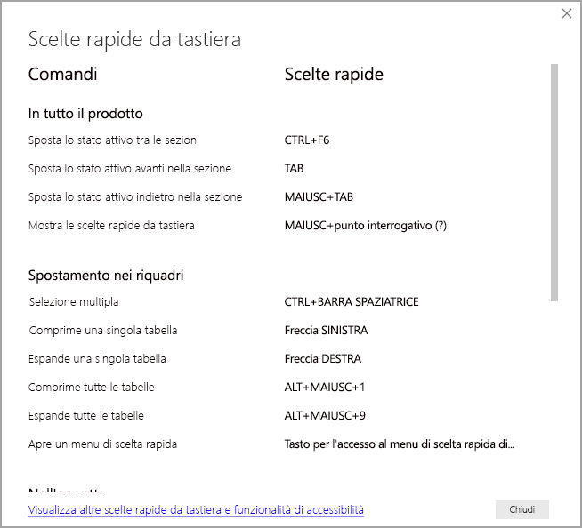

# Utilizzo di report in Power BI con gli strumenti di accessibilità
Power BI ha diverse funzionalità predefinite che consentono agli utenti con particolari esigenze di interagire più facilmente con i report di Power BI. Grazie a questi strumenti gli utenti possono ottenere da un report le stesse informazioni ottenute da chi non usa l'assistive technology.

Durante la lettura di questo articolo si incontreranno due termini importanti:

* Lo **stato attivo** è il punto della pagina in cui si trova il mouse. Lo stato attivo è in genere indicato da un bordo blu che circonda un oggetto.
* Il **canvas** è l'area della pagina del report.

Le sezioni seguenti descrivono gli strumenti di accessibilità disponibili per l'utilizzo dei report di Power BI.

## Navigazione da tastiera

Quando si avvia Power BI Desktop o il servizio Power BI, non appena si preme **TAB**, viene visualizzata una descrizione comando nell'angolo superiore destro. Il collegamento intitolato **Suggerimenti per l'uso di Power BI con una utilità per la lettura dello schermo** indirizza a questo articolo, fornendo informazioni su come utilizzare un report con gli strumenti di accessibilità. Facendo clic sul collegamento **Passa al contenuto principale**, si accede al canvas del report.

Premendo **?** si apre una finestra di dialogo con i tasti di scelta rapida usati più di frequente in Power BI. Per visualizzare un elenco completo dei tasti di scelta rapida disponibili in Power BI, è possibile passare al collegamento nella parte inferiore della finestra di dialogo, che consente di accedere alla documentazione di Power BI sui [tasti di scelta rapida](desktop-accessibility-keyboard-shortcuts.md).

È possibile spostare lo stato attivo tra le schede della pagina del report o gli oggetti in una determinata pagina del report usando **CTRL+F6**. Quando una pagina del report caricata è attiva, usare **TAB** per spostare lo stato attivo su ogni oggetto presente nella pagina, ad esempio tutte le caselle di testo, le immagini, le forme e i grafici. 

In generale, l'uso di **INVIO** per la selezione o l'immissione e l'uso di **ESC** per l'uscita sono comandi comuni in Power BI.

### Navigazione da tastiera per gli oggetti visivi

Molti autori di report di Power BI creano report contenenti grandi quantità di dati. Quando ci si sposta all'interno di un oggetto visivo, può essere fastidioso passare da un elemento all'altro premendo TAB. La navigazione da tastiera per gli oggetti visivi è stata progettata come una gerarchia, con tre livelli. Questi tre livelli sono descritti nei paragrafi seguenti.

Per esplorare il primo livello, quando si passa a un oggetto visivo premere **CTRL + freccia DESTRA** per accedere a tale oggetto visivo. Dopo l'accesso all'oggetto visivo, è possibile premere **TAB** per scorrere le aree principali dell'oggetto visivo. Le aree principali che è possibile scorrere sono l'area del tracciato dati, le categorie dell'asse (se applicabile all'oggetto visivo) e la legenda (se l'oggetto visivo ne ha una).

L'immagine seguente mostra come un utente scorre il primo livello di un oggetto visivo:

Il secondo livello della gerarchia consente di accedere a una delle aree principali (area del tracciato dati, categorie dell'asse x, legenda) dell'oggetto visivo. Quando si utilizza un report, è possibile passare a una di queste aree principali e scorrere i punti dati o le categorie in tale sezione dell'oggetto visivo. Dopo aver scelto l'area che si vuole esplorare ulteriormente, è possibile premere **INVIO** per scorrere tale area specifica.

Per selezionare tutti i punti dati in una serie, passare alla legenda e premere **INVIO**. Nella legenda è possibile premere **TAB** per spostarsi tra le diverse categorie della legenda. Premere **INVIO** per selezionare una serie specifica.

Per selezionare punti dati specifici, passare all'area del tracciato dati e premere **INVIO**. Nell'area del tracciato dati è possibile premere **TAB** per spostarsi tra i punti dati. Se l'oggetto visivo ha più serie, è possibile premere **freccia SU** o **freccia GIÙ** per passare ai punti dati di una serie diversa.

Per selezionare tutti i punti dati in un asse di categorie, passare alle etichette dell'asse e premere **INVIO**. Nelle etichette dell'asse è possibile premere **TAB** per spostarsi tra i nomi delle etichette. Premere **INVIO** per selezionare un nome di etichetta.

Se si è passati a un livello, è possibile premere **ESC** per uscirne. L'immagine seguente mostra come un utente può entrare e uscire dai livelli di un oggetto visivo e selezionare i punti dati e le etichette delle categorie dell'asse x, passare a una serie diversa e selezionare tutti i punti dati in una serie.

Se non si riesce a passare a un oggetto o a un oggetto visivo usando la tastiera, è possibile che l'autore del report abbia deciso di nascondere tale oggetto dall'ordine di tabulazione. Gli autori dei report in genere nascondono gli oggetti decorativi dall'ordine di tabulazione. Se non è possibile spostarsi in modo logico all'interno di un report premendo TAB, è consigliabile contattare l'autore del report. Gli autori dei report possono impostare l'ordine di tabulazione per gli oggetti e gli oggetti visivi.

### Navigazione da tastiera per i filtri dei dati

Anche i filtri dei dati hanno funzionalità di accessibilità predefinite. Quando si seleziona un filtro dei dati, per modificarne il valore usare **CTRL+freccia DESTRA** per spostarsi tra i vari controlli all'interno del filtro dei dati. Ad esempio, quando si preme inizialmente **CTRL+freccia DESTRA**, lo stato attivo è sulla gomma. Quindi, premendo la **BARRA SPAZIATRICE** si esegue un'azione equivalente alla selezione del pulsante della gomma che comporta la cancellazione di tutti i valori presenti nel filtro dei dati.

È possibile spostarsi tra i controlli in un filtro dei dati premendo **TAB**. Premendo **TAB** quando si è sulla gomma, si passa al pulsante a discesa. Con un altro **TAB** si passa al primo valore del filtro dei dati (se sono presenti più valori per il filtro dei dati, ad esempio un intervallo).

### Passaggio a un'altra pagina

Quando le schede della pagina del report sono attive, usare **TAB** o i tasti di **direzione** per spostare lo stato attivo da una pagina del report a quella successiva. L'utilità per la lettura dello schermo legge il titolo della pagina del report e indica se è attualmente selezionato. Per caricare la pagina del report attualmente attiva, usare **INVIO** o la **BARRA SPAZIATRICE**.

### Accesso all'intestazione dell'oggetto visivo
Durante lo spostamento tra gli oggetti visivi, è possibile premere **ALT+MAIUSC+F10** per spostare lo stato attivo sull'intestazione dell'oggetto visivo. Quest'ultima contiene diverse opzioni tra cui l'ordinamento, l'esportazione dei dati su cui si basa il grafico e la modalità messa a fuoco. Le icone visualizzate nell'intestazione dell'oggetto visivo dipendono dalle opzioni che l'autore del report ha deciso di mostrare.

## Utilità per la lettura dello schermo

Quando si visualizza un report, è meglio lasciare disattivata la modalità di analisi. Power BI deve essere considerato come un'applicazione più che come un documento e, perché sia possibile esplorarlo più facilmente, è stato configurato con la navigazione personalizzata. Quando si usa un'utilità per la lettura dello schermo con Power BI Desktop, è consigliabile verificare che sia aperta prima di aprire Power BI Desktop.

Quando si passa da un oggetto all'altro, l'utilità per la lettura dello schermo legge il tipo di oggetto e il titolo dell'oggetto (se presente). L'utilità per la lettura dello schermo legge anche una descrizione dell'oggetto (testo alternativo), se è stata inclusa dall'autore del report.

### Mostra i dati
È possibile premere **ALT+MAIUSC+F11** per visualizzare una versione accessibile della finestra **Mostra i dati**. Questa finestra consente di esplorare i dati usati nell'oggetto visivo in una tabella HTML, usando le stesse scelte rapide da tastiera che si usano normalmente con l'utilità per la lettura dello schermo.

La funzionalità **Mostra i dati** è una tabella HTML accessibile a un'utilità per la lettura dello schermo solo tramite questa scelta rapida da tastiera. Se si apre **Mostra i dati** dall'opzione nell'intestazione dell'oggetto visivo, viene visualizzata una tabella *non* compatibile con l'utilità per la lettura dello schermo.  Quando si usa **Mostra i dati** tramite le scelte rapide da tastiera, attivare la modalità di analisi per poter usare tutti i tasti di scelta rapida offerti dall'utilità per la lettura dello schermo.

Per uscire dalla vista **Mostra i dati** e tornare a un report, premere **ESC**.

## Modalità a contrasto elevato

Il servizio Power BI prova a rilevare le impostazioni di contrasto elevato selezionate per Windows. L'efficacia e l'accuratezza del rilevamento dipendono dal browser che visualizza il servizio Power BI. Per impostare il tema manualmente nel servizio Power BI, è possibile selezionare **Visualizza > A colori a contrasto elevato** e quindi selezionare il tema da applicare al report.

## Passaggi successivi

Gli articoli relativi all'accessibilità in Power BI sono i seguenti:

* [Panoramica dell'accessibilità in Power BI](desktop-accessibility-overview.md) 
* [Creazione di report di Power BI accessibili](desktop-accessibility-creating-reports.md) 
* [Creazione di report di Power BI con gli strumenti di accessibilità](desktop-accessibility-creating-tools.md)
* [Scelte rapide da tastiera per l'accessibilità per i report di Power BI](desktop-accessibility-keyboard-shortcuts.md)
* [Elenco di controllo dell'accessibilità dei report](desktop-accessibility-creating-reports.md#report-accessibility-checklist)

