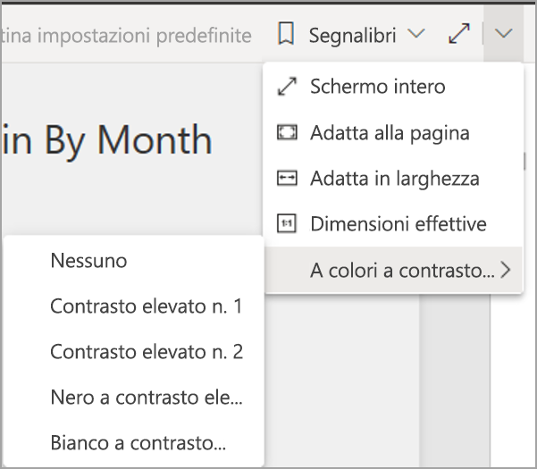
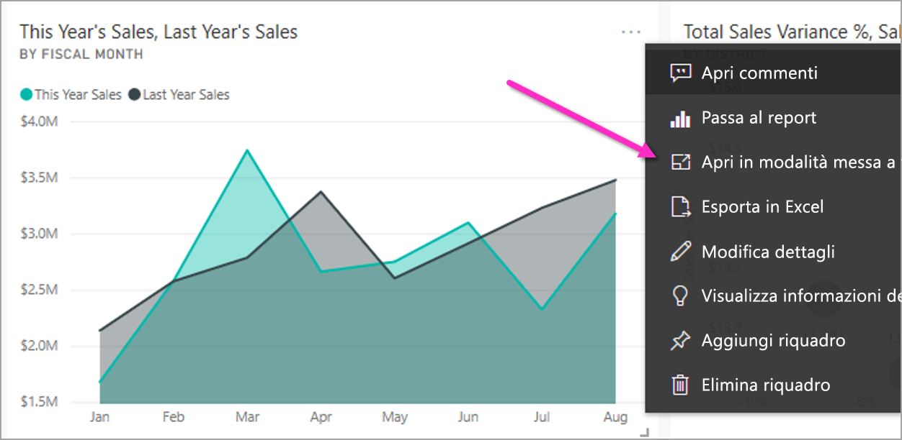
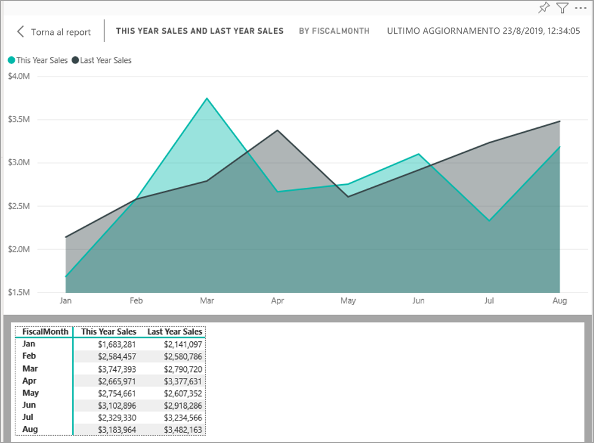
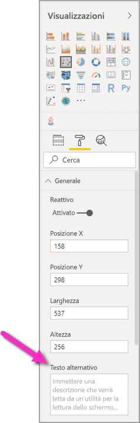
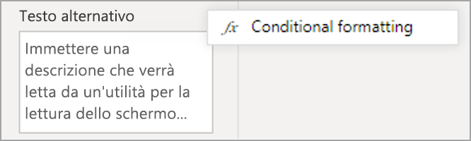
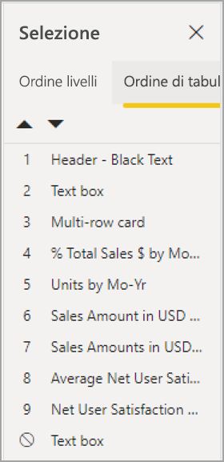
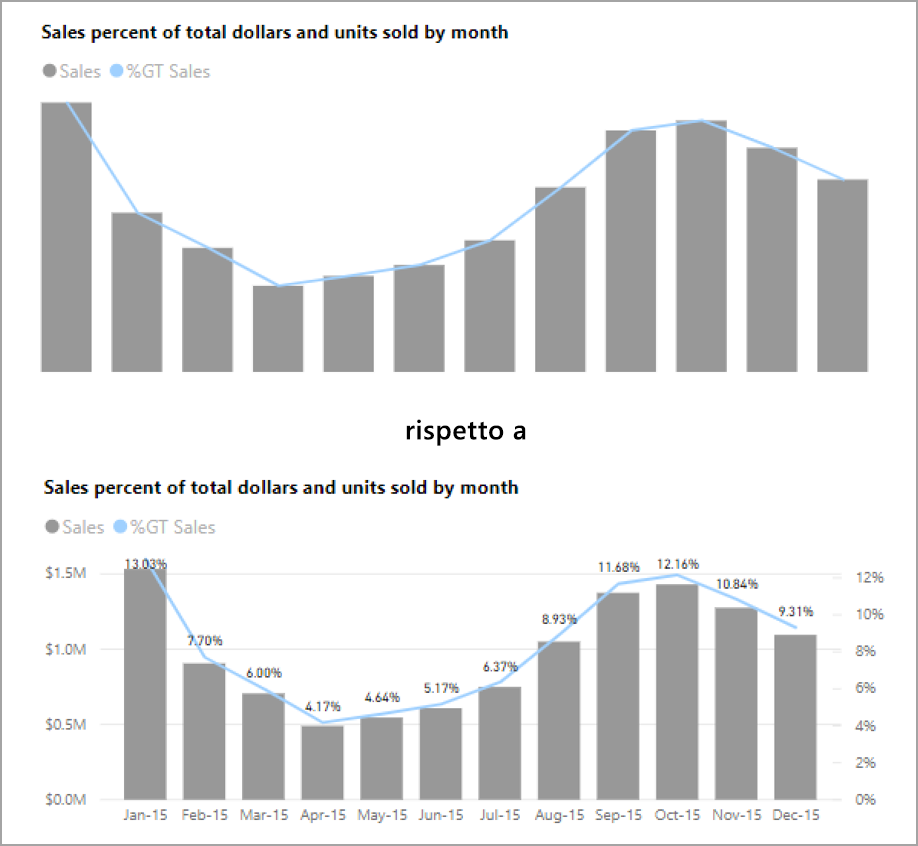
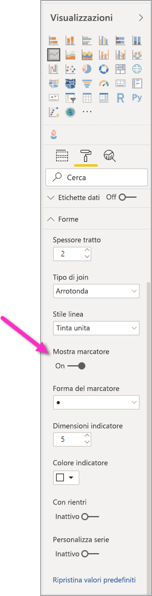
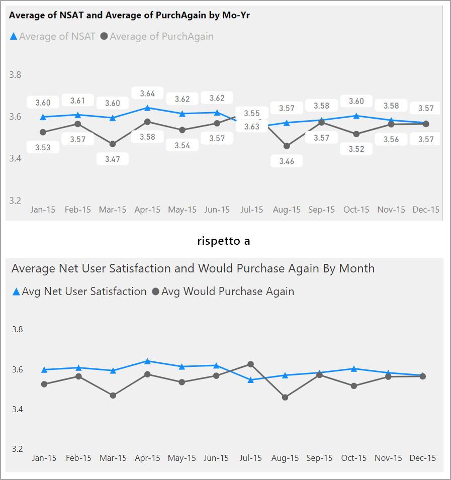
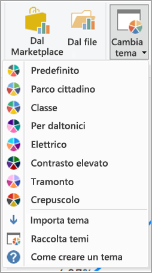

# Progettare report di Power BI per l'accessibilità
È possibile progettare e creare report accattivanti senza compromettere l'accessibilità. Ogni volta che si compila un report, indipendentemente dal tipo di destinatari, è consigliabile creare i report in modo che siano utilizzabili dal maggior numero di persone possibile, senza che sia necessario adattarli a una particolare progettazione.

Questo articolo descrive le funzionalità di accessibilità e gli strumenti per la creazione di report accessibili in Power BI.

In genere, quando si usa Power BI con un'utilità per la lettura dello schermo, è consigliabile disattivare la modalità di analisi o la modalità browse.

Per migliorare il processo di creazione di report con le utilità per la lettura dello schermo, è disponibile un menu di scelta rapida. Il menu consente di spostare i campi presenti nell'area verso l'alto o verso il basso nell'elenco **Campi**. Il menu consente anche di spostare il campo in altre aree, ad esempio **Legenda** o **Valore** oppure altri.

## Tipi di funzionalità di accessibilità

Power BI offre le funzionalità per creare report accessibili, ma spetta all'autore del report incorporarle nei report. In questo articolo sono descritte le tre categorie di funzionalità di accessibilità disponibili:

* Funzionalità di accessibilità predefinite (nessuna configurazione necessaria)
* Funzionalità di accessibilità predefinite (configurazione necessaria)
* Altri suggerimenti e considerazioni

Ognuna di queste categorie viene illustrata nelle sezioni riportate di seguito.

## Funzionalità di accessibilità predefinite

Power BI ha funzionalità di accessibilità incorporate nel prodotto, che non richiedono alcuna configurazione da parte dell'autore del report. Queste funzionalità sono le seguenti:

* Navigazione da tastiera
* Compatibilità dell'utilità per la lettura dello schermo
* Visualizzazione a colori a contrasto elevato
* Modalità messa a fuoco
* Tabella Mostra i dati

Sono disponibili anche funzionalità utili per l'utilizzo dei report. Gli articoli che descrivono tali funzionalità sono disponibili nella sezione [Passaggi successivi](#next-steps), alla fine di questo articolo.

Queste funzionalità di accessibilità predefinite verranno ora analizzate singolarmente. 

### Navigazione da tastiera

L'autore di un report non deve preoccuparsi che gli utenti possano utilizzare la tastiera per spostarsi in un report. Tutti gli oggetti visivi di Power BI possono essere esplorati tramite la tastiera e l'utente del report può esaminare i punti dati negli oggetti visivi, passare da una scheda della pagina all'altra e accedere alle funzionalità interattive, tra cui l'evidenziazione incrociata, l'applicazione di filtri e il sezionamento.

Quando un utente del report si sposta in un report, compare la messa a fuoco per indicare la posizione dell'utente nel report. A seconda del browser in uso, è possibile che la modalità messa a fuoco venga visualizzata in modo diverso.

Per accedere ai tasti di scelta rapida usati più di frequente, è possibile premere *?* per visualizzare una finestra di dialogo dei tasti di scelta rapida. Per altre informazioni, vedere gli articoli relativi alle esperienze di utilizzo accessibili e ai tasti di scelta rapida nella sezione [Passaggi successivi](#next-steps) alla fine di questo articolo.

### Compatibilità dell'utilità per la lettura dello schermo

In generale, ogni oggetto in Power BI con navigazione da tastiera è compatibile anche per le utilità per la lettura dello schermo. Quando un utente di un report passa a un oggetto visivo, l'utilità per la lettura dello schermo leggerà il titolo, il tipo di oggetto visivo e qualsiasi testo alternativo, se è stato impostato.

### Visualizzazione a colori a contrasto elevato

Power BI ha il supporto del contrasto elevato per i report. Se si usa una modalità a contrasto elevato in Windows, Power BI Desktop rileva automaticamente il tema a contrasto elevato usato in Windows e applica queste impostazioni ai report. Questi colori a contrasto elevato vengono usati anche nel report pubblicato nel servizio Power BI o altrove.

Anche il servizio Power BI tenta di rilevare le impostazioni di contrasto elevato selezionate per Windows, ma l'efficacia e l'accuratezza di questo tipo di rilevamento dipende dal browser in uso per il servizio Power BI. Per impostare il tema manualmente nel servizio Power BI, nell'angolo in alto a destra è possibile selezionare **V > A colori a contrasto elevato** e quindi selezionare il tema da applicare al report.

### Modalità messa a fuoco
Se un utente di un report osserva un oggetto visivo in un dashboard, può espandere l'oggetto visivo in modo da riempire più spazio sullo schermo passando al menu di scelta rapida dell'oggetto visivo e selezionando **Apri in modalità messa a fuoco**.

### Tabella Mostra i dati
Gli utenti dei report possono anche visualizzare i dati in un oggetto visivo in formato tabulare premendo **ALT+MAIUSC+F11**. Questa tabella è simile a quella visualizzata scegliendo **Mostra dati** dal menu di scelta rapida dell'oggetto visivo, ma è più semplice da leggere per l'utilità per la lettura dello schermo.

## Funzionalità di accessibilità predefinite che richiedono una configurazione

Power BI ha funzionalità di accessibilità incorporate nel prodotto, che richiedono una configurazione da parte dell'autore del report.  Queste funzionalità includono:

* Testo alternativo
* Ordine di tabulazione
* Titoli ed etichette
* Marcatori
* Temi dei report

## Testo alternativo

Il testo alternativo (descrizioni testuali alternative) viene usato per descrivere agli utenti dell'utilità per la lettura dello schermo l'aspetto e la funzione di oggetti visivi e immagini nella pagina del report. Gli autori dei report dovrebbero aggiungere il testo alternativo a ogni oggetto che comunica informazioni importanti su un report. La presenza del testo alternativo garantisce che gli utenti del report comprendano il messaggio che l'utente vuole comunicare con un oggetto visivo, anche se non possono vedere l'oggetto visivo, l'immagine, la forma o la casella di testo. È possibile specificare un testo alternativo per qualsiasi oggetto in un report di Power BI Desktop. A tale scopo, selezionare l'oggetto, ad esempio l'oggetto visivo, la forma e così via, e nel riquadro **Visualizzazioni** selezionare la sezione **Formato**, espandere **Generale**, quindi scorrere fino alla fine e immettere il testo nella casella **Testo alternativo**. La casella di testo **Testo alternativo** ha un limite di 250 caratteri.

Il testo alternativo deve includere le informazioni sui dati analitici che l'utente del report deve poter ottenere da un oggetto visivo. Poiché un'utilità per la lettura dello schermo legge il titolo e il tipo di un oggetto visivo, è sufficiente immettere una descrizione. Un esempio di testo alternativo per l'oggetto visivo seguente potrebbe essere: *Soddisfazione netta degli utenti in base al colore del prodotto venduto, ulteriormente suddivisa in base alla classe del prodotto*.

Tenere presente che l'inserimento del callout di dati analitici o di punti dati specifici potrebbe non essere la scelta migliore, perché i dati in Power BI sono dinamici. Per usare il testo alternativo dinamico, vedere la sezione successiva che descrive la formattazione condizionale per il testo alternativo.

### Formattazione condizionale per il testo alternativo

Una caratteristica di Power BI davvero interessante è che i dati sono dinamici. È possibile usare le misure DAX e la formattazione condizionale per creare un testo alternativo dinamico. Le utilità per la lettura dello schermo riescono quindi a richiamare i valori specifici dei dati visualizzati da un utente di un report.

### Ordine di tabulazione
L'impostazione dell'ordine di tabulazione consente agli utenti della tastiera di esplorare il report nello stesso ordine in cui gli utenti elaborano visivamente gli oggetti visivi del report. Se si includono forme decorative e immagini nel report, è consigliabile rimuoverle dall'ordine di tabulazione. 

Per impostare l'ordine di tabulazione, selezionare la scheda **Visualizza** nella barra multifunzione e selezionare il pulsante **Riquadro di selezione** per visualizzare il riquadro di selezione.

Nel **riquadro Selezione** selezionando **Ordine di tabulazione** viene visualizzato l'ordine di tabulazione corrente per il report. È possibile selezionare un oggetto, quindi usare i pulsanti freccia verso l'alto e verso il basso per spostare l'oggetto nella gerarchia oppure è possibile selezionare un oggetto con il mouse e trascinarlo nella posizione desiderata nell'elenco. Facendo clic sul numero accanto a un oggetto, l'oggetto viene nascosto dall'ordine di tabulazione.

### Titoli ed etichette
I titoli degli oggetti visivi e delle pagine dei report sono importanti funzionalità di accessibilità che consentono all'utente di orientarsi nel report. Evitare di usare acronimi o espressioni gergali nei titoli dei report. Se si condivide il report con un nuovo utente o con un utente esterno all'organizzazione, il significato dei termini o degli acronimi potrebbe non essere comprensibile. L'immagine seguente mostra un oggetto visivo con un acronimo nel titolo (a sinistra) e un titolo più chiaro per l'oggetto visivo a destra.

In di un oggetto visivo assicurarsi che tutti i titoli, le etichette degli assi, i valori della legenda e le etichette dati siano facili da leggere e da comprendere. Confrontare le immagini seguenti, in cui la prima immagine contiene pochi numeri o descrizioni dei dati, mentre la seconda ne contiene molti.

Con le etichette dati è anche possibile scegliere di attivare o disattivare le etichette per ogni serie nell'oggetto visivo o di posizionarle sopra o sotto una serie. Nonostante Power BI posizioni automaticamente le etichette dati sopra o sotto una riga, a volte il risultato non è molto chiaro. Nell'oggetto visivo seguente le etichette dati sono confuse e non facili da leggere.

Il posizionamento delle etichette dati sopra o sotto la serie può essere utile, soprattutto se si usa un grafico a linee con più linee. Con alcune modifiche, le etichette dati ora sono molto più chiare.

### Marcatori

È consigliabile evitare di usare il colore (inclusa la formattazione condizionale delle funzionalità) come unico modo per comunicare le informazioni. È invece possibile usare i marcatori per trasmettere serie diverse.

Per gli oggetti visivi Riga, Area e Casella combinata e per gli oggetti visivi Dispersione e Bolle, è possibile attivare i marcatori e usare una forma del marcatore diversa per ogni riga.

Per attivare i marcatori, selezionare la sezione Formato nel riquadro Visualizzazioni, espandere la sezione **Forme**, quindi scorrere verso il basso per trovare il tasto di attivazione e disattivazione **Mostra marcatori** e impostarlo su **Sì**, come illustrato nell'immagine seguente. 

È anche possibile usare **Personalizza serie** per selezionare il nome di ogni linea (o l'area, se si usa un grafico ad aree) dalla casella di riepilogo a discesa nella sezione Forme. Sotto l'elenco a discesa, è possibile regolare molti aspetti del marcatore usato per la riga selezionata, tra cui la forma, il colore e le dimensioni.

Anche se si consiglia agli autori dei report di attivare le etichette dati e i marcatori, se li si attiva tutti per ogni oggetto visivo, il report potrebbe risultare meno chiaro e meno accessibile. Nell'immagine seguente è possibile confrontare un oggetto visivo con le etichette dati e i marcatori attivi e una versione più comprensibile con le etichette dati disattivate.

Se si pensa che l'oggetto visivo o il report sia poco chiaro, verificarlo eseguendo uno [squint test](https://chrome.google.com/webstore/detail/the-squint-test/gppnipfbappicilfniaimcnagbpfflpg).  Se lo sguardo nota più le etichette dati che i punti dati, disattivare le etichette dati.

### Temi, contrasto e colori per daltonici

È consigliabile assicurarsi che il contrasto tra testo e colori di sfondo nei report sia sufficiente. Il criterio di superamento 1.4.3 di WCAG 2.1 stabilisce che il testo e il colore di sfondo devono avere un contrasto minimo di 4.5:1. Sono disponibili diversi strumenti, ad esempio [Color Contrast Analyzer](https://developer.paciellogroup.com/resources/contrastanalyser/), [WebAIM](https://webaim.org/resources/contrastchecker/) e [Accessible Colors](https://accessible-colors.com/), che possono essere usati per controllare i colori del report.

È anche necessario tenere presente che alcuni visualizzatori di report possono presentare carenze nella visione dei colori. Strumenti come [Coblis](https://www.color-blindness.com/coblis-color-blindness-simulator/) e [Vischeck](https://www.vischeck.com/vischeck/vischeckImage.php) simulano ciò che vedono i visualizzatori di report con carenze cromatiche diverse.  Usando meno colori o una tavolozza monocromatica nel report, si ridurrà il rischio di creare report non accessibili.

Per gli utenti con problemi di percezione dei colori è particolarmente difficile distinguere alcune combinazioni di colori, tra cui: 

* verde e rosso
* verde e marrone
* blu e viola
* verde e blu
* verde chiaro e giallo
* blu e grigio
* verde e grigio
* verde e nero

Evitare di usare questi colori nello stesso grafico o nella stessa pagina del report. Power BI include alcuni temi predefiniti che consentono di rendere il report più accessibile, ma è consigliabile controllare il report con alcuni degli strumenti aggiuntivi indicati in questo articolo.

## Suggerimenti e considerazioni
Questa sezione fornisce indicazioni, suggerimenti e considerazioni da tenere presenti quando si creano report che devono essere accessibili.

### Capire di quali informazioni hanno bisogno i destinatari

La creazione di un report è un processo iterativo. Prima di iniziare a inserire gli oggetti visivi nella pagina, rivolgersi ad alcuni utenti del report per comprendere meglio quali informazioni vogliono ottenere dal report e come vogliono visualizzarle.  

L'integrazione dell'accessibilità dovrebbe essere parte di questo processo. Si potrebbe scoprire che la propria idea non è quella che hanno in mente gli utenti del report. Dopo aver preparato una bozza iniziale del report, sottoporla a un utente del report e raccogliere altro feedback. La raccolta di feedback può aiutare l'autore di un report a evitare un numero elevato di richieste di modifiche da parte di utenti insoddisfatti in futuro.

### Fare in modo che il report sia semplice e coerente

Fare in modo che il report sia il più semplice possibile. Spesso si cerca di inserire troppi elementi in un singolo oggetto visivo. Suddividendoli invece in più oggetti visivi, spesso diventa più semplice e facile comprenderli. Si consiglia di usare più oggetti visivi se mostrano facet diversi dei dati e usano filtri o interazioni con gli oggetti visivi per creare un'esperienza ottimale. Allo stesso tempo, tenere al minimo il numero di oggetti visivi in una pagina. Evitare di inserire elementi ridondanti o di rendere la pagina disordinata. Non sono necessari due oggetti visivi per mostrare la stessa cosa. Gli utenti dei report potrebbero essere sopraffatti da tutte le informazioni derivanti da troppi oggetti visivi oppure potrebbero avere una soglia di attenzione limitata e distrarsi. Questo approccio rende più semplice usare il report, anche perché la presenza di un numero eccessivo di oggetti visivi in una pagina può rallentare le prestazioni del report.

Fare in modo che il report sia coerente usando lo stesso colore e stile del carattere per gli elementi visivi del report. Usare le stesse dimensioni del carattere per i titoli di tutti gli oggetti visivi, esattamente come per le etichette dati e i titoli degli assi. Se si usano i filtri dei dati in più pagine del report, inserirli nella stessa posizione in ogni pagina del report.

### Test per ipovisione

Un modo rapido per testare l'aspetto di un report per gli utenti ipovedenti consiste nel ridurre la luminosità dello schermo o del dispositivo mobile.  Sono disponibili componenti aggiuntivi dei browser che possono essere usati per eseguire uno squint test.

## Elenco di controllo dell'accessibilità dei report

Oltre agli strumenti e alle funzionalità di accessibilità, Power BI fornisce l'elenco di controllo seguente che è possibile usare per la creazione di report. Questo elenco di controllo consente di assicurarsi che i report siano accessibili e disponibili per la maggior parte dei destinatari, prima di pubblicarli. 

### Tutti gli oggetti visivi

* Verificare che il contrasto dei colori tra il testo dei titoli, delle etichette degli assi e delle etichette dati e lo sfondo sia almeno di 4.5:1.
* Evitare di trasmettere le informazioni solo tramite il colore. Usare il testo o le icone per integrare o sostituire il colore.
* Sostituire le espressioni gergali o gli acronimi non necessari.
* Assicurarsi che venga aggiunto un **testo alternativo** a tutti gli oggetti visivi non decorativi della pagina.
* Verificare che la pagina del report risulti chiara per gli utenti con problemi di percezione dei colori.

### Filtri dei dati
* Se nelle pagine del report è presente una raccolta di più filtri dei dati, assicurarsi che la progettazione sia coerente in tutte le pagine. Usare il più possibile lo stesso tipo di carattere, gli stessi colori e la stessa posizione nello spazio.

### Casella di testo
* Assicurarsi che il contrasto dei colori tra il tipo di carattere e lo sfondo sia almeno di 4.5:1.
* Assicurarsi di inserire i contenuti di testo nella casella **Testo alternativo** in modo che le utilità per la lettura dello schermo possano leggerli.

### Interazioni oggetti visivi
* Le informazioni chiave sono accessibili solo tramite un'interazione? In tal caso, ridisporre gli oggetti visivi in modo che siano pre-filtrati per rendere più evidente la conclusione più importante.
* Si usano i segnalibri per la navigazione? Provare a esplorare il report con una tastiera per assicurarsi che l'esperienza sia accettabile per gli utenti che usano solo la tastiera.

### Ordinamento
* L'ordinamento di ogni oggetto visivo nella pagina è quello desiderato? La tabella accessibile **Mostra dati** mostra i dati in base all'ordinamento impostato per l'oggetto visivo.

### Descrizioni comando
* Non usare le descrizioni comando per trasmettere informazioni importanti. Gli utenti con problemi di mobilità e gli utenti che non usano il mouse avranno difficoltà ad accedervi.
* Aggiungere le descrizioni comando ai grafici come informazioni supplementari. Queste informazioni sono incluse nella tabella **Mostra dati** accessibile per ogni oggetto visivo.

### Video
* Evitare che un video venga avviato automaticamente quando viene eseguito il rendering della pagina.
* Assicurarsi che il video includa i sottotitoli o fornisca una trascrizione.

### Audio
* Evitare che un contenuto audio venga avviato automaticamente quando viene eseguito il rendering della pagina.
* Fornire una trascrizione per qualsiasi contenuto audio.

### Forme
* Assicurarsi che le forme decorative siano contrassegnate come nascoste nell'ordine di tabulazione, in modo che non vengano annunciate da un'utilità per la lettura dello schermo.
* Evitare di usare un numero tale di forme decorative da distrarre l'utente.
* Quando si usano le forme per richiamare i punti dati, usare un **testo alternativo** per spiegare che cosa viene richiamato.

### Immagini
* Quando si usano le immagini per richiamare i punti dati, usare un **testo alternativo** per spiegare che cosa viene richiamato.
* Assicurarsi che le immagini decorative siano contrassegnate come nascoste nell'ordine di tabulazione, in modo che non vengano annunciate da un'utilità per la lettura dello schermo.
* Evitare di usare un numero tale di immagini decorative da distrarre l'utente.

### Oggetti visivi personalizzati
* Cercare gli oggetti visivi personalizzati nella tabella **Mostra dati** accessibile. Se le informazioni visualizzate non sono sufficienti, cercare un altro oggetto visivo.
* Se si usa l'oggetto visivo personalizzato *Asse di riproduzione*, assicurarsi che non venga riprodotto automaticamente. Indicare chiaramente che l'utente deve premere il pulsante Riproduci/Sospendi per avviare/arrestare la modifica dei valori.

### Negli oggetti visivi nella pagina
* Impostare l'ordine di tabulazione e disattivare l'ordine di tabulazione (contrassegnare l'elemento come nascosto) per gli elementi decorativi.

## Considerazioni e limitazioni
Le funzionalità di accessibilità hanno alcune problematiche e limitazioni note. Le descrizioni di queste problematiche e limitazioni sono elencate di seguito:

* Quando si usano le utilità per la lettura dello schermo con **Power BI Desktop**, l'esperienza migliore si ottiene aprendo l'utilità per la lettura dello schermo prima di aprire qualsiasi file in **Power BI Desktop**.

## Passaggi successivi

Gli articoli relativi all'accessibilità in Power BI sono i seguenti:

* [Panoramica dell'accessibilità in Power BI](desktop-accessibility-overview.md) 
* [Utilizzo di report di Power BI con gli strumenti di accessibilità](desktop-accessibility-consuming-tools.md)
* [Creazione di report di Power BI con gli strumenti di accessibilità](desktop-accessibility-creating-tools.md)
* [Scelte rapide da tastiera per l'accessibilità per i report di Power BI](desktop-accessibility-keyboard-shortcuts.md)
* [Elenco di controllo dell'accessibilità dei report](#report-accessibility-checklist)
