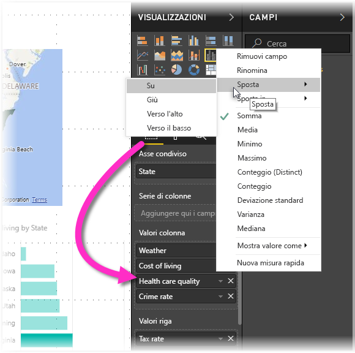

# Accessibilità al report di Power BI Desktop
Power BI offre funzionalità che consentono agli utenti con particolari esigenze di interagire più facilmente con i report di Power BI. Queste funzionalità includono la possibilità di usare un report tramite la tastiera o un'utilità per la lettura dello schermo, la tabulazione per evidenziare vari oggetti in una pagina e l'uso ponderato dei marcatori nelle visualizzazioni.

## Uso di un report di Power BI Desktop con la tastiera o l'utilità per la lettura dello schermo
A partire dalla versione di settembre 2017 di **Power BI Desktop**, è possibile fare clic su **?** per visualizzare una finestra che descrive i tasti di scelta rapida per l'accessibilità disponibili in **Power BI Desktop**.

Grazie ai miglioramenti dell'accessibilità, è possibile usare un report di Power BI con la tastiera o l'utilità di lettura dello schermo servendosi delle tecniche seguenti:

Quando si visualizza un report, in genere la modalità di analisi deve essere disattivata.

È possibile spostare lo stato attivo tra le schede della pagina del report o gli oggetti in una determinata pagina del report, usando **CTRL+F6**.

* Quando le *schede della pagina del report* sono attive, usare i tasti di *tabulazione* o le *frecce* per spostare lo stato attivo da una pagina del report a quella successiva. Il titolo della pagina del report, se selezionato, viene letto dall'utilità di lettura dello schermo. Per caricare la pagina del report attualmente attiva, utilizzare tasto *Invio* o la *barra dello spazio*.
* Quando la *pagina del report* caricata è attiva, usare il tasto di *tabulazione* per spostare lo stato attivo su ogni oggetto nella pagina, ad esempio tutte le caselle di testo, le immagini, le forme e i grafici. L'utilità di lettura dello schermo legge il tipo di oggetto, il titolo dell'oggetto, se esiste, e una descrizione dell'oggetto, se aggiunta dall'autore del report. 

Durante lo spostamento tra gli oggetti visivi, è possibile premere **ALT+ MAIUSC+F10** per spostare lo stato attivo sull'intestazione dell'oggetto visivo, che contiene diverse opzioni tra cui l'ordinamento, l'esportazione dei dati su cui si basa il grafico e la modalità messa a fuoco. 

È possibile premere **Alt+MAIUSC+F11** per visualizzare una versione accessibile della finestra *Visualizza dati*. Ciò consente di esplorare i dati usati nell'oggetto visivo in una tabella HTML, usando gli stessi tasti di scelta rapida che in genere si usano con l'utilità per la lettura dello schermo. 

> [!NOTE]
> La funzionalità di visualizzazione dei dati è accessibile solo da un'utilità per la lettura dello schermo usando questo tasto di scelta rapida. Se si apre la finestra Visualizza dati usando l'opzione nell'intestazione dell'oggetto visivo, non sarà accessibile per un'utilità per la lettura dello schermo. Se si usa l'opzione Mostra i dati, attivare la modalità di analisi per sfruttare tutti i tasti di scelta rapida offerti dal lettore di schermata.

A partire dalla versione di luglio 2018 di **Power BI Desktop**, la funzionalità di accessibilità è incorporata nei filtri dei dati. Quando si seleziona un filtro dei dati, per modificare il valore di un filtro dei dati usare CTRL+freccia destra per spostarsi tra i vari controlli all'interno di filtro dei dati. Ad esempio, quando si preme inizialmente CTRL+freccia destra lo stato attivo è sulla gomma e quindi premere BARRA SPAZIATRICE equivale a fare clic sul pulsante della gomma, che cancella tutti i valori nel filtro dei dati. 

È possibile spostarsi tra i controlli in un filtro dei dati premendo il tasto TAB. Premendo il tasto TAB quando lo stato attivo è sulla gomma ci si sposta sul pulsante a discesa. Con un altro TAB ci si sposta sul primo valore del filtro dei dati (se sono presenti più valori per il filtro dei dati, ad esempio un intervallo). 

Queste opzioni di accessibilità aggiuntive sono state create per consentire agli utenti di usare al meglio i report di Power BI con un'utilità per la lettura dello schermo e la tastiera.

## Suggerimenti per la creazione di report accessibili
I suggerimenti seguenti consentono di creare report di **Power BI Desktop** più accessibili.

### Suggerimenti generali per i report accessibili

* Per gli oggetti visivi **Riga**, **Area** e **Casella combinata** e per gli oggetti visivi **Dispersione** e **Bolle** attivare i marcatori e usare una *Forma del marcatore* diversa per ogni riga.
  
  * Per attivare i *Marcatori* , selezionare la sezione **Formato** sezione nel riquadro **Visualizzazioni**, espandere la sezione **Forme**, quindi scorrere verso il basso per trovare il tasto di attivazione e disattivazione **Marcatori** e *attivarlo*.
  * Quindi, selezionare il nome di ogni riga (o l'area, se si usa un grafico ad **area**) dalla casella di riepilogo a discesa nella sezione **Forme**. Sotto l'elenco a discesa, è possibile regolare molti aspetti del marcatore usato per la riga selezionata, tra cui la forma, il colore e le dimensioni.
  
  
  
  * L'uso di una *forma del marcatore* diversa per ogni riga semplifica per gli utenti dei report la distinzione tra le righe o le aree.
* A titolo di precisazione del punto precedente, è consigliabile non fare affidamento sui colori per veicolare le informazioni. Oltre a usare le forme nei grafici a linee e a dispersione, non fare affidamento sulla formattazione condizionale per inserire informazioni dettagliate in tabelle e matrici. 
* Selezionare un ordinamento intenzionale per ogni oggetto visivo nel report. Quando gli utenti delle utilità per la lettura dello schermo esaminano i dati su cui si basa il grafico, viene selezionato lo stesso ordinamento dell'oggetto visivo.
* Selezionare un *tema* a contrasto elevato e facile da usare per i daltonici dalla raccolta dei temi e importarlo usando la funzione di anteprima del [**Tema**](desktop-report-themes.md).
* Per ogni oggetto nel report, inserire il *Testo alternativo*. In questo modo gli utenti del report comprendono il messaggio che l'utente vuole comunicare con un oggetto visivo, anche se non possono vedere l'oggetto visivo, l'immagine, la forma o la casella di testo. È possibile specificare *Testo alternativo* per qualsiasi oggetto in un report **Power BI Desktop**. A tale scopo, selezionare l'oggetto, ad esempio l'oggetto visivo, la forma e così via, e nel riquadro **Visualizzazioni** selezionare la sezione **Formato**, espandere **Generale**, quindi scorrere fino alla fine e immettere il testo nella casella **Testo alternativo**.
  
  
* Assicurarsi che il contrasto tra testo e colori di sfondo nei report sia sufficiente. Sono disponibili diversi strumenti, ad esempio un [analizzatore del contrasto dei colori](https://developer.paciellogroup.com/resources/contrastanalyser/), che possono essere usati per controllare i colori del report. 
* Usare dimensioni di testo e tipi di carattere facilmente leggibili. Testo di piccole dimensioni o tipi di carattere difficili da leggere non favoriscono l'accessibilità.
* Includere il titolo, le etichette degli assi e le etichette dei dati in tutti gli oggetti visivi.
* Usare titoli significativi per tutte le pagine del report.
* Evitare forme e immagini decorative nel report, se possibile, poiché vengono incluse nell'ordine di tabulazione del report. Se è necessario includere oggetti decorativi nel report, aggiornare il testo alternativo dell'oggetto in modo da informare gli utenti dell'utilità per la lettura dello schermo che si tratta di oggetti decorativi.

### Disposizione degli elementi nelle aree dei campi
A partire dalla versione di ottobre 2018 di **Power BI Desktop**, è possibile spostarsi all'interno dell'area **Campi** con una tastiera e l'area interagisce con le utilità per la lettura dello schermo. 

Per migliorare il processo di creazione di report con le utilità per la lettura dello schermo, è disponibile un menu di scelta rapida per consentire di spostare i campi nell'area verso l'alto o verso il basso nell'elenco **Campi** o di spostare il campo in altre aree, come **Legenda**, **Valore** o altre.

## Supporto del contrasto elevato per i report

Quando si usano le modalità a contrasto elevato in Windows, queste impostazioni e la tavolozza selezionate vengono applicate anche ai report in **Power BI Desktop**. 

**Power BI Desktop** rileva automaticamente il tema a contrasto elevato usato in Windows e applica queste impostazioni ai report. Questi colori a contrasto elevato vengono usati anche nel report pubblicato nel servizio Power BI o altrove.

Anche il servizio Power BI tenta di rilevare le impostazioni di contrasto elevato selezionate per Windows, ma l'efficacia e l'accuratezza di questo tipo di rilevamento dipende dal browser in uso per il servizio Power BI. Per impostare il tema manualmente nel servizio Power BI, è possibile selezionare **Visualizza > A colori a contrasto elevato** e quindi selezionare il tema da applicare al report.

In **Power BI Desktop** notare che alcune aree, ad esempio i campi **Visualizzazioni** e **Campi**, non riflettono la selezione delle combinazioni di colori di Windows a contrasto elevato.

## Considerazioni e limitazioni
Sono state rilevate problematiche e limitazioni note relative alle funzionalità di accessibilità, descritte nell'elenco seguente:

* Quando si usano le utilità per la lettura dello schermo con **Power BI Desktop**, per ottimizzare l'esperienza aprire l'utilità preferita prima di aprire qualsiasi file in Power BI Desktop.
* Se si usa l'Assistente vocale, esistono alcune limitazioni per lo spostamento in Visualizza dati come in una tabella HTML.

## Keyboard Shortcuts
I tasti di scelta rapida sono utili per spostarsi nei report di Power BI usando una tastiera. Le tabelle seguenti descrivono le combinazioni di tasti disponibili in un report di Power BI. Oltre a usare questi tasti di scelta rapida in Power BI Desktop, queste combinazioni di tasti funzionano anche nelle esperienze seguenti:

* Finestra di dialogo Esplora domande e risposte
* Finestra di dialogo Guida introduttiva
* Menu File e finestra di dialogo Informazioni
* Barra degli avvisi
* Finestra di dialogo Ripristino del file
* Finestra di dialogo Frowns (Commenti)

Con l'impegno continuo di migliorare l'accessibilità, l'elenco precedente di esperienze supporta anche le utilità per la lettura dello schermo e le impostazioni di contrasto elevato.

### Tasti di scelta rapida usati di frequente
| Operazione da eseguire           | Premere                |
| :------------------- | :------------------- |
| Sposta lo stato attivo tra le sezioni  | CTRL+F6 |
| Sposta lo stato attivo avanti nella sezione | TAB         |
| Sposta lo stato attivo indietro nella sezione | MAIUSC+TAB |
| Selezionare o deselezionare un oggetto | INVIO o BARRA SPAZIATRICE |
| Selezionare più oggetti | CTRL + BARRA SPAZIATRICE |

### Nell'oggetto visivo
| Operazione da eseguire           | Premere                |
| :------------------- | :------------------- |
| Sposta lo stato attivo sul menu dell'oggetto visivo | ALT+MAIUSC+F10 |
| Mostra i dati | ALT + MAIUSC+ F11  |

### Navigazione riquadro
| Operazione da eseguire           | Premere                |
| :------------------- | :------------------- |
| Apre un menu di scelta rapida | <ul><li>Tastiera di Windows: tasto per aprire il menu di scelta rapida di Windows+F10.  La chiave di contesto di Windows è compresa tra il tasto Alt di sinistra e il tasto freccia SINISTRA</li><li>Altre tastiere: MAIUSC+F10</li></ul> |

### Filtro dei dati
| Operazione da eseguire           | Premere                |
| :------------------- | :------------------- |
| Interagire con un filtro dei dati | CTRL + tasto freccia DESTRA |

### Riquadro di selezione
| Operazione da eseguire           | Premere                |
| :------------------- | :------------------- |
| Attivare il riquadro di selezione | F6 |
| Spostare un oggetto in alto nei livelli | CTRL + MAIUSC + F |
| Spostare un oggetto in basso nei livelli | CTRL + MAIUSC + B |
| Nascondi/Mostra un oggetto (Attiva/Disattiva) | CTRL + MAIUSC + S |

### Editor DAX
| Operazione da eseguire           | Premere                |
| :------------------- | :------------------- |
| Spostare una riga su/giù | ALT + tasto freccia SU/Freccia GIÙ |
| Copiare una riga su/giù | MAIUSC + ALT + tasto freccia SU/tasto freccia GIÙ |
| Inserire una riga sotto | CTRL + INVIO |
| Inserire una riga sopra | CTRL + MAIUSC + INVIO |
| Passare alla parentesi quadra corrispondente | CTRL + MAIUSC + \ |
| Riga rientro/rientro negativo | CTRL + ] / [ |
| Inserire il cursore | ALT + clic |
| Selezionare la riga corrente | CTRL + I |
| Selezionare tutte le occorrenze della selezione corrente | CTRL + MAIUSC + L |
| Selezionare tutte le occorrenze della parola corrente | CTRL + F2 |

### Immetti dati
| Operazione da eseguire           | Premere                |
| :------------------- | :------------------- |
| Uscire dalla griglia modificabile | CTRL + TAB |

## Passaggi successivi
* [Usare i temi dei report in Power BI Desktop (anteprima)](desktop-report-themes.md)

