# Accessibilità al report di Power BI Desktop
Power BI offre funzionalità che consentono agli utenti con particolari esigenze di interagire più facilmente con i report di Power BI. Queste funzionalità includono la possibilità di usare un report tramite la tastiera o un'utilità per la lettura dello schermo, la tabulazione per evidenziare vari oggetti in una pagina e l'uso ponderato dei marcatori nelle visualizzazioni.

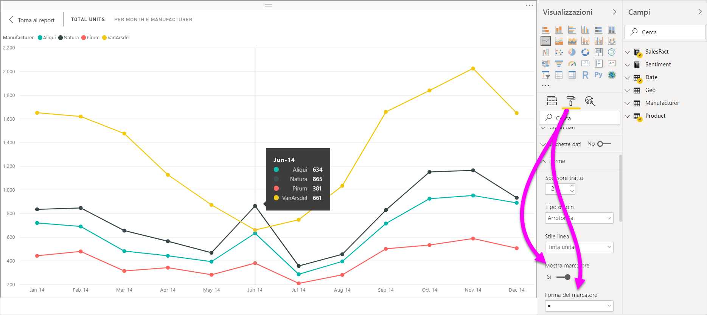

## Uso di un report di Power BI Desktop con la tastiera o l'utilità per la lettura dello schermo
A partire dalla versione di settembre 2017 di **Power BI Desktop** è possibile premere **MAIUSC+?** per visualizzare una finestra che descrive le scelte rapide da tastiera per l'accessibilità disponibili in **Power BI Desktop**.

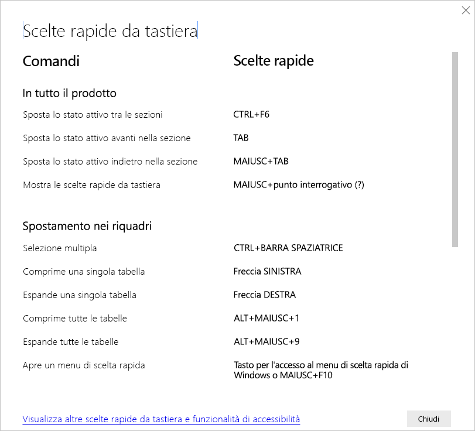

Grazie ai miglioramenti dell'accessibilità, è possibile usare un report di Power BI con la tastiera o l'utilità di lettura dello schermo servendosi delle tecniche seguenti:

> [!NOTE]
> Quando si visualizza un report, in genere la modalità di analisi deve essere disattivata.

È possibile spostare lo stato attivo tra le schede della pagina del report o gli oggetti in una determinata pagina del report usando **CTRL+F6**.

* Quando le schede della pagina del report sono attive, usare **TAB** o i tasti di **direzione** per spostare lo stato attivo da una pagina del report a quella successiva. L'utilità per la lettura dello schermo legge il titolo della pagina del report e indica se è attualmente selezionato. Per caricare la pagina del report attualmente attiva, usare **INVIO** o la barra spaziatrice.
* Quando una pagina del report caricata è attiva, usare **TAB** per spostare lo stato attivo su ogni oggetto presente nella pagina, ad esempio tutte le caselle di testo, le immagini, le forme e i grafici. L'utilità per la lettura dello schermo legge il tipo di oggetto e il titolo dell'oggetto (se presente). L'utilità per la lettura dello schermo legge anche una descrizione dell'oggetto, se è stata inclusa dall'autore del report. 

Durante lo spostamento tra gli oggetti visivi, è possibile premere **ALT+MAIUSC+F10** per spostare lo stato attivo sull'intestazione dell'oggetto visivo. Quest'ultima contiene diverse opzioni tra cui l'ordinamento, l'esportazione dei dati su cui si basa il grafico e la modalità messa a fuoco. 

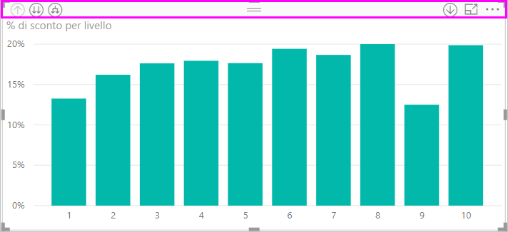

È possibile premere **ALT+MAIUSC+F11** per visualizzare una versione accessibile della finestra **Mostra i dati**. Questa finestra consente di esplorare i dati usati nell'oggetto visivo in una tabella HTML, usando le stesse scelte rapide da tastiera che si usano normalmente con l'utilità per la lettura dello schermo. 

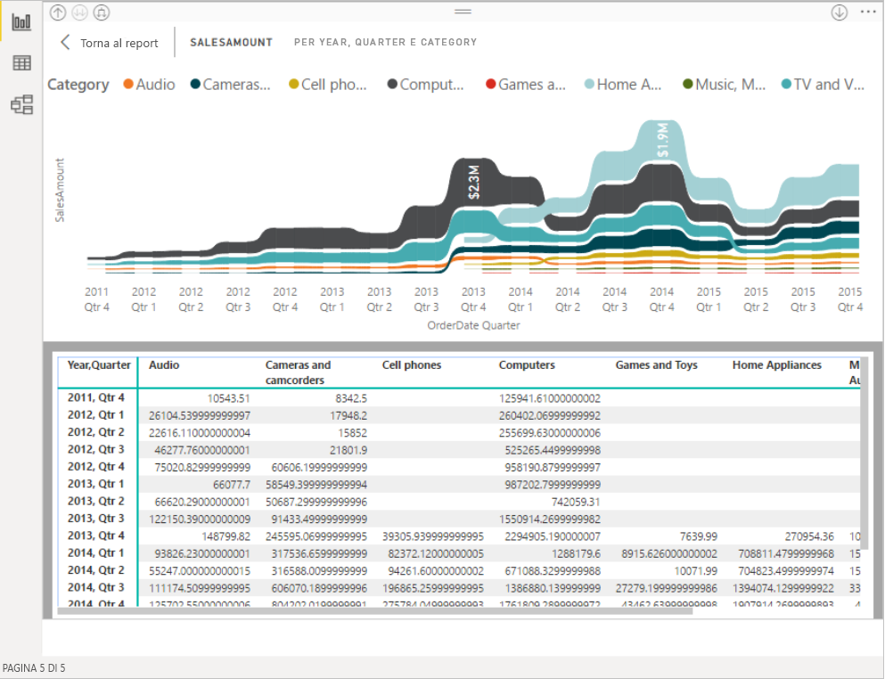

> [!NOTE]
> La funzionalità **Mostra i dati** è accessibile a un'utilità per la lettura dello schermo solo tramite questa scelta rapida da tastiera. Se si apre **Mostra i dati** tramite l'opzione disponibile nell'intestazione dell'oggetto visivo, la funzionalità non risulterà accessibile a un'utilità per la lettura dello schermo. Quando si usa **Mostra i dati**, attivare la modalità di analisi per poter usare tutti i tasti di scelta rapida offerti dall'utilità per la lettura dello schermo.

A partire dalla versione di luglio 2018 di **Power BI Desktop**, la funzionalità di accessibilità è incorporata nei filtri dei dati. Quando si seleziona un filtro dei dati, per modificarne il valore, usare **CTRL+freccia DESTRA** per spostarsi tra i vari controlli all'interno del filtro dei dati. Ad esempio, quando si preme inizialmente **CTRL+freccia DESTRA**, lo stato attivo è sulla gomma. Quindi, premendo la barra spaziatrice si esegue un'azione equivalente alla selezione del pulsante della gomma che comporta la cancellazione di tutti i valori presenti nel filtro dei dati. 

È possibile spostarsi tra i controlli in un filtro dei dati premendo il tasto **TAB**. Premendo il tasto **TAB** quando si è sulla gomma, si passa al pulsante a discesa. Con un altro **TAB** si passa al primo valore del filtro dei dati (se sono presenti più valori per il filtro dei dati, ad esempio un intervallo). 

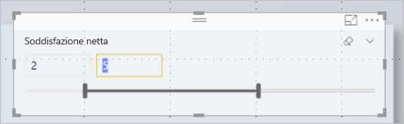

Queste opzioni di accessibilità aggiuntive consentono agli utenti di usare al meglio i report di Power BI con un'utilità per la lettura dello schermo e la tastiera.

## Suggerimenti per la creazione di report accessibili
I suggerimenti seguenti consentono di creare report di **Power BI Desktop** più accessibili.

### Suggerimenti generali per i report accessibili

* Per gli oggetti visivi **Linea**, **Area** e **Combinato** e per gli oggetti visivi **Dispersione** e **Bolle** attivare l'alternanza **Mostra marcatori** e usare una **Forma del marcatore** diversa per ogni linea.
  
  * Per attivare l'alternanza **Mostra marcatori**, selezionare la sezione **Formato** nel riquadro **Visualizzazioni** ed espandere la sezione **Forme**. Scorrere verso il basso per trovare l'alternanza **Mostra marcatori** e impostarla su **Attivata**.
  * Per personalizzare singole linee, trovare l'alternanza **Personalizza serie** e impostarla su **Attivata**. Quindi, selezionare il nome di ogni riga (o l'area, se si usa un grafico ad **area**) dalla casella di riepilogo a discesa nella sezione **Forme**. Sotto l'elenco a discesa, è possibile regolare molti aspetti del marcatore usato per la riga selezionata, tra cui la forma, il colore e le dimensioni.
  
    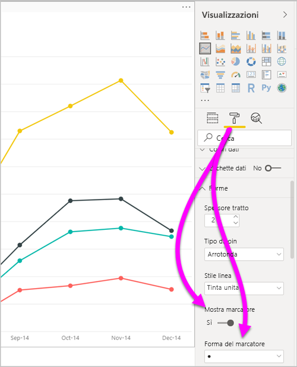
  
  * L'uso di una **forma del marcatore** diversa per ogni riga semplifica per gli utenti dei report la distinzione tra le righe o le aree.
* A titolo di precisazione del punto precedente, è consigliabile non fare affidamento sui colori per veicolare le informazioni. Quando si usano le forme nei grafici a linee e a dispersione, non fare affidamento sulla formattazione condizionale per inserire informazioni dettagliate in tabelle e matrici. 
* Selezionare un ordinamento intenzionale per ogni oggetto visivo nel report. Quando gli utenti delle utilità per la lettura dello schermo esaminano i dati su cui si basa il grafico, viene selezionato lo stesso ordinamento dell'oggetto visivo.
* Selezionare un tema a contrasto elevato e adatto ai daltonici dalla raccolta temi. Importarlo usando la [funzionalità di anteprima **Temi**](desktop-report-themes.md).
* Per ogni oggetto di un report, includere testo alternativo. In questo modo, gli utenti del report comprenderanno ciò che si vuole comunicare con un oggetto visivo. Il testo alternativo è utile anche nel caso in cui l'utente non possa vedere l'oggetto visivo, l'immagine, la forma o la casella di testo. In un report di **Power BI Desktop** è possibile includere testo alternativo per qualsiasi oggetto. Selezionare l'oggetto, ad esempio un oggetto visivo, una forma e così via, quindi nel riquadro **Visualizzazioni** selezionare la sezione **Formato**. Espandere quindi la sezione **Generale**, scorrere verso il basso e immettere il testo nella casella **Testo alternativo**.
  
  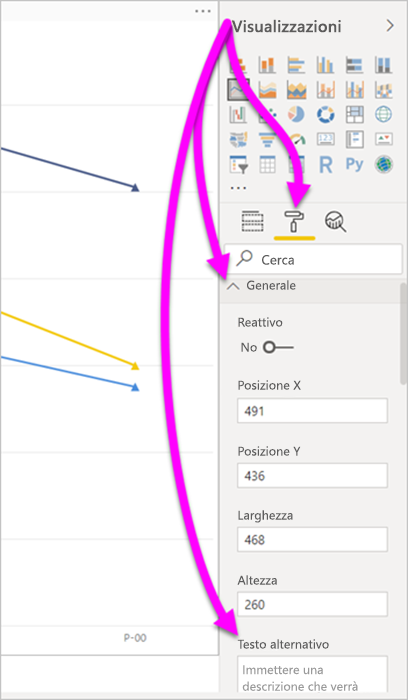
* Assicurarsi che il contrasto tra testo e colori di sfondo nei report sia sufficiente. Sono disponibili diversi strumenti, ad esempio un [analizzatore del contrasto dei colori](https://developer.paciellogroup.com/resources/contrastanalyser/), che possono essere usati per controllare i colori del report. 
* Usare dimensioni di testo e tipi di carattere facilmente leggibili. Testo di piccole dimensioni o tipi di carattere difficili da leggere non favoriscono l'accessibilità.
* Includere il titolo, le etichette degli assi e le etichette dei dati in tutti gli oggetti visivi.
* Usare titoli significativi per tutte le pagine del report.
* Evitare forme e immagini decorative nel report, se possibile, poiché vengono incluse nell'ordine di tabulazione del report. Se è necessario includere oggetti decorativi nel report, aggiornare il testo alternativo dell'oggetto in modo da informare gli utenti dell'utilità per la lettura dello schermo che si tratta di oggetti decorativi.

### Disposizione degli elementi nelle aree dei campi
A partire dalla versione di ottobre 2018 di **Power BI Desktop** è possibile spostarsi all'interno dell'area **Campi** con una tastiera e l'area interagisce con le utilità per la lettura dello schermo. 

Per migliorare il processo di creazione di report con le utilità per la lettura dello schermo, è disponibile un menu di scelta rapida. Il menu consente di spostare i campi presenti nell'area verso l'alto o verso il basso nell'elenco **Campi**. Il menu consente anche di spostare il campo in altre aree, ad esempio **Legenda** o **Valore** oppure altri.

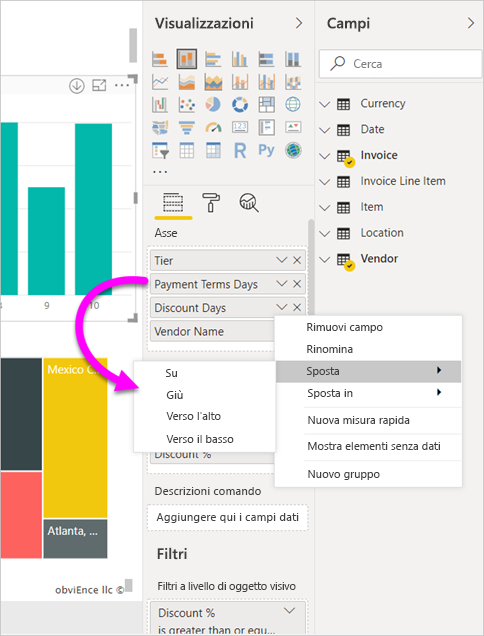

## Supporto del contrasto elevato per i report

Quando si usano le modalità a contrasto elevato in Windows, queste impostazioni e la tavolozza selezionate vengono applicate anche ai report in **Power BI Desktop**. 

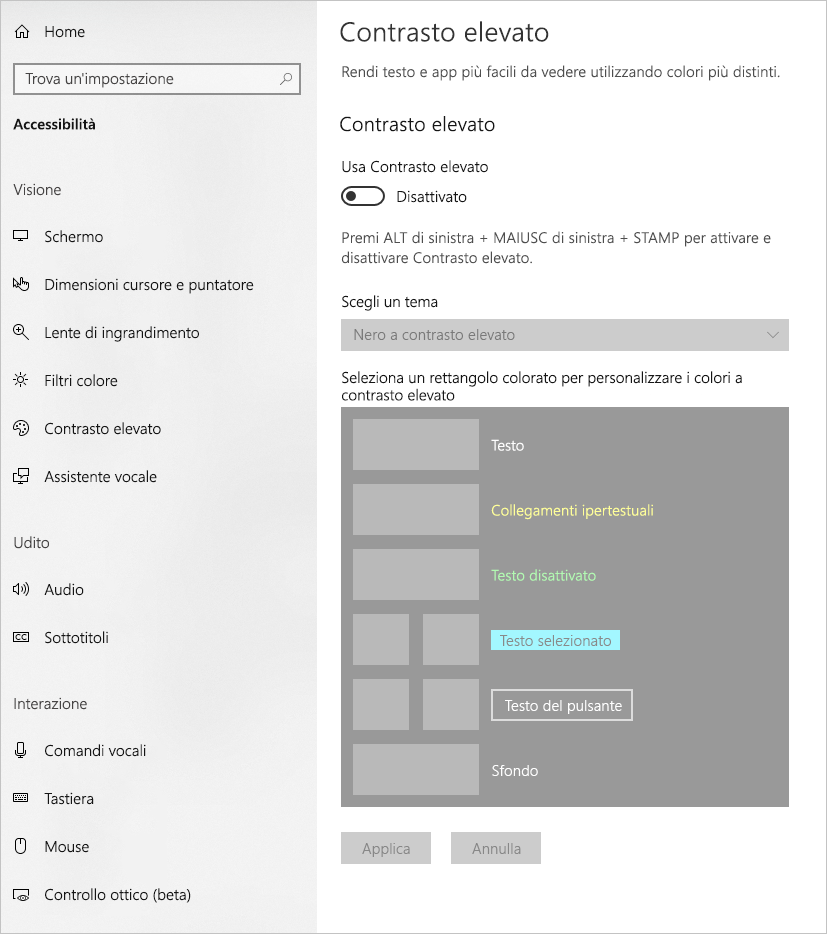

**Power BI Desktop** rileva automaticamente il tema a contrasto elevato usato in Windows e applica queste impostazioni ai report. Questi colori a contrasto elevato vengono usati anche nel report pubblicato nel servizio Power BI o altrove.

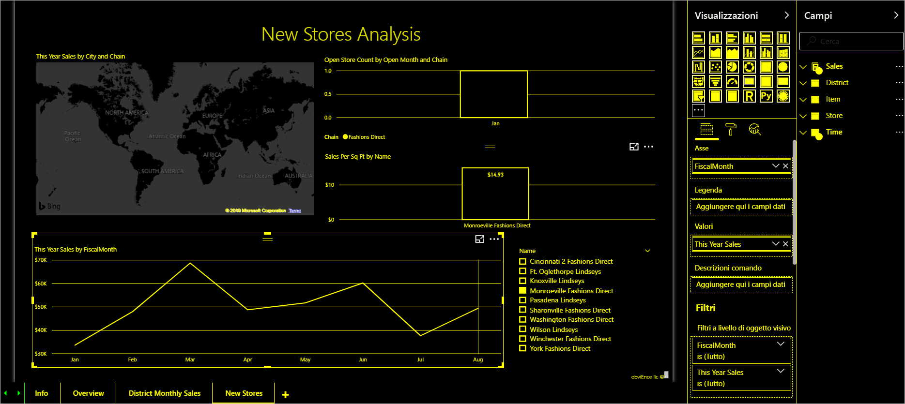

Anche il servizio Power BI tenta di rilevare le impostazioni di contrasto elevato selezionate per Windows. L'efficacia e l'accuratezza del rilevamento dipendono dal browser che visualizza il servizio Power BI. Per impostare il tema manualmente nel servizio Power BI, è possibile selezionare **Visualizza** > **A colori a contrasto elevato** e quindi selezionare il tema da applicare al report.

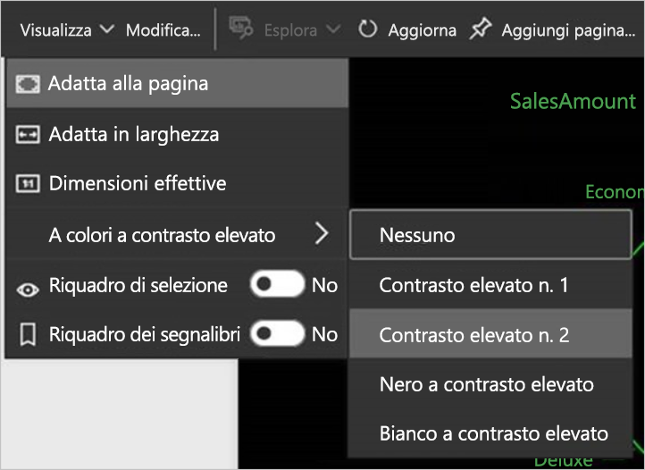

## Considerazioni e limitazioni
Le funzionalità di accessibilità hanno alcune problematiche e limitazioni note. Le descrizioni di queste problematiche e limitazioni sono elencate di seguito:

* Quando si usano le utilità per la lettura dello schermo con **Power BI Desktop**, l'esperienza migliore si ottiene aprendo l'utilità per la lettura dello schermo prima di aprire qualsiasi file in **Power BI Desktop**.
* Se si usa l'Assistente vocale, esistono alcune limitazioni per l'esplorazione di **Mostra i dati** come tabella HTML.

## Scelte rapide da tastiera
I tasti di scelta rapida sono utili per spostarsi nei report di Power BI usando una tastiera. Le tabelle seguenti descrivono le combinazioni di tasti disponibili in un report di Power BI. Oltre che in **Power BI Desktop**, queste scelte rapida da tastiera funzionano anche nelle esperienze seguenti:

* Finestra di dialogo **Esplora domande e risposte**
* Finestra di dialogo **Attività iniziali**
* Menu **File** e finestra di dialogo **Informazioni**
* Barra **Avviso**
* Finestra di dialogo **Ripristino del file**
* Finestra di dialogo **Frowns** (Commenti)

Con l'impegno continuo di migliorare l'accessibilità, l'elenco precedente di esperienze supporta anche le utilità per la lettura dello schermo e le impostazioni di contrasto elevato.

### Tasti di scelta rapida usati di frequente
| Azione da eseguire           | Premere                |
| :------------------- | :------------------- |
| Sposta lo stato attivo tra le sezioni  | **CTRL+F6** |
| Sposta lo stato attivo avanti nella sezione | **TAB**         |
| Sposta lo stato attivo indietro nella sezione | **MAIUSC+TAB** |
| Selezionare o cancellare la selezione di un oggetto | **INVIO** o **BARRA SPAZIATRICE** |
| Selezionare più oggetti | **CTRL+BARRA SPAZIATRICE** |

### Nell'oggetto visivo
| Azione da eseguire           | Premere                |
| :------------------- | :------------------- |
| Sposta lo stato attivo sul menu dell'oggetto visivo | **ALT+MAIUSC+F10** |
| Mostra i dati | **ALT+MAIUSC+F11**  |
| Accede a un oggetto visivo | **CTRL+freccia DESTRA** |
| Accede a un livello | **INVIO** |
| Esce da un livello o un oggetto visivo | **ESC** |
| Selezionare o cancellare la selezione di un punto dati | **INVIO** o **BARRA SPAZIATRICE** |
| Selezione multipla | **CTRL+INVIO** o **CTRL+BARRA SPAZIATRICE** |
| Clic con il pulsante destro del mouse | <ul><li>Tastiera di Windows: **tasto per l'accesso al menu di scelta rapida di Windows+F10**. La chiave di contesto di Windows è compresa tra il tasto Alt di sinistra e il tasto freccia SINISTRA</li><li>Altre tastiere: **MAIUSC+F10**</li></ul> |
| Cancella selezione | **CTRL+MAIUSC+C** |

### Spostamento in tabelle e matrici
| Azione da eseguire          | Premere                |
| :------------------- | :------------------- |
| Spostare lo stato attivo verso l'alto o verso il basso di una cella (in tutte le celle di tutte le aree)  | **Freccia SU** / **Freccia GIÙ** |
| Spostare lo stato attivo verso sinistra o verso destra di una cella (in tutte le celle di tutte le aree)  | **Freccia SINISTRA** / **Freccia DESTRA** |

### Spostamento nei riquadri
| Azione da eseguire           | Premere                |
| :------------------- | :------------------- |
| Selezione multipla | **CTRL+BARRA SPAZIATRICE** |
| Comprime una singola tabella | **Freccia SINISTRA** |
| Espande una singola tabella | **Freccia DESTRA** |
| Comprime tutte le tabelle | **ALT+MAIUSC+1** |
| Espande tutte le tabelle | **ALT+MAIUSC+9** |
| Apre un menu di scelta rapida | <ul><li>Tastiera di Windows: **tasto per l'accesso al menu di scelta rapida di Windows+F10**.  La chiave di contesto di Windows è compresa tra il tasto Alt di sinistra e il tasto freccia SINISTRA</li><li>Altre tastiere: **MAIUSC+F10**</li></ul> |

### Filtro dei dati
| Azione da eseguire         | Premere                |
| :------------------- | :------------------- |
| Interagire con un filtro dei dati | **CTRL+freccia DESTRA** |

### Riquadro di selezione
| Azione da eseguire           | Premere                |
| :------------------- | :------------------- |
| Attivare il riquadro di selezione | **F6** |
| Spostare un oggetto in alto nei livelli | **CTRL+MAIUSC+F** |
| Spostare un oggetto in basso nei livelli | **CTRL+MAIUSC+B** |
| Nascondi/Mostra un oggetto (Attiva/Disattiva) | **CTRL+MAIUSC+S** |

### Editor DAX
| Azione da eseguire          | Premere                |
| :------------------- | :------------------- |
| Spostare una riga su/giù | **ALT+freccia SU** / **freccia GIÙ** |
| Copiare una riga su/giù | **MAIUSC+ALT+freccia SU** / **freccia GIÙ** |
| Inserire una riga sotto | **CTRL+INVIO** |
| Inserire una riga sopra | **CTRL+MAIUSC+INVIO** |
| Passare alla parentesi quadra corrispondente | **CTRL+MAIUSC+**  \ |
| Impostare un rientro per la riga/Estendere la riga nel margine | **CTRL+]**  /  **[** |
| Inserire il cursore | **ALT+clic** |
| Selezionare la riga corrente | **CTRL+I** |
| Selezionare tutte le occorrenze della selezione corrente | **CTRL+MAIUSC+L** |
| Selezionare tutte le occorrenze della parola corrente | **CTRL+F2** |

### Immettere dati
| Azione da eseguire           | Premere                |
| :------------------- | :------------------- |
| Uscire dalla griglia modificabile | **CTRL+TAB** |

## Passaggi successivi
* [Usare i temi dei report in Power BI Desktop (anteprima)](desktop-report-themes.md)

