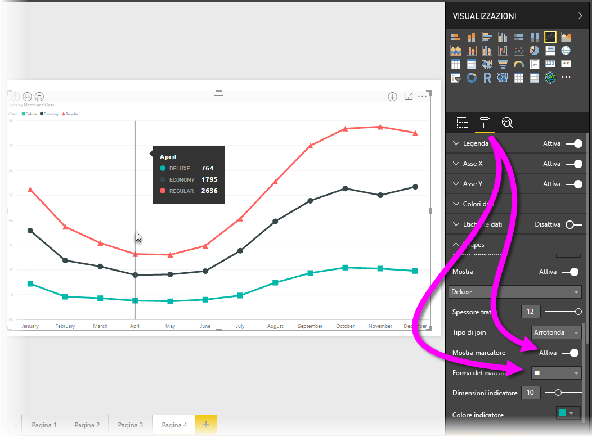
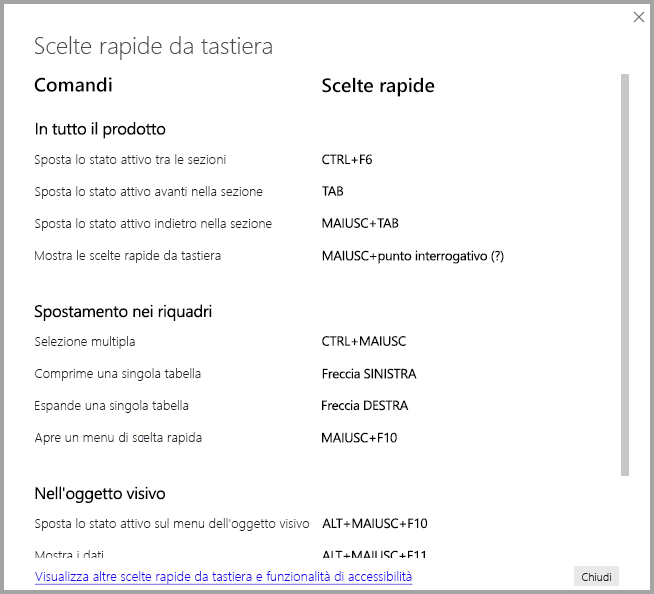
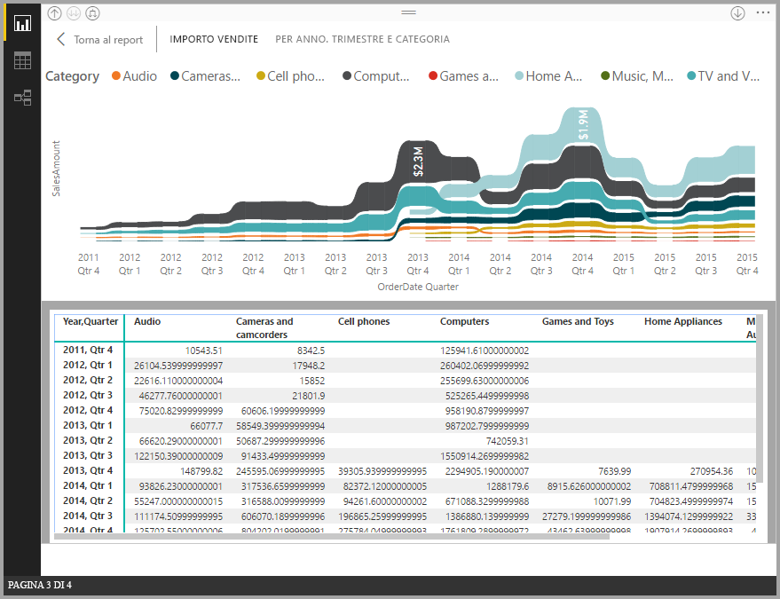
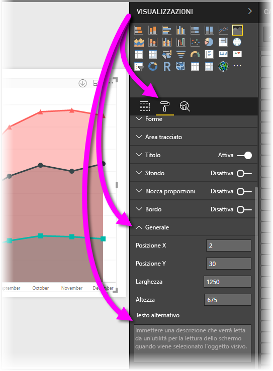

# Accessibilità al report di Power BI Desktop
**Power BI Desktop** dispone di funzionalità che consentono agli utenti con particolari esigenze di usare e interagire più facilmente con i report di **Power BI Desktop**. Queste funzionalità includono la possibilità di usare un report tramite la tastiera o un'utilità per la lettura dello schermo, la tabulazione per evidenziare vari oggetti in una pagina e l'uso ponderato dei marcatori nelle visualizzazioni.

> [!NOTE]
> Queste funzionalità di accessibilità sono disponibili con le versioni di giugno 2017 di **Power BI Desktop** e le versioni successive. Sono previste funzionalità di accessibilità aggiuntive anche per le versioni future.
> 
> 

## Uso di un report di Power BI Desktop con la tastiera o l'utilità per la lettura dello schermo
A partire dalla versione di settembre 2017 di **Power BI Desktop**, è possibile fare clic su **?** per visualizzare una finestra che descrive i tasti di scelta rapida per l'accessibilità disponibili in **Power BI Desktop**.

Con i miglioramenti di accessibilità, è possibile usare un report di **Power BI Desktop** con la tastiera o l'utilità di lettura dello schermo servendosi delle tecniche seguenti:

È possibile spostare lo stato attivo tra le schede della pagina del report o gli oggetti in una determinata pagina del report, usando **CTRL+F6**.

* Quando le *schede della pagina del report* sono attive, usare i tasti di *tabulazione* o le *frecce* per spostare lo stato attivo da una pagina del report a quella successiva. Il titolo della pagina del report, se selezionato, viene letto dall'utilità di lettura dello schermo. Per caricare la pagina del report attualmente attiva, utilizzare tasto *Invio* o la *barra dello spazio*.
* Quando la *pagina del report* caricata è attiva, usare il tasto di *tabulazione* per spostare lo stato attivo su ogni oggetto nella pagina, ad esempio tutte le caselle di testo, le immagini, le forme e i grafici. L'utilità di lettura dello schermo legge il tipo di oggetto e una descrizione dell'oggetto inserita dall'autore. 

È possibile premere **Alt + Maiusc + F10** per spostare lo stato attivo su un menu di oggetti visivi.

È possibile premere **Alt + Maiusc + F11** per visualizzare una versione accessibile della finestra *Visualizza dati*.

Queste opzioni di accessibilità aggiuntive sono state create per consentire agli utenti di utilizzare appieno i report di **Power BI Desktop** tramite una utilità per la lettura dello schermo e la tastiera.

## Suggerimenti per la creazione di report accessibili
I suggerimenti seguenti consentono di creare report di **Power BI Desktop** più accessibili.

* Per gli oggetti visivi **Riga**, **Area** e **Casella combinata** e per gli oggetti visivi **Dispersione** e **Bolle** attivare i marcatori e usare una *Forma del marcatore* diversa per ogni riga.
  
  * Per attivare i *Marcatori* , selezionare la sezione **Formato** sezione nel riquadro **Visualizzazioni**, espandere la sezione **Forme**, quindi scorrere verso il basso per trovare il tasto di attivazione e disattivazione **Marcatori** e *attivarlo*.
  * Quindi, selezionare il nome di ogni riga (o l'area, se si usa un grafico ad **area**) dalla casella di riepilogo a discesa nella sezione **Forme**. Sotto l'elenco a discesa, è possibile regolare molti aspetti del marcatore usato per la riga selezionata, tra cui la forma, il colore e le dimensioni.
  
  
  
  * L'uso di una *forma del marcatore* diversa per ogni riga semplifica per gli utenti dei report la distinzione tra le righe o le aree.
* A titolo di precisazione del punto precedente, è consigliabile non fare affidamento sui colori per veicolare le informazioni. Come descritto in precedenza, l'uso di forme sulle linee, ovvero di marcatori, risulta l'approccio più utile.
* Selezionare un *tema* a contrasto elevato e facile da usare per i daltonici dalla raccolta dei temi e importarlo usando la funzione di anteprima del [**Tema**](desktop-report-themes.md).
* Per ogni oggetto nel report, inserire il *Testo alternativo*. In questo modo gli utenti del report comprendono il messaggio che l'utente vuole comunicare con un oggetto visivo, anche se non possono vedere l'oggetto visivo, l'immagine, la forma o la casella di testo. È possibile specificare *Testo alternativo* per qualsiasi oggetto in un report **Power BI Desktop**. A tale scopo, selezionare l'oggetto, ad esempio l'oggetto visivo, la forma e così via, e nel riquadro **Visualizzazioni** selezionare la sezione **Formato**, espandere **Generale**, quindi scorrere fino alla fine e immettere il testo nella casella **Testo alternativo**.
  
  
* Assicurarsi che il contrasto tra testo e colori di sfondo nei report sia sufficiente.
* Usare dimensioni di testo e tipi di carattere facilmente leggibili. Testo di piccole dimensioni o tipi di carattere difficili da leggere non favoriscono l'accessibilità.
* Includere il titolo, le etichette degli assi e le etichette dei dati in tutti gli oggetti visivi.

## Considerazioni e limitazioni
Sono state rilevate problematiche e limitazioni note relative alle funzionalità di accessibilità, descritte nell'elenco seguente:

* JAWS è supportato nei report che vengono visualizzati nel **servizio Power BI**, inclusi tutti i report incorporati. JAWS è anche supportato in **Power BI Desktop**, ma è necessario aprire l'utilità per la lettura dello schermo prima di aprire i file di **Power BI Desktop** affinché funzioni correttamente.

## Passaggi successivi
* [Usare i temi dei report in Power BI Desktop (anteprima)](desktop-report-themes.md)

