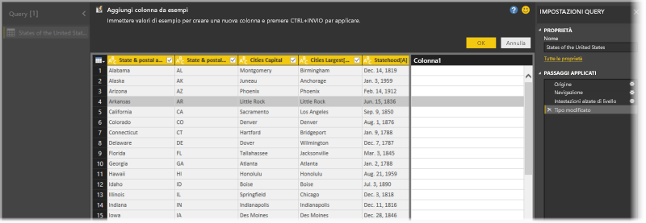
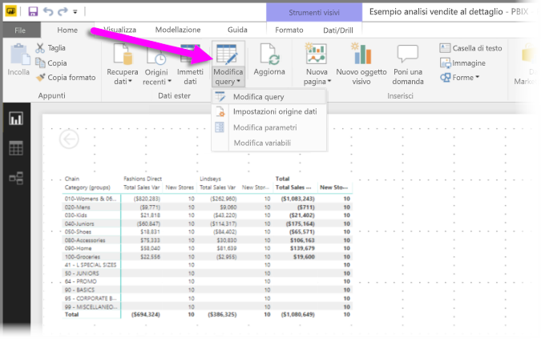
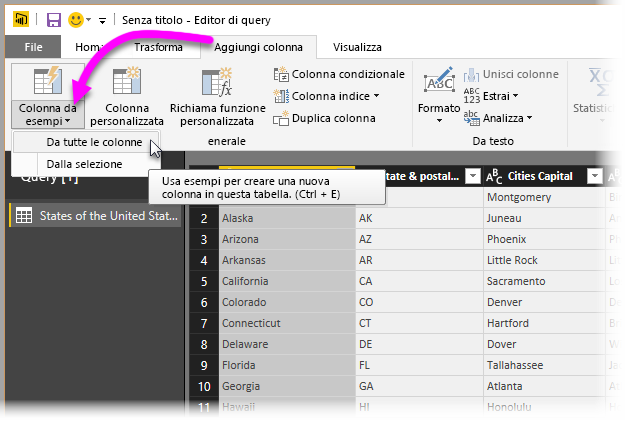
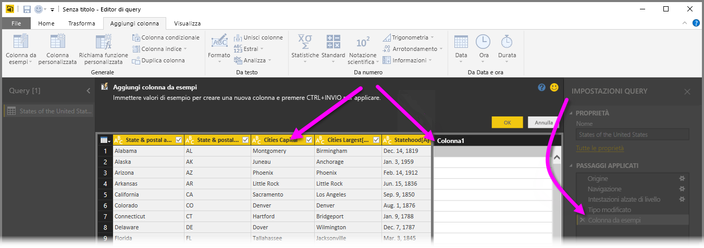
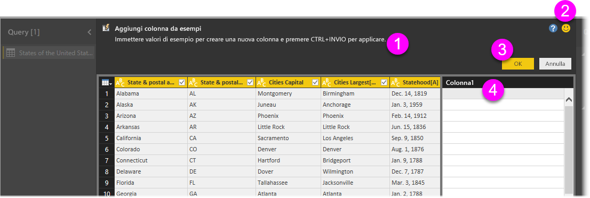
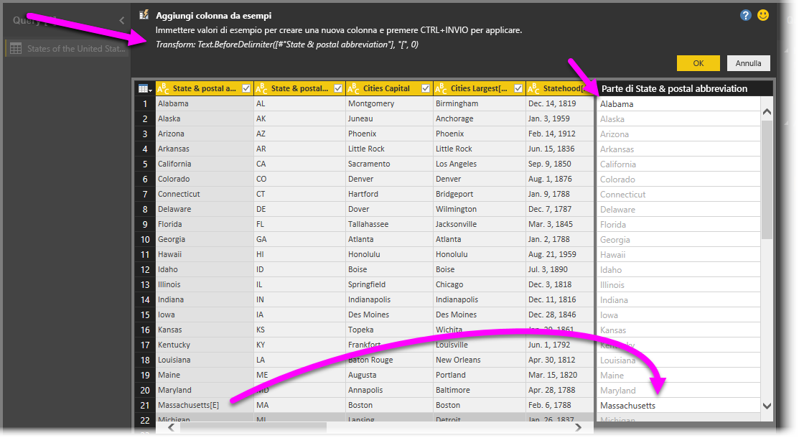

# Aggiungere una colonna da un esempio in Power BI Desktop
A partire dalla versione di aprile 2017 di **Power BI Desktop**, è possibile aggiungere nuove colonne di dati al modello usando l'**Editor di query** e fornendo semplicemente uno o più valori di esempio per la nuova colonna. È possibile creare un nuovo esempio di colonna da una selezione corrente oppure fornire input basati su tutte le colonne (o solo su alcune di esse) in una determinata tabella.

Questo approccio consente di creare rapidamente e facilmente nuove colonne ed è ideale nelle situazioni seguenti:

* Si conosce il risultato dei dati che si vuole ottenere nella nuova colonna, ma non si è certi di quale trasformazione (o raccolta di trasformazioni) consenta di ottenerlo.
* Si sa già qual è la trasformazione necessaria, ma non si è sicuri di dove fare clic o selezionare nell'interfaccia utente per eseguirla.
* Si hanno tutte le informazioni sulle trasformazioni necessarie usando un'espressione *Colonna personalizzata* in **M**, ma una o più espressioni non sono disponibili per la selezione o l'aggiunta nell'interfaccia utente.

L'uso della funzionalità **Aggiungi colonna da esempi** è semplice e lineare. Nelle prossime sezioni, si osserverà quanto sia facile usarla.

## Usare l'Editor di query per aggiungere una nuova colonna da esempi
Per creare una nuova colonna da un esempio, avviare l'**Editor di query**. A tale scopo, selezionare **Modifica query** nella barra multifunzione **Home** in **Power BI Desktop**.

Per ottenere dati da una pagina Web, andare alla scheda **Home**, fare clic su **Recupera dati > Web**, quindi incollare l'URL nella finestra di dialogo visualizzata. Questo articolo usa i dati di un articolo di Wikipedia. È possibile fare clic sul collegamento seguente per recuperare i dati e proseguire:

* [**Elenco di stati e territori degli Stati Uniti**](https://wikipedia.org/wiki/List_of_states_and_territories_of_the_United_States)

Dopo aver avviato l'**Editor di query** e aver caricato alcuni dati, sarà possibile iniziare ad aggiungere una colonna da esempi. Per aggiungere una nuova colonna, nell'**Editor di query** selezionare la scheda **Aggiungi colonna** nella barra multifunzione e quindi selezionare **Colonna da esempi**. Se si sceglie l'elenco a discesa, è possibile selezionare **Da tutte le colonne** (impostazione predefinita, se si seleziona solo il pulsante anziché l'elenco a discesa) o **Dalla selezione**. In questo articolo verrà esaminata la procedura dopo aver selezionato **Da tutte le colonne**.

## Riquadro Aggiungi colonna da esempi
Dopo aver effettuato una selezione per aggiungere una nuova colonna da esempi, viene visualizzato un nuovo riquadro che mostra le colonne nella tabella corrente (potrebbe essere necessario scorrere per visualizzarle tutte). La nuova **Colonna1**, ovvero la colonna che **Power BI Desktop** crea in base agli esempi dell'utente, viene visualizzata anche a destra. Sotto la nuova intestazione **Colonna1** sono presenti celle vuote, in cui è possibile digitare i propri esempi, che Power BI usa per creare regole e trasformazioni corrispondenti all'esempio.

Si noti che si tratta di un **passaggio applicato** nel riquadro **Impostazioni query**. Come sempre, l'**Editor di query** registrerà i passaggi della trasformazione e li applicherà alla query, in quest'ordine.

Questo è il riquadro **Aggiungi colonne da esempi** e consiste in quattro aree principali:

1. La **barra dei comandi**, che include una breve descrizione della funzionalità o della trasformazione.
2. L'opzione **Invia commenti e suggerimenti**, per aiutare Power BI a migliorare questa funzionalità.
3. I pulsanti **OK** e **Annulla**, che consentono di salvare le trasformazioni e aggiungere la colonna o annullare l'operazione.
4. L'area della nuova colonna, in cui è possibile digitare i valori di esempio in qualsiasi riga (per fornire a Power BI il proprio esempio) in relazione alle altre colonne nella stessa riga.

Mentre si digita il proprio esempio nella nuova colonna, Power BI offre un'anteprima dell'aspetto della colonna che si sta creando, in base alle trasformazioni che rileva. Se ad esempio si digita *Alabama* nella prima riga, questo corrisponde al valore *Alabama* nella prima colonna della tabella: non appena si preme *INVIO*, Power BI compila la colonna in base a tale valore.

Si supponga ora di andare alla riga che include *Massachusetts[E]* e di eliminare l'ultima parte, *[E]*, perché non è più necessaria. Power BI rileva la modifica e usa l'esempio per creare una trasformazione. Si noti la spiegazione della trasformazione nel riquadro centrale superiore.

Mentre si continua a fornire esempi, l'**Editor di query** aggiunge altre trasformazioni. Quando si è soddisfatti, è possibile selezionare **OK** per salvare le modifiche.

## Vedere Aggiungi colonna da esempi in azione
Per vedere questa funzionalità in azione, guardare il video seguente, che ne mostra il funzionamento in base all'origine dati fornita precedentemente in questo esempio. Dopo la visione, si potrà procedere autonomamente.

<iframe width="560" height="315" src="https://www.youtube.com/embed/-ykbVW9wQfw" frameborder="0" allowfullscreen></iframe>

## Considerazioni e limitazioni
Sono disponibili molte trasformazioni quando si usa il riquadro **Aggiungi colonna da esempi**, ma non tutte le trasformazioni sono incluse. Di seguito sono elencate tutte le trasformazioni supportate.

* **Riferimento**
  
  * Riferimento a una colonna specifica (incluse le trasformazioni di taglio, pulizia e maiuscole/minuscole)

* **Trasformazioni di testo**
  
  * Combina (supporta la combinazione di stringhe letterali e di interi valori di colonna)
  * Sostituisci
  * Lunghezza
  * Estrai   
    * Primi caratteri
    * Ultimi caratteri
    * Intervallo
    * Testo prima del delimitatore
    * Testo dopo il delimitatore
    * Testo racchiuso tra delimitatori
    * Lunghezza

* Le **trasformazioni di testo** supportate seguenti sono disponibili a partire dalla versione di novembre 2017 di **Power BI Desktop**:
    
  * Rimuovi caratteri
  * Mantieni caratteri

> [!NOTE]
> Tutte le trasformazioni di *testo* tengono conto dell'eventuale necessità di tagliare, pulire o di applicare una trasformazione di maiuscole/minuscole al valore della colonna.
> 
> 

* **Trasformazioni di data**
  
  * Giorno
  * Giorno della settimana
  * Nome giorno della settimana
  * Giorno dell'anno
  * Mese
  * Nome del mese
  * Trimestre dell'anno
  * Settimana del mese
  * Settimana dell'anno
  * Anno
  * Età
  * Inizio dell'anno
  * Fine dell'anno
  * Inizio del mese
  * Fine del mese
  * Inizio del trimestre
  * Giorni del mese
  * Fine del trimestre
  * Inizio della settimana
  * Fine della settimana
  * Giorno del mese
  * Inizio della giornata
  * Fine della giornata

* **Trasformazioni di ora**
  
  * Ora
  * Minuto
  * Secondo  
  * In Ora Locale

> [!NOTE]
> Tutte le trasformazioni di *data* e *ora* prendono in considerazione l'eventuale necessità di convertire il valore della colonna in *Date*, *Time* o *DateTime*.
> 
> 

* **Trasformazioni di numero** 

  * Valore assoluto
  * Arcocoseno
  * Arcoseno
  * Arcotangente
  * Converti in numero
  * Coseno
  * Cubo
  * Dividi
  * Esponente
  * Fattoriale
  * Divisione intera
  * È pari
  * È dispari
  * Ri
  * Logaritmo in base 10
  * Modulo
  * Moltiplica
  * Arrotonda per difetto
  * Arrotonda per eccesso
  * Segno
  * Seno
  * Radice quadrata
  * Quadrato
  * Sottrai
  * Somma
  * Tangente

* La **trasformazione di numero** supportata seguente è disponibile a partire dalla versione di novembre 2017 di **Power BI Desktop**:

  * Bucket/Intervalli

* **Generale**
  
  * Colonna condizionale