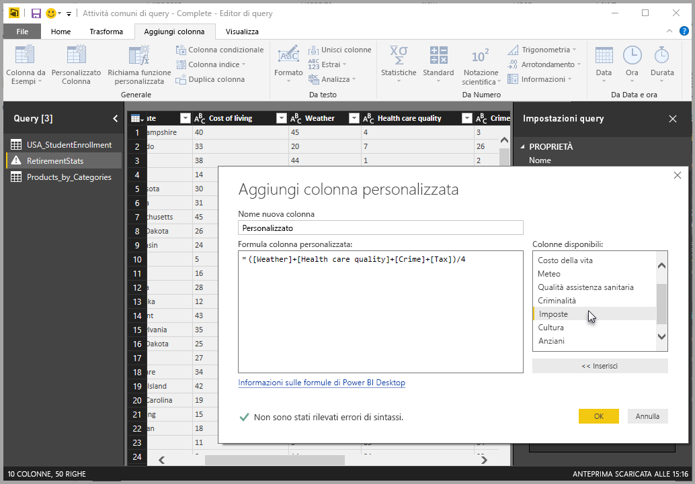
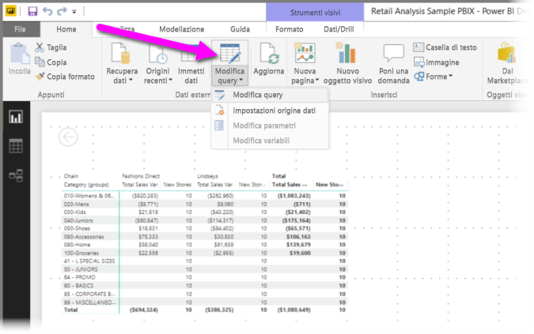
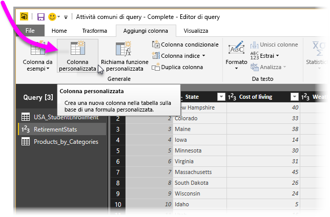
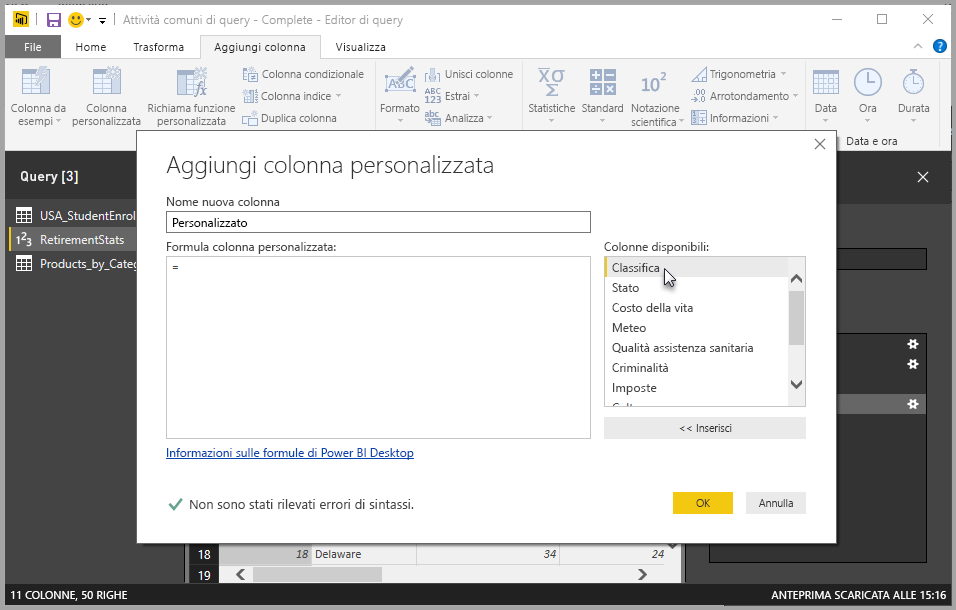
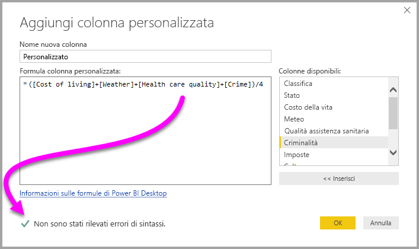
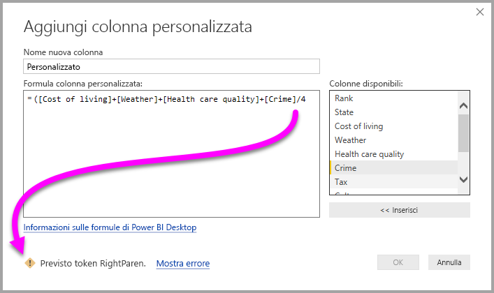
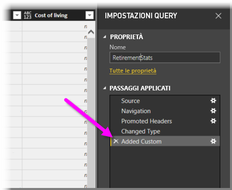
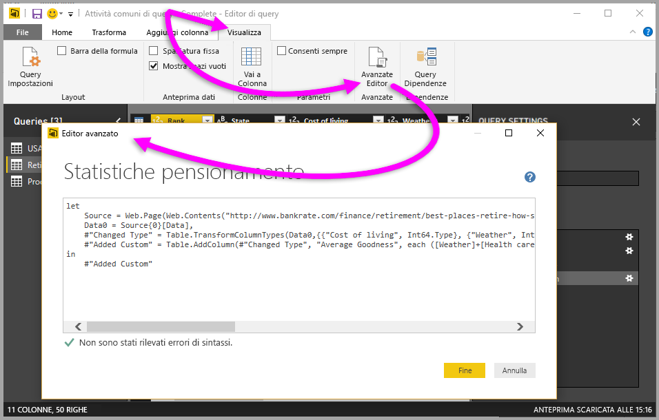

# Aggiungere una colonna personalizzata in Power BI Desktop
È possibile aggiungere facilmente una nuova colonna dei dati personalizzata al modello usando l'**Editor di query** in **Power BI Desktop**. È possibile creare e rinominare la colonna personalizzata usando semplici pulsanti per creare [formule M](https://msdn.microsoft.com/library/mt270235.aspx) che definiscono la colonna personalizzata. La formula M ha un [set di contenuti di riferimento completo per la funzione](https://msdn.microsoft.com/library/mt779182.aspx). 

La creazione di una colonna personalizzata è un altro **Passaggio applicato** alla query create in **Editor di query**, vale a dire che può essere modificata, spostata in avanti o indietro o modificata in qualsiasi momento.

## Usare l'Editor di query per aggiungere una nuova colonna personalizzata
Per creare una nuova colonna personalizzata, avviare l'**Editor di query**. A tale scopo, selezionare **Modifica query** nella barra multifunzione **Home** in **Power BI Desktop**.

Dopo aver avviato l'**Editor di query** e caricato alcuni dati, sarà possibile aggiungere una colonna personalizzata selezionando la scheda **Aggiungi colonna** sulla barra multifunzione, quindi selezionando **Colonna personalizzata**.

Verrà visualizzata la finestra **Aggiungi colonna personalizzata**, descritta nella sezione seguente.

## Finestra Aggiungi colonna personalizzata
Nella finestra **Aggiungi colonna personalizzata** sono visibili l'elenco di campi disponibili nel riquadro di destra, il nome della colonna personalizzata nella parte superiore (è possibile rinominarla digitando un nuovo nome nella casella di testo) e la [formula **M**](https://msdn.microsoft.com/library/mt779182.aspx) creata (o scritta) in base all'inserimento di campi da destra, l'aggiunta di operatori e altrimenti la compilazione della formula sulla quale viene definita la nuova colonna personalizzata. 

## Creare formule per la colonna personalizzata
È possibile selezionare un campo dall'elenco **Colonne disponibili:** a destra e selezionare **<< Inserisci** per aggiungerlo alla formula della colonna personalizzata. È anche possibile fare semplicemente doppio clic su una colonna nell'elenco per aggiungerla.

Mentre si digita la formula e si compila la colonna, nella parte inferiore della finestra verrà visualizzato un indicatore che informa in tempo reale (durante la digitazione) se vengono rilevati errori di sintassi. Se la sintassi è valida, verrà visualizzato un segno di spunta verde.

Se invece è presente un errore qualsiasi nella sintassi, verranno visualizzati un'icona di avviso di colore giallo, con l'errore rilevato, e un collegamento che posiziona il cursore (nella formula) sul punto in cui è stato rilevato l'errore.

Quando si seleziona **OK**, la colonna personalizzata viene aggiunta al modello e il passaggio **Aggiunta colonna personalizzata** viene aggiunto ai **Passaggi applicati** della query.

Se si fa doppio clic sul passaggio **Aggiunta colonna personalizzata** nel riquadro **Passaggi applicati**, viene nuovamente visualizzata la finestra **Aggiungi colonna personalizzata**, con la formula di colonna personalizzata creato dall'utente già caricata e pronta per essere modificata, se necessario.

## Uso dell'Editor avanzato per le colonne personalizzate
È anche possibile creare una colonna personalizzata (e modificare qualsiasi passaggio della query, d'altra parte) usando l'**Editor avanzato**. Nell'**Editor di query** selezionare la scheda **Visualizza**, quindi selezionare **Editor avanzato** per visualizzare l'**Editor avanzato**.

L'**Editor avanzato** offre il controllo completo sulla query.

## Passaggi successivi
Sono disponibili altri modi per creare una colonna personalizzata, inclusa la creazione di una colonna in base ad esempi forniti dall'utente all'**Editor di query**. Per altre informazioni sulla creazione di colonne personalizzate da esempi, vedere l'articolo seguente:

* [Aggiungere una colonna da un esempio in Power BI Desktop](desktop-add-column-from-example.md)
* [Introduction to M formula language](https://msdn.microsoft.com/library/mt270235.aspx) (Introduzione al linguaggio delle formule M)
* [M function reference](https://msdn.microsoft.com/library/mt779182.aspx) (Informazioni di riferimento sulla funzione M)  

