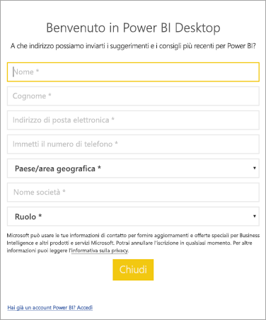

# <a name="how-administrators-can-manage-the-power-bi-desktop-sign-in-form"></a>Procedura per la gestione del modulo di accesso da parte degli amministratori di Power BI Desktop
Al primo avvio di Power BI Desktop viene visualizzato un modulo di accesso. È possibile inserire le informazioni oppure accedere a Power BI per continuare. Gli amministratori possono gestire questo modulo usando una chiave del Registro di sistema. 



Gli amministratori possono usare la chiave del Registro di sistema seguente per disabilitare il modulo di accesso. Questa modifica può essere estesa all'intera organizzazione tramite i criteri globali.

```
Key: HKEY_LOCAL_MACHINE\SOFTWARE\Policies\Microsoft\Power BI Desktop
valueName: ShowLeadGenDialog
```

Un valore pari 0 disabiliterà la finestra di dialogo.

Altre domande? [Provare a rivolgersi alla community di Power BI](http://community.powerbi.com/)

