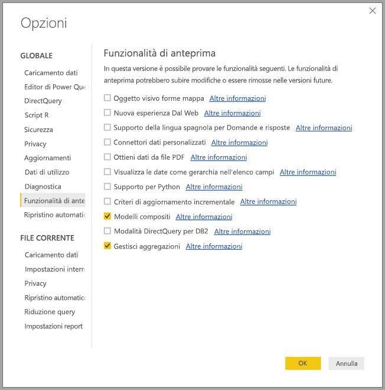
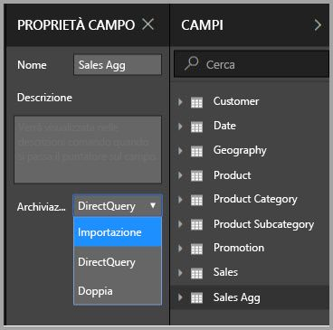
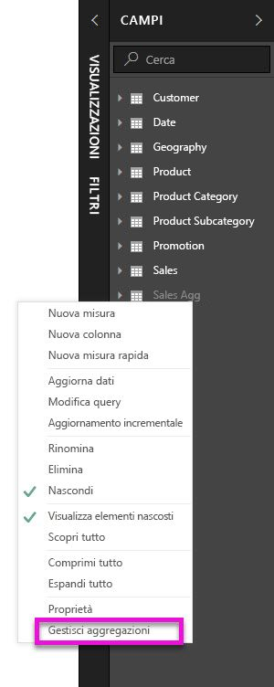
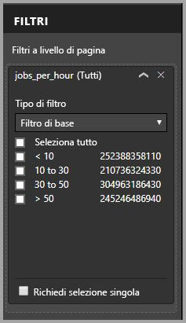

# Aggregazioni in Power BI Desktop (anteprima)

L'uso delle **aggregazioni** in Power BI consente di eseguire analisi interattive su big data in modi che in precedenza non erano possibili. Le **aggregazioni** possono ridurre notevolmente il costo dello sblocco di grandi set di dati da impiegare per processi decisionali.

L'elenco seguente indica i vantaggi derivanti dall'utilizzo delle **aggregazioni**:

* **Prestazioni delle query su set di dati di grandi dimensioni**: quando gli utenti interagiscono con gli oggetti visivi nei report di Power BI, al set di dati vengono inviate query DAX. L'elaborazione delle query ha una velocità maggiore grazie alla memorizzazione dei dati nella cache a livello di aggregazione e usa una frazione delle risorse necessarie per l'elaborazione a livello di dettaglio. I big data vengono sbloccati in un modo che non sarebbe altrimenti possibile.
* **Ottimizzazione dell'aggiornamento dati**: le dimensioni della cache e i tempi di aggiornamento sono inferiori perché i dati vengono memorizzati a livello di aggregazione. Il tempo necessario per rendere i dati disponibili per gli utenti è minore.
* **Creazione di architetture bilanciate**: la cache in memoria di Power BI gestisce le query aggregate in modo efficace. Le query inviate all'origine dati in modalità DirectQuery sono limitate per facilitare il rispetto dei limiti di concorrenza. Le query che vengono accettate tendono ad essere query di livello transazionale filtrate che vengono, generalmente, gestite correttamente dai sistemi per big data e dai data warehouse.

### Archiviazione a livello di tabella
L'archiviazione a livello di tabella viene in genere usata insieme alla funzionalità di aggregazione. Vedere l'articolo [Modalità di archiviazione in Power BI Desktop (anteprima)](desktop-storage-mode.md) per altre informazioni.

### Tipi di origini dati
Le aggregazioni vengono utilizzate con origini dati che rappresentano modelli dimensionali, ad esempio data warehouse o data mart, nonché con origini big data basate su Hadoop. Questo articolo descrive le comuni differenze di modellazione in Power BI per ogni tipo di origine dati.

Tutte le origini Import e DirectQuery (non multidimensionali) di Power BI funzionano con le aggregazioni.

## Abilitazione della funzionalità di anteprima delle aggregazioni

La funzionalità **aggregazioni** è disponibile in anteprima e deve essere abilitata in **Power BI Desktop**. Per abilitare le **aggregazioni**, selezionare **File > Opzioni e impostazioni > Opzioni > Funzionalità di anteprima** e quindi selezionare le caselle di controllo **Modelli compositi** e **Gestisci aggregazioni**. 

È necessario riavviare **Power BI Desktop** per rendere effettiva la modifica.

## Aggregazioni basate su relazioni

Le **aggregazioni** basate su relazioni sono in genere utilizzate con modelli dimensionali. I set di dati di Power BI che traggono origine da data warehouse e data mart assomigliano a schemi star o snowflake e presentano relazioni tra tabelle delle dimensioni e tabelle dei fatti.

Si consideri il modello seguente, che proviene da una singola origine dati. Si supponga che, per iniziare, tutte le tabelle usino DirectQuery. La tabella dei fatti **Sales** contiene miliardi di righe. L'impostazione della modalità di archiviazione di **Sales** su **Import** per la memorizzazione nella cache comporterebbe un notevole sovraccarico della memoria e delle funzionalità di gestione.

Quindi, la tabella **Sales Agg** verrà creata come tabella di aggregazione. Ha una granularità maggiore rispetto a **Sales** e pertanto conterrà molte meno righe. Il numero di righe è uguale alla somma di **SalesAmount** con i valori raggruppati per **CustomerKey**, **DateKey** e **ProductSubcategoryKey**. Anziché miliardi di righe ci saranno milioni di righe, una quantità molto più facile da gestire.

Si supponga che le seguenti tabelle delle dimensioni siano quelle usate più spesso per le query con elevato valore per l'azienda. Sono le tabelle con le quali è possibile filtrare **Sales Agg** utilizzando relazioni *uno-a-molti* o *molti-a-uno*. Relazioni di altri tipi, ad esempio *molti-a-molti* oppure *multiorigine*, non vengono considerate per le aggregazioni.

* Geografia
* Cliente
* Data
* Sottocategoria prodotto
* Categoria prodotto

L'immagine seguente mostra questo modello.

> [!NOTE]
> La tabella **Sales Agg** è semplicemente un'altra tabella, pertanto offre la flessibilità di essere caricata in vari modi. Ad esempio, l'aggregazione può essere eseguita nel database di origine utilizzando i processi ETL/ELT oppure usando l'[espressione M](https://msdn.microsoft.com/query-bi/m/power-query-m-reference) per la tabella. Può usare la modalità di archiviazione Import, con o senza [aggiornamento incrementale in Power BI Premium](service-premium-incremental-refresh.md), oppure la modalità DirectQuery ed essere ottimizzata per query veloci usando [gli indici columnstore](https://docs.microsoft.com/sql/relational-databases/indexes/columnstore-indexes-overview). Questa flessibilità consente di creare architetture bilanciate in cui il carico di query viene ripartito per evitare i colli di bottiglia.

### Modalità di archiviazione 
Continuiamo con l'esempio illustrato. Impostiamo la modalità di archiviazione di **Sales Agg** su **Import** per velocizzare le query.

Quando si esegue questa operazione, viene visualizzata la finestra di dialogo seguente in cui si segnala che le tabelle delle dimensioni correlate verranno impostate sulla modalità di archiviazione **Dual**. 

L'impostazione **Dual** consente alle tabelle delle dimensioni di utilizzare la modalità Import o DirectQuery, a seconda della sottoquery.

* Le query con cui si aggregano le metriche della tabella **Sales Agg**, ovvero di tipo Import, e che raggruppano i valori in base a uno o più attributi delle tabelle Dual correlate possono essere restituite dalla cache in memoria.
* Le query con cui si aggregano le metriche della tabella **Sales**, ovvero di tipo DirectQuery, e che raggruppano i valori in base a uno o più attributi delle tabelle Dual correlate, possono essere restituite in modalità DirectQuery. La logica di query che include l'operazione Raggruppa per verrà passata al database di origine.

Per altre informazioni sulla modalità di archiviazione **Dual**, vedere l'articolo [Modalità di archiviazione](desktop-storage-mode.md).

> Nota: Ia tabella **Sales Agg** è nascosta. Le tabelle di aggregazione devono essere nascoste dai consumer del set di dati. I consumer e le query fanno riferimento alla tabella dettagli, non alla tabella di aggregazione. Non è nemmeno necessario che siano a conoscenza dell'esistenza della tabella di aggregazione.

### finestra di dialogo Gestisci aggregazioni
A questo punto verranno definite le aggregazioni. Selezionare il menu di scelta rapida **Gestisci aggregazioni** per **Sales Agg** facendo clic sulla tabella con il pulsante destro del mouse.

Viene visualizzata la finestra di dialogo **Gestisci aggregazioni**. Mostra una riga per ogni colonna della tabella **Sales Agg**, in cui è possibile specificare la modalità di aggregazione. Le query inviate al set di dati di Power BI che fanno riferimento alla tabella **Sales** vengono reindirizzate internamente alla tabella **Sales Agg**. Non è necessario che i consumer del set di dati conoscano l'esistenza della tabella **Sales Agg**.

Nella tabella seguente vengono mostrate le aggregazioni per la tabella **Sales Agg**.

#### Funzione Esecuzione del riepilogo

Nell'elenco a discesa Esecuzione del riepilogo sono disponibili i valori di selezione seguenti.
* Conteggio
* GroupBy
* Max
* Min
* Somma
* Conta righe della tabella

#### Convalide

Dalla finestra di dialogo vengono applicate le seguenti importanti convalide:

* La colonna dettagli selezionata deve avere lo stesso tipo di dati della colonna aggregazioni, eccettuato per le funzioni di Conteggio e Conta righe della tabella. Conteggio e Conta righe della tabella sono presenti solo per colonne di aggregazione di tipo integer e non richiedono un tipo di dati corrispondente.
* Le aggregazioni concatenate che coprono tre o più tabelle non sono consentite. Non è ad esempio possibile configurare le aggregazioni nella **Tabella A** che fa riferimento alla **Tabella B** contenente aggregazioni che fanno riferimento alla **Tabella C**.
* Le aggregazioni duplicate in cui due voci usano la stessa funzione di riepilogo e fanno riferimento alla stessa tabella/colonna dettagli non sono consentite.

Durante questa anteprima pubblica delle **aggregazioni** vengono applicate anche le convalide seguenti. Si prevede che queste convalide vengano rimosse prima del rilascio per la disponibilità generale.

* Le aggregazioni non sono utilizzabili con la sicurezza a livello di riga. *Limitazione dell'anteprima pubblica.*
* La tabella dettagli deve essere DirectQuery, non Import. *Limitazione dell'anteprima pubblica.*

La maggior parte delle convalide di questo tipo vengono applicate disabilitando i valori dell'elenco a discesa e visualizzando il testo esplicativo nella descrizione comando, come illustrato nell'immagine seguente.

### Colonne GroupBy

In questo esempio, le tre voci GroupBy sono facoltative, non influiscono sulla modalità di aggregazione con la sola eccezione della query di esempio DISTINCTCOUNT, illustrata nella prossima figura. Sono incluse principalmente per scopi di leggibilità. Senza queste voci GroupBy, le aggregazioni verrebbero ancora raggiunte in base alle relazioni. Questo comportamento si distingue dall'utilizzo delle aggregazioni senza relazioni, come illustrato nell'esempio dei big data più avanti in questo articolo.

### Rilevare se le aggregazioni sono raggiunte o ignorate dalle query

Per altre informazioni su come rilevare se le query vengono restituite dalla cache in memoria (motore di archiviazione) o in modalità DirectQuery, cioè inviate tramite push all'origine dati con SQL Profiler, vedere l'articolo [Modalità di archiviazione](desktop-storage-mode.md). Lo stesso processo può essere utilizzato anche per rilevare se le aggregazioni sono raggiunte.

Inoltre, il seguente evento esteso viene fornito in SQL Profiler.

    Query Processing\Aggregate Table Rewrite Query

Il frammento di codice JSON seguente mostra un esempio dell'output dell'evento generato quando viene utilizzata un'aggregazione.

* **matchingResult** indica che per la sottoquery è stata utilizzata un'aggregazione.
* **dataRequest** mostra le colonne Group-By e le colonne aggregate usate dalla sottoquery.
* **mapping** mostra le colonne nella a cui è stato eseguito il mapping tabella di aggregazione.

### Esempi di query
La query seguente raggiunge l'aggregazione perché le colonne nella tabella *Date* sono al livello di granularità corretto per raggiungere l'aggregazione. Per **SalesAmount** verrà utilizzata l'aggregazione **Sum**.

La query seguente non raggiungerà l'aggregazione. Nonostante richieda la somma di **SalesAmount**, esegue un'operazione di raggruppamento su una colonna della tabella **Product**, che non è al livello di granularità corretto per raggiungere l'aggregazione. Se si osservano le relazioni nel modello, si nota che una sottocategoria di prodotto può avere più righe **Product** e la query non sarebbe in grado di determinare il prodotto da aggregare. In questo caso, la query torna alla modalità DirectQuery e invia una query SQL all'origine dati.

Le aggregazioni non servono solo per eseguire semplici calcoli come banali somme. Possono servire anche per eseguire calcoli complessi. Concettualmente, un calcolo complesso viene suddiviso in sottoquery per ogni SUM, MIN, MAX e COUNT e ogni sottoquery viene valutata per determinare se l'aggregazione può essere raggiunta. Questa logica non risulta efficace in tutti i casi a causa dell'ottimizzazione del piano di query, ma in generale è applicabile. L'esempio seguente raggiunge l'aggregazione:

La funzione COUNTROWS può trarre vantaggio dalle aggregazioni. La query seguente raggiungerà l'aggregazione perché nella tabella **Sales** è presente un'aggregazione **Conta** righe della tabella.

La funzione AVERAGE può trarre vantaggio dalle aggregazioni. La query raggiungerà l'aggregazione perché AVERAGE viene trattata internamente come un'operazione SUM divisa per COUNT. Poiché la colonna **UnitPrice** dispone di aggregazioni definite per SUM e COUNT, l'aggregazione viene raggiunta.

In alcuni casi, la funzione DISTINCTCOUNT può trarre vantaggio dalle aggregazioni. La query seguente raggiungerà l'aggregazione perché è presente una voce GroupBy per **CustomerKey**, che mantiene le specificità di **CustomerKey** nella tabella di aggregazione. Questa tecnica è ancora soggetta alla soglia prestazioni per la quale una quantità di valori distinct superiore a due - cinque milioni può influire sulle prestazioni delle query. Tuttavia, può essere utile nelle situazioni in cui sono presenti miliardi di righe nella tabella dettagli e da due a cinque milioni di valori distinct nella colonna. In questo caso, l'operazione distinct count può essere svolta più velocemente rispetto all'analisi della tabella con miliardi di righe, anche se è stata memorizzata nella cache in memoria.

## Aggregazioni basate su colonne Group-By 

I modelli di big data basati su Hadoop hanno caratteristiche diverse rispetto ai modelli dimensionali. Per evitare join tra tabelle di grandi dimensioni, essi non si basano, in genere, sulle relazioni. Al contrario, gli attributi dimensione sono spesso denormalizzati e trasformati in tabelle dei fatti. Questi grossi modelli di big data possono essere sbloccati per l'analisi interattiva tramite **aggregazioni** basate su colonne Group-By.

La tabella seguente contiene la colonna numerica **Movement** da aggregare. Tutte le altre colonne sono gli attributi per il raggruppamento. La tabella contiene dati IoT e un elevato numero di righe. La modalità di archiviazione è DirectQuery. Le query sull'origine dati che eseguono l'aggregazione nell'intero set di dati sono lente a causa del volume elevato.

Per abilitare l'analisi interattiva in questo set di dati, aggiungiamo una tabella di aggregazione che raggruppa in base alla maggior parte di attributi ma esclude gli attributi con cardinalità elevata, ad esempio longitudine e latitudine. Ciò riduce notevolmente il numero di righe ed è sufficientemente piccola da rientrare agevolmente in un'istanza di cache in memoria. La modalità di archiviazione di **Driver Activity Agg** è Import.

Successivamente, si definiscono i mapping delle aggregazioni nella finestra di dialogo **Gestisci aggregazioni**. Visualizza una riga per ogni colonna della tabella **Driver Activity Agg**, in cui è possibile specificare la modalità di aggregazione.

Nella tabella seguente vengono mostrate le aggregazioni per la tabella **Sales Agg**.

### Colonne GroupBy

In questo esempio le voci **GroupBy** **non sono facoltative**; senza di esse le aggregazioni non verrebbero raggiunte. Questo comportamento è diverso rispetto all'uso delle aggregazioni basate su relazioni, come illustrato nell'esempio del modello dimensionale proposto in precedenza in questo articolo.

### Esempi di query

La query seguente raggiungerà l'aggregazione in quanto la colonna **Activity Date** è coperta dalla tabella di aggregazione. L'aggregazione Conta righe della tabella viene usata dalla funzione COUNTROWS.

In particolare per i modelli che contengono attributi di filtro nelle tabelle dei fatti, è consigliabile utilizzare le aggregazioni Conta righe della tabella. Power BI può inviare query al set di dati usando COUNTROWS nei casi in cui non è esplicitamente richiesto dall'utente. Ad esempio, la finestra di dialogo Filtri mostra il numero di righe per ogni valore.

## Precedenza di aggregazione

La precedenza di aggregazione consente a più tabelle di aggregazione di essere considerate da una singola sottoquery.

Si consideri l'esempio seguente. Si tratta di un [modello composito](desktop-composite-models.md) contenente più origini DirectQuery.

* La tabella **Driver Activity Agg2** di tipo Import ha una granularità molto elevata perché gli attributi group-by sono pochi e con cardinalità bassa. Il numero di righe potrebbe essere di appena qualche migliaio, pertanto la tabella potrebbe stare facilmente in un'istanza di cache in memoria. Poiché accade che questi attributi vengano utilizzati da un pannello personale di alto profilo, le query che fanno riferimento a essi devono essere più veloci possibile.
* La tabella **Driver Activity Agg** è una tabella di aggregazione intermedia con modalità DirectQuery. Contiene oltre un miliardo di righe ed è ottimizzata nell'origine tramite indici columnstore.
* La tabella **Driver Activity** è in modalità DirectQuery e contiene oltre un trilione di righe di dati IoT originati da un sistema per big data. Serve query drill-through per visualizzare singole letture IoT in contesti filtro controllati.

Il footprint della memoria di questo modello è relativamente piccolo, ma sblocca un set di dati di grandi dimensioni. Rappresenta un'architettura bilanciata perché distribuisce il carico di query tra i componenti dell'architettura e li utilizza in base ai punti di forza.

La finestra di dialogo **Gestisci aggregazioni** per **Driver Activity Agg2** mostra che il campo *Precedenza* è 10, ovvero superiore a quello di **Driver Activity Agg**. Questo significa che verrà considerato prima dalle query che usano le aggregazioni. Le sottoquery il cui livello di granularità non consente di ottenere una risposta da **Driver Activity Agg2** prenderanno in considerazione **Driver Activity Agg**. Le query dettagli a cui non può rispondere nessuna delle tabelle di aggregazione verranno indirizzate a **Driver Activity**.

La tabella specificata nella colonna **Detail Table** è **Driver Activity** non **Driver Activity Agg**, perché le aggregazioni concatenate non sono consentite. A questo proposito, vedere [convalide](#validations) più indietro in questo articolo.

Nella tabella seguente vengono mostrate le aggregazioni per la tabella **Sales Agg**.

## Aggregazioni basate su colonne Group-By combinate con relazioni

È anche possibile combinare le due tecniche di aggregazione descritte in precedenza in questo articolo. Le **aggregazioni** basate su relazioni potrebbero richiedere che le tabelle con le dimensioni denormalizzate vengano suddivise in più tabelle. Se questo risulta dispendioso o poco efficiente per alcune tabelle delle dimensioni, gli attributi necessari possono essere replicati nella tabella di aggregazione per determinate dimensioni e relazioni utilizzate per altri utenti.

Il seguente modello replica i valori *Month*, *Quarter*, *Semester* e *Year* nella tabella **Sales Agg**. Non esiste alcuna relazione tra la tabella **Sales Agg** e la tabella **Date**. Sono presenti relazioni con **Customer** e **Product Subcategory**. La modalità di archiviazione di **Sales Agg** è Import.

La tabella seguente mostra le voci impostate nella finestra di dialogo **Gestisci aggregazioni** della tabella **Sales Agg**. Le voci GroupBy in cui **Date** è la tabella dei dettagli sono obbligatorie per raggiungere le aggregazioni per le query che raggruppano in base agli attributi Date. Come nell'esempio precedente, le voci GroupBy per CustomerKey e ProductSubcategoryKey non influiscono sui riscontri di aggregazione a causa della presenza di relazioni, comunque con l'eccezione di DISTINCTCOUNT.

> Nota: poiché si tratta di una tabella dei dettagli, questo modello richiede che la tabella **Date** sia in modalità DirectQuery per compilare la finestra di dialogo Gestisci aggregazioni. Si tratta di una limitazione dell'anteprima che verrà probabilmente rimossa per la disponibilità generale.

### Esempi di query

La query seguente raggiunge l'aggregazione perché CalendarMonth è coperto dalla tabella di aggregazione e CategoryName è accessibile tramite le relazioni uno-a-molti. Verrà utilizzata l'aggregazione Sum per **SalesAmount**.

La query seguente non raggiungerà l'aggregazione perché CalendarDay non è coperto dalla tabella di aggregazione.

La seguente query di business intelligence non raggiungerà l'aggregazione in quanto la funzione DATESYTD genera una tabella di valori CalendarDay, che non sono coperti dalla tabella di aggregazione.

## Le cache devono essere mantenute sincronizzate

Le **aggregazioni** in cui le modalità di archiviazione DirectQuery e Import e/o Dual sono combinate possono restituire dati diversi se la cache in memoria non viene mantenuta sincronizzata con i dati di origine. L'esecuzione di query non tenterà di mascherare problemi dei dati, ad esempio filtrando i risultati di DirectQuery in modo che corrispondano ai valori memorizzati nella cache. Queste funzionalità rappresentano un'ottimizzazione delle prestazioni e devono essere usate solo in modi che non compromettano la possibilità di soddisfare i requisiti aziendali. È responsabilità dell'utente conoscere i flussi di dati e progettare il sistema di conseguenza. Esistono tecniche consolidate per gestire questi problemi nell'origine, se necessario.

## Passaggi successivi

Gli articoli seguenti includono ulteriori informazioni sui modelli compositi e descrivono anche la modalità DirectQuery in modo dettagliato.

* [Modelli compositi in Power BI Desktop (anteprima)](desktop-composite-models.md)
* [Relazioni molti-a-molti in Power BI Desktop (anteprima)](desktop-many-to-many-relationships.md)
* [Modalità di archiviazione in Power BI Desktop (anteprima)](desktop-storage-mode.md)

Articoli su DirectQuery:

* [Uso di DirectQuery in Power BI](desktop-directquery-about.md)
* [Origini dati supportate da DirectQuery in Power BI](desktop-directquery-data-sources.md)

