# Usare le aggregazioni in Power BI Desktop

Le *aggregazioni* in Power BI consentono di ridurre le dimensioni delle tabelle per potersi concentrare sui dati importanti e migliorare le prestazioni delle query. Le aggregazioni consentono l'analisi interattiva su Big Data in modi altrimenti non possibili e possono ridurre notevolmente i costi di sblocco di set di dati di grandi dimensioni per il processo decisionale.

Di seguito sono riportati alcuni vantaggi dell'uso delle aggregazioni:

- **Aumento delle prestazioni delle query sui Big Data**. Ogni interazione con gli oggetti visivi di Power BI invia query DAX al set di dati. I dati aggregati memorizzati nella cache usano una frazione delle risorse necessarie per i dati dettaglio, quindi è possibile sbloccare Big Data che altrimenti sarebbero inaccessibili.
- **Ottimizzazione dell'aggiornamento dei dati**. Poiché le minori dimensioni della cache riducono i tempi di aggiornamento, i dati vengono inviati agli utenti più velocemente.
- **Bilanciamento delle architetture**. La cache in memoria di Power BI può gestire query aggregate, limitando le query inviate in modalità DirectQuery e consentendo di rispettare i limiti di concorrenza. Le rimanenti query a livello di dettaglio tendono a essere query di livello transazionale filtrate che vengono, generalmente, gestite correttamente dai sistemi per Big Data e dai data warehouse.

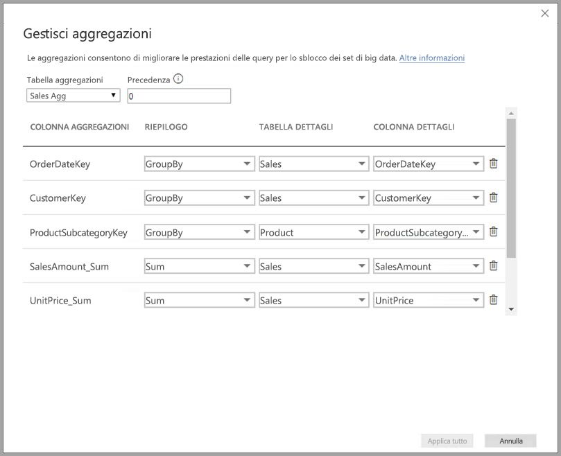

Le origini dati dimensionali, ad esempio data warehouse e data mart, possono usare le [aggregazioni basate su relazioni](#aggregation-based-on-relationships). Le origini Big Data basate su Hadoop spesso [basano le aggregazioni su colonne GroupBy](#aggregation-based-on-groupby-columns). Questo articolo descrive le comuni differenze di modellazione di Power BI per ogni tipo di origine dati.

## Creare una tabella aggregata

Per creare una tabella aggregata:
1. Configurare una nuova tabella con i campi desiderati, a seconda dell'origine dati e del modello. 
1. Definire le aggregazioni usando la finestra di dialogo **Gestisci aggregazioni**.
1. Se applicabile, modificare la [modalità di archiviazione](#storage-modes) per la tabella aggregata. 

### Gestisci aggregazioni

Dopo aver creato la nuova tabella con i campi desiderati, nel riquadro **Campi** di qualsiasi visualizzazione di Power BI Desktop fare clic con il pulsante destro del mouse sulla tabella e scegliere **Gestisci aggregazioni**.

La finestra di dialogo **Gestisci aggregazioni** mostra una riga per ogni colonna della tabella, in cui è possibile specificare il comportamento di aggregazione. Nell'esempio seguente le query sulla tabella dei dettagli **Sales** vengono reindirizzate internamente alla tabella delle aggregazioni **Sales Agg**. 

L'elenco a discesa **Riepilogo** della finestra di dialogo **Gestisci aggregazioni** include i valori seguenti:
- Conteggio
- GroupBy
- Max
- Min
- Somma
- Count table rows

In questo esempio di aggregazione basata su relazioni le voci GroupBy sono facoltative. A eccezione di DISTINCTCOUNT, non influiscono sul comportamento di aggregazione e servono soprattutto a migliorare la leggibilità. Senza le voci GroupBy, le aggregazioni verrebbero comunque raggiunte in base alle relazioni, a differenza di quanto accade nell'[esempio dei Big Data](#aggregation-based-on-groupby-columns) più avanti in questo articolo, in cui le voci GroupBy sono necessarie.

Dopo aver definito le aggregazioni desiderate, selezionare **Applica tutto**. 

### Convalide

La finestra di dialogo **Gestisci aggregazioni** applica le importanti convalide seguenti:

- **Colonna dettagli** deve avere lo stesso tipo di dati di **Colonna aggregazioni**, eccettuato per le funzioni Conteggio e Conta righe della tabella in **Riepilogo**. Conteggio e Conta righe della tabella sono disponibili solo per le colonne delle aggregazioni di tipo Integer e non richiedono un tipo di dati corrispondente.
- Le aggregazioni concatenate che coprono tre o più tabelle non sono consentite. Ad esempio, le aggregazioni in **Tabella A** non possono fare riferimento a una **Tabella B** contenente aggregazioni che fanno riferimento a una **Tabella C**.
- Le aggregazioni duplicate, in cui due voci usano la stessa funzione di **Riepilogo** e fanno riferimento alla stessa **Tabella dettagli** e **Colonna dettagli**, non sono consentite.
- La **Tabella dettagli** deve usare la modalità di archiviazione DirectQuery, non Import.
- Il raggruppamento in base a una colonna di chiave esterna usata da una relazione inattiva e l'uso della funzione USERELATIONSHIP per i riscontri di aggregazione non sono supportati.

La maggior parte delle convalide viene applicata disabilitando i valori dell'elenco a discesa e visualizzando il testo esplicativo nella descrizione comando, come illustrato nell'immagine seguente.

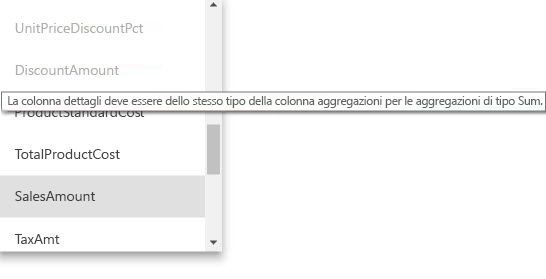

### Le tabelle di aggregazione sono nascoste

Gli utenti con accesso in sola lettura al set di dati non possono eseguire query sulle tabelle di aggregazione. In questo modo si evitano problemi di sicurezza quando vengono usate con la *sicurezza a livello di riga*. Gli utenti finali e le query fanno riferimento alla tabella dei dettagli, non alla tabella delle aggregazioni e non è necessario che siano a conoscenza della tabella delle aggregazioni.

Per questo motivo, le tabelle delle aggregazioni sono nascoste nella visualizzazione **Report**. Se la tabella non è già nascosta, la finestra di dialogo **Gestisci aggregazioni** la imposterà come nascosta quando si seleziona **Applica tutto**.

### Modalità di archiviazione
La funzionalità di aggregazione interagisce con le modalità di archiviazione a livello di tabella. Le tabelle di Power BI possono usare le modalità di archiviazione *DirectQuery*, *Import* o *Dual*. DirectQuery esegue una query direttamente sul back-end, mentre Import memorizza nella cache i dati in memoria e invia le query ai dati memorizzati nella cache. Tutte le origini dati Import e DirectQuery non multidimensionali di Power BI possono usare le aggregazioni. 

Per impostare la modalità di archiviazione di una tabella aggregata su Import per velocizzare le query, selezionare la tabella aggregata nella visualizzazione **Modello** di Power BI Desktop. Nel riquadro **Proprietà** espandere **Avanzate** e nell'elenco a discesa **Modalità di archiviazione** selezionare **Import**. Tenere presente che questa operazione è irreversibile. 

Per altre informazioni sulle modalità di archiviazione delle tabelle, vedere [Gestire la modalità di archiviazione in Power BI Desktop](desktop-storage-mode.md).

### Sicurezza a livello di riga per le aggregazioni

Per il corretto funzionamento delle aggregazioni, le espressioni di sicurezza a livello di riga devono filtrare sia la tabella delle aggregazioni che la tabella dei dettagli. 

Nell'esempio seguente l'espressione di sicurezza a livello di riga sulla tabella **Geography** funziona per le aggregazioni, perché Geography è presente sul lato del filtro delle relazioni sia con la tabella **Sales** che con la tabella **Sales Agg**. La sicurezza a livello di riga verrà applicata correttamente sia alle query che raggiungono la tabella di aggregazione che a quelle che non la raggiungono.

Un'espressione di sicurezza a livello di riga sulla tabella **Product** filtra soltanto la tabella dei dettagli **Sales**, non la tabella aggregata **Sales Agg**. Dal momento che la tabella di aggregazione è semplicemente un'altra rappresentazione dei dati presenti nella tabella dei dettagli, rispondere alle query dalla tabella delle aggregazioni non è un'operazione sicura se il filtro della sicurezza a livello di riga non può essere applicato. Non è consigliabile filtrare solo la tabella dei dettagli, perché le query degli utenti da questo ruolo non usufruiranno dei riscontri di aggregazione. 

Un'espressione di sicurezza a livello di riga che filtra solo la tabella delle aggregazioni **Sales Agg** e non la tabella dei dettagli **Sales** non è consentita.

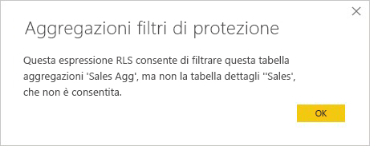

Per le [aggregazioni basate sulle colonne GroupBy](#aggregation-based-on-groupby-columns), un'espressione di sicurezza a livello di riga applicata alla tabella dei dettagli può essere usata per filtrare la tabella delle aggregazioni perché tutte le colonne GroupBy nella tabella delle aggregazioni sono previste dalla tabella dei dettagli. D'altra parte, un filtro di sicurezza a livello di riga sulla tabella delle aggregazioni non può essere applicato alla tabella dei dettagli, quindi non è consentito.

## Aggregazione basata su relazioni

I modelli dimensionali in genere usano le *aggregazioni basate su relazioni*. I set di dati di Power BI provenienti da data warehouse e data mart assomigliano a schemi star o snowflake e presentano relazioni tra tabelle delle dimensioni e tabelle dei fatti.

Nel modello seguente da una singola origine dati, le tabelle usano la modalità di archiviazione DirectQuery. La tabella dei fatti **Sales** contiene miliardi di righe. L'impostazione della modalità di archiviazione di **Sales** su Import per la memorizzazione nella cache comporterebbe un notevole sovraccarico della memoria e delle funzionalità di gestione.

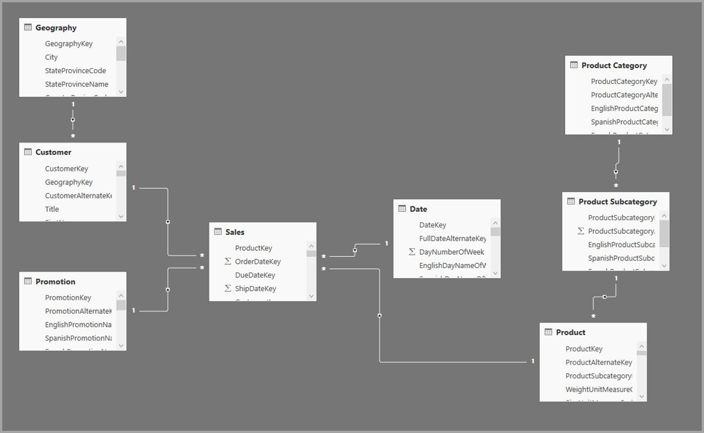

Creare invece la tabella delle aggregazioni **Sales Agg**. Nella tabella **Sales Agg** il numero di righe è uguale alla somma di **SalesAmount** con i valori raggruppati per **CustomerKey**, **DateKey** e **ProductSubcategoryKey**. La tabella **Sales Agg** ha una granularità più elevata di **Sales**, quindi invece di miliardi di righe, può contenerne milioni, che è molto più facile gestire.

Se le tabelle delle dimensioni seguenti sono le più usate per le query con valore di business elevato, possono filtrare **Sales Agg**, usando relazioni *uno-a-molti* o *molti-a-uno*.

- Geografia
- Cliente
- Data
- Product Subcategory
- Categoria prodotto

L'immagine seguente mostra questo modello.

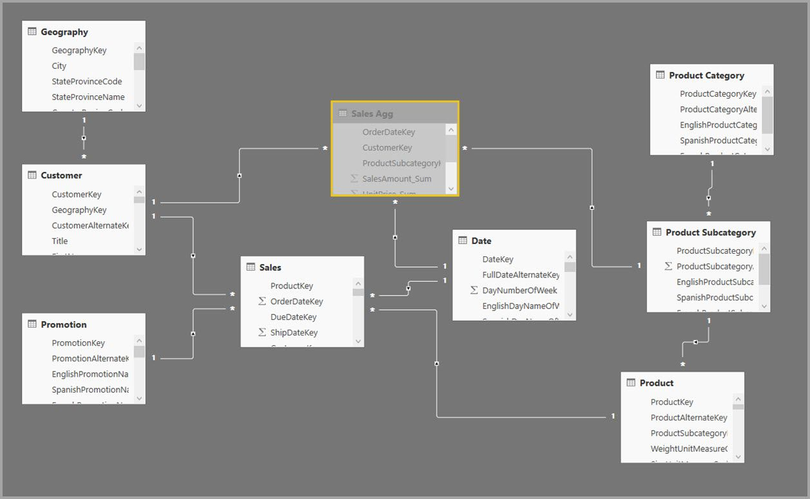

Nella tabella seguente vengono mostrate le aggregazioni per la tabella **Sales Agg**.

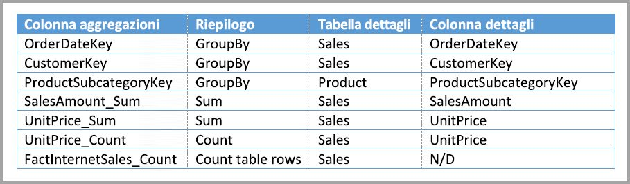

> [!NOTE]
> La tabella **Sales Agg**, come qualsiasi tabella, offre la flessibilità di essere caricata in vari modi. L'aggregazione può essere eseguita nel database di origine usando i processi ETL/ELT oppure usando l'[espressione M](/powerquery-m/power-query-m-function-reference) per la tabella. La tabella aggregata può usare la modalità di archiviazione Import, con o senza [aggiornamento incrementale in Power BI Premium](service-premium-incremental-refresh.md), oppure la modalità DirectQuery ed essere ottimizzata per query veloci usando gli [indici columnstore](/sql/relational-databases/indexes/columnstore-indexes-overview). Questa flessibilità consente di creare architetture bilanciate in cui il carico di query può essere ripartito per evitare i colli di bottiglia.

Impostando la modalità di archiviazione della tabella **Sales Agg** aggregata su **Import**, si apre una finestra di dialogo che informa che le tabelle delle dimensioni correlate possono essere impostate sulla modalità di archiviazione *Dual*. 

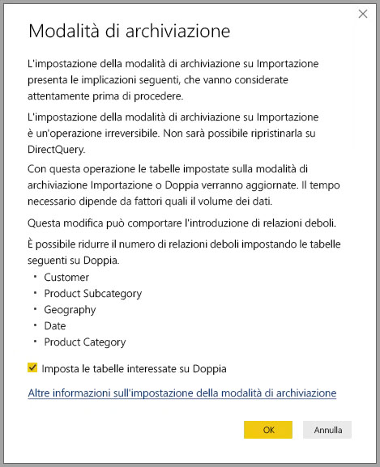

L'impostazione delle tabelle delle dimensioni correlate su Dual consente di usare la modalità Import o DirectQuery, a seconda della sottoquery. Nell'esempio:

- Le query con cui si aggregano le metriche della tabella **Sales Agg** in modalità Import e che raggruppano i valori in base a uno o più attributi delle tabelle Dual correlate possono essere restituite dalla cache in memoria.
- Le query con cui si aggregano le metriche dalla tabella **Sales** DirectQuery e che raggruppano i valori in base a uno o più attributi delle tabelle Dual correlate, possono essere restituite in modalità DirectQuery. La logica di query, che include l'operazione GroupBy, viene passata al database di origine.

Per altre informazioni sulla modalità di archiviazione Dual, vedere [Gestire la modalità di archiviazione in Power BI Desktop](desktop-storage-mode.md).

### Relazioni forti e deboli

I riscontri delle aggregazioni basati sulle relazioni richiedono relazioni forti.

Le relazioni forti includono le combinazioni seguenti di modalità di archiviazione, in cui entrambe le tabelle provengono da una singola origine:

| Tabella sui lati *molti* | Tabella sul lato *uno* |
| ------------- |----------------------| 
| Doppia          | Doppia                 | 
| Importa        | Importa o Doppia       | 
| DirectQuery   | DirectQuery o Doppia  | 

Una relazione *tra origini diverse* è considerata forte esclusivamente se entrambe le tabelle sono impostate su Import. Le relazioni molti-a-molti sono sempre considerate deboli.

Per i riscontri di aggregazione *tra origini diverse* che non dipendono da relazioni, vedere [Aggregazioni basate su colonne GroupBy](#aggregation-based-on-groupby-columns). 

### Esempi di query di aggregazione basata su relazioni

La query seguente raggiunge l'aggregazione perché le colonne nella tabella **Date** sono al livello di granularità corretto per raggiungere l'aggregazione. La colonna **SalesAmount** usa l'aggregazione **Sum**.

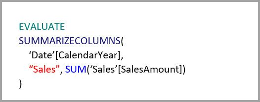

La query seguente non raggiunge l'aggregazione. Nonostante richieda la somma di **SalesAmount**, la query esegue un'operazione GroupBy su una colonna della tabella **Product**, che non è al livello di granularità corretto per raggiungere l'aggregazione. Se si osservano le relazioni nel modello, una sottocategoria di prodotti può avere più righe **Product**. La query non potrebbe determinare il prodotto in cui eseguire l'aggregazione. In questo caso, la query torna alla modalità DirectQuery e invia una query SQL all'origine dati.

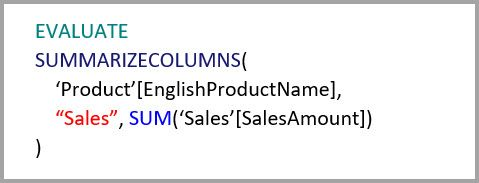

Le aggregazioni non servono solo per eseguire semplici calcoli come banali somme. Possono servire anche per eseguire calcoli complessi. Concettualmente, un calcolo complesso viene suddiviso in sottoquery per ogni SUM, MIN, MAX e COUNT e ogni sottoquery viene valutata per determinare se può raggiungere l'aggregazione. Questa logica non risulta efficace in tutti i casi a causa dell'ottimizzazione del piano di query, ma in generale è applicabile. L'esempio seguente raggiunge l'aggregazione:

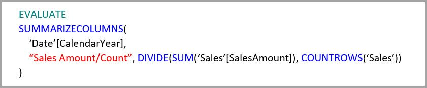

La funzione COUNTROWS può trarre vantaggio dalle aggregazioni. La query seguente raggiunge l'aggregazione perché per la tabella **Sales** è definita un'aggregazione di righe della tabella **Count**.

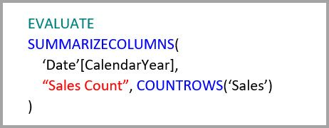

La funzione AVERAGE può trarre vantaggio dalle aggregazioni. La query raggiunge l'aggregazione perché AVERAGE viene trattata internamente come un'operazione SUM divisa per COUNT. Poiché la colonna **UnitPrice** dispone di aggregazioni definite per SUM e COUNT, l'aggregazione viene raggiunta.

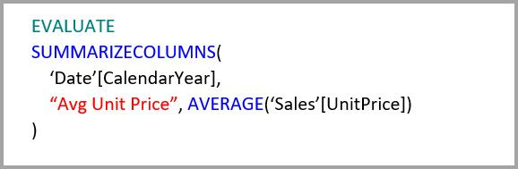

In alcuni casi, la funzione DISTINCTCOUNT può trarre vantaggio dalle aggregazioni. La query seguente raggiunge l'aggregazione perché è presente una voce GroupBy per **CustomerKey**, che mantiene le specificità di **CustomerKey** nella tabella di aggregazione. Questa tecnica potrebbe comunque raggiungere la soglia delle prestazioni per la quale una quantità di valori distinct superiore a due - cinque milioni può influire sulle prestazioni delle query. Può tuttavia essere utile nelle situazioni in cui sono presenti miliardi di righe nella tabella dei dettagli, ma da due a cinque milioni di valori distinct nella colonna. In questo caso, l'operazione DISTINCTCOUNT può essere svolta più velocemente rispetto all'analisi della tabella con miliardi di righe, anche se è stata memorizzata nella cache in memoria.

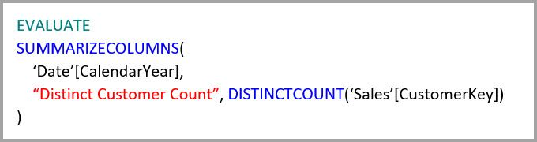

Le funzioni di time intelligence DAX sono compatibili con le aggregazioni. La query seguente raggiunge l'aggregazione perché la funzione DATESYTD genera una tabella di valori **CalendarDay** e la tabella di aggregazione è a un livello di granularità coperto per le colonne group-by nella tabella **Date**. Questo è un esempio di filtro con valori di tabella per la funzione CALCULATE, che può funzionare con le aggregazioni.

## Aggregazione basata su colonne GroupBy 

I modelli di big data basati su Hadoop hanno caratteristiche diverse rispetto ai modelli dimensionali. Per evitare join tra tabelle di grandi dimensioni, i modelli di Big Data spesso non usano le relazioni, ma denormalizzano gli attributi delle dimensioni in tabelle dei fatti. È possibile sbloccare questi modelli di Big Data di grandi dimensioni per l'analisi interattiva usando *aggregazioni basate su colonne GroupBy*.

La tabella seguente contiene la colonna numerica **Movement** da aggregare. Tutte le altre colonne sono gli attributi per il raggruppamento. La tabella contiene dati IoT e un elevato numero di righe. La modalità di archiviazione è DirectQuery. Le query sull'origine dati che eseguono l'aggregazione nell'intero set di dati sono lente a causa del volume elevato. 

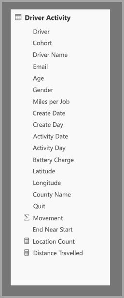

Per abilitare l'analisi interattiva in questo set di dati, è possibile aggiungere una tabella di aggregazione che esegue il raggruppamento in base alla maggior parte degli attributi, ma esclude gli attributi con cardinalità elevata, ad esempio longitudine e latitudine. Ciò riduce notevolmente il numero di righe ed è sufficientemente piccola da rientrare agevolmente in un'istanza di cache in memoria. 

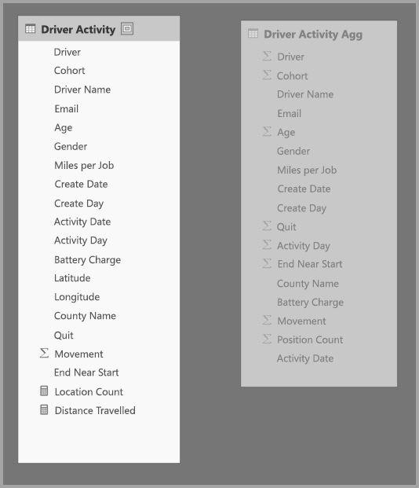

I mapping delle aggregazioni per la tabella **Driver Activity Agg** vengono definiti nella finestra di dialogo **Gestisci aggregazioni**. 

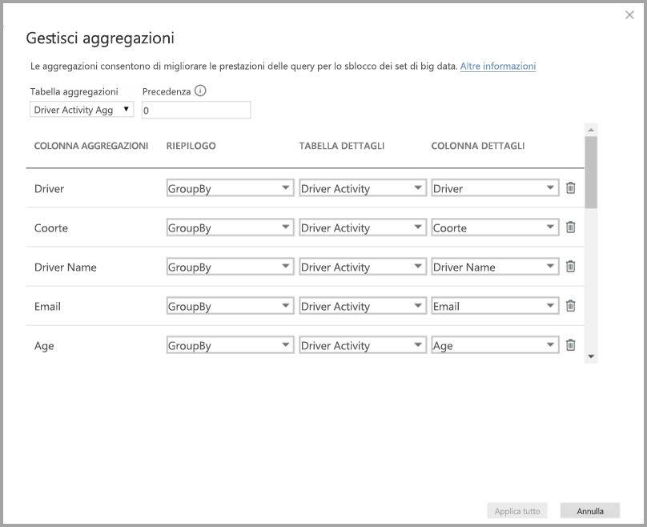

Nelle aggregazioni basate su colonne GroupBy, le voci **GroupBy** non sono facoltative. Senza di esse, le aggregazioni non verranno raggiunte. Non è come usare le aggregazioni basate su relazioni, dove le voci GroupBy sono facoltative.

La tabella seguente mostra le aggregazioni per la tabella **Driver Activity Agg**.

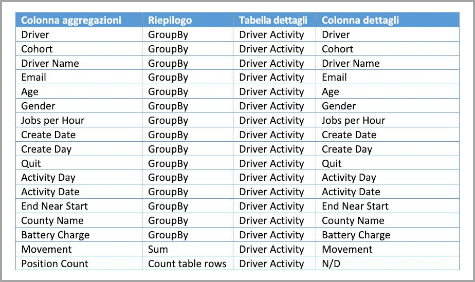

È possibile impostare la modalità di archiviazione della tabella aggregata **Driver Activity Agg** su Import.

### Esempio di query di aggregazione GroupBy

La query seguente raggiunge l'aggregazione perché la colonna **Activity Date** è coperta dalla tabella delle aggregazioni. La funzione COUNTROWS usa l'aggregazione **Conta righe della tabella**.

In particolare per i modelli che contengono attributi di filtro nelle tabelle dei fatti, è consigliabile usare le aggregazioni **Conta righe della tabella**. Power BI può inviare query al set di dati usando COUNTROWS nei casi in cui non è esplicitamente richiesto dall'utente. Ad esempio, la finestra di dialogo Filtri mostra il numero di righe per ogni valore.

## Tecniche di aggregazione combinate

È possibile combinare le tecniche delle relazioni e delle colonne GroupBy per le aggregazioni. Le aggregazioni basate su relazioni potrebbero richiedere che le tabelle con le dimensioni denormalizzate vengano suddivise in più tabelle. Se questo risulta dispendioso o poco efficiente per alcune tabelle delle dimensioni, è possibile replicare gli attributi necessari nella tabella delle aggregazioni per tali dimensioni e usare le relazioni per le altre.

Il modello seguente, ad esempio, replica i valori **Month**, **Quarter**, **Semester** e **Year** nella tabella **Sales Agg**. Non esistono relazioni tra **Sales Agg** e la tabella **Date**, ma sono presenti relazioni con **Customer** e **Product Subcategory**. La modalità di archiviazione di **Sales Agg** è Import.

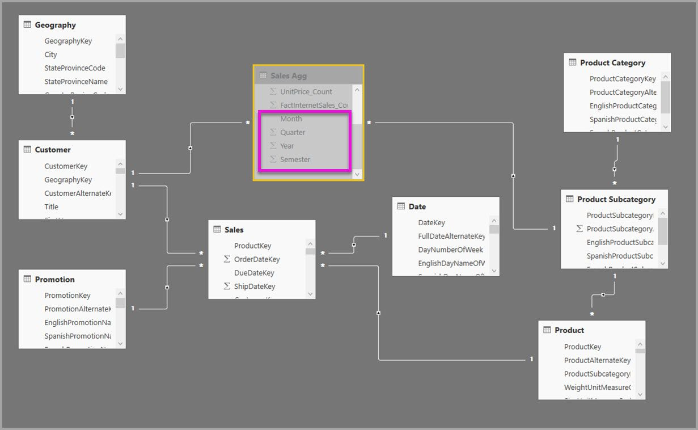

La tabella seguente mostra le voci impostate nella finestra di dialogo **Gestisci aggregazioni** della tabella **Sales Agg**. Le voci GroupBy in cui **Date** è la tabella dei dettagli sono obbligatorie per raggiungere le aggregazioni per le query che eseguono il raggruppamento in base agli attributi **Date**. Come nell'esempio precedente, le voci **GroupBy** per **CustomerKey** e **ProductSubcategoryKey** non influiscono sui riscontri delle aggregazioni, fatta eccezione per DISTINCTCOUNT, a causa della presenza di relazioni.

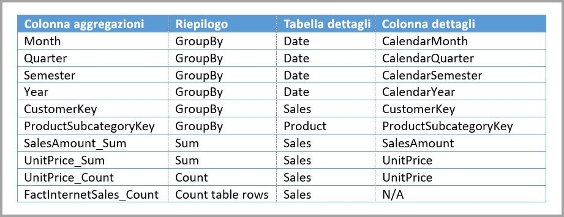

### Esempi di query di aggregazione combinate

La query seguente raggiunge l'aggregazione perché la tabella delle aggregazioni copre **CalendarMonth** e **CategoryName** è accessibile tramite le relazioni uno-a-molti. **SalesAmount** usa l'aggregazione **SUM**.

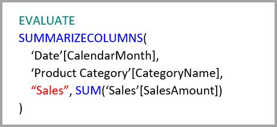

La query seguente non raggiunge l'aggregazione perché la tabella delle aggregazioni non copre **CalendarDay**.

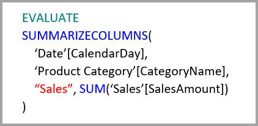

La seguente query di Business Intelligence per le gerarchie temporali non raggiunge l'aggregazione perché la funzione DATESYTD genera una tabella di valori **CalendarDay** e la tabella delle aggregazioni non copre **CalendarDay**.

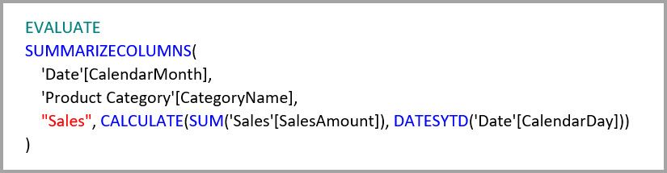

## Precedenza di aggregazione

La precedenza di aggregazione consente a più tabelle di aggregazione di essere considerate da una singola sottoquery.

L'esempio seguente è un [modello composito](desktop-composite-models.md) contenente più origini:

- La tabella in modalità DirectQuery **Driver Activity** contiene oltre un trilione di righe di dati IoT originati da un sistema per Big Data. Serve query drill-through per visualizzare singole letture IoT in contesti filtro controllati.
- La tabella **Driver Activity Agg** è una tabella di aggregazione intermedia con modalità DirectQuery. Contiene oltre un miliardo di righe in Azure SQL Data Warehouse ed è ottimizzata all'origine tramite indici columnstore.
- La tabella **Driver Activity Agg2** di tipo Import ha una granularità molto elevata perché gli attributi group-by sono pochi e con cardinalità bassa. Il numero di righe potrebbe essere di appena qualche migliaio, pertanto la tabella potrebbe stare facilmente in un'istanza di cache in memoria. Poiché accade che questi attributi vengano utilizzati da un pannello personale di alto profilo, le query che fanno riferimento a essi devono essere più veloci possibile.

> [!NOTE]
> Le tabelle delle aggregazioni DirectQuery che usano un'origine dati diversa dalla tabella dei dettagli sono supportate solo se la tabella delle aggregazioni proviene da un'origine SQL Server, Azure SQL o Azure SQL Data Warehouse.

Il footprint della memoria di questo modello è relativamente piccolo, ma sblocca un set di dati di grandi dimensioni. Rappresenta un'architettura bilanciata perché distribuisce il carico di query tra i componenti dell'architettura e li utilizza in base ai punti di forza.

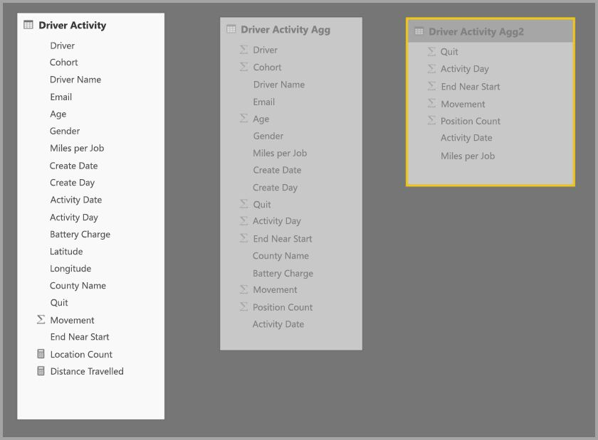

La finestra di dialogo **Gestisci aggregazioni** per **Driver Activity Agg2** imposta il campo **Precedenza** su *10*, ovvero su un valore più elevato che per **Driver Activity Agg**. L'impostazione di precedenza più elevata indica che le query che usano le aggregazioni considereranno prima **Driver Activity Agg2**. Le sottoquery il cui livello di granularità non consente di ottenere una risposta da **Driver Activity Agg2** prenderanno in considerazione **Driver Activity Agg**. Le query dettagli a cui non può rispondere nessuna delle tabelle di aggregazione verranno indirizzate a **Driver Activity**.

La tabella specificata nella colonna **Tabella dettagli** è **Driver Activity** non **Driver Activity Agg**, perché le aggregazioni concatenate non sono consentite.

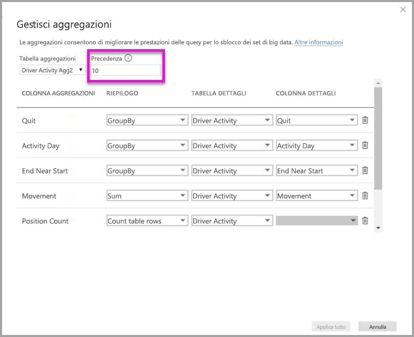

La tabella seguente mostra le aggregazioni per la tabella **Driver Activity Agg2**.

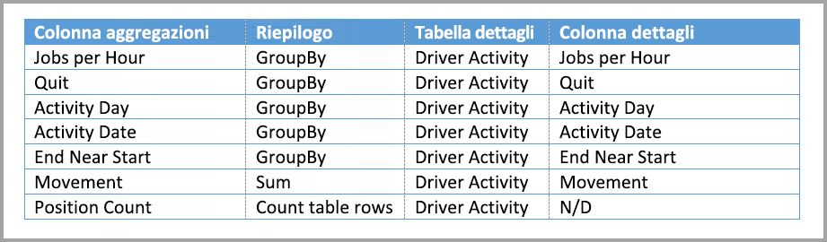

## Rilevare se le query raggiungono o meno le aggregazioni

SQL Profiler può rilevare se le query vengono restituite dal motore di archiviazione della cache in memoria o se ne viene eseguito il push nell'origine dati da DirectQuery. È possibile usare lo stesso processo per rilevare se le aggregazioni sono raggiunte. Per altre informazioni, vedere [Query con o senza riscontri nella cache](desktop-storage-mode.md#queries-that-hit-or-miss-the-cache). 

SQL Profiler fornisce anche l'evento esteso `Query Processing\Aggregate Table Rewrite Query`.

Il frammento di codice JSON seguente mostra un esempio dell'output dell'evento generato quando viene utilizzata un'aggregazione.

- **matchingResult** indica che la sottoquery ha usato un'aggregazione.
- **dataRequest** mostra le colonne GroupBy e le colonne aggregate usate dalla sottoquery.
- **mapping** mostra le colonne nella a cui è stato eseguito il mapping tabella di aggregazione.

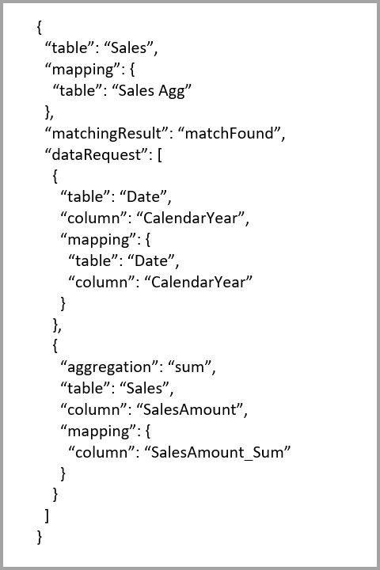

## Mantenere sincronizzate le cache

Le aggregazioni in cui le modalità di archiviazione DirectQuery, Import e/o Dual sono combinate possono restituire dati diversi a meno che la cache in memoria venga mantenuta sincronizzata con i dati di origine. Ad esempio, l'esecuzione della query non proverà a mascherare i problemi dei dati filtrando i risultati di DirectQuery in modo che corrispondano ai valori memorizzati nella cache. Esistono tecniche consolidate per gestire questi problemi nell'origine, se necessario. Le ottimizzazioni delle prestazioni devono essere usate solo in modi che non compromettano la possibilità di soddisfare i requisiti aziendali. È responsabilità dell'utente conoscere i flussi di dati e progettare il sistema di conseguenza. 

## Passaggi successivi

Per altre informazioni sui modelli compositi, vedere:

- [Usare modelli compositi in Power BI Desktop](desktop-composite-models.md)
- [Applicare le relazioni molti-a-molti in Power BI Desktop](desktop-many-to-many-relationships.md)
- [Gestire la modalità di archiviazione in Power BI Desktop](desktop-storage-mode.md)

Per altre informazioni su DirectQuery, vedere:

- [Informazioni sull'uso di DirectQuery in Power BI](desktop-directquery-about.md)
- [Origini dati di Power BI](desktop-directquery-data-sources.md)
