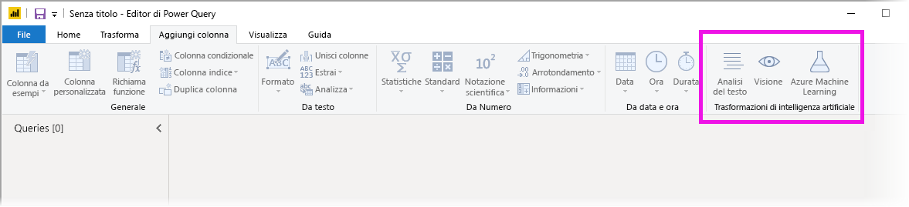
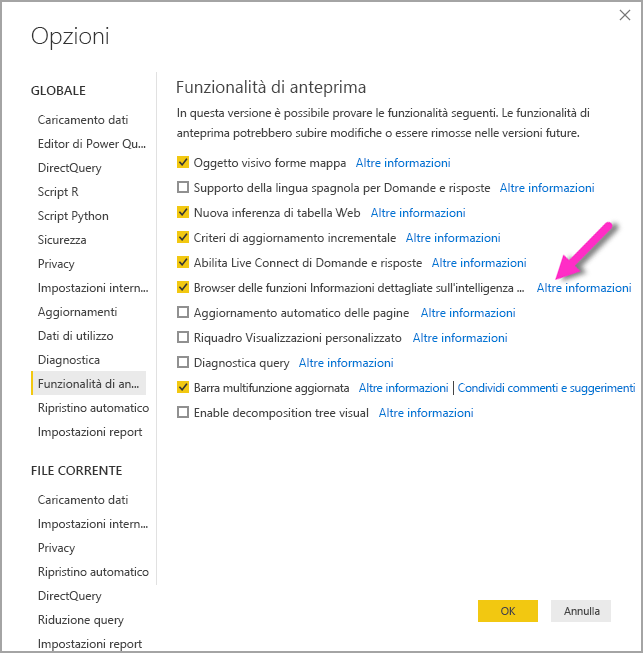
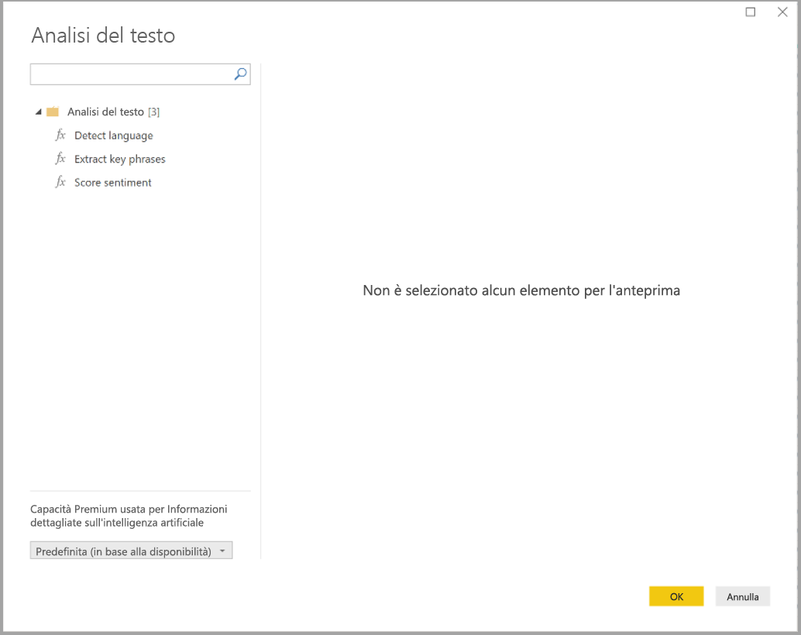
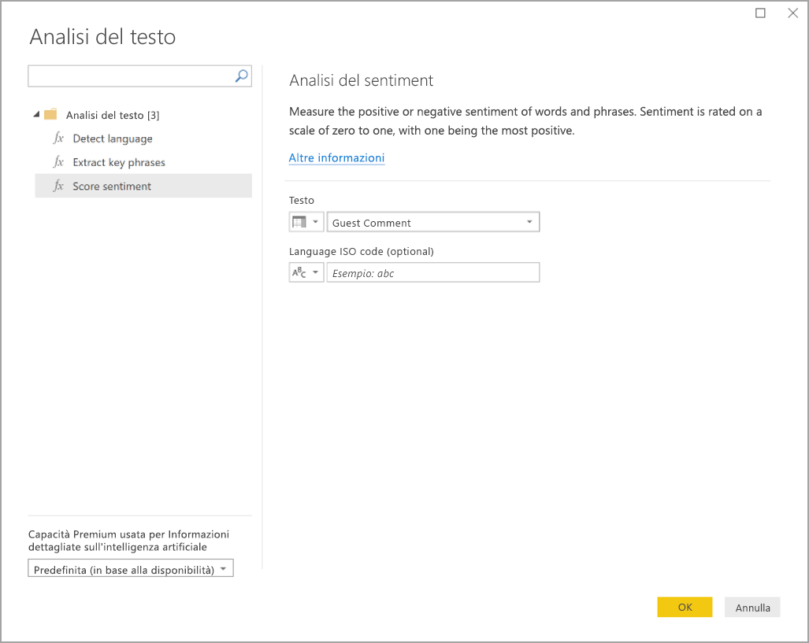
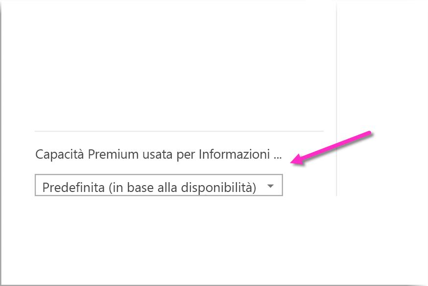
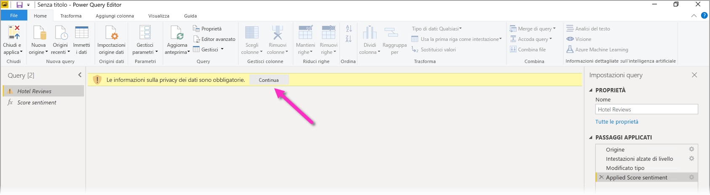
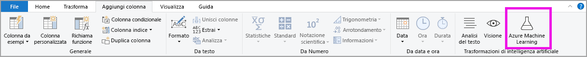
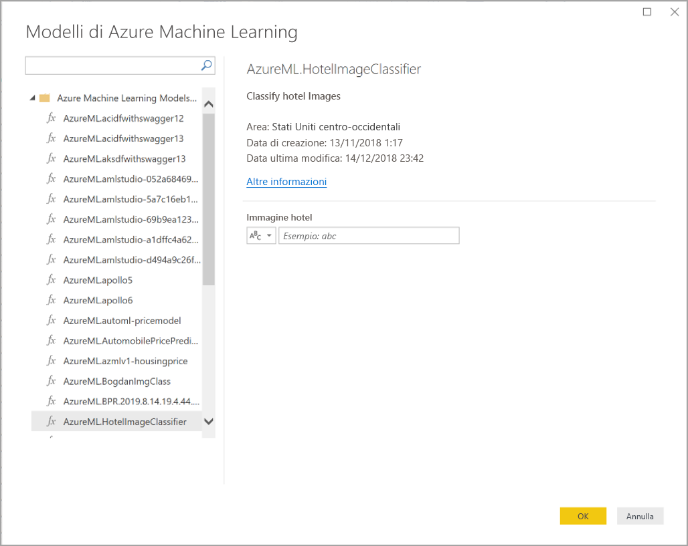

# Usare Informazioni dettagliate sull'intelligenza artificiale in Power BI Desktop (anteprima)

In Power BI è possibile usare Informazioni dettagliate sull'intelligenza artificiale per accedere a una raccolta di modelli di Machine Learning di cui è già stato eseguito il training che migliorano le attività di preparazione dei dati. È possibile accedere a Informazioni dettagliate sull'intelligenza artificiale nell'**Editor di Power Query** e alle funzionalità e funzioni associate tramite le schede **Home** e **Aggiungi colonna** dell'**Editor di Power query**. 

Questo articolo descrive le funzioni di Analisi del testo e Visione artificiale, entrambe funzioni di Servizi cognitivi di Azure. Questo articolo include anche una sezione in cui vengono descritte le funzioni personalizzate di Azure Machine Learning disponibili in Power BI.

## Come abilitare Informazioni dettagliate sull'intelligenza artificiale

Informazioni dettagliate sull'intelligenza artificiale è una funzionalità di anteprima di Power BI che è necessario abilitare. Per abilitarla, selezionare **File > Opzioni e impostazioni > Opzioni** e selezionare **Funzionalità di anteprima** dalla colonna a sinistra. Nel riquadro di destra è presente l'opzione **Browser delle funzioni Informazioni dettagliate sull'intelligenza artificiale**. Selezionare la casella di controllo accanto a **Browser delle funzioni Informazioni dettagliate sull'intelligenza artificiale** per abilitare la funzionalità di anteprima. Per rendere effettiva la modifica relativa alla funzionalità di anteprima è necessario riavviare Power BI Desktop.

## Uso di Analisi del testo e Visione artificiale

In Power BI Analisi del testo e Visione artificiale consentono di applicare diversi algoritmi dei [Servizi cognitivi di Azure](https://azure.microsoft.com/services/cognitive-services/) per arricchire i dati in Power Query.

I servizi attualmente supportati sono i seguenti:

* [Analisi del sentiment](https://docs.microsoft.com/azure/cognitive-services/text-analytics/how-tos/text-analytics-how-to-sentiment-analysis)
* [Estrazione frasi chiave](https://docs.microsoft.com/azure/cognitive-services/text-analytics/how-tos/text-analytics-how-to-keyword-extraction)
* [Rilevamento lingua](https://docs.microsoft.com/azure/cognitive-services/text-analytics/how-tos/text-analytics-how-to-language-detection)
* [Assegnazione di tag alle immagini](https://docs.microsoft.com/azure/cognitive-services/computer-vision/concept-tagging-images) 

Le trasformazioni vengono eseguite nel servizio Power BI e non richiedono una sottoscrizione di Servizi cognitivi di Azure. 

> [!IMPORTANT]
> 
> Per usare le funzionalità Analisi del testo o Visione artificiale, è necessario Power BI Premium.

### Abilitazione di Analisi del testo e Visione artificiale per le capacità Premium

Le funzionalità di Servizi cognitivi sono supportate per i nodi della capacità Premium EM2, A2 o P1 e superiori. Per eseguire Servizi cognitivi nella capacità viene usato un carico di lavoro di Intelligenza artificiale separato. Durante l'anteprima pubblica di queste funzionalità, antecedente a giugno 2019, questo carico di lavoro era disabilitato per impostazione predefinita. Prima di usare Servizi cognitivi in Power BI è necessario abilitare il carico di lavoro di Intelligenza artificiale nelle **impostazioni di capacità** nel portale di amministrazione. È possibile attivare il **carico di lavoro di Intelligenza artificiale** nella sezione **Carichi di lavoro** e definire la quantità massima di memoria che può usare. Il limite consigliato per la memoria è pari al 20%. Il superamento di questo limite causa il rallentamento della query.

### Funzioni disponibili

Questa sezione descrive le funzioni disponibili in Servizi cognitivi in Power BI.

#### Rileva lingua

La funzione di rilevamento della lingua valuta l'input di testo e, per ogni campo, restituisce il nome della lingua e l'identificatore ISO. Questa funzione è utile per le colonne di dati che raccolgono testo arbitrario, la cui lingua è sconosciuta. La funzione accetta come input dati in formato testo.

Analisi del testo riconosce fino a 120 lingue. Per altre informazioni, vedere [Supporto lingua e area geografica per l'API Analisi del testo](https://docs.microsoft.com/azure/cognitive-services/text-analytics/text-analytics-supported-languages).

#### Estrarre le frasi chiave

La funzione **Estrazione frasi chiave** valuta il testo non strutturato e, per ogni campo di testo, restituisce un elenco di frasi chiave. La funzione richiede come input un campo di testo e accetta un input facoltativo per **Info su impostazioni cultura**.

L'estrazione di espressioni chiave risulta più efficiente quando si elaborano blocchi di testo più grandi, diversamente dalla funzione Analisi del sentiment che offre le migliori prestazioni su blocchi di testo più piccoli. Per ottenere risultati ottimali da entrambe le operazioni, provare a ristrutturare gli input di conseguenza.

#### Analisi del sentiment

La funzione **Analisi del sentiment** valuta l'input di testo e restituisce un punteggio del sentiment per ogni documento, compreso tra 0 (negativo) e 1 (positivo). Questa funzione è utile per rilevare il sentiment positivo e negativo in social media, recensioni dei clienti e forum di discussione.

Analisi del testo usa un algoritmo di classificazione di Machine Learning per generare un punteggio del sentiment compreso tra 0 e 1. I punteggi più vicini a 1 indicano un sentiment positivo, quelli più vicini a 0 indicano un sentiment negativo. Il modello è stato precedentemente sottoposto a training con un corpo di testo di grandi dimensioni con associazioni di sentiment. Attualmente non è possibile fornire dati di training personali. Il modello usa una combinazione di tecniche durante l'analisi del testo, tra cui elaborazione del testo, analisi delle parti del discorso, disposizione delle parole e associazioni di parole. Per altre informazioni sull'algoritmo, vedere [Introducing Text Analytics](https://blogs.technet.microsoft.com/machinelearning/2015/04/08/introducing-text-analytics-in-the-azure-ml-marketplace/) (Introduzione ad Analisi del testo).

L'analisi del sentiment viene eseguita sull'intero campo di input, a differenza dell'estrazione del sentiment per una particolare entità nel testo. In pratica, si è osservata una tendenza al miglioramento della precisione del punteggio quando i documenti contengono una o due frasi invece di un intero blocco di testo. Durante una fase di valutazione dell'obiettività, il modello determina se un campo di input nel suo insieme è obiettivo o contiene sentiment. Un campo di input prevalentemente obiettivo non passa alla fase di rilevamento del sentiment, producendo un punteggio di 0,50 senza ulteriore elaborazione. Per i campi di input che proseguono nella pipeline, la fase successiva genera un punteggio superiore o inferiore a 0,50, a seconda del grado di sentiment rilevato nel campo di input.

Attualmente la funzione Analisi del sentiment supporta le lingue seguenti: inglese, tedesco, spagnolo e francese. Altre lingue sono disponibili in anteprima. Per altre informazioni, vedere [Supporto lingua e area geografica per l'API Analisi del testo](https://docs.microsoft.com/azure/cognitive-services/text-analytics/text-analytics-supported-languages).

#### Assegnazione di tag alle immagini

La funzione **Aggiungi tag alle immagini** restituisce tag sulla base di più di duemila oggetti, esseri viventi, paesaggi e azioni riconoscibili. Quando i tag sono ambigui o non sono comunemente noti, l'output offre *suggerimenti* per chiarire il significato del tag nel contesto di un'ambientazione nota. I tag non sono organizzati in una tassonomia e non esiste alcuna gerarchia di ereditarietà. Una raccolta di tag di contenuti costituisce la base della *descrizione* di un'immagine visualizzata come linguaggio leggibile formattato in frasi complete.

Dopo il caricamento di un'immagine o la definizione di un URL di immagine, gli algoritmi di Visione artificiale generano tag in base agli oggetti, alle azioni e agli esseri umani identificati nell'immagine. L'assegnazione di tag non è limitata al soggetto principale, come la persona in primo piano, ma si estende all'ambiente (interno o esterno), all'arredamento, agli attrezzi, alle piante, agli animali, agli accessori e così via.

Questa funzione richiede un URL immagine o un campo Base 64 come input. Attualmente la funzione di assegnazione di tag alle immagini supporta le lingue seguenti: inglese, spagnolo, giapponese, portoghese e cinese semplificato. Per altre informazioni, vedere [Supporto lingua e area geografica per l'API Analisi del testo](https://docs.microsoft.com/rest/api/cognitiveservices/computervision/tagimage/tagimage#uri-parameters).

### Richiamo di funzioni di Analisi del testo o Visione artificiale in Power Query

Per arricchire i dati con le funzioni Analisi del testo o Visione artificiale, aprire l'**Editor di Power Query**. Questo esempio illustra come assegnare un punteggio all'analisi del sentiment di un testo. Gli stessi passaggi possono essere usati per estrarre le frasi chiave, rilevare la lingua e assegnare tag alle immagini.

Selezionare il pulsante **Analisi del testo** nella barra multifunzione **Home** o **Aggiungi colonna**. Verrà richiesto di eseguire l'accesso.

Dopo aver eseguito l'accesso, selezionare la funzione da usare e la colonna di dati che si vuole trasformare in finestra popup.

Power BI seleziona una capacità Premium in cui eseguire la funzione e invia i risultati a Power BI Desktop. La capacità selezionata viene usata solo per Analisi del testo e Visione artificiale durante le operazioni e gli aggiornamenti in Power BI Desktop. Una volta pubblicato il report, gli aggiornamenti vengono eseguiti sulla capacità Premium dell'area di lavoro in cui viene pubblicato il report. È possibile modificare la capacità usata per tutti i Servizi cognitivi nell'elenco a discesa nell'angolo inferiore sinistro della finestra popup.

**Cultureinfo** è un input facoltativo che specifica la lingua del testo. Questo campo contiene un codice ISO. Come input per Cultureinfo è possibile usare una colonna oppure un campo statico. In questo esempio la lingua scelta è l'inglese, specificato come "en" per l'intera colonna. Se si lascia vuoto questo campo, Power BI rileva automaticamente la lingua prima di applicare la funzione. In seguito selezionare **Applica**.

La prima volta che si usa Informazioni dettagliate sull'intelligenza artificiale in una nuova origine dati, viene richiesto di impostare il livello di privacy dei dati.

> [!NOTE]
> Gli aggiornamenti del set di dati in Power BI funzionano solo per le origini dati per cui il livello di privacy è impostato su pubblico o aziendale.

Dopo il richiamo della funzione, il risultato viene aggiunto come nuova colonna alla tabella. Anche la trasformazione viene aggiunta come passaggio applicato nella query.

Nel caso di aggiunta di tag alle immagini ed estrazione di frasi chiave, i risultati possono restituire più valori. Ogni singolo risultato viene restituito in un duplicato della riga originale.

### Pubblicazione di un report con le funzioni Analisi del testo o Visione artificiale

Quando si eseguono modifiche in Power Query e aggiornamenti in Power BI Desktop, Analisi del testo e Visione artificiale usano la capacità Premium selezionata nell'editor di Power Query. Dopo la pubblicazione del report in Power BI, viene usata la capacità Premium dell'area di lavoro in cui il report è stato pubblicato.

I report per cui sono state usate le funzioni Analisi del testo e Visione artificiale devono essere pubblicati in un'area di lavoro non associata a una capacità Premium. In caso contrario, l'aggiornamento del set di dati avrà esito negativo.

### Gestione dell'effetto su una capacità Premium

Le sezioni seguenti descrivono come è possibile gestire gli effetti di Analisi del testo e Visione artificiale sulla capacità.

#### Selezione di una capacità

Gli autori del report possono selezionare la capacità Premium in cui eseguire Informazioni dettagliate sull'intelligenza artificiale. Per impostazione predefinita, Power BI seleziona la prima capacità creata a cui l'utente ha accesso.

#### Monitoraggio con l'app Metrica per la capacità

I proprietari della capacità Premium possono monitorare l'effetto delle funzioni Analisi del testo e Visione artificiale su una capacità con [l'app Metrica per le capacità Premium di Power BI](service-admin-premium-monitor-capacity.md). L'app offre metriche dettagliate sull'integrità dei carichi di lavoro di Intelligenza artificiale all'interno della capacità. Il grafico superiore indica l'utilizzo della memoria da parte dei carichi di lavoro di Intelligenza artificiale. Gli amministratori della capacità Premium possono impostare il limite di memoria per il carico di lavoro di Intelligenza artificiale per capacità. Quando l'utilizzo della memoria raggiunge il limite, è possibile aumentare il limite o spostare alcune aree di lavoro in una capacità diversa.

### Confronto tra Power Query e Power Query Online

Le funzioni Analisi del testo e Visione artificiale usate in Power Query e Power Query Online sono le stesse. Le uniche differenze tra le esperienze sono le seguenti:

* Power Query ha pulsanti separati per Analisi del testo, Visione artificiale e Azure Machine Learning. In Power Query Online queste funzioni sono unificate in un solo menu.
* In Power Query l'autore del report può selezionare la capacità Premium usata per eseguire le funzioni. Questa operazione non è necessaria in Power Query Online, perché in ogni capacità specifica è già presente un flusso di dati.

### Considerazioni e limitazioni di Analisi del testo

Quando si usa Analisi del testo è necessario tenere presenti alcune considerazioni e limitazioni.

* L'aggiornamento incrementale è supportato, ma può causare problemi di prestazioni quando viene usato nelle query con Informazioni dettagliate sull'intelligenza artificiale.
* Non è disponibile il supporto di DirectQuery.

## Uso di Azure Machine Learning

Numerose organizzazioni usano modelli di **Machine Learning** per ottenere informazioni dettagliate e stime migliori sulle proprie attività aziendali. La possibilità di visualizzare e richiamare informazioni dettagliate da questi modelli in report, dashboard e altri strumenti di analisi facilita la distribuzione di queste informazioni agli utenti aziendali che ne hanno maggiormente bisogno. Con Power BI è facile incorporare le informazioni dettagliate dei modelli ospitati in Azure Machine Learning, usando semplici movimenti di puntamento e clic.

Per usare questa funzionalità, un data scientist può semplicemente concedere all'analista di Power BI l'accesso al modello di Azure Machine Learning usando il portale di Azure. Quindi, all'inizio di ogni sessione, Power Query individua tutti i modelli di Azure Machine Learning a cui l'utente ha accesso e li espone come funzioni dinamiche di Power Query. L'utente può quindi richiamare queste funzioni accedendovi dalla barra multifunzione dell'editor di Power Query o richiamando direttamente la funzione M. Power BI inoltre invia in batch automaticamente le richieste di accesso quando richiama il modello di Azure Machine Learning per un set di righe, al fine di ottenere prestazioni migliori.

Questa funzionalità è supportata nei flussi di dati di Power BI Desktop e Power BI e per Power Query Online nel servizio Power BI.

Per altre informazioni sui flussi di dati, vedere [Preparazione dei dati self-service in Power BI](service-dataflows-overview.md).

Per altre informazioni su Azure Machine Learning, vedere gli articoli seguenti:

- Panoramica: [Cos'è Azure Machine Learning?](https://docs.microsoft.com/azure/machine-learning/service/overview-what-is-azure-ml)
- Guide di avvio rapido ed esercitazioni per Azure Machine Learning: [Documentazione di Azure Machine Learning](https://docs.microsoft.com/azure/machine-learning/)

### Concessione dell'accesso a un modello di Azure Machine Learning

Per accedere a un modello di Azure Machine Learning da Power BI, l'utente deve avere accesso in **lettura** alla sottoscrizione di Azure. Deve avere anche le autorizzazioni seguenti:

- Per i modelli di Machine Learning Studio (versione classica), accesso in **lettura** al servizio Web Machine Learning Studio (versione classica)
- Per i modelli di Machine Learning, accesso in **lettura** all'area di lavoro di Machine Learning

La procedura in questa sezione spiega come concedere a un utente di Power BI l'accesso a un modello ospitato nel servizio Azure Machine Learning, in modo che possa accedere a questo modello come a una funzione di Power Query. Per altre informazioni, vedere [Gestire l'accesso alle risorse di Azure usando il controllo degli accessi in base al ruolo e il portale di Azure](https://docs.microsoft.com/azure/role-based-access-control/role-assignments-portal).

1. Accedere al [portale di Azure](https://portal.azure.com/).
2. Passare alla pagina **Sottoscrizioni**. La pagina **Sottoscrizioni** è disponibile nell'elenco **Tutti i servizi** nel menu di spostamento a sinistra del portale di Azure.
3. Selezionare la propria sottoscrizione
4. Selezionare **Controllo di accesso (IAM)** e quindi il pulsante **Aggiungi**.
5. Selezionare **Lettore** come ruolo. Selezionare l'utente di Power BI a cui si vuole concedere l'accesso al modello di Azure Machine Learning.
6. Selezionare **Salva**
7. Ripetere i passaggi da 3 a 6 per assegnare all'utente il ruolo **Lettore** per l'accesso allo specifico servizio Web di Machine Learning Studio (versione classica) *o* all'area di lavoro di Machine Learning che ospita il modello.

### Individuazione dello schema per i modelli di Machine Learning

I data scientist usano principalmente Python per sviluppare, e persino per distribuire, i modelli di Machine Learning per Machine Learning. A differenza di Machine Learning Studio (versione classica), che consente di automatizzare l'attività di creazione di un file di schema per il modello, nel caso di Machine Learning il data scientist deve generare esplicitamente il file di schema mediante Python.

Questo file di schema deve essere incluso nel servizio Web distribuito per i modelli di Machine Learning. Per generare automaticamente lo schema per il servizio Web, è necessario fornire un esempio di input/output nello script di ingresso per il modello distribuito. Vedere la sottosezione sulla [generazione automatica (facoltativa) degli schemi Swagger nei modelli di distribuzione con Azure Machine Learning](https://docs.microsoft.com/azure/machine-learning/how-to-deploy-and-where#optional-define-model-web-service-schema) nella documentazione del servizio. Il collegamento include lo script di ingresso di esempio con le istruzioni per la generazione dello schema.

In particolare, le funzioni _@input\_schema_ e _@output\_schema_ nello script di ingresso fanno riferimento ai formati degli esempi di input e output nelle variabili _input\_sample_ e _output\_sample_ e usano questi esempi per generare una specifica OpenAPI (Swagger) per il servizio Web durante la distribuzione.

Le istruzioni per la generazione dello schema tramite l'aggiornamento dello script di ingresso devono essere applicate anche ai modelli creati con gli esperimenti di Machine Learning automatizzati e utilizzando l'SDK di Azure Machine Learning.

> [!NOTE]
> I modelli creati usando l'interfaccia visiva di Azure Machine Learning attualmente non supportano la generazione dello schema, ma la supporteranno nelle versioni successive.
> 
### Richiamare un modello di Azure Machine Learning in Power Query

È possibile richiamare un modello di Azure Machine Learning al quale si ha accesso direttamente dall'editor di Power Query. Per accedere ai modelli di Azure Machine Learning, selezionare il pulsante **Azure Machine Learning** nella barra multifunzione **Home** o **Aggiungi colonna** nell'editor di Power Query.

Tutti i modelli di Azure Machine Learning a cui si ha accesso sono elencati qui come funzioni di Power Query. Inoltre, i parametri di input del modello di Azure Machine Learning vengono automaticamente mappati ai parametri della funzione di Power Query corrispondente.

Per richiamare un modello di Azure Machine Learning è possibile specificare una qualsiasi delle colonne dell'entità selezionata come input dall'elenco a discesa. Si può anche specificare un valore di costante da usare come input attivando l'icona della colonna a sinistra della finestra di dialogo di input.

Selezionare **OK** per visualizzare l'anteprima dell'output del modello di Azure Machine Learning come nuova colonna nella tabella delle entità. Il richiamo del modello verrà visualizzato anche come passaggio applicato per la query.

Se il modello restituisce più parametri di output, questi vengono raggruppati in un unico record nella colonna di output. È possibile espandere la colonna per produrre singoli parametri di output in colonne separate.

### Considerazioni e limitazioni di Azure Machine Learning

Le considerazioni e le limitazioni seguenti si applicano a Azure Machine Learning in Power BI Desktop.

* I modelli creati usando l'interfaccia visiva di Azure Machine Learning attualmente non supportano la generazione dello schema. Il supporto è previsto per le versioni successive.
* L'aggiornamento incrementale è supportato, ma può causare problemi di prestazioni quando viene usato nelle query con Informazioni dettagliate sull'intelligenza artificiale.
* Non è disponibile il supporto di DirectQuery.

## Passaggi successivi

Questo articolo ha offerto una panoramica sull'integrazione di Machine Learning in Power BI Desktop. Potrebbero essere interessanti e utili anche gli articoli seguenti.

- [Esercitazione: Richiamare un modello di Machine Learning Studio (versione classica) in Power BI](service-tutorial-invoke-machine-learning-model.md)
- [Esercitazione: Uso di Servizi cognitivi in Power BI](service-tutorial-use-cognitive-services.md)
- [Servizi cognitivi in Power BI](service-cognitive-services.md)
- [Integrazione di Azure Machine Learning in Power BI](service-machine-learning-integration.md)
- [Monitoraggio delle capacità Premium con l'app](service-admin-premium-monitor-capacity.md)
- [Metriche di Intelligenza artificiale disponibili nell'app per le metriche di capacità Premium](https://powerbi.microsoft.com/blog/ai-metrics-now-available-in-power-bi-premium-capacity-metrics-app/)
