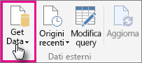
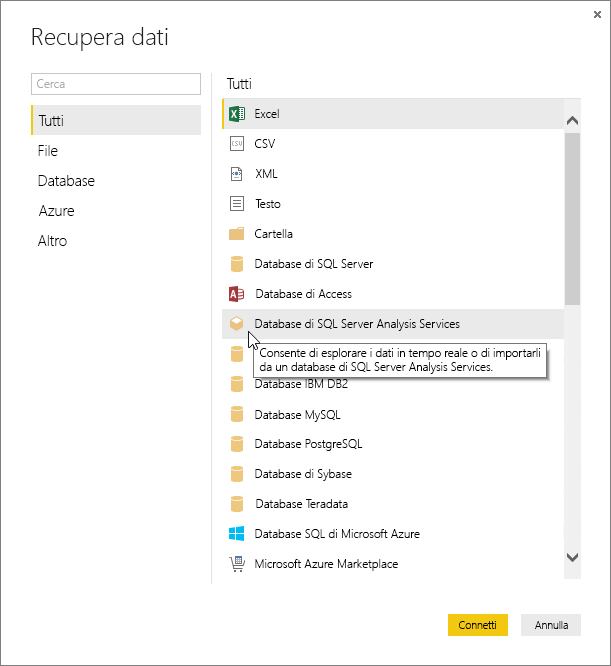
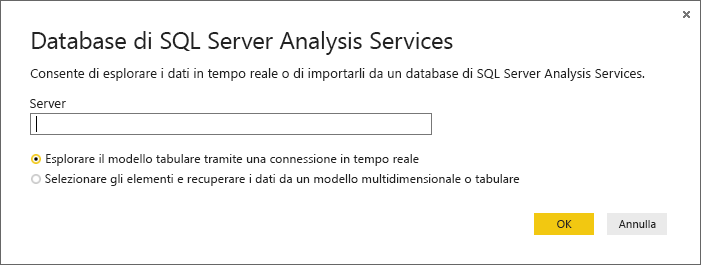
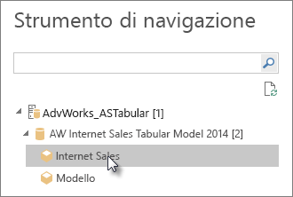
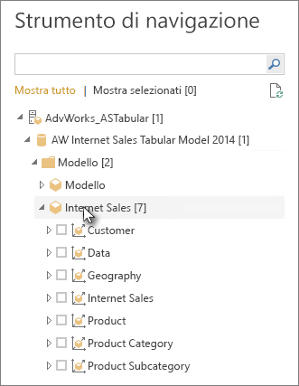
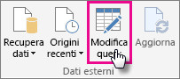
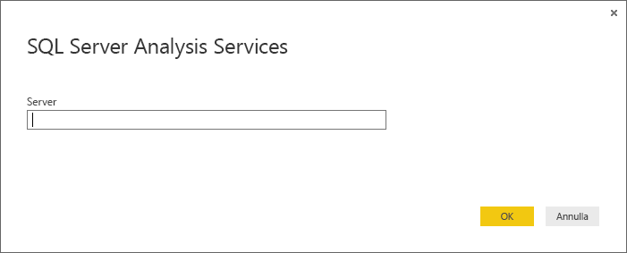

# Uso dei dati tabulari di SQL Server Analysis Services in Power BI Desktop
Con Power BI Desktop è possibile connettersi in due modi ai modelli tabulari di SQL Server Analysis Services e recuperare dati da tali modelli: Esplorare usando una connessione dinamica o Selezionare elementi e importarli in Power BI Desktop,

come verrà illustrato nelle sezioni successive.

**Esplorare usando una connessione in tempo reale** : quando si usa una connessione in tempo reale, gli elementi nel modello tabulare o nella prospettiva, come tabelle, colonne e misure compaiono nell'elenco dei campi di Power BI Desktop. È possibile usare gli strumenti di visualizzazione e report avanzati di Power BI Desktop per esplorare il modello tabulare in modi nuovi e altamente interattivi.

Durante la connessione in tempo reale, non viene importato alcun dato dal modello tabulare in Power BI Desktop. Ogni volta che si interagisce con una visualizzazione Power BI Desktop esegue una query sul modello tabulare e calcola i risultati visualizzati. I dati visualizzati sono sempre quelli più recenti disponibili nel modello tabulare, dall'ultima elaborazione o dalle tabelle DirectQuery disponibili nel modello tabulare. 

Tenere presente che i modelli tabulari sono molto sicuri. Gli elementi visualizzati in Power BI Desktop dipendono dalle autorizzazioni per il modello tabulare a cui si è connessi.

Dopo aver creato i report dinamici in Power BI Desktop, è possibile condividerli con la pubblicazione nel sito di Power BI. Quando si pubblica un file di Power BI Desktop con una connessione dinamica a un modello tabulare nel sito di Power BI, è necessario che il gateway dati locale sia installato e configurato dall'amministratore. Per altre informazioni, vedere [Gateway dati locale](service-gateway-onprem.md).

**Selezionare elementi e importarli in Power BI Desktop** : quando ci si connette con questa opzione, è possibile selezionare elementi quali tabelle, colonne e misure nel modello tabulare o prospettiva e caricarli in un modello di Power BI Desktop. È possibile usare l'Editor di query avanzato di Power BI Desktop per modellare ulteriormente i dati. È possibile usare le funzionalità di modellazione di Power BI Desktop per modellare ulteriormente i dati. Non viene mantenuta alcuna connessione in tempo reale tra Power BI Desktop e il modello tabulare. È quindi possibile esplorare il modello di Power BI Desktop offline o pubblicare nel sito di Power BI.

## Per connettersi a un modello tabulare
1. In Power BI Desktop, fare clic su **Recupera dati** nella scheda **Home**.
   
   
2. Fare clic su **SQL Server Analysis Services Database**, quindi fare clic su **Connetti**.
   
   
3. Immettere il nome del server e selezionare una modalità di connessione. 
   
   
4. Questo passaggio dipende dalla modalità di connessione che è stata selezionata:

* Se si esegue la connessione in tempo reale, nello Strumento di navigazione, selezionare un modello tabulare o una prospettiva.
  
  
* Se si è scelto di selezionare gli elementi e recuperare i dati, nello Strumento di navigazione, selezionare un modello tabulare o una prospettiva. È anche possibile selezionare solo tabelle o colonne specifiche da caricare. Per effettuare il data shaping prima di caricare, fare clic su Modifica per aprire l'Editor di query. Quando si è pronti, fare clic su Carica per importare i dati in Power BI Desktop.

  

## Domande frequenti
**Domanda**: è necessario un gateway dati locale?

**Risposta**: dipende. Se si usa Power BI Desktop per la connessione in tempo reale a un modello tabulare, ma non si intende eseguire la pubblicazione nel sito di Power BI, non è necessario un gateway. Se invece si intende eseguire la pubblicazione nel sito di Power BI, un gateway dati è necessario per stabilire comunicazioni protette tra il servizio Power BI e il server Analysis Services locale. È opportuno rivolgersi all'amministratore del server Analysis Services prima di installare un gateway dati.

Se si sceglie di selezionare gli elementi e recuperare i dati, i dati del modello tabulare vengono importati direttamente nel file di Power BI Desktop, quindi non è necessario alcun gateway.

**Domanda**: qual è la differenza tra la connessione dinamica reale a un modello tabulare dal servizio Power BI rispetto alla connessione dinamica da Power BI Desktop?

**Risposta**: durante la connessione dinamica a un modello tabulare dal sito nel servizio Power BI a un database locale di Analysis Services all'interno dell'organizzazione, è necessario un gateway dati locale per proteggere le comunicazioni. Durante la connessione in tempo reale a un modello tabulare da Power BI Desktop, non è necessario un gateway perché sia Power BI Desktop che il server Analysis Services a cui ci si connette sono in esecuzione in locale all'interno dell'organizzazione. Tuttavia, se si pubblica il file di Power BI Desktop nel sito di Power BI, è necessario un gateway.

**Domanda**: se è stata creata una connessione dinamica, è possibile connettersi a un'altra origine dati nello stesso file di Power BI Desktop?

**Risposta**: No. È possibile esplorare i dati in tempo reale e connettersi a un altro tipo di origine dati nello stesso file. Se sono già stati importati dati o ci si è connessi a un'origine dati diversa in un file di Power BI Desktop, sarà necessario creare un nuovo file per esplorare in tempo reale.

**Domanda**: se è stata creata una connessione dinamica, è possibile modificare il modello o la query in Power BI Desktop?

**Risposta**: è possibile creare misure a livello di report in Power BI Desktop, ma tutte le altre funzionalità di query e modellazione sono disabilitate durante l'esplorazione di dati dinamici.

**Domanda**: una connessione dinamica è protetta?

**Risposta**: Sì. Per connettersi al server Analysis Services vengono usate le credenziali di Windows correnti. Non è possibile usare credenziali Basic o archiviate nel servizio Power BI o in Power BI Desktop durante l'esplorazione in tempo reale.

**Domanda**: nello strumento di navigazione vengono visualizzati un modello e una prospettiva. Qual è la differenza?

**Risposta**: una prospettiva è una visualizzazione specifica di un modello tabulare. Può includere solo particolari tabelle, colonne o misure in base a un'esigenza di analisi dati univoci. Un modello tabulare contiene sempre almeno una prospettiva, che potrebbe includere tutti gli elementi nel modello. Se non si è certi di quali sia necessario selezionare, rivolgersi all'amministratore.

## Per modificare il nome del server dopo la connessione iniziale
Dopo aver creato un file di Power BI Desktop con una connessione di esplorazione in tempo reale, potrebbero presentarsi alcuni casi in cui si vuole passare la connessione a un server diverso. Ad esempio, se è stato creato il file di Power BI Desktop quando ci si connette a un server di sviluppo e prima di pubblicarlo nel servizio Power BI, si vuole passare la connessione al server di produzione.

1. Selezionare **Modifica query** dalla barra multifunzione.
   
   
2. Immettere il nome del nuovo server.
   
   
   
   
## Risoluzione dei problemi 
L'elenco seguente descrive tutti i problemi noti relativi alla connessione a SQL Server Analysis Services (SSAS) o a Azure Analysis Services. 

* **Errore: Non è stato possibile caricare lo schema del modello** - Questo errore si verifica in genere quando l'utente che si connette a Analysis Services non ha accesso al database o al modello.

