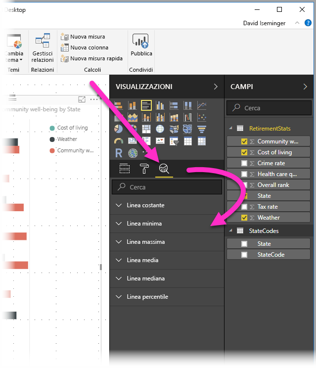
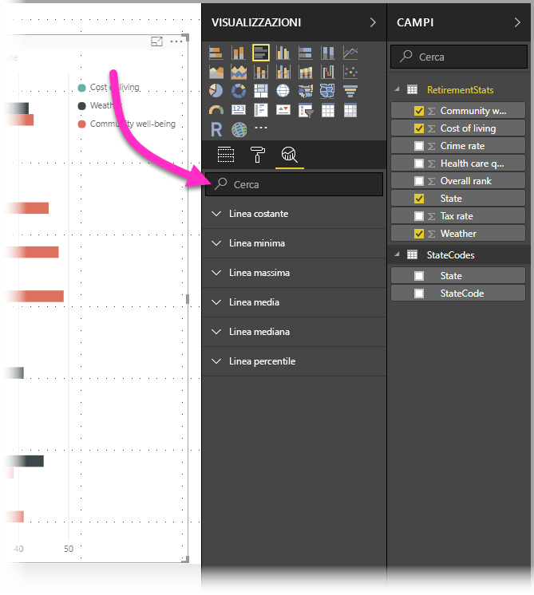
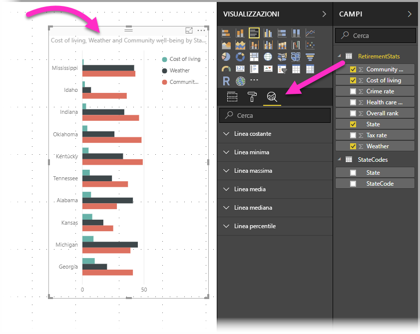
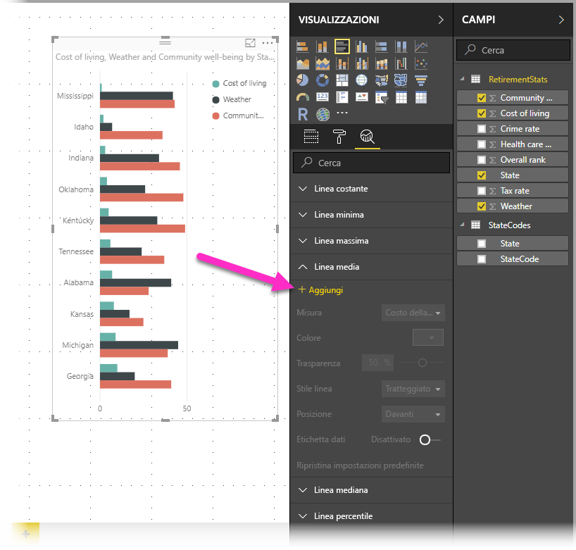
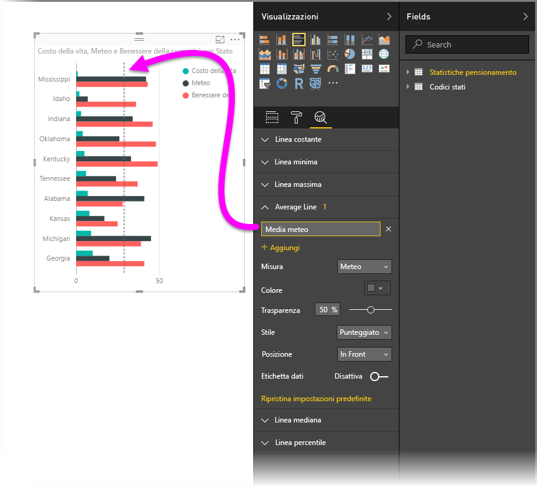
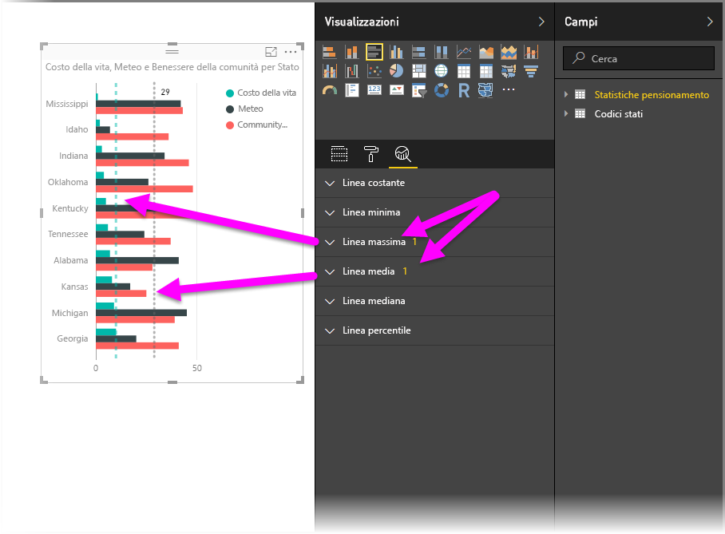
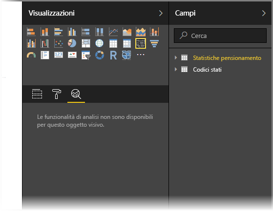
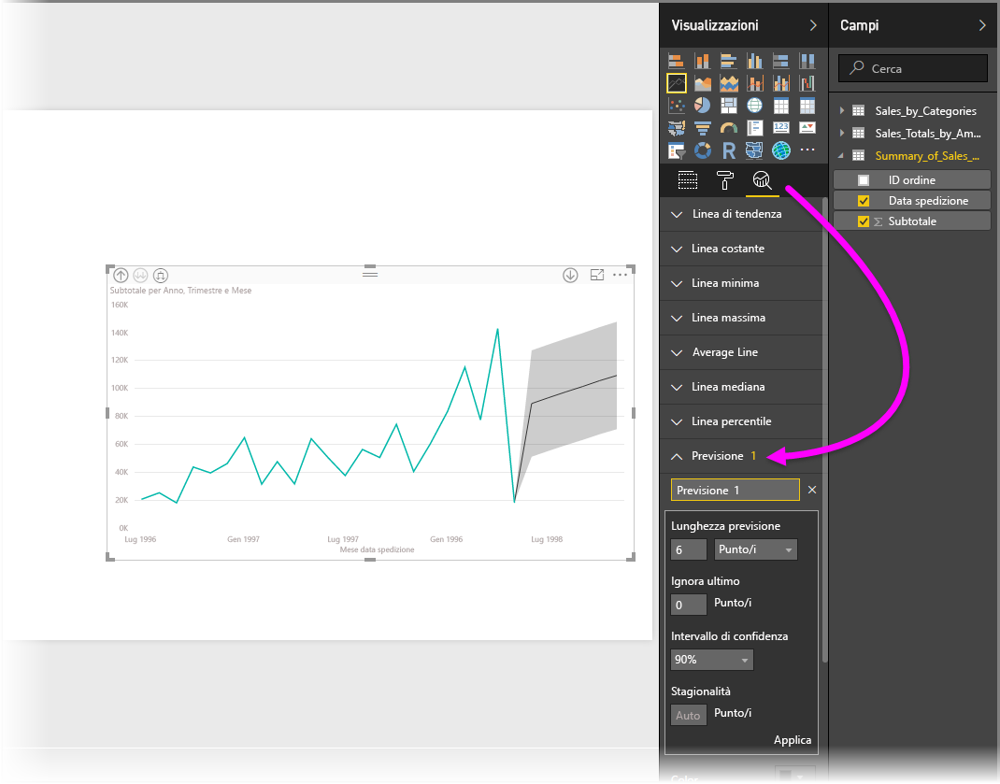

# Uso del riquadro Analisi in Power BI Desktop
Con il riquadro **Analisi** in **Power BI Desktop** è possibile aggiungere *linee di riferimento* dinamiche agli oggetti visivi e incentrare l'attenzione su tendenze o informazioni importanti. Il riquadro **Analisi** è disponibile nell'area **Visualizzazioni** di Power BI Desktop.

> [!NOTE]
> Il riquadro **Analisi** viene visualizzato solo quando si seleziona un oggetto visivo nell'area di disegno di Power BI Desktop.

## Eseguire ricerche all'interno del riquadro Analisi
A partire dalla versione di febbraio 2018 di **Power BI Desktop** (versione 2.55.5010.201 o versione successiva), è possibile eseguire ricerche all'interno del riquadro **Analisi**, ovvero una sottosezione del riquadro **Visualizzazioni** . Come illustrato nell'immagine seguente, la casella di ricerca viene visualizzata quando si seleziona il riquadro **Analisi**.

## Uso del riquadro Analisi
Con il riquadro **Analisi** è possibile creare i seguenti tipi di linee di riferimento dinamiche, anche se non tutte le linee sono disponibili per tutti i tipi di oggetti visivi:

* Linea costante asse X
* Linea costante asse Y
* Linea minima
* Linea massima
* Linea media
* Linea mediana
* Linea percentile

Le sezioni seguenti mostrano come usare il riquadro **Analisi** e le linee di riferimento dinamiche nelle visualizzazioni.

Per visualizzare le linee di riferimento dinamiche disponibili per un oggetto visivo, seguire questa procedura:

1. Selezionare o creare un oggetto visivo, quindi selezionare l'icona **Analisi** dalla sezione **Visualizzazioni**.
   
   
2. Selezionare la freccia rivolta verso il basso per il tipo di linea che si desidera creare per espandere le opzioni. In questo caso, si selezionerà **Linea media**.
   
   
3. Per creare una nuova linea, selezionare **+ Aggiungi**. È quindi possibile specificare un nome per la linea facendo doppio clic sulla casella di testo, quindi digitando il nome.
   
   Sono disponibili moltissime opzioni per la linea, ad esempio per impostare *colore*, *trasparenza*, *stile* e *posizione* relativamente a elementi dati dell'oggetto visivo, oltre alla possibilità di scegliere se includere l'etichetta. In particolare è possibile selezionare la **Misura** dell'oggetto visivo sulla quale basare la linea selezionando il menu a discesa **Misura**, che viene automaticamente popolato con gli elementi dati dell'oggetto visivo. In questo caso, si selezionerà *Weather* come misura, si etichetterà l'opzione come *Average Weather* e si personalizzeranno altre opzioni come illustrato di seguito.
   
   
4. Se si desidera visualizzare un'etichetta dati, spostare il dispositivo di scorrimento **Etichetta dati** su On. In questo caso, si ottiene una serie completa di opzioni aggiuntive per l'etichetta dati come illustrato nell'immagine seguente.
   
   
5. Notare il numero visualizzato accanto all'elemento **Linea media** nel riquadro **Analisi**. Questo numero indica quante linee dinamiche sono attualmente presenti nell'oggetto visivo e di che tipo sono. Se si aggiunge una **Linea massima** per *Cost of Living*, è possibile vedere nel riquadro **Analisi** che è ora presente anche una linea di riferimento dinamica **Linea massima** applicata a questo oggetto visivo.
   
   

Se l'oggetto visivo selezionato non può contenere linee di riferimento dinamiche applicate, in questo caso un oggetto visivo **Mappa**, verrà visualizzato quanto segue nel momento in cui si seleziona il riquadro **Analisi**.

Sono moltissime le informazioni interessanti da poter evidenziare creando linee di riferimento dinamiche con il riquadro **Analisi**.

Sono previste altre funzionalità, ad esempio l'espansione degli oggetti visivi che possono avere linee di riferimento dinamiche applicate, pertanto è consigliabile tenersi aggiornati sulle novità.

## Applicare la previsione
È possibile usare la funzionalità **Previsione** selezionando un oggetto visivo, quindi espandendo la sezione **Previsione** del riquadro **Analisi**. È possibile specificare molti input per modificare la previsione, ad esempio *Lunghezza previsione*, *Intervallo di confidenza* e altri. La figura seguente mostra un oggetto visivo di base con previsione applicata, ma è possibile attingere alla propria immaginazione (e sperimentare con la funzionalità *Previsione*) per vedere come è possibile applicarla ai propri modelli.

## Limitazioni
La possibilità di usare linee di riferimento dinamiche dipende dal tipo di oggetto visivo in uso. L'elenco seguente mostra le linee dinamiche attualmente disponibili per i vari oggetti visivi:

Gli oggetti visivi seguenti possono usufruire pienamente delle linee dinamiche:

* Grafico ad aree
* Grafico a linee
* Grafico a dispersione
* Istogramma a colonne raggruppate
* Grafico a barre raggruppate

Gli oggetti visivi seguenti possono usare solo una *linea costante* dal riquadro **Analisi**:

* Area in pila
* Barre in pila
* Istogramma in pila
* Barre in pila 100%
* Istogramma in pila 100%

Per gli oggetti visivi seguenti è attualmente disponibile solo la *linea di tendenza*:

* Linee non in pila
* Istogramma a colonne raggruppate

Infine, gli oggetti visivi non cartesiani attualmente non possono applicare linee dinamiche dal riquadro **Analisi**, ad esempio:

* Matrice
* Grafico a torta
* Grafico ad anello
* Tabella

La linea del percentile è disponibile solo quando si usano dati importati in **Power BI Desktop** o con una connessione dinamica a un modello in un server che esegue **Analysis Services 2016** o versione successiva, **Azure Analysis Services** o un set di dati nel servizio Power BI. 

## Passaggi successivi
Power BI Desktop offre infinite possibilità. Per altre informazioni sulle capacità disponibili, vedere le risorse seguenti:

* [Novità di Power BI Desktop](desktop-latest-update.md)
* [Scarica Power BI Desktop](desktop-get-the-desktop.md)
* [Introduzione a Power BI Desktop](desktop-getting-started.md)
* [Panoramica delle query con Power BI Desktop](desktop-query-overview.md)
* [Tipi di dati in Power BI Desktop](desktop-data-types.md)
* [Effettuare il data shaping e combinare i dati con Power BI Desktop](desktop-shape-and-combine-data.md)
* [Attività di query comuni in Power BI Desktop](desktop-common-query-tasks.md)    

