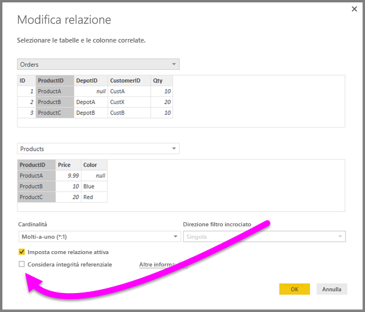
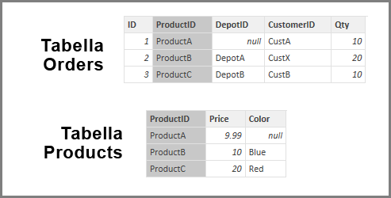
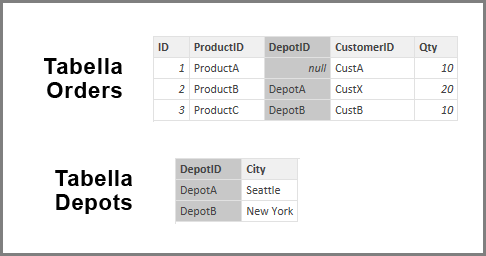
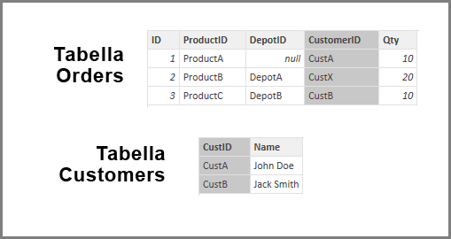

# Considerare le impostazioni di integrità referenziale in Power BI Desktop
Quando ci si connette a un'origine dati con **DirectQuery**, è possibile usare la selezione **Considera integrità referenziale** per consentire un'esecuzione ottimizzata delle query sull'origine dati. Questa funzionalità presenta alcuni requisiti per i dati sottostanti ed è disponibile solo quando si usa **DirectQuery**.

Quando si imposta **Considera integrità referenziale**, viene abilitato l'uso di istruzioni **INNER JOIN**, invece di **OUTER JOIN**, per le query sull'origine dati, che migliora l'efficacia delle query.

## Requisiti per l'utilizzo di Considera integrità referenziale
Questa impostazione avanzata viene abilitata solo quando ci si connette ai dati con **DirectQuery**. I requisiti seguenti sono necessari per il corretto funzionamento di **Considera integrità referenziale**:

* I dati nella colonna **Da** della relazione non sono mai *Null* o *vuoti*
* Per ogni valore nella colonna **Da** è presente un valore corrispondente nella colonna **A**

In questo contesto la colonna **Da** corrisponde a *Molti* in una relazione *Uno-a-molti* oppure alla colonna della prima tabella in una relazione *Uno-a-uno*.

## Esempio di utilizzo di Considera integrità referenziale
L'esempio seguente mostra il comportamento di **Considera integrità referenziale** quando viene usato nelle connessioni dati. L'esempio mostra una connessione a un'origine dati che include una tabella **Orders**, una tabella **Products** e una tabella **Depots**.

1. Nella figura seguente che mostra la tabella **Orders** e la tabella **Products** esiste integrità referenziale tra **Orders[ProductID]** e **Products[ProductID]**. La colonna **[ProductID]** nella tabella **Orders** non è mai *Null* e tutti i valori vengono anche visualizzati nella tabella **Products**. Di conseguenza, **Considera integrità referenziale** deve essere impostato per ottenere query più efficienti. Questa impostazione non modifica i valori visualizzati negli oggetti visivi.
   
   
2. Nella figura seguente non esiste integrità referenziale tra **Orders[DepotID]** e **Depots[DepotID]**, perché **DepotID** è *Null* per alcuni elementi *Orders*. Di conseguenza, **Considera integrità referenziale** *non* deve essere impostato.
   
   
3. Infine, non esiste integrità referenziale tra **Orders[CustomerID]** e **Customers[CustomerID]** nelle tabelle seguenti. **CustomerID** contiene alcuni valori, in questo caso, *CustX*, che non esistono nella tabella *Customers*. Di conseguenza, **Considera integrità referenziale** *non* deve essere impostato.
   
   

## Impostazione di Considera integrità referenziale
Per abilitare questa funzionalità, selezionare la casella di controllo accanto a **Considera integrità referenziale** come mostrato nella figura seguente.

Se selezionata, l'impostazione viene convalidata in base ai dati per assicurare che non ci siano righe *Null* o non corrispondenti. *Tuttavia*, per i casi con un numero molto elevato di valori, la convalida non garantisce l'assenza di problemi di integrità referenziale.

Inoltre, la convalida viene eseguita quando si modifica la relazione e *non* riflette eventuali modifiche successive ai dati.

## Cosa accade se si imposta Considera integrità referenziale in modo errato?
Se i dati presentano problemi di integrità referenziale e si imposta **Considera integrità referenziale**, non si verificheranno errori. Tuttavia, i dati mostreranno apparenti incoerenze. Ad esempio, nel caso della relazione con la tabella **Depots** descritta in precedenza, il risultato sarà il seguente:

* Un oggetto visivo che mostra il totale di *Order Qty* avrebbe un valore pari a 40
* Un oggetto visivo che mostra il totale di *Order Qty by Depot City* avrebbe un valore totale di appena *30* perché non include l'ID ordine 1, in cui **DepotID** è *Null*.

## Passaggi successivi
Altre informazioni su [DirectQuery](desktop-use-directquery.md)

Altre informazioni sulle [relazioni in Power BI](desktop-create-and-manage-relationships.md)

Altre informazioni su [Visualizzazione delle relazioni in Power BI Desktop](desktop-relationship-view.md).

