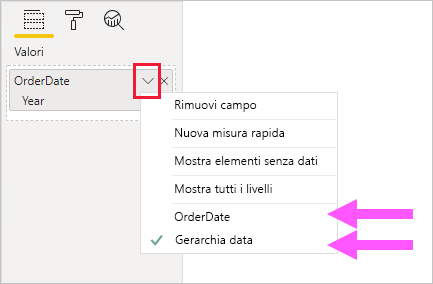
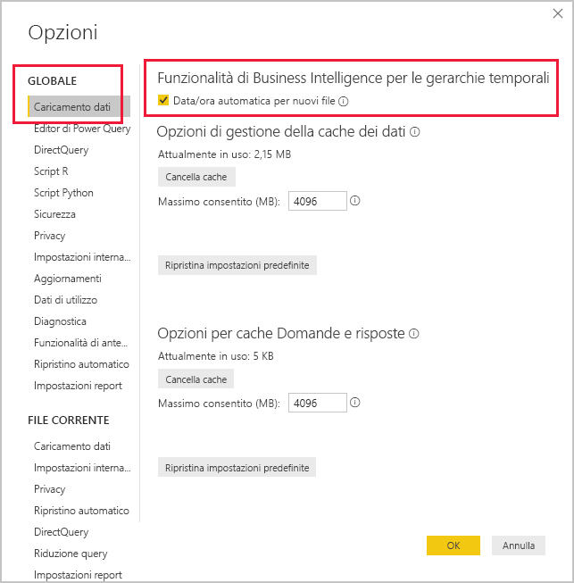

# <a name="auto-datetime-in-power-bi-desktop"></a>Data/ora automatica in Power BI Desktop

Questo articolo è destinato a esperti di modellazione di dati che sviluppano modelli di importazione o compositi in Power BI Desktop. Introduce e descrive l'opzione _Data/ora automatica_.

Data/ora automatica è un'opzione di caricamento dati disponibile in Power BI Desktop. Questa opzione facilita la creazione di report con funzionalità di Business Intelligence per le gerarchie temporali sulla base delle colonne della data caricate in un modello. In particolare, consente agli autori di report che usano il modello di dati di filtrare, raggruppare ed eseguire il drill-down usando periodi di tempo del calendario (anni, trimestri, mesi e giorni). L'aspetto importante è che non è necessario sviluppare in modo esplicito queste funzionalità di Business Intelligence per le gerarchie temporali.

Quando l'opzione è abilitata, Power BI Desktop crea una tabella di data/ora automatica nascosta per ogni colonna della data, purché siano soddisfatte tutte le condizioni seguenti:

- La modalità di archiviazione tabelle è Importa
- Il tipo di dati della colonna è data o data/ora
- La colonna non è il lato "molti" di una relazione del modello

## <a name="how-it-works"></a>Come funziona

Ogni tabella di data/ora automatica è di fatto una [tabella calcolata](desktop-calculated-tables.md) che genera righe di dati tramite la funzione [CALENDAR](/dax/calendar-function-dax) di DAX. Ogni tabella include anche sei colonne calcolate: **Giorno**, **NumMese**, **Mese**, **NumTrimestre**, **Trimestre** e **Anno**.

> [!NOTE]
> Power BI converte e formatta i nomi e i valori delle colonne in base alla [lingua del modello](supported-languages-countries-regions.md#choose-the-language-for-the-model-in-power-bi-desktop).

Power BI Desktop crea anche una relazione tra la colonna **Data** della tabella di data/ora automatica e la colonna della data del modello.

La tabella di data/ora automatica contiene gli anni di calendario completi che comprendono tutti i valori di data archiviati nella colonna della data del modello. Ad esempio, se il primo valore in una colonna della data è il 20 marzo 2016 e l'ultimo valore è il 23 ottobre 2019, la tabella conterrà 1.461 righe. Rappresenta una riga per ogni data nei quattro anni di calendario compresi tra il 2016 e il 2019. Quando Power BI aggiorna il modello, viene aggiornata anche ogni tabella di data/ora automatica per assicurarsi che contenga le date che includono i valori delle colonne della data.

Se fosse possibile visualizzare le righe di una tabella di data/ora automatica, l'aspetto sarebbe simile al seguente:


> [!NOTE]
> Le tabelle di data/ora automatica sono nascoste in modo permanente e risultano invisibili anche agli esperti di modellazione. Non sono visibili nel riquadro **Campi** o nel diagramma della visualizzazione modello e le relative righe non sono visibili nella visualizzazione dati. Non è inoltre possibile fare riferimento direttamente alla tabella e alla relativa colonna in espressioni DAX.

La tabella definisce anche una gerarchia, fornendo oggetti visivi con un percorso di drill-down nei livelli anno, trimestre, mese e giorno.

Se fosse possibile visualizzare una tabella di data/ora automatica nel diagramma della visualizzazione modello, l'aspetto sarebbe simile al seguente (le colonne correlate sono evidenziate):


## <a name="work-with-auto-datetime"></a>Usare l'opzione di data/ora automatica

Quando esiste una tabella di data/ora automatica per una colonna della data (e tale colonna è visibile), gli autori del report non troveranno tale colonna come campo nel riquadro **Campi**. Troveranno invece un oggetto espandibile il cui nome è uguale a quello della colonna della data. È possibile identificare facilmente tale oggetto perché è decorato con un'icona di calendario. Quando gli autori del report espandono l'oggetto calendario, troveranno una gerarchia denominata **Gerarchia data**. Dopo aver espanso la gerarchia, troveranno quattro livelli: **Anno**, **Trimestre**, **Mese** e **Giorno**.


La gerarchia generata di data/ora automatica può essere usata per configurare un oggetto visivo in modo analogo alle normali gerarchie. È possibile configurare gli oggetti visivi usando l'intera gerarchia di **Gerarchia data** o livelli specifici della gerarchia.

È però disponibile una funzionalità aggiunta, non supportata dalle normali gerarchie. Quando si aggiunge la gerarchia di data/ora automatica, o un livello della gerarchia, a un oggetto visivo, l'autore del report può scegliere di usare alternativamente la gerarchia o la colonna della data. Questo approccio è utile per alcuni oggetti visivi, quando è necessaria solo la colonna della data e non la gerarchia e i relativi livelli. Per iniziare, configurare il campo dell'oggetto visivo (fare clic con il pulsante destro del mouse sul campo dell'oggetto visivo oppure fare clic sulla freccia verso il basso) e quindi usare il menu di scelta rapida per passare dalla colonna della data alla gerarchia e viceversa.



I calcoli del modello, scritti in DAX, possono infine fare riferimento _direttamente_ a una colonna della data o _indirettamente_ alle colonne nascoste della tabella di data/ora automatica.

La formula scritta in Power BI Desktop può fare riferimento a una colonna della data nel modo consueto. Per fare riferimento alle colonne della tabella di data/ora automatica, è invece necessario usare una speciale sintassi estesa. Per iniziare, fare riferimento alla colonna della data e quindi aggiungere un punto (.) dopo di essa. La funzionalità di completamento automatico della barra della formula consentirà quindi di selezionare una colonna della tabella di data/ora automatica.

![Esempio di immissione di un'espressione di misura DAX nella barra della formula. La formula finora è Date Count = COUNT(Sales[OrderDate]. e l'elenco di completamento automatico include tutte le sette colonne della tabella di data/ora automatica nascosta. Queste colonne sono: Data, Giorno, Mese, NumMese, Trimestre, NumTrimestre e Anno.](media/desktop-auto-date-time/auto-date-time-dax-auto-complete.png)

In Power BI Desktop un'espressione di misura valida può essere:

```dax
Date Count = COUNT(Sales[OrderDate].[Date])
```

> [!NOTE]
> Anche se questa espressione di misura è valida in Power BI Desktop, non corrisponde alla sintassi DAX corretta. Internamente, Power BI Desktop traspone l'espressione in modo che faccia riferimento all'effettiva colonna della tabella di data/ora automatica, che è nascosta.

## <a name="configure-auto-datetime-option"></a>Configurare l'opzione di data/ora automatica

È possibile configurare la data/ora automatica _a livello globale_ o per il _file corrente_. L'opzione globale si applica ai nuovi file di Power BI Desktop e può essere attivata o disattivata in qualsiasi momento. Per una nuova installazione di Power BI Desktop, entrambe le opzioni sono attivate per impostazione predefinita.

Anche l'opzione relativa al file corrente può essere attivata o disattivata in qualsiasi momento. Quando è attivata, le tabelle di data/ora automatica vengono create. Quando è disattivata, tutte le tabelle di data/ora automatica vengono rimosse dal modello.

> [!CAUTION]
> Prestare attenzione quando si disattiva l'opzione relativa al file corrente, in quanto implica la rimozione delle tabelle di data/ora automatica. Assicurarsi di correggere eventuali filtri di report danneggiati o gli oggetti visivi che sono stati configurati per usarli.

In Power BI Desktop selezionare _File > Opzioni e impostazioni > Opzioni_ e quindi selezionare la pagina **Globale** o **File corrente**. In entrambe le pagine l'opzione è disponibile nella sezione **Funzionalità di Business Intelligence per le gerarchie temporali**.



## <a name="next-steps"></a>Passaggi successivi

Per altre informazioni sull'opzione di data/ora automatica e sugli argomenti correlati, vedere le risorse seguenti:

- [Impostare e usare tabelle data in Power BI Desktop](desktop-date-tables.md)
- Domande? [Provare a rivolgersi alla community di Power BI](https://community.powerbi.com/)
