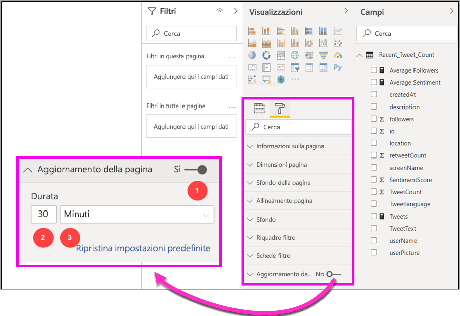
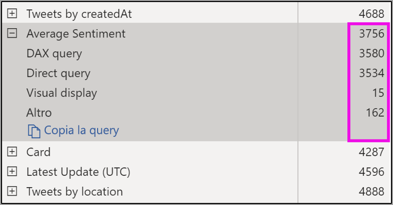
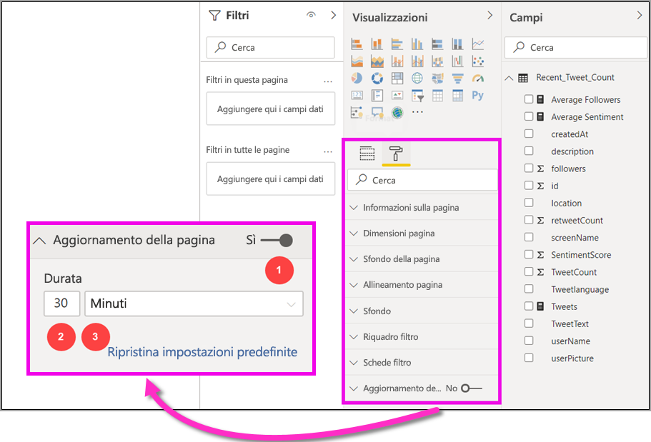

# Aggiornamento automatico della pagina in Power BI Desktop (anteprima)

Quando si esegue il monitoraggio di eventi critici, è importante che i dati vengano aggiornati non appena vengono aggiornati i dati di origine. Ad esempio, nel settore della produzione è fondamentale sapere quando una macchina non funziona correttamente o è prossima a un malfunzionamento.

La funzionalità Aggiornamento pagina automatico in Power BI consente alla pagina del report attiva di eseguire query per individuare nuovi dati, con una cadenza predefinita, nelle [origini DirectQuery](https://docs.microsoft.com/power-bi/desktop-directquery-about).

## Uso dell'aggiornamento pagina automatico

In questa versione di anteprima è necessario abilitare la funzionalità di aggiornamento pagina automatico in Power BI Desktop. Passare a **File > Opzioni e impostazioni** quindi selezionare **Opzioni** e selezionare **Funzionalità di anteprima** dal riquadro a sinistra. Abilitare la funzionalità selezionando la casella di controllo accanto a *Aggiornamento pagina automatico*. L'aggiornamento pagina automatico è disponibile solo per le origini dati DirectQuery.

Per usare l'aggiornamento pagina automatico, selezionare la pagina del report per cui si vuole abilitare l'aggiornamento. Nel riquadro **Visualizzazioni** selezionare l'icona **Formattazione** (rullo) e individuare l'opzione **Aggiornamento della pagina** nella parte inferiore del riquadro. 

La figura seguente mostra la scheda **Aggiornamento della pagina**. Le descrizioni degli elementi numerati sono disponibili nei paragrafi successivi:

1.  Dispositivo di scorrimento Aggiornamento pagina automatico: attiva o disattiva l'aggiornamento della pagina
2.  Valore di intervallo Aggiornamento della pagina: valore numerico per l'intervallo di aggiornamento
3.  Unità di intervallo Aggiornamento della pagina: unità dell'intervallo per l'aggiornamento della pagina

In questa scheda è possibile attivare l'aggiornamento della pagina e selezionare la durata dell'aggiornamento. Il valore predefinito è 30 minuti (l'intervallo di aggiornamento minimo è di un secondo). Il report inizierà a essere aggiornato con l'intervallo impostato. 

## Determinazione dell'intervallo di aggiornamento della pagina

Quando è abilitato l'aggiornamento pagina automatico, Power BI Desktop invia continuamente query all'origine DirectQuery. Poiché si verifica un ritardo tra l'invio della query e il recupero dei dati, per gli intervalli di aggiornamento brevi è necessario verificare che le query restituiscano correttamente i dati ricercati entro l'intervallo configurato. Se i dati non vengono restituiti entro l'intervallo, si verificano situazioni in cui gli oggetti visivi vengono aggiornati con una frequenza inferiore rispetto a quella configurata.

È consigliabile che l'intervallo di aggiornamento corrisponda almeno alla frequenza di arrivo dei nuovi dati prevista:

* Se arrivano nuovi dati nell'origine ogni 20 minuti, l'intervallo di aggiornamento non può essere inferiore a 20 minuti. 

* Se arrivano nuovi dati ogni secondo, l'intervallo deve essere impostato su un secondo. 

Per gli intervalli di aggiornamento brevi, ad esempio l'intervallo di un secondo, è necessario considerare anche il tipo di origine dati DirectQuery, il carico creato dalle query, la distanza dei visualizzatori del report dal data center della capacità e così via. 

È possibile effettuare una stima usando l'analizzatore prestazioni in Power BI Desktop che consente di verificare se ogni query dell'oggetto visivo ha tempo sufficiente per restituire il risultato dall'origine e dove viene impiegato il tempo. In base ai risultati dell'analizzatore prestazioni, è possibile regolare o apportare modifiche all'origine dati oppure provare a usare altri oggetti visivi e misure nel report.

La figura seguente mostra i risultati di una DirectQuery nell'analizzatore prestazioni:

Di seguito vengono descritte alcune altre caratteristiche relative a questa origine dati. 

1.  I dati arrivano con una frequenza di due secondi. 
2.  L'analizzatore prestazioni mostra un tempo massimo di query e visualizzazione di circa 4,9 secondi (4688 millisecondi). 
3.  L'origine dati è configurata in modo da gestire circa 1000 query simultanee al secondo. 
4.  Si prevede che circa 10 utenti visualizzino il report simultaneamente.

Il risultato è il seguente:

* **5 oggetti visivi x 10 utenti = circa 50 query**

Questo calcolo comporta un carico molto più elevato rispetto a quello che l'origine dati può supportare. Poiché i dati arrivano ogni due secondi, la frequenza di aggiornamento deve essere di due secondi. Tuttavia, poiché il completamento della query richiede circa cinque secondi, è consigliabile impostare una frequenza maggiore di cinque secondi. 

Si noti inoltre che questo risultato può essere diverso quando si pubblica il report nel servizio poiché il report userà l'istanza di Analysis Services ospitata nel cloud. È possibile modificare le frequenze di aggiornamento di conseguenza. 

Per tenere conto della durata delle query e dell'aggiornamento, Power BI eseguirà la query di aggiornamento successiva solo quando tutte le query di aggiornamento rimanenti saranno completate. Di conseguenza, anche se l'intervallo di aggiornamento è più breve del tempo necessario per l'elaborazione delle query, Power BI eseguirà nuovamente l'aggiornamento solo dopo che le query rimanenti sono state completate. 

Di seguito viene descritto come è possibile rilevare e diagnosticare i problemi di prestazioni come amministratore della capacità. Per altre domande e risposte sulle prestazioni e sulla risoluzione dei problemi, vedere anche la sezione delle **domande frequenti sull'aggiornamento pagina automatico** più avanti in questo articolo.

## Aggiornamento pagina automatico nel servizio Power BI

È anche possibile impostare gli intervalli di aggiornamento pagina automatico per i report creati in Power BI Desktop e pubblicati nel servizio Power BI. 

L'aggiornamento pagina automatico per i report nel servizio Power BI viene configurato con passaggi simili alla configurazione in Power BI Desktop. L'immagine seguente mostra la configurazione **Aggiornamento della pagina** per il servizio Power BI:

1.  Dispositivo di scorrimento Aggiornamento pagina automatico: attiva o disattiva l'aggiornamento della pagina
2.  Valore di intervallo Aggiornamento della pagina: valore numerico per l'intervallo di aggiornamento, deve essere un numero intero
3.  Unità di intervallo Aggiornamento della pagina: unità dell'intervallo per l'aggiornamento della pagina

### Intervalli di aggiornamento della pagina

Gli intervalli di aggiornamento della pagina consentiti nel servizio Power BI variano a seconda del tipo di area di lavoro del report. Questa considerazione si applica a tutti i report seguenti:

* Pubblicazione di un report in un'area di lavoro in cui è abilitato l'aggiornamento pagina automatico
* Modifica di un intervallo di aggiornamento della pagina già in un'area di lavoro
* Creazione di un report direttamente nel servizio

Power BI Desktop non prevede alcuna restrizione per l'intervallo di aggiornamento; l'intervallo di aggiornamento può avere una frequenza di un secondo. Tuttavia, quando i report vengono pubblicati nel servizio Power BI, vengono applicate alcune restrizioni descritte nelle sezioni seguenti.

### Restrizioni sugli intervalli di aggiornamento

Nel servizio Power BI le restrizioni dell'aggiornamento pagina automatico si applicano in base a fattori quali l'area di lavoro e l'uso dei servizi Premium.

Per comprenderne il funzionamento, tenere presente le seguenti informazioni di base su capacità e aree di lavoro:

Le **capacità** sono un concetto chiave di Power BI che rappresenta un set di risorse (archiviazione, processore e memoria) usate per ospitare e distribuire i contenuti di Power BI. Le capacità sono condivise o dedicate. Una **capacità condivisa** è condivisa con altri clienti Microsoft, mentre una **capacità dedicata** è dedicata interamente a un singolo cliente. Le capacità dedicate sono descritte nell'articolo [Gestione delle capacità Premium](service-premium-capacity-manage.md).

Nella capacità condivisa i carichi di lavoro vengono eseguiti in risorse di calcolo condivise con altri clienti. Poiché la capacità deve condividere le risorse, vengono imposte limitazioni per garantire il *rispetto delle regole*, ad esempio impostando le dimensioni massime del modello (1 GB) e la frequenza di aggiornamento giornaliero massima (otto volte al giorno).

Le **aree di lavoro** di Power BI risiedono all'interno delle capacità e rappresentano contenitori di sicurezza, collaborazione e distribuzione. Ogni utente di Power BI ha un'area di lavoro chiamata **Area di lavoro personale**. È possibile creare aree di lavoro aggiuntive per la collaborazione e la distribuzione. Queste aree di lavoro sono chiamate **aree di lavoro**. Per impostazione predefinita, le aree di lavoro, incluse le aree di lavoro personali, vengono create nella **capacità condivisa**.

Di seguito sono riportati alcuni dettagli per i due scenari di area di lavoro:

**Aree di lavoro condivise**: per le aree di lavoro standard, ovvero le aree di lavoro che non fanno parte di una capacità Premium, l'aggiornamento pagina automatico ha un intervallo minimo di 30 minuti (intervallo minimo consentito).

**Aree di lavoro Premium**: la disponibilità dell'aggiornamento pagina automatico nelle aree di lavoro Premium dipende dalle impostazioni di carico di lavoro impostate dall'amministratore Premium per la capacità Power BI Premium. Esistono due variabili che potrebbero influire sulla possibilità di configurare l'aggiornamento pagina automatico:

 1. *Attivazione/disattivazione della funzionalità*: se l'amministratore della capacità ha deciso di disabilitare la funzionalità, non sarà possibile impostare alcun tipo di aggiornamento della pagina nel report pubblicato.

 2. *Intervallo di aggiornamento minimo*: quando abilita la funzionalità, l'amministratore della capacità deve impostare un intervallo di aggiornamento minimo. Se l'intervallo è inferiore al valore minimo, il servizio Power BI sostituisce l'intervallo per rispettare l'intervallo minimo impostato dall'amministratore della capacità.

La tabella seguente illustra più dettagliatamente la disponibilità di questa funzionalità e i limiti per ogni tipo di capacità e [modalità di archiviazione](service-dataset-modes-understand.md)

| Modalità di archiviazione | Capacità dedicata | Capacità condivisa |
| --- | --- | --- |
| Query diretta | **Supportata**: sì.  **Intervallo di aggiornamento minimo**: 1 secondo  **Sostituzione dell'amministratore della capacità**: sì. | **Supportata**: sì.  **Intervallo di aggiornamento minimo**: 30 minuti  **Sostituzione dell'amministratore della capacità**: no. |
| Importa | **Supportata**: no.  **Intervallo di aggiornamento minimo**: N/D.  **Sostituzione dell'amministratore della capacità**: N/D. | **Supportata**: no.  **Intervallo di aggiornamento minimo**: N/D.  **Sostituzione dell'amministratore della capacità**: N/D. |
| Modalità mista (DQ + altre) | **Supportata**: sì.  **Intervallo di aggiornamento minimo**: 1 secondo  **Sostituzione dell'amministratore della capacità**: sì. | **Supportata**: sì.  **Intervallo di aggiornamento minimo**: 30 minuti  **Sostituzione dell'amministratore della capacità**: no. |
| Live Connect AS | **Supportata**: no.  **Intervallo di aggiornamento minimo**: N/D.  **Sostituzione dell'amministratore della capacità**: N/D. | **Supportata**: no.  **Intervallo di aggiornamento minimo**: N/D.  **Sostituzione dell'amministratore della capacità**: N/D. |
| Live Connect PBI | **Supportata**: no.  **Intervallo di aggiornamento minimo**: N/D.  **Sostituzione dell'amministratore della capacità**: N/D. | **Supportata**: no.  **Intervallo di aggiornamento minimo**: N/D.  **Sostituzione dell'amministratore della capacità**: N/D. |

> [!NOTE]
> Quando si pubblica il report con aggiornamento pagina automatico abilitato da Power BI Desktop al servizio, sarà necessario specificare le credenziali per l'origine dati DirectQuery nel menu delle impostazioni del set di dati.

## Considerazioni e limitazioni

Quando si usa l'aggiornamento pagina automatico in Power BI Desktop o nel servizio Power BI è necessario tenere presente alcune considerazioni.

* Le modalità di archiviazione Import, LiveConnect e Push non sono supportate per l'aggiornamento pagina automatico.  
* I modelli compositi con almeno un'origine dati DirectQuery sono supportati.
* Power BI Desktop non prevede alcuna restrizione per l'intervallo di aggiornamento che può avere una frequenza di un secondo. Quando i report vengono pubblicati nel servizio Power BI, vengono applicate alcune restrizioni descritte nelle sezioni precedenti.

### Diagnostica delle prestazioni

L'aggiornamento pagina automatico è utile per gli scenari di monitoraggio e per l'esplorazione dei dati in rapida evoluzione. Tuttavia, a volte questo può comportare un carico eccessivo sulla capacità o sull'origine dati.

Per evitare un carico eccessivo sulle origini dati, Power BI include le misure di sicurezza seguenti:

1. Tutte le query di aggiornamento pagina automatico vengono eseguite con una priorità **più bassa** per garantire che le query interattive (ad esempio il caricamento di pagine e gli oggetti visivi con filtro incrociato) abbiano la precedenza.
2. Se la query non è stata completata prima del ciclo di aggiornamento successivo, Power BI non emette nuove query di aggiornamento fino a quando la query precedente non viene completata. Ad esempio, se l'intervallo di aggiornamento è impostato su un secondo e le query in media richiedono quattro secondi, Power BI emette una query solo ogni quattro secondi.

Esistono due aree in cui è comunque possibile riscontrare colli di bottiglia delle prestazioni:

1. **Capacità:** La query raggiunge prima la capacità Premium che riduce e valuta la query DAX generata dalle visualizzazioni del report nelle query di origine.
2. **Origine dati DirectQuery:** Le query convertite nel passaggio precedente vengono quindi eseguite nell'origine. L'origine potrà essere SQL Server, un'origine SAP HANA e così via.

Usando l'[app delle metriche Premium](service-admin-premium-monitor-capacity.md) disponibile per gli amministratori è possibile visualizzare la quantità di capacità usata dalle query con priorità bassa.

Le query con priorità bassa sono costituite da query di aggiornamento pagina automatico e query di aggiornamento del modello. Attualmente non esiste alcun modo per distinguere il carico delle query di aggiornamento pagina automatico da quello delle query di aggiornamento del modello.

Se si nota che la capacità viene sovraccaricata con query con priorità bassa, è possibile eseguire alcune azioni:

1. Richiedere uno SKU Premium di dimensioni maggiori.
2. Contattare il proprietario del report e chiedere di abbassare l'intervallo di aggiornamento.
3. Nel portale di amministrazione della capacità è possibile:
  1. Disattivare l'aggiornamento pagina automatico per la capacità
  2. Alzare l'intervallo di aggiornamento minimo che avrà effetto su tutti i report della capacità.

### Domande frequenti

Questa sezione contiene alcune domande e risposte comuni. 

1. Sono l'autore di un report. Ho impostato l'intervallo di aggiornamento del report su un secondo in Desktop, ma dopo la pubblicazione il report non viene aggiornato nel servizio.

    * Verificare che l'aggiornamento pagina automatico sia attivato per la pagina. Poiché questa impostazione viene specificata per ogni singola pagina, è necessario assicurarsi che sia attiva per ogni pagina del report che si vuole aggiornare.
    * Verificare di aver eseguito il caricamento in un'area di lavoro con capacità Premium associata, altrimenti l'intervallo di aggiornamento verrà bloccato a 30 minuti.
    * Se il report si trova in un'area di lavoro Premium, contattare l'amministratore per verificare che abbia abilitato questa funzionalità per la capacità associata. Assicurarsi inoltre che l'intervallo di aggiornamento minimo per la capacità sia inferiore o uguale a quello del report.

2. Sono un amministratore della capacità. Ho modificate le impostazioni dell'intervallo di aggiornamento pagina automatico, ma non vengono applicate. In altre parole, i report continuano a essere aggiornati con una frequenza indesiderata oppure non vengono aggiornati anche se l'aggiornamento è stato attivato.

    * Le modifiche dell'impostazione di aggiornamento pagina automatico apportate nell'interfaccia utente dell'amministratore della capacità richiedono 5 minuti per essere propagate ai report.
    * Oltre ad attivare l'aggiornamento pagina automatico per la capacità è necessario attivarlo anche per le pagine di un report in cui si vuole visualizzarlo.

3. Il report funziona in modalità mista (DQ + Import). Non tutti gli oggetti visivi sono in fase di aggiornamento.

    * Questo comportamento è previsto se gli oggetti visivi fanno riferimento a tabelle Import. L'aggiornamento pagina automatico non è supportato per Import.
    * Vedere la domanda 1 in questa sezione.

4. Gli aggiornamenti del report venivano eseguiti correttamente ma all'improvviso si sono interrotti.

    * Provare ad aggiornare la pagina per verificare se il problema si risolve autonomamente.
    * Rivolgersi all'amministratore della capacità poiché potrebbe aver disattivato la funzionalità o avere alzato l'intervallo di aggiornamento minimo (vedere la domanda 2).

5. Sono l'autore di un report. Gli oggetti visivi non vengono aggiornati con la frequenza specificata. Vengono aggiornati con una frequenza più lenta.

    * Se l'esecuzione delle query richiede più tempo, l'intervallo di aggiornamento verrà ritardato. L'aggiornamento pagina automatico attende il completamento di tutte le query prima di eseguirne di nuove.
    * L'amministratore della capacità potrebbe avere impostato un intervallo di aggiornamento minimo superiore a quello impostato per il report. Contattare l'amministratore della capacità e richiedere l'abbassamento dell'intervallo.

6. Le query di aggiornamento pagina automatico sono gestite dalla cache?

    * No, tutte le query di aggiornamento pagina automatico ignorano i dati memorizzati nella cache.

## Passaggi successivi

Per altre informazioni, vedere gli articoli seguenti:

* [Uso di DirectQuery in Power BI](desktop-directquery-about.md)
* [Usare l'analizzatore prestazioni per esaminare le prestazioni degli elementi del report](desktop-performance-analyzer.md)
* [Distribuzione e gestione delle capacità Power BI Premium](whitepaper-powerbi-premium-deployment.md)
* [Origini dati in Power BI Desktop](desktop-data-sources.md)
* [Effettuare il data shaping e combinare i dati con Power BI Desktop](desktop-shape-and-combine-data.md)
* [Connettersi a cartelle di lavoro di Excel in Power BI Desktop](desktop-connect-excel.md)   
* [Immettere dati direttamente in Power BI Desktop](desktop-enter-data-directly-into-desktop.md)   
