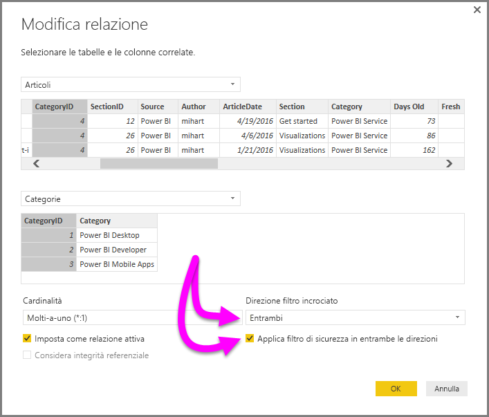

# Filtro incrociato bidirezionale con DirectQuery in Power BI Desktop

Quando si filtrano tabelle per creare la visualizzazione appropriata di dati, gli autori di report devono determinare in che modo i filtri vengono applicati a un report. Il contesto di filtro di una tabella viene ad esempio mantenuto su un lato della relazione ma non sull'altro e sono quindi spesso necessarie formule DAX complesse per ottenere i risultati richiesti.

Il filtro incrociato bidirezionale consente agli autori di report e ai responsabili della modellazione dei dati di avere un controllo maggiore sul modo in cui i filtri vengono applicati quando si utilizzano tabelle correlate, permettendo l'applicazione di questi filtri su *entrambi* i lati di una relazione tra tabelle. Per ottenere questo risultato, il contesto di filtro viene propagato a una seconda tabella correlata nell'altro lato della relazione tra tabelle.

È disponibile un [white paper dettagliato](http://download.microsoft.com/download/2/7/8/2782DF95-3E0D-40CD-BFC8-749A2882E109/Bidirectional%20cross-filtering%20in%20Analysis%20Services%202016%20and%20Power%20BI.docx) che illustra il filtro incrociato bidirezionale in Power BI Desktop. Il white paper illustra anche SQL Server Analysis Services 2016, perché il comportamento è uguale in entrambi i casi.

* Scaricare il white paper[Bidirectional cross-filtering for Power BI Desktop](http://download.microsoft.com/download/2/7/8/2782DF95-3E0D-40CD-BFC8-749A2882E109/Bidirectional%20cross-filtering%20in%20Analysis%20Services%202016%20and%20Power%20BI.docx) (Filtro incrociato bidirezionale per Power BI Desktop).

### Abilitazione del filtro incrociato bidirezionale per DirectQuery

Per abilitare il filtro incrociato, nella finestra di dialogo **Modifica relazione** per una relazione è necessario selezionare le opzioni seguenti:

* L'opzione **Direzione filtro incrociato**deve essere impostata su **Entrambe**.
* È necessario selezionare anche l'opzione **Applica filtro di sicurezza in entrambe le direzioni**.
  
  

> [!NOTE]
> Quando si creano formule DAX per il filtro incrociato in Power BI Desktop, usare *UserPrincipalName*, che spesso corrisponde all'accesso dell'utente; ad esempio *joe@contoso.com*, invece di *UserName*. Potrebbe essere quindi necessario creare una tabella correlata che esegue il mapping di *UserName* o EmployeeID, ad esempio, a *UserPrincipleName*.
> 
> 

Per altre informazioni e per esempi sul funzionamento del filtro incrociato bidirezionale, vedere il [white paper](http://download.microsoft.com/download/2/7/8/2782DF95-3E0D-40CD-BFC8-749A2882E109/Bidirectional%20cross-filtering%20in%20Analysis%20Services%202016%20and%20Power%20BI.docx) indicato in precedenza in questo articolo.

