# Usare i segnalibri in Power BI Desktop per condividere informazioni dettagliate e creare storie
Con i *segnalibri* in Power BI Desktop è possibile acquisire la visualizzazione attualmente configurata di una pagina del report, tra cui il filtro e lo stato degli oggetti visivi. In seguito, sarà possibile tornare a tale stato selezionando il segnalibro salvato. 

È anche possibile creare una raccolta di segnalibri, disporli nell'ordine desiderato e successivamente passare da un segnalibro all'altro in una presentazione per evidenziare una serie di informazioni dettagliate oppure la storia che si vuole narrare tramite gli oggetti visivi e i report. 

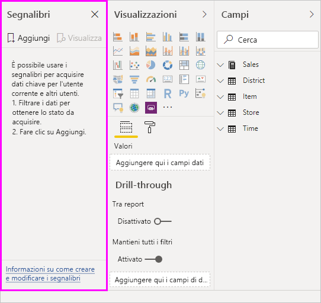

I segnalibri possono avere diversi usi. È ad esempio possibile usare i segnalibri per tenere traccia dello stato di avanzamento per la creazione dei report (i segnalibri sono facili da aggiungere, eliminare e rinominare) oppure per creare una presentazione in stile PowerPoint che scorre i segnalibri nell'ordine specificato per comunicare una storia con un report. 

> [!TIP]
> Per informazioni sull'uso dei segnalibri personali nel servizio Power BI, vedere [Annuncio dei segnalibri personali nel servizio Power BI](https://powerbi.microsoft.com/blog/announcing-personal-bookmarks-in-the-power-bi-service/). 

## Utilizzo dei segnalibri
Per usare i segnalibri, selezionare la scheda **Visualizza** sulla barra multifunzione di Power BI Desktop, quindi selezionare **Riquadro dei segnalibri**. 

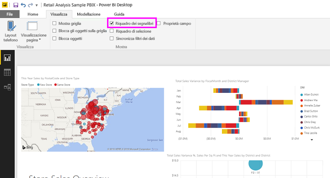

Quando si crea un segnalibro, insieme al segnalibro stesso vengono salvati gli elementi seguenti:

* Pagina corrente
* Filtri
* Filtri dei dati, inclusi il tipo (ad esempio elenco o menu a discesa) e lo stato del filtro dei dati
* Stato della selezione degli oggetti visivi (ad esempio filtri con evidenziazione incrociata)
* Ordinamento
* Posizione drill
* Visibilità di un oggetto (usando il riquadro **Selezione**)
* Modalità messa a fuoco o **In evidenza** di qualsiasi oggetto visibile

Configurare una pagina di report nel modo in cui si vuole che venga visualizzata nel segnalibro. Dopo aver disposto la pagina del report e gli oggetti visivi nel modo desiderato, per aggiungere un segnalibro selezionare **Aggiungi** nel riquadro **Segnalibri**. 

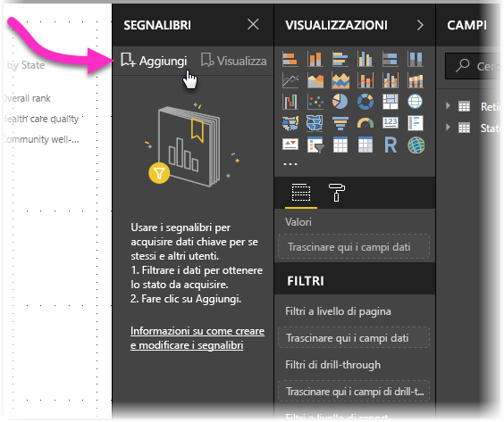

Power BI Desktop crea un segnalibro e gli assegna un nome generico. Per **rinominare**, **eliminare** o **aggiornare** un segnalibro facilmente, selezionare i puntini di sospensione accanto al nome del segnalibro e quindi scegliere un'azione dal menu visualizzato.

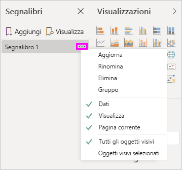

Dopo aver creato un segnalibro, visualizzarlo selezionandolo nel riquadro **Segnalibri**. 

È anche possibile specificare se ogni segnalibro applicherà le proprietà dei **dati**, ad esempio filtri e filtri dei dati, le proprietà di **visualizzazione**, come evidenziazioni e relativa visibilità e le modifiche della **pagina corrente**, che presentano la pagina che era visibile quando è stato aggiunto il segnalibro. Queste funzionalità sono utili quando si usano i segnalibri per spostarsi tra le visualizzazioni dei report o le selezioni di oggetti visivi. In questo caso è possibile disattivare le proprietà dei dati, in modo che i filtri non vengano reimpostati quando gli utenti cambiano visualizzazione selezionando un segnalibro. 

Per apportare tali modifiche, selezionare i puntini di sospensione accanto al nome del segnalibro, quindi selezionare o deselezionare i segni di spunta accanto a **Dati**, **Visualizzazione** e altri controlli. 

## Disposizione dei segnalibri
Man mano che si creano i segnalibri, è possibile che l'ordine in cui vengono creati sia diverso da quello che si vuole presentare ai destinatari. Riorganizzare l'ordine dei segnalibri è facile.

- Nel riquadro **Segnalibri** trascinare i segnalibri selezionati per modificarne l'ordine. 

   La barra gialla tra i segnalibri indica la posizione in cui verrà collocato il segnalibro trascinato.

   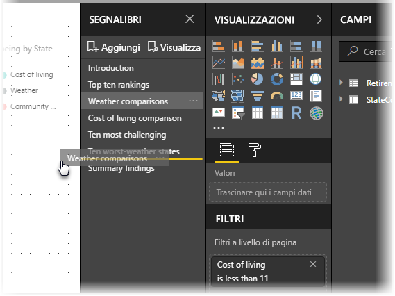

L'ordine dei segnalibri è importante quando si usa la funzionalità **Visualizzazione** dei segnalibri, come descritto nella sezione successiva.

## Segnalibri come presentazione
Se si vuole presentare una raccolta di segnalibri nell'ordine in cui sono disposti, selezionare **Visualizzazione** nel riquadro **Segnalibri** per avviare una presentazione.

Quando si passa alla modalità **Visualizzazione**, è necessario tenere conto di alcuni aspetti.

   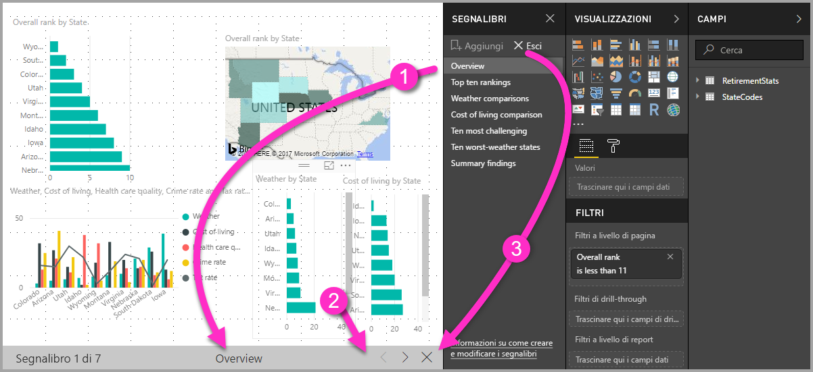

1. Il nome del segnalibro viene visualizzato nella barra del titolo del segnalibro nella parte inferiore dell'area di disegno.

2. Le frecce disponibili nella barra del titolo del segnalibro consentono di passare al segnalibro precedente o successivo.

3. Per uscire dalla modalità **Visualizzazione**, selezionare **Esci** nel riquadro **Segnalibri** o la **X** nella barra del titolo del segnalibro. 

Nella modalità **Visualizzazione** è possibile chiudere il riquadro **Segnalibri**, selezionando la **X** nel riquadro stesso, per lasciare più spazio alla presentazione. Tutti gli oggetti visivi sono interattivi quando sono nella modalità **Visualizzazione** e disponibili per l'evidenziazione incrociata, come accade quando si interagisce direttamente con essi. 

## Visibilità: uso del riquadro Selezione
Il riquadro **Selezione**, correlato al riquadro **Segnalibri**, fornisce un elenco di tutti gli oggetti nella pagina corrente e consente di selezionare un oggetto e specificare se è visibile o meno. 

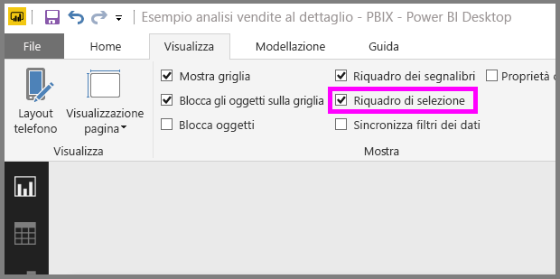

Nel riquadro **Selezione** si seleziona un oggetto e si attiva/disattiva la visibilità dell'oggetto selezionando l'icona a forma di occhio a destra dell'oggetto. 

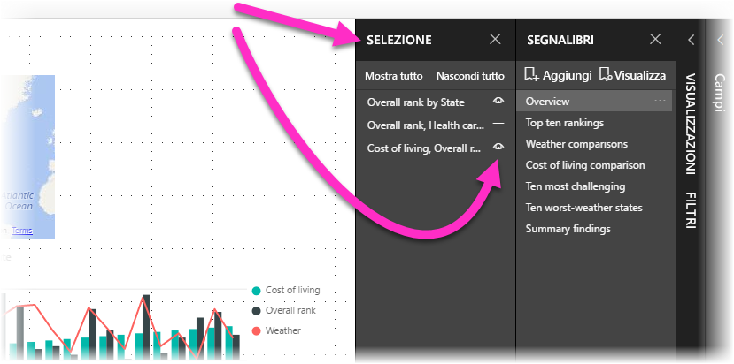

Quando si aggiunge un segnalibro, viene anche salvato lo stato di visibilità di ogni oggetto, in base all'impostazione corrispondente nel riquadro **Selezione**. 

È importante notare che i filtri dei dati continueranno a filtrare una pagina di report indipendentemente dal fatto che siano visibili o meno. Di conseguenza, è possibile creare molti segnalibri diversi, con impostazioni differenti per i filtri dei dati e ottenere una visualizzazione diversa (evidenziando informazioni dettagliate diverse) per una singola pagina di report in vari segnalibri.

## Segnalibri per forme e immagini
È anche possibile collegare forme e immagini ai segnalibri. Con questa funzionalità, quando si seleziona un oggetto, viene mostrato il segnalibro associato a tale oggetto. Questa funzionalità può essere particolarmente utile quando si utilizzano i pulsanti. Per altre informazioni, vedere [Uso dei pulsanti in Power BI](desktop-buttons.md). 

Per assegnare un segnalibro a un oggetto: 

1. Selezionare l'oggetto nell'area di disegno report, quindi nel riquadro **Formato forma** visualizzato impostare il dispositivo di scorrimento **Azione** su **Sì**.

2. Espandere la sezione **Azione**. In **Tipo** selezionare **Segnalibro**.

3. In **Segnalibri** selezionare un segnalibro.

   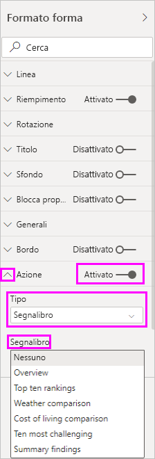

Con i segnalibri collegati agli oggetti, è possibile effettuare diverse operazioni. Si può creare un sommario visivo nella pagina del report o fornire visualizzazioni diverse, ad esempio tipi di oggetti visivi, delle stesse informazioni.

Nella modalità di modifica premere **CTRL** e selezionare il collegamento per seguirlo. Se non si è nella modalità di modifica, selezionare l'oggetto per seguire il collegamento. 

## Gruppi di segnalibri

A partire dalla versione di agosto 2018 di Power BI Desktop, è possibile creare e usare gruppi di segnalibri. Un gruppo di segnalibro è una raccolta di segnalibri specificati dall'utente, che possono essere visualizzati e organizzati come gruppo. 

Per creare un gruppo di segnalibri: 
1. Premere **CTRL** e selezionare i segnalibri che si vogliono includere nel gruppo. 

2. Selezionare i puntini di sospensione accanto ai segnalibri selezionati e quindi scegliere **Raggruppa** dal menu visualizzato.

   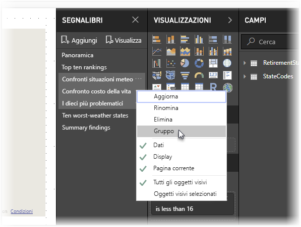

Power BI Desktop denomina automaticamente il gruppo *Group 1*. È possibile selezionare i puntini di sospensione accanto a questo nome, selezionare **Rinomina** e rinominarlo nel modo desiderato.

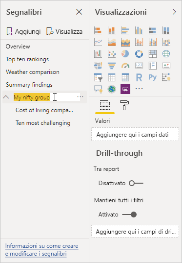

Come con qualsiasi gruppo di segnalibri, espandendo il nome del gruppo si espande o si comprime semplicemente il gruppo di segnalibri e il gruppo non rappresenta un segnalibro da solo. 

Quando si usa la funzionalità **Visualizza** per i segnalibri, si applicano i dettagli seguenti:

* Se il segnalibro selezionato è in un gruppo quando si seleziona **Visualizza** dai segnalibri, solo i segnalibri *in tale gruppo* vengono visualizzati nella sessione di visualizzazione. 

* Se il segnalibro selezionato non è in un gruppo o è nel primo livello (ad esempio è il nome di un gruppo di segnalibri), vengono riprodotti tutti i segnalibri per l'intero report, inclusi i segnalibri in qualsiasi gruppo. 

Per separare i segnalibri: 
1. Selezionare un segnalibro in un gruppo e selezionare i puntini di sospensione. 

2. Selezionare **Separa** dal menu visualizzato.

   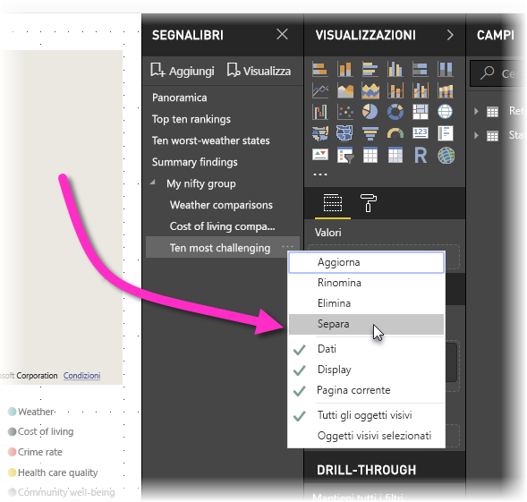

   Quando si seleziona **Separa** per qualsiasi segnalibro di un gruppo, tutti i segnalibri vengono rimossi dal gruppo e viene eliminato il gruppo, ma non i segnalibri stessi. 

Per rimuovere un singolo segnalibro da un gruppo: 
1. Se si seleziona **Separa** per un membro di tale gruppo, viene eliminato l'intero raggruppamento. 

2. Selezionare i membri da aggiungere al nuovo gruppo premendo **CTRL** e selezionando ogni segnalibro e quindi selezionare di nuovo **Raggruppa**. 

## Uso della funzionalità In evidenza
La funzionalità *In evidenza* è un'altra novità introdotta con i segnalibri. In evidenza consente di attirare l'attenzione su un grafico specifico, ad esempio, quando si presentano i segnalibri nella modalità **Visualizzazione**.

Ecco un confronto tra la modalità In evidenza e la modalità messa a fuoco e le relative differenze:

1. Con la modalità messa a fuoco, si seleziona l'icona **Modalità messa a fuoco** di un oggetto visivo, che in questo modo occuperà l'intera area di disegno.

2. Con la funzionalità In evidenza, si fa clic sui puntini di sospensione di un oggetto visivo e si seleziona **In evidenza** per evidenziarlo nelle dimensioni originali grazie a un effetto di dissolvenza che rende tutti gli altri oggetti visivi nella pagina quasi trasparenti. 

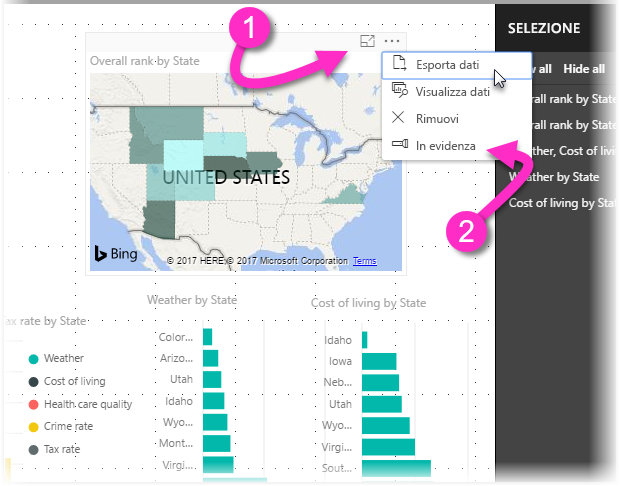

Quando si seleziona l'icona **Modalità messa a fuoco** dell'oggetto visivo nell'immagine precedente, la pagina ha l'aspetto seguente:

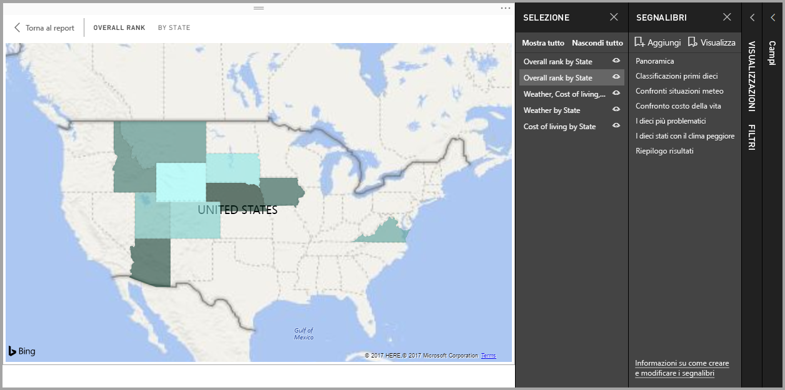

Al contrario, quando viene selezionata l'opzione **In evidenza** dal menu dei puntini di sospensione dell'oggetto visivo, la pagina ha l'aspetto seguente:

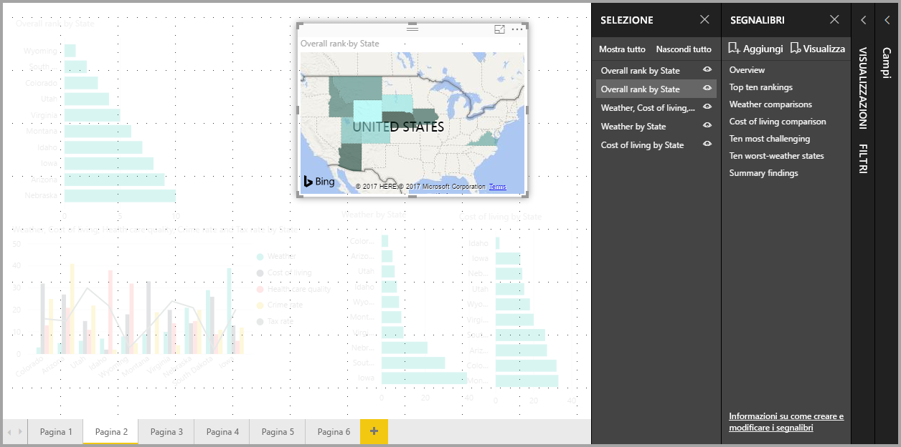

Se quando si aggiunge un segnalibro è selezionata la modalità messa a fuoco o In evidenza, la modalità attiva viene mantenuta nel segnalibro.

## Segnalibri nel servizio Power BI
Quando si pubblica nel servizio Power BI un report con segnalibri, è possibile visualizzare e interagire con tali segnalibri nel servizio Power BI. Quando in un report sono disponibili segnalibri, per visualizzare i riquadri **Selezione** e **Segnalibri**, selezionare **Visualizza** > **Riquadro di selezione** o **Visualizza** > **Riquadro dei segnalibri**. 

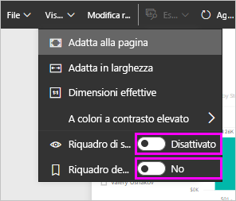

Nel servizio Power BI il riquadro **Segnalibri** funziona esattamente come in Power BI Desktop e consente di selezionare **Visualizza** per mostrare i segnalibri nell'ordine definito, come in una presentazione.

Usare la barra del titolo dei segnalibri grigia, invece delle frecce nere, per spostarsi tra i segnalibri. Le frecce nere consentono di spostarsi tra le pagine del report, non tra i segnalibri.

## Abilitare l'anteprima dei segnalibri (versioni precedenti all'aggiornamento di marzo 2018)
A partire dalla versione di marzo 2018 di Power BI Desktop i segnalibri sono disponibili a livello generale. 

È sempre consigliabile eseguire l'aggiornamento alla versione più recente. Se tuttavia la versione di Power BI Desktop in uso è precedente, è possibile provare la nuova funzionalità dei segnalibri a partire dalla versione di Power BI Desktop di ottobre 2017 e anche nel servizio Power BI per i report abilitati per i segnalibri. 

Per abilitare la funzionalità dei segnalibri in anteprima: 

1. Selezionare **File** > **Opzioni e impostazioni** > **Opzioni** > **Funzionalità in anteprima** e quindi selezionare **Segnalibri**. 

   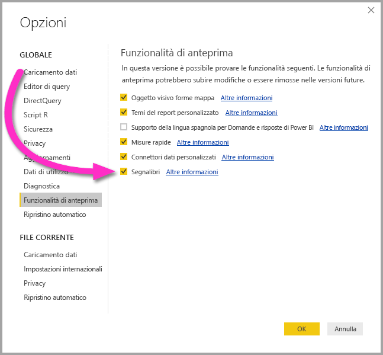

2. Riavviare Power BI Desktop per abilitare la versione di anteprima dei segnalibri.

## Limitazioni e considerazioni
Per questa versione della funzionalità dei segnalibri, tenere presenti alcune limitazioni e considerazioni.

* La maggior parte degli oggetti visivi personalizzati dovrebbero funzionare bene con i segnalibri. Se tuttavia si verificano problemi con i segnalibri e un oggetto visivo personalizzato, contattare l'autore di tale oggetto visivo personalizzato e richiedere l'aggiunta del supporto dei segnalibri all'oggetto visivo. 
* Se si aggiunge un oggetto visivo in una pagina del report dopo aver creato un segnalibro, l'oggetto visivo viene visualizzato nel suo stato predefinito, ovvero, se si aggiunge un filtro dei dati a una pagina in cui sono stati creati segnalibri in precedenza, il filtro dei dati si comporta in base allo stato predefinito.
* Se dopo aver creato un segnalibro un oggetto visivo viene spostato, le modifiche si riflettono automaticamente nel segnalibro. 

## Passaggi successivi
Per altre informazioni sulle funzionalità simili o su come interagire con i segnalibri, vedere gli articoli seguenti:

* [Usare il drill-through in Power BI Desktop](desktop-drillthrough.md)
* [Visualizzare un riquadro del dashboard o un oggetto visivo di un report in modalità messa a fuoco](consumer/end-user-focus.md)

