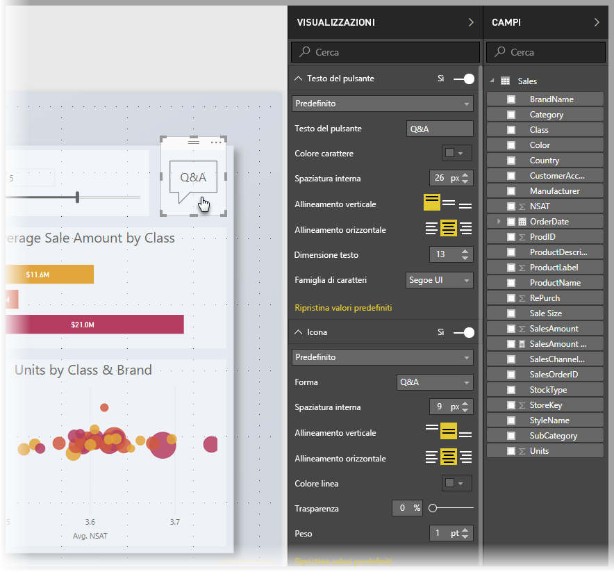
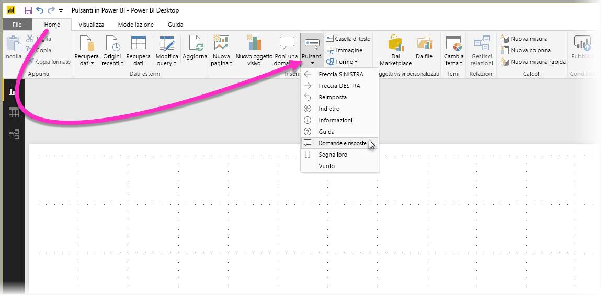
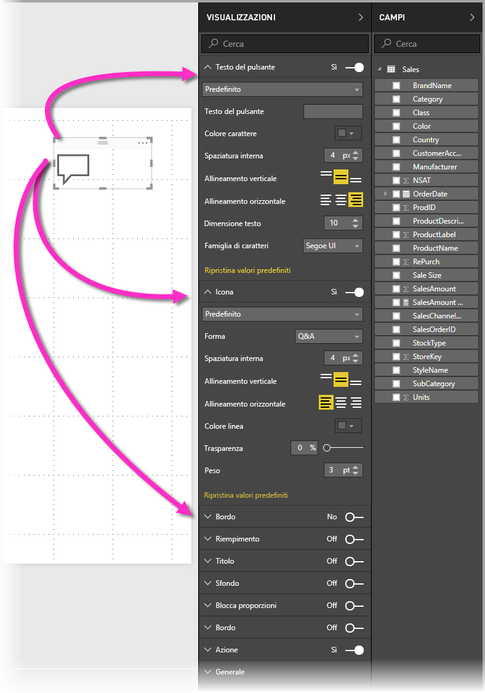
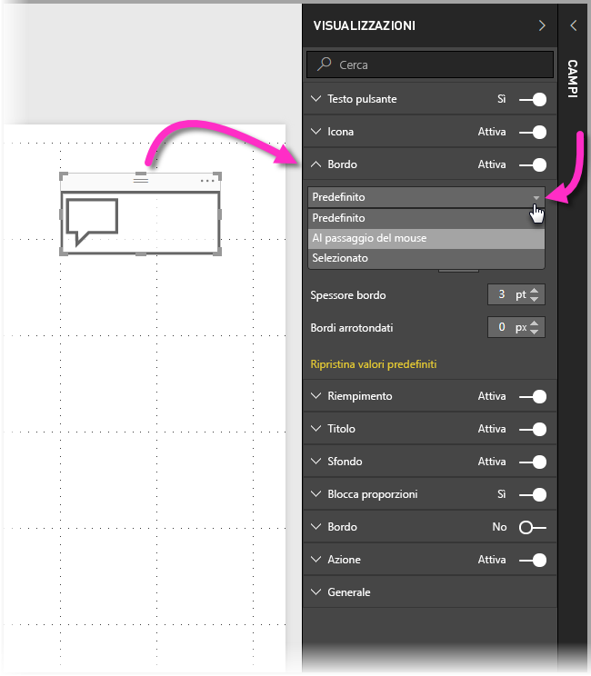
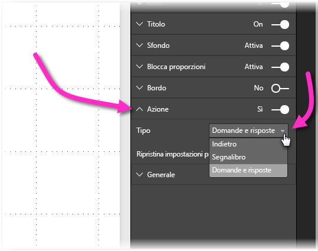

# Uso dei pulsanti in Power BI
L'uso dei **pulsanti** in Power BI consente di creare report e dashboard con un comportamento simile alle app e in tal modo di creare un ambiente coinvolgente in modo che gli utenti possano passare il mouse, fare clic e interagire in altri modi con il contenuto di Power BI. È possibile aggiungere pulsanti ai report in **Power BI Desktop** e condividere o pubblicare questi report nel servizio Power BI per creare dashboard con un comportamento simile alle app per gli utenti.

I pulsanti creati in **Power BI Desktop** sono disponibili per l'uso nei report o nei dashboard pubblicati nel **servizio Power BI**.

## Creazione di pulsanti nei report
Per creare un pulsante in un report di **Power BI Desktop**, selezionare **Pulsanti** nella barra multifunzione **Home**. Viene visualizzato un menu a discesa in cui è possibile selezionare il pulsante desiderato da una raccolta di opzioni, come illustrato nella figura seguente. 

Quando si crea un pulsante e lo si seleziona nell'area di disegno report, il riquadro **Visualizzazioni** mostra i diversi modi per personalizzare il pulsante in base alle specifiche esigenze. Ad esempio, è possibile attivare o disattivare **Testo pulsante**, spostando il dispositivo di scorrimento in tale sezione del riquadro **Visualizzazioni**. È anche possibile modificare l'icona del pulsante, il riempimento del pulsante, il titolo e l'azione eseguita quando gli utenti fanno clic sul pulsante in un report o un dashboard, tra le altre proprietà.

## Impostare le proprietà dei pulsanti per lo stato inattivo, al passaggio del mouse o selezionato

I pulsanti in Power BI presentano tre stati: predefinito (aspetto dei pulsanti quando non sono selezionati o non vi si passa il mouse sopra), al passaggio del mouse o selezionato (azione spesso indicata come *fare clic*). Molte delle sezioni nel riquadro **Visualizzazioni** possono essere modificate singolarmente in base a questi tre stati, con una grande flessibilità per la personalizzazione dei pulsanti.

Le sezioni seguenti nel riquadro **Visualizzazioni** consentono di modificare la formattazione o il comportamento di un pulsante in base ai relativi tre stati:

* Testo pulsante
* Icona
* Bordo
* Riempimento

Per specificare l'aspetto del pulsante per ogni stato, espandere una di queste sezioni e selezionare l'elenco a discesa visualizzato nella parte superiore della sezione. Nella figura seguente è visualizzata la sezione **Bordo** espansa con l'elenco a discesa selezionato per mostrare i tre stati:

## Selezionare l'azione per un pulsante

È possibile selezionare l'azione da eseguire quando un utente seleziona un pulsante in Power BI. È possibile accedere alle opzioni per le azioni del pulsante dalla sezione **Azione** nel riquadro **Visualizzazioni**.

Le opzioni per le azioni dei pulsanti sono:

* Indietro
* Segnalibro
* Domande e risposte

Selezionando **Indietro** l'utente torna alla pagina precedente del report. Questa azione è particolarmente utile per le pagine di drill-down.

Selezionando **Segnalibro** viene visualizzata la pagina del report associata a un segnalibro definito per il report corrente. Sono disponibili [altre informazioni sui segnalibri in Power BI](desktop-bookmarks.md). 

Selezionando **Domande e risposte** nell'elenco a discesa viene visualizzata una finestra **Esplora domande e risposte**. 

Per alcuni pulsanti sarà disponibile un'azione predefinita selezionata automaticamente. Ad esempio, per il tipo di pulsante **Domande e risposte** è selezionata automaticamente l'azione **Domande e risposte**. Per altre informazioni su **Esplora domande e risposte**, vedere [questo post di blog](https://powerbi.microsoft.com/blog/power-bi-desktop-april-2018-feature-summary/#Q&AExplorer).

È possibile provare o testare i pulsanti creati per il report usando *CTRL+clic* sul pulsante da provare. 

## Passaggi successivi
Per altre informazioni sulle funzionalità simili o su come interagire con i pulsanti, vedere gli articoli seguenti:

* [Usare il drill-through in Power BI Desktop](desktop-drillthrough.md)
* [Visualizzare un riquadro del dashboard o un oggetto visivo di un report in modalità messa a fuoco](consumer/end-user-focus.md)
* [Usare i segnalibri per condividere informazioni dettagliate e creare storie in Power BI](desktop-bookmarks.md)

