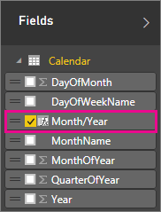
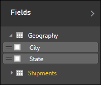
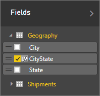
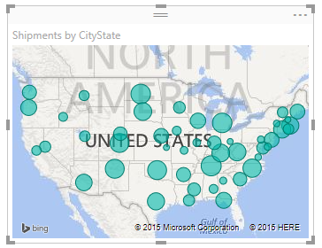

# Uso delle colonne calcolate in Power BI Desktop
Con le colonne calcolate, è possibile aggiungere nuovi dati a una tabella già presente nel modello. Tuttavia, invece di eseguire query e caricare i valori nella nuova colonna da un'origine dati, viene creata una formula Data Analysis Expressions (DAX) che definisce i valori della colonna. In Power BI Desktop, le colonne calcolate vengono create usando la funzionalità Nuova colonna in Visualizzazione Report.

A differenza delle colonne personalizzate create come parte di una query usando Aggiungi colonna personalizzata in Visualizzazione Report, le colonne calcolate in Visualizzazione Report o Vista dati si basano sui dati già caricati nel modello. Ad esempio, è possibile scegliere di concatenare i valori di due colonne diverse in due tabelle diverse ma correlate, eseguire addizioni o estrarre le sottostringhe.

Le colonne calcolate create vengono visualizzate nell'elenco Campi come qualsiasi altro campo, ma hanno un'icona speciale che indica che i valori sono il risultato di una formula. È possibile assegnare qualsiasi nome alle colonne e aggiungerle a una visualizzazione del report con le normali procedure usate per gli altri campi.

Le colonne calcolate calcolano i risultati usando [Data Analysis Expressions](https://msdn.microsoft.com/library/gg413422.aspx) (DAX), un linguaggio delle formule pensato per essere usato con dati relazionali, come quelli in Power BI Desktop. DAX include una libreria con oltre 200 funzioni, operatori e costrutti che fornisce un'enorme flessibilità per la creazione di formule di calcolo dei risultati per quasi tutte le esigenze di analisi dei dati. Per altre informazioni su DAX, vedere la sezione Scopri di più alla fine di questo articolo.

Le formule DAX somigliano alle formule di Excel. In effetti, DAX ha molte funzioni analoghe ad Excel. Le funzioni DAX, tuttavia, sono concepite per funzionare su dati suddivisi in modo interattivo o filtrati in un report, come in Power BI Desktop. A differenza di Excel, in cui si possono avere formule diverse per ogni riga nella tabella, quando si crea una formula DAX per una nuova colonna il risultato viene calcolato per tutte le righe nella tabella. I valori della colonna vengono ricalcolati in base alle esigenze, ad esempio quando vengono aggiornati i dati sottostanti e vengono modificati i valori.

## Esempio
Jeff è un responsabile delle spedizioni di Contoso. Vuole creare un report che mostri il numero di spedizioni nelle diverse città. Ha una tabella Geography con campi separati per città e stato, ma vuole che il report visualizzi City, State come un unico valore sulla stessa riga. Al momento, la tabella Geography di Jeff non contiene il campo che vuole.

Tuttavia con una colonna calcolata Jeff può semplicemente unire o concatenare le città della colonna City con gli stati della colonna State.

Jeff fa clic con il pulsante destro del mouse sulla tabella Geography, quindi sceglie Nuova colonna. Immette quindi la seguente formula DAX nella barra della formula:

Questa formula crea semplicemente una colonna denominata CityState e, per ogni riga della tabella Geography, acquisisce i valori della colonna City, aggiunge una virgola e uno spazio, quindi concatena i valori della colonna State.

Ora Jeff ha il campo che vuole.

Può aggiungerlo all'area di disegno report insieme al numero di spedizioni. Molto velocemente e con il minimo sforzo, ora Jeff ha un campo City, State che può aggiungere a quasi tutti i tipi di visualizzazione. Jeff osserva che, quando crea una visualizzazione mappa, Power BI Desktop riesce anche a leggere i valori City, State nella nuova colonna.

## Altre informazioni
In questo articolo è stata fornita solo una rapida introduzione alle colonne calcolate. Vedere [Esercitazione: Creare colonne calcolate in Power BI Desktop](desktop-tutorial-create-calculated-columns.md), in cui è possibile scaricare un file di esempio e ottenere informazioni dettagliate su come creare altre colonne. 

Per altre informazioni su DAX, vedere [Nozioni di DAX in Power BI Desktop](desktop-quickstart-learn-dax-basics.md).

Per altre informazioni sulle colonne create come parte di una query, vedere la sezione relativa alla creazione di colonne personalizzate in [Attività di query comuni in Power BI Desktop](desktop-common-query-tasks.md).  

