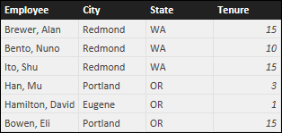
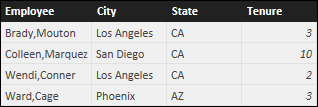
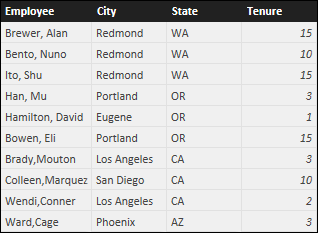
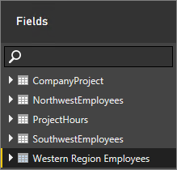

# <a name="create-calculated-tables-in-power-bi-desktop"></a>Creare tabelle calcolate in Power BI Desktop
Molto spesso si creano tabelle importando i dati nel modello da un'origine dati esterna. Le *tabelle calcolate*, tuttavia, consentono di aggiungere nuove tabelle basate sui dati già caricati nel modello. Invece di eseguire query e caricare i valori nelle colonne della nuova tabella da un'origine dati, si crea una formula [DAX (Data Analysis Expressions)](/dax/index) che definisce i valori della tabella.

DAX è un linguaggio di formule per l'uso di dati relazionali, come in Power BI Desktop. DAX include una libreria con oltre 200 funzioni, operatori e costrutti che fornisce un'enorme flessibilità per la creazione di formule di calcolo dei risultati per quasi tutte le esigenze di analisi dei dati. Le tabelle calcolate sono in genere preferibili per i dati e i calcoli intermedi da archiviare come parte del modello, anziché da calcolare al momento o come risultati di query. È ad esempio possibile scegliere un'operazione *union* o *cross join* per due colonne esistenti.

Analogamente alle altre tabelle di Power BI Desktop, le tabelle calcolate possono avere relazioni con altre tabelle. Le colonne delle tabelle calcolate includono tipi di dati e formattazione e possono appartenere a una categoria di dati. È possibile assegnare qualsiasi nome alle colonne e aggiungerle alle visualizzazioni dei report come nel caso di qualsiasi altro campo. Le tabelle calcolate vengono ricalcolate se una delle tabelle da cui viene eseguito il pull dei dati viene aggiornata.

## <a name="create-a-calculated-table"></a>Creare una tabella calcolata

È possibile creare tabelle calcolate usando la funzionalità **Nuova tabella** nella visualizzazione report o nella visualizzazione dati di Power BI Desktop.

Si supponga, ad esempio, di essere un responsabile del personale e di avere una tabella **Northwest Employees** e un'altra tabella **Southwest Employees**. Si decide di combinare le due tabelle in un'unica tabella denominata **Western Region Employees**.

**Tabella Northwest Employees**

 

**Tabella Southwest Employees**

 

Nella visualizzazione report o nella visualizzazione dati di Power BI Desktop selezionare **Nuova tabella** nel gruppo **Calcoli** della scheda **Modellazione**. L'operazione è un po' più semplice nella visualizzazione dati, perché è possibile vedere immediatamente la nuova tabella calcolata.

 

Nella barra della formula immettere la formula seguente:

```dax
Western Region Employees = UNION('Northwest Employees', 'Southwest Employees')
```

Verrà creata una nuova tabella denominata **Western Region Employees**, visualizzata come qualsiasi altra tabella nel riquadro **Campi**. È possibile creare relazioni con altre tabelle, aggiungere misure e colonne calcolate nonché aggiungere campi ai report come con qualsiasi altra tabella.

 

 

## <a name="functions-for-calculated-tables"></a>Funzioni per le tabelle calcolate

È possibile definire una tabella calcolata tramite un'espressione DAX che restituisce una tabella, compreso un semplice riferimento a un'altra tabella, ad esempio:

```dax
New Western Region Employees = 'Western Region Employees'
```

Questo articolo fornisce solo una rapida introduzione alle tabelle calcolate. È possibile usare le tabelle calcolate con DAX per risolvere molti problemi analitici. Ecco alcune delle funzioni di tabella DAX più comuni:

* DISTINCT
* VALORI
* CROSSJOIN
* UNION
* NATURALINNERJOIN
* NATURALLEFTOUTERJOIN
* INTERSECT
* CALENDAR
* CALENDARAUTO

Vedere [Informazioni di riferimento sulle funzioni DAX](/dax/dax-function-reference) per queste e altre funzioni DAX che restituiscono tabelle.

