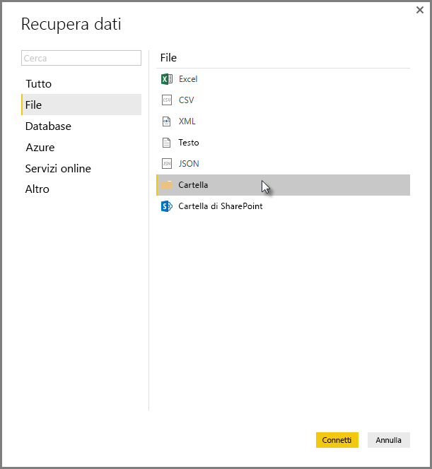
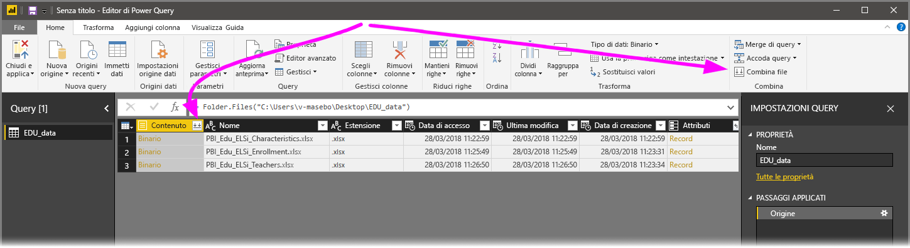
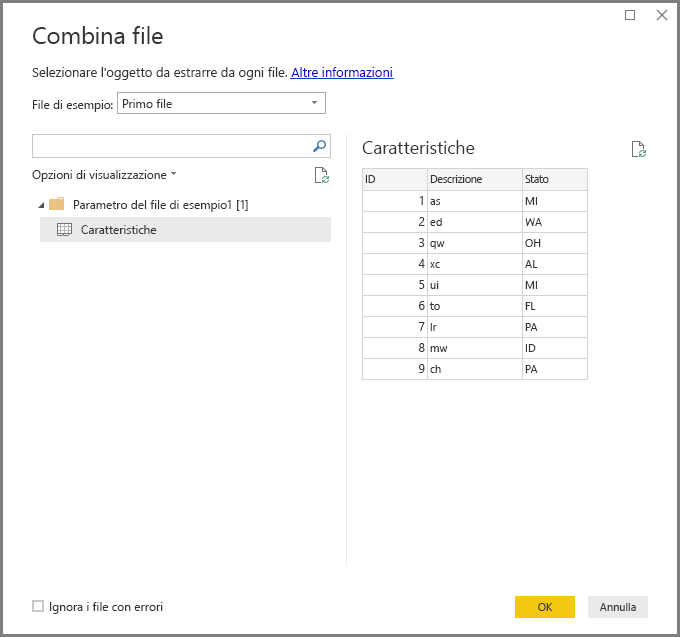
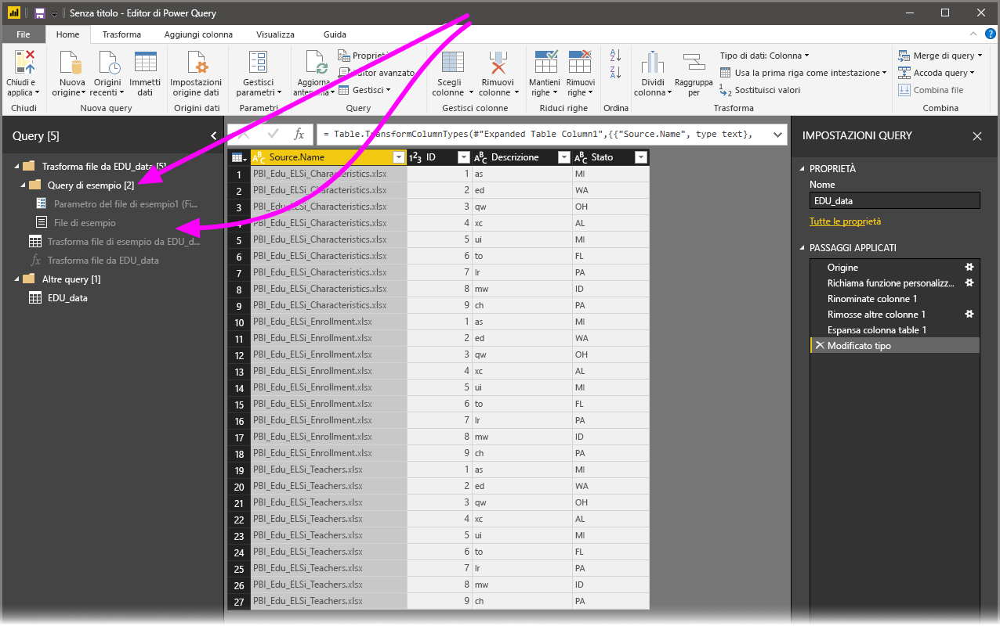

# Combinare file (binari) in Power BI Desktop
Un solido approccio all'importazione di dati in **Power BI Desktop** consiste nel combinare più file con lo stesso schema in un'unica tabella logica. Con la versione di **Power BI Desktop** di novembre 2016 (e le versioni successive) questo comodo e popolare approccio è stato reso più pratico ed esteso, come descritto in questo articolo.

Per avviare il processo di combinazione di file dalla stessa cartella, selezionare **Recupera dati > File > Cartella**.

## Comportamento precedente di combinazione dei file (binari)
Prima della versione di **Power BI Desktop** di novembre 2016 questa funzionalità era denominata **Combina binari** ed era possibile combinare determinati tipi di file con la trasformazione **Combina binari**, ma esistevano alcune limitazioni:

* Le trasformazioni non venivano considerate per ogni singolo file prima che i file fossero combinati in una singola tabella. Di conseguenza, spesso era necessario combinare i file, quindi escludere i *valori di intestazione* filtrando le righe come parte del processo di modifica.
* La trasformazione **Combina binari** funzionava solo per i file di *testo* o *CSV*, ma non per altri formati di file supportati, ad esempio cartelle di lavoro di Excel, file JSON e altri.

I clienti hanno richiesto un utilizzo più intuitivo dell'operazione **Combina binari**, quindi la trasformazione è stata migliorata e rinominata **Combina file**.

## Comportamento attuale di combinazione dei file
**Power BI Desktop** ora gestisce la trasformazione **Combina file** (binari) in modo più efficace. Iniziare selezionando **Combina file**, ad esempio dalla scheda della barra multifunzione **Home** nell'**Editor di query** o dalla colonna stessa.

La trasformazione **Combina file** ora si comporta come segue:

* La trasformazione **Combina file** analizza ogni file di input e determina il formato di file corretto da usare, ad esempio un file di *testo*, una *cartella di lavoro di Excel* o un file *JSON*.
* La trasformazione consente di selezionare un oggetto specifico dal primo file, ad esempio una *cartella di lavoro di Excel*, da estrarre.
  
  
* La trasformazione **combina file** esegue quindi automaticamente le query seguenti:
  
  * Crea una query di esempio che esegue tutti i passaggi di estrazione necessari in un singolo file.
  * Crea un *query della funzione* che parametrizza l'input file/binario della *query di esempio*. La query di esempio e la query della funzione sono collegate in modo che le modifiche apportate alla query di esempio vengano riflesse nella query della funzione.
  * Applica la *query della funzione* alla query originale con binari di input, ad esempio la query *Cartella*, in modo da applicare la query della funzione per gli input binari in ciascuna riga, quindi espande l'estrazione dei dati risultanti come colonne di livello superiore.
    
    

Con il nuovo comportamento di **Combina file**, è possibile combinare facilmente tutti i file con lo stesso tipo e struttura di file (ad esempio, le stesse colonne) in una determinata cartella.

È anche possibile applicare facilmente altri passaggi di trasformazione o estrazione modificando la *query di esempio* creata automaticamente, senza doversi preoccupare di modificare o creare altri passaggi della *query della funzione*. Qualsiasi modifica apportata alla *query di esempio* viene automaticamente generata nella *query della funzione* collegata.

## Passaggi successivi
È possibile connettersi a molti tipi di dati usando Power BI Desktop. Per altre informazioni sulle origini dati, vedere le risorse seguenti:

* [Che cos'è Power BI Desktop?](desktop-what-is-desktop.md)
* [Origini dati in Power BI Desktop](desktop-data-sources.md)
* [Effettuare il data shaping e combinare i dati con Power BI Desktop](desktop-shape-and-combine-data.md)
* [Connettersi a file CSV in Power BI Desktop](desktop-connect-csv.md)   
* [Immettere dati direttamente in Power BI Desktop](desktop-enter-data-directly-into-desktop.md)   

